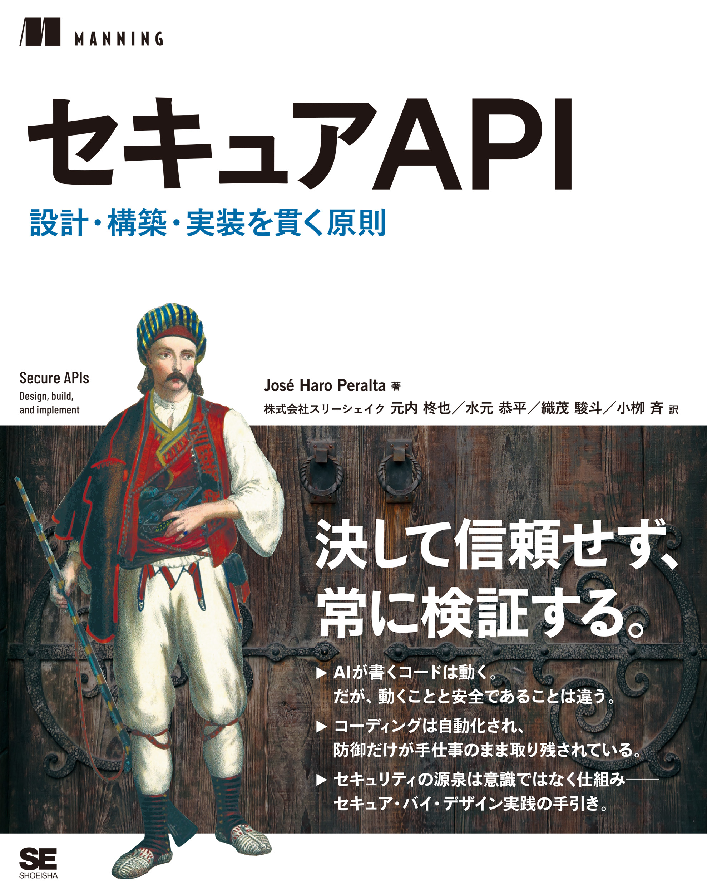
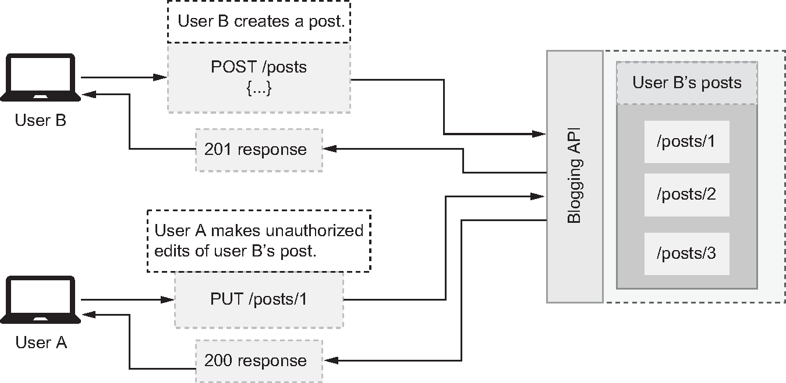
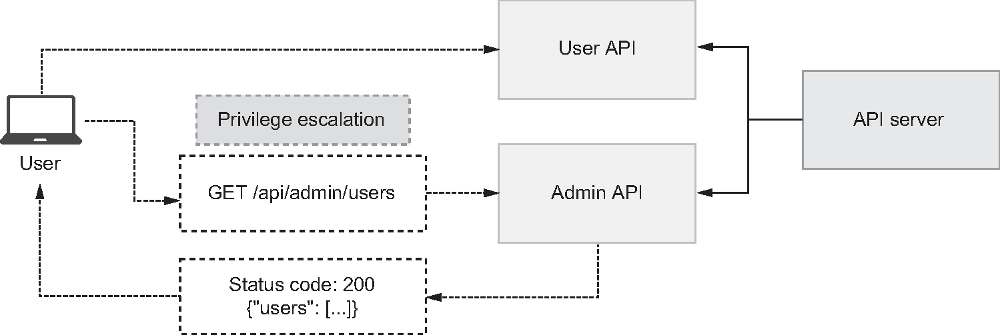
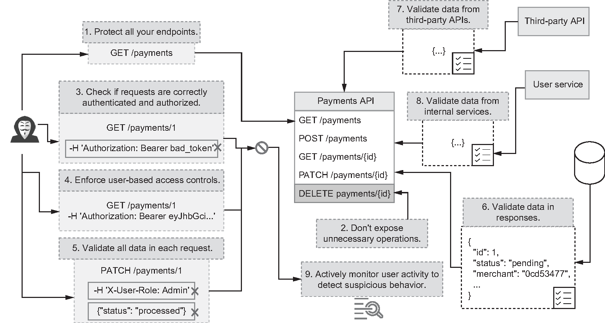
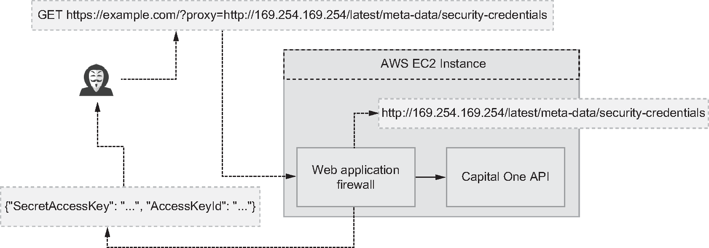
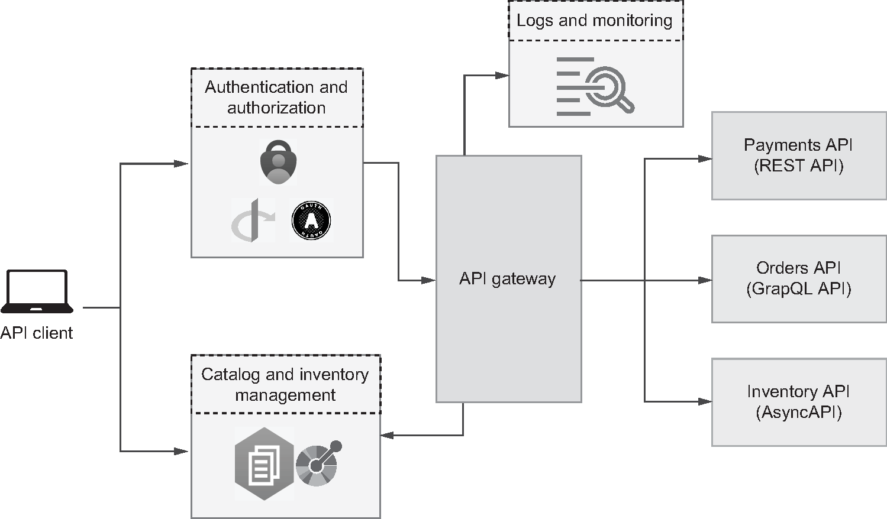
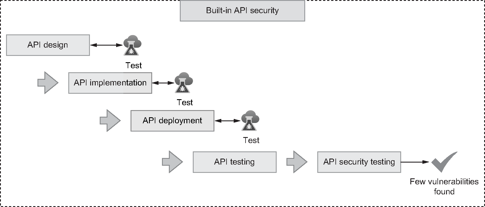
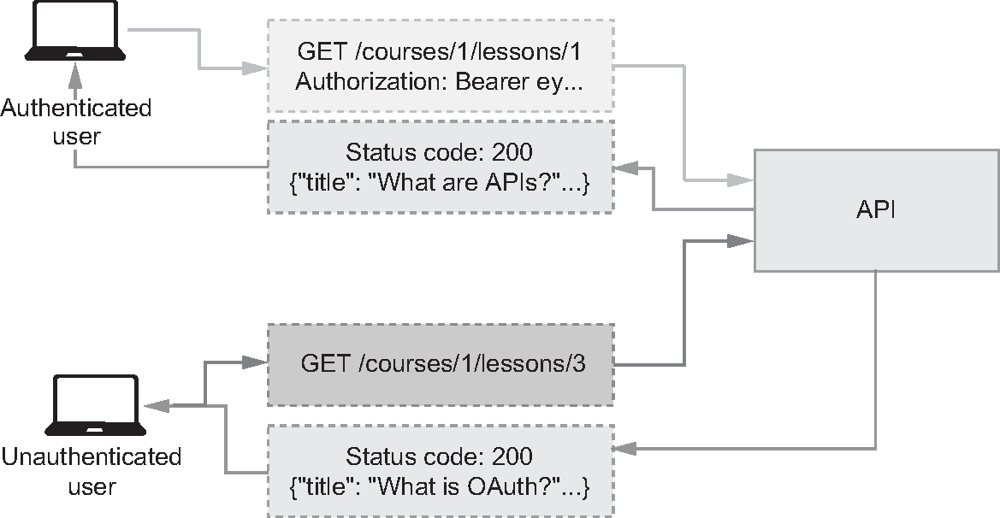
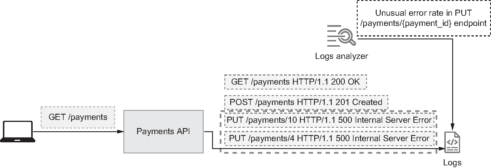

<!--
_backgroundColor: #0a1929
_color: white
_class: title dark
-->


<div class="title" style="text-align: left; margin-top: 100px; margin-left: 80px; padding-left: 0; max-width: 70%;">

# <span style="font-size: 1.1em;">20分でわかる セキュアAPI</span>

### AIが対策を書く前に、許可条件と検証方法を決める

</div>

<div class="author-info" style="text-align: left; padding-left: 0; text-indent: 0;">
2026/08/07 『セキュアAPI』翻訳者と考える、設計段階から組み込むセキュリティ</br>
@nwiizo 20min
</div>

---

<!-- _backgroundColor: white -->


## nwiizo

<div style="font-size: 0.75em;">

株式会社スリーシェイクのソフトウェアエンジニアです。格闘技、読書、グラビアが趣味で、よく本を紹介しています。

技術書翻訳を手がけるたび、わかることが1つ増えるのと引き換えに、わからないことが3つ増えていきます。

単著『<strong>おい、とりあえず終わらせろ</strong>』が刊行予定です。<br>
翻訳書『<strong>実践 プラットフォームエンジニアリング</strong>』も刊行予定です。

インターネット上では <strong>nwiizo</strong> を名乗り、ブログ「<strong>じゃあ、おうちで学べる</strong>」を運営しています。X / GitHub もこのIDでやっています。

</div>

---

## 20分後にできること

<div style="font-size: 0.7em;">

<p>AIが対策コードを書いても、許可条件が曖昧なら安全にはなりません。この20分では、<strong>1つのAPIフローを実装前にレビューする方法</strong>を説明します。</p>

<div style="display: flex; gap: 16px; margin-top: 18px; align-items: center;">
<div style="flex: 1; background-color: #f5f5f5; padding: 14px; border-radius: 8px;">

<strong>1. 守る境界を説明できる</strong>

<p>誰が、どの対象を、どの順序で操作できるかを言葉にします。</p>

</div>
<div style="flex: 1; background-color: #f5f5f5; padding: 14px; border-radius: 8px;">

<strong>2. AIとAPIの責任を分けられる</strong>

<p>AIは操作を提案し、APIは入力形式と業務上の許可を検証します。</p>

</div>
<div style="flex: 1; background-color: #f5f5f5; padding: 14px; border-radius: 8px;">

<strong>3. 判断を検証へつなげられる</strong>

<p>脅威モデルの4問を、拒否するテストとログへつなげます。</p>

</div>
</div>

<div style="margin-top: 16px; padding: 10px; background-color: #e0e0e0; border-radius: 5px; text-align: center;">
<span style="color: #e65100; font-weight: bold;">明日、利用者 → AIエージェント → APIの1フローを図にし、4つの問いを書き出せます。</span>
</div>

</div>

---

## AIが対策を書く時代に本書を読む理由

<div style="font-size: 0.66em;">

<p>生成AIにセキュリティコードを書かせ、AIエージェントにAPIを呼ばせるとき、<strong>人が先に何を決める必要があるか</strong>を整理します。AIは認可コード、テスト、ログ分析を生成できます。一方、AIエージェントは人に代わってトークンを使い、APIを高速に実行します。対策を実装できても、業務ルールがなければ「その操作が正しいか」は決められません。</p>

<div style="display: grid; grid-template-columns: 1fr 1.5fr; gap: 10px; margin-top: 13px; align-items: stretch;">
<div style="font-weight: bold; padding: 0 11px 2px;">AIが変えること</div>
<div style="font-weight: bold; padding: 0 11px 2px; color: #e65100;">だから、人が先に決めること</div>

<div style="background-color: #f5f5f5; padding: 11px; border-radius: 8px;"><strong>AIが短時間でできること</strong><br>既知の攻撃への対策コードやテストを生成できます。</div>
<div style="background-color: #fff3e0; padding: 11px; border-radius: 8px;"><strong>① コードを書く前に、許可条件を決める</strong><br>誰が、誰の対象へ、どの順序で操作できるかは、業務データから決めます。</div>

<div style="background-color: #f5f5f5; padding: 11px; border-radius: 8px;"><strong>AIの導入で増えるもの</strong><br>入力経路、API呼び出し回数、実行速度が増えます。</div>
<div style="background-color: #fff3e0; padding: 11px; border-radius: 8px;"><strong>② 入力元を信用せず、証拠を確かめる</strong><br>生成AIも内部APIも入力元です。操作は提案できても、権限を与える側にはしません。</div>

<div style="background-color: #f5f5f5; padding: 11px; border-radius: 8px;"><strong>AIへ委ねる前に必要なもの</strong><br>人とシステムが共有できる判定基準が必要です。</div>
<div style="background-color: #fff3e0; padding: 11px; border-radius: 8px;"><strong>③ 生成結果を継続して検証する</strong><br>起きてほしくないことを先に決め、契約・業務テスト・ログでAIの仕事も検証します。</div>
</div>

<div style="margin-top: 12px; padding: 10px; background-color: #e0e0e0; border-radius: 5px; text-align: center;">
<strong>AIにコードを書かせるほど、人は「何を許すか」と「正しく拒否できたか」を明文化する必要があります。</strong>
</div>

</div>

---

## 個別対策より、判断のメンタルモデルを更新する

<div style="font-size: 0.68em;">

<p>では、その明文化は何があればできるのか。WAFのルール、JWTの検証、入力形式の検査は、それぞれ特定の失敗を止めます。より大切なのは、APIを見たときに<strong>「何を守るか、何が起き得るか、何をするか、十分だったか」</strong>を順に問うメンタルモデルです。</p>

<div style="display: flex; gap: 14px; margin-top: 18px; align-items: stretch;">
<div style="flex: 1; background-color: #f5f5f5; padding: 13px; border-radius: 8px;">
<div style="font-size: 0.82em; color: #666;">AIが速くする</div>
<strong>個別の技術を学ぶ</strong>
<p>用語、攻撃例、対策コードを質問し、理解できるまで説明してもらいます。</p>
</div>
<div style="flex: 1; background-color: #f5f5f5; padding: 13px; border-radius: 8px;">
<div style="font-size: 0.82em; color: #666;">AIが速くする</div>
<strong>実装候補を作る</strong>
<p>仕様やコードを見せ、見落としの候補、テスト、修正案を作ってもらいます。</p>
</div>
<div style="flex: 1; background-color: #fff3e0; padding: 13px; border-radius: 8px;">
<div style="font-size: 0.82em; color: #e65100; font-weight: bold;">AIでは速くならない</div>
<strong>問いを繰り返し使う</strong>
<p>4つの問いと業務ルールを使い、AIの案が守る対象、失敗条件、検証方法を満たすか確かめます。</p>
</div>
</div>

<p style="margin-top: 18px;">メンタルモデルは、1回の回答や1回の読書では変わりません。設計レビュー、拒否テスト、運用で見つけた乱用へ4つの問いを繰り返し使い、<strong>想定と結果が違った箇所を修正することで、時間をかけて更新します。</strong></p>

<div style="margin-top: 12px; padding: 10px; background-color: #e0e0e0; border-radius: 5px; text-align: center;">
<strong>AIは個別の学習を速めます。本書は、対策を選ぶ前に何を問うかを繰り返し練習するために使います。</strong>
</div>

</div>

---

## 本書は脅威モデルから検証まで一体で扱う

<div style="font-size: 0.68em;">

<div style="display: flex; gap: 22px; align-items: center;">
<div style="width: 25%; text-align: center;">

</div>
<div style="flex: 1;">

<p><strong>『セキュアAPI 設計・構築・実装を貫く原則』</strong><br>José Haro Peralta 著、株式会社スリーシェイク訳、翔泳社</p>

<div style="display: grid; grid-template-columns: 1fr 1fr; gap: 10px; margin-top: 12px;">
<div style="background-color: #f5f5f5; padding: 10px; border-radius: 8px;">
<strong>脅威モデル　Ch.1–3</strong><br>何を扱い、何が起こり得るかを明らかにします。
</div>
<div style="background-color: #f5f5f5; padding: 10px; border-radius: 8px;">
<strong>防止　Ch.4–10</strong><br>設計・実装・インフラの各層で脅威を止めます。
</div>
<div style="background-color: #f5f5f5; padding: 10px; border-radius: 8px;">
<strong>検知　Ch.11</strong><br>ログ、メトリクス、トレースから未知の利用パターンを探します。
</div>
<div style="background-color: #f5f5f5; padding: 10px; border-radius: 8px;">
<strong>検証　Ch.12</strong><br>脅威モデルから設計レビューとテスト項目を作ります。
</div>
</div>

<p style="margin-top: 13px;">4つの問い「何を扱うか、何が起こるか、どう対処するか、十分だったか」を、今日は<strong>許可条件・入力と権限の検証・対策の検証</strong>という3つの作業として説明します。</p>

</div>
</div>

</div>

---

<!--
_backgroundColor: #0a1929
_color: white
_class: transition
-->

<div style="display: flex; flex-direction: column; justify-content: center; align-items: center; height: 80%; text-align: center;">

<div style="font-size: 1.5em; font-weight: bold;">

# 1. 許可条件

</div>

<strong>認証を通ったリクエストを、どこで拒否するか。</strong>

</div>

---

## 認証の成功は、認可の入力にすぎない

<div style="font-size: 0.75em;">

<div style="display: flex; gap: 12px; align-items: stretch; margin-top: 20px;">
<div style="flex: 1; background-color: #f5f5f5; padding: 14px; border-radius: 8px;">

<strong>届いたリクエスト</strong>

<p><code>GET /api/orders/456</code><br>利用者Aから届きました。</p>

</div>
<div style="display: flex; align-items: center; font-size: 1.5em;">→</div>
<div style="flex: 1; background-color: #f5f5f5; padding: 14px; border-radius: 8px;">

<strong>認証が答えたこと</strong>

<p>送信者は確かに利用者Aである。ここで認証の仕事は終わりです。</p>

</div>
<div style="display: flex; align-items: center; font-size: 1.5em;">→</div>
<div style="flex: 1; background-color: #fff3e0; padding: 14px; border-radius: 8px;">

<strong>認可がこれから答えること</strong>

<p>利用者Aは注文456を読んでよいか。所有者、テナント（同じシステムを使う組織ごとの区切り）、注文状態から判断します。</p>

</div>
</div>

<p style="margin-top: 18px;">利用者Aがログイン済みでも、注文456が利用者Bのものなら拒否すべきです。<strong>主体がわかることと、主体と対象の関係が正しいことは別問題</strong>です。</p>

<div style="margin-top: 12px; padding: 10px; background-color: #e0e0e0; border-radius: 5px; text-align: center;">
<span style="color: #e65100; font-weight: bold;">関係を確認しないAPIは、認証を通ったリクエストにそのまま200を返します。</span>
</div>

</div>

---

## BOLAは「IDの問題」ではなく「関係の欠落」

<div style="font-size: 0.7em;">

<div style="display: flex; gap: 18px; align-items: center;">
<div style="width: 42%;">

<div style="font-size: 0.46em; color: #999; text-align: center; margin-top: 4px;">Figure 4.1 BOLA happens when user A can access resources or operations that should be accessible only to user B, such as updating user B's posts. より引用</div>
</div>
<div style="flex: 1;">

```text
User B: POST /posts   → /posts/1
User A: PUT /posts/1 → 200 OK
```

<p>同じ欠落は、注文以外のデータでも起きます。<strong>BOLA</strong>はBroken Object Level Authorizationの略で、データ1件ごとの認可の不備を指します。</p>

<p>リクエストを処理するコードは「投稿1が存在するか」を確認しています。しかし、<strong>要求主体と投稿1の所有者との関係</strong>を確認していません。</p>

</div>
</div>

<div style="margin-top: 14px; padding: 9px; background-color: #e0e0e0; border-radius: 5px; text-align: center;">
<strong>存在確認は認可ではありません。所有者を見ないコードは、IDさえ合っていれば通します。</strong>
</div>

</div>

---

## IDを推測しにくくしても、認可の代わりにはならない

<div style="font-size: 0.75em;">

<p>BOLAへの対策としてよく挙がるのが「連番のIDをやめる」です。これは有効ですが、効く範囲が限られます。</p>

<div style="display: flex; gap: 18px; margin-top: 16px; align-items: stretch;">
<div style="flex: 1; background-color: #f5f5f5; padding: 14px; border-radius: 8px;">
<strong>発見を難しくする</strong>
<p>UUIDなどの推測しにくいIDとレート制限は、他人のIDを総当たりで探す速度を落とします。ただし、一度漏れたIDが使われるのは防げません。</p>
</div>
<div style="flex: 1; background-color: #fff3e0; padding: 14px; border-radius: 8px;">
<strong>利用を拒否する</strong>
<p>所有者・テナント・共有権限を、リソースへのすべてのリクエストで評価します。IDが正しく渡ってきても、関係が成り立たなければ拒否します。</p>
</div>
</div>

<p style="margin-top: 16px;">前者は攻撃者が対象を<strong>見つける</strong>までの話で、後者は見つけた後に<strong>使う</strong>ときの話です。必要なのは後者です。</p>

<div style="margin-top: 12px; padding: 9px; background-color: #e0e0e0; border-radius: 5px; text-align: center;">
<strong>識別子は発見を難しくしますが、認可は見つかった後の利用を止めます。</strong>
</div>

</div>

---

## 認可判断は4要素でレビューする

<div style="font-size: 0.72em;">

<div style="display: flex; gap: 18px; align-items: center;">
<div style="width: 42%;">

<div style="font-size: 0.46em; color: #999; text-align: center; margin-top: 4px;">Figure 4.14 A common cause of BFLA is failure to check whether users' roles have access to the requested API. In this example, a normal user gets access to an admin API. より引用</div>
</div>
<div style="flex: 1; display: flex; gap: 8px; flex-wrap: wrap; align-items: center;">
<div style="flex: 1 1 42%; background-color: #f5f5f5; padding: 8px; border-radius: 8px;">
<strong>主体</strong><br>ユーザー、サービス、端末が主体になります。
</div>
<div style="flex: 1 1 42%; background-color: #f5f5f5; padding: 8px; border-radius: 8px;">
<strong>操作</strong>
<br>読む、更新する、承認するといった操作を評価します。
</div>
<div style="flex: 1 1 42%; background-color: #f5f5f5; padding: 8px; border-radius: 8px;">
<strong>対象</strong>
<br>注文、項目、管理機能などが対象になります。
</div>
<div style="flex: 1 1 42%; background-color: #f5f5f5; padding: 8px; border-radius: 8px;">
<strong>文脈</strong>
<br>所有者、テナント、状態、時刻を文脈として使います。
</div>
</div>
</div>

<p style="margin-top: 14px;">左の図は、一般ユーザーが管理者向けAPIを呼び出せてしまう例です。主体は一般ユーザー、操作は読む、対象は管理者向けAPI、文脈はそのユーザーのロールにあたります。<strong>4つのうちロールだけを見ていないため、200が返っています。</strong></p>

<div style="margin-top: 12px; padding: 9px; background-color: #e0e0e0; border-radius: 5px; text-align: center;">
<strong>4つのうち1つでも評価していなければ、通ってしまう経路が残ります。</strong>
</div>

</div>

---

## ロールで足りるか、対象との関係が要るか

<div style="font-size: 0.72em;">

<p>4要素のうち、ロールだけで決まる場合と、対象との関係まで見ないと決まらない場合があります。</p>

<div style="display: flex; gap: 18px; margin-top: 10px; align-items: stretch;">
<div style="flex: 1; background-color: #f5f5f5; padding: 13px; border-radius: 8px;">
<strong>RBAC　ロールで決める</strong>
<p>Role-Based Access Control。「管理者だけが実行できる」のように、主体のロールだけで可否が決まる場合に使えます。対象が誰のものかは見ません。</p>
</div>
<div style="flex: 1; background-color: #fff3e0; padding: 13px; border-radius: 8px;">
<strong>ABAC　属性で決める</strong>
<p>Attribute-Based Access Control。「所有者が、同じテナントで、未確定の注文だけを承認できる」のように、対象との関係や状態が必要な場合に使います。</p>
</div>
</div>

<p style="margin-top: 14px;">どちらを使うかは好みではなく、<strong>許可条件が業務データを参照するかどうか</strong>で決まります。参照するなら、その判断は業務データを持つ場所でしかできません。</p>

<div style="display: flex; gap: 18px; margin-top: 10px; align-items: center;">
<div style="flex: 1; background-color: #f5f5f5; padding: 10px; border-radius: 8px;">
<strong>共通層で行う処理</strong>
<p>共通層では、デフォルト拒否、トークン検証、粗いロール判定を行います。</p>
</div>
<div style="flex: 1; background-color: #f5f5f5; padding: 10px; border-radius: 8px;">
<strong>業務APIで行う判断</strong>
<p>ドメイン層では、所有関係、テナント、承認順序、例外条件を評価します。</p>
</div>
</div>

<div style="margin-top: 10px; padding: 9px; background-color: #e0e0e0; border-radius: 5px; text-align: center;">
<strong>証拠の検証は共通化できますが、業務上の許可は業務の事実がある場所で決めます。</strong>
</div>

</div>

---

## 脆弱性名が違っても、欠けた問いは同じ

<div style="font-size: 0.75em;">

<p>守るのは注文そのものだけではありません。認可の不備は1種類ではなく、<strong>どの境界で許可を決めるか</strong>によって、必要な設計とテストが変わります。</p>

<div style="display: flex; gap: 14px; margin-top: 12px; align-items: center; flex-wrap: wrap;">
<div style="flex: 1 1 42%; background-color: #f5f5f5; padding: 10px; border-radius: 8px;">
<strong>対象　BOLA</strong>（データ1件の認可不備）<br>
この主体は、この注文を操作できるか。
</div>
<div style="flex: 1 1 42%; background-color: #f5f5f5; padding: 10px; border-radius: 8px;">
<strong>項目　BOPLA</strong>（項目レベルの認可不備）<br>
この項目を読み、または変更できるか。
</div>
<div style="flex: 1 1 42%; background-color: #f5f5f5; padding: 10px; border-radius: 8px;">
<strong>機能　BFLA</strong>（機能レベルの認可不備）<br>
この管理操作を実行できるか。
</div>
<div style="flex: 1 1 42%; background-color: #f5f5f5; padding: 10px; border-radius: 8px;">
<strong>フロー　業務の乱用</strong><br>
正規機能でも、この順序や頻度を許すか。
</div>
</div>

<p style="margin-top: 12px;">利用者Aが注文456を読めるかは、<strong>対象</strong>の問題です。同じ注文でも、金額だけを隠すなら<strong>項目</strong>、返金を実行させるなら<strong>機能</strong>、短時間に同じ注文を何度も参照するなら<strong>フロー</strong>の問題になります。1つの注文APIに、4つの境界が同時に存在します。</p>

<div style="margin-top: 12px; padding: 9px; background-color: #e0e0e0; border-radius: 5px; text-align: center;">
<strong>「認証必須」で確認できるのは主体だけです。許可の可否は、主体 × 操作 × 対象 × 文脈でテストします。</strong>
</div>

<div style="text-align: right; font-size: 0.5em; color: #999; margin-top: 4px;">
参考: OWASP Top 10 API Security Risks – 2023
</div>

</div>

---

<!--
_backgroundColor: #0a1929
_color: white
_class: transition
-->

<div style="display: flex; flex-direction: column; justify-content: center; align-items: center; height: 80%; text-align: center;">

<div style="font-size: 1.5em; font-weight: bold;">

# 2. 入力と権限の検証

</div>

<strong>AIも内部APIも入力元です。どこまで検証してから受け取るか。</strong>

</div>

---

## ゼロトラストは通信元だけで入力を信用しない

<div style="font-size: 0.72em;">

<div style="display: flex; gap: 18px; align-items: center;">
<div style="width: 38%;">

<div style="font-size: 0.46em; color: #999; text-align: center; margin-top: 4px;">Figure 3.8 Zero-trust APIs apply NIST 800-207's principles to protect all assets and endpoints, apply robust access controls, and validate data across all flows while actively monitoring malicious activity. より引用</div>
</div>
<div style="flex: 1; background-color: #f5f5f5; padding: 14px; border-radius: 8px;">

<p>NIST SP 800-207は、ネットワーク上の場所だけを根拠に、暗黙の信用を与えないと整理します。</p>

<p>本書はこの原則をデータへ広げます。<strong>リクエスト、レスポンス、DB、内部サービス、第三者API</strong>を、それぞれの契約（型、必須項目、上限などの約束事）で検証します。</p>

</div>
</div>

<p style="margin-top: 16px;">「内部APIだから」「自社DBだから」と検証を省くと、壊れたデータが別のAPIへ送信されたり、DBへ保存されたりします。ゼロトラストでは、<strong>出所ではなく検証結果を根拠にデータを扱います。</strong></p>

<div style="text-align: right; font-size: 0.5em; color: #999; margin-top: 4px;">
参考: NIST SP 800-207, Zero Trust Architecture
</div>

</div>

---

## SSRFとは、サーバーが届く範囲を借りる攻撃

<div style="font-size: 0.72em;">

<p>検証していない入力の中でも、URLはとくに危険です。SSRF（Server-Side Request Forgery）は、<strong>サーバーに代理でURLを取得させる機能</strong>を悪用します。「指定したURLの画像を取り込む」「入力された住所を外部APIで検証する」といった正規の機能が入口になります。</p>

<div style="display: flex; gap: 18px; margin-top: 16px; align-items: stretch;">
<div style="flex: 1; background-color: #f5f5f5; padding: 14px; border-radius: 8px;">
<strong>利用者から届く範囲</strong>
<p>利用者のブラウザからは、社内ネットワークやクラウド内部の管理用アドレスには届きません。</p>
</div>
<div style="flex: 1; background-color: #fff3e0; padding: 14px; border-radius: 8px;">
<strong>サーバーから届く範囲</strong>
<p>サーバーは内部ネットワークの中にいます。AWSのEC2には、内部アドレス <code>169.254.169.254</code> へ問い合わせると、そのサーバー自身の認証情報を返す仕組み（インスタンスメタデータ）があります。</p>
</div>
</div>

<p style="margin-top: 16px;">この2つの範囲は同じではありません。攻撃者が狙うのは、その差です。</p>

<div style="margin-top: 12px; padding: 10px; background-color: #e0e0e0; border-radius: 5px; text-align: center;">
<strong>攻撃者は自分では届きません。届く場所にいるサーバーに、代わりに取りに行かせます。</strong>
</div>

</div>

---

## WAFの設定不備が、AWS認証情報の流出につながった

<div style="font-size: 0.7em;">

<div style="display: flex; gap: 18px; align-items: center;">
<div style="width: 42%;">

<div style="font-size: 0.46em; color: #999; text-align: center; margin-top: 4px;">Figure 5.5 Capital One's SSRF attack happened due to a misconfiguration in its WAF, which allowed the threat actor to relay a request to Capital One's EC2 instance metadata endpoint and retrieve its AWS access keys. より引用</div>
</div>
<div style="flex: 1;">

```text
攻撃者がproxy URLを指定します。
        ↓
WAFが代理で取得します。
        ↓
EC2メタデータへ到達します。
        ↓
AWSアクセスキーが外部へ流出します。
```

<p>2019年に米国の大手金融機関Capital Oneで起きた事例です。問題になったのはURL文字列だけではありません。<strong>外から到達できない場所へ行けるサーバー側の権限</strong>を、未検証の入力が操作しました。</p>

</div>
</div>

<div style="margin-top: 14px; padding: 9px; background-color: #e0e0e0; border-radius: 5px; text-align: center;">
<strong>正規のリクエスト1本で、外部からは触れないはずの認証情報が外へ出ました。</strong>
</div>

</div>

---

## 到達できる範囲を、3か所で小さくする

<div style="font-size: 0.72em;">

<p>「取得先のURLを利用者が指定できる」機能そのものが必要な場合、SSRFの入口はなくせません。そこで、<strong>入口をふさぐのではなく、届く範囲を狭めます。</strong></p>

<div style="display: flex; gap: 14px; margin-top: 16px; align-items: stretch;">
<div style="flex: 1; background-color: #f5f5f5; padding: 14px; border-radius: 8px;">
<strong>1. 入力</strong>
<p>取得先を、あらかじめ決めた宛先だけに限定します。「危ないURLを弾く」拒否リストではなく、許可リストで絞ります。</p>
</div>
<div style="flex: 1; background-color: #f5f5f5; padding: 14px; border-radius: 8px;">
<strong>2. 実行環境</strong>
<p>取得処理を内部資源から隔離します。その処理を動かす場所から、内部の管理用アドレスへ届かないようにします。</p>
</div>
<div style="flex: 1; background-color: #f5f5f5; padding: 14px; border-radius: 8px;">
<strong>3. 外向き通信</strong>
<p>サーバーからの外向き通信を中継サーバーへ集め、そこで宛先を検査・制限します。</p>
</div>
</div>

<div style="margin-top: 16px; padding: 9px; background-color: #e0e0e0; border-radius: 5px; text-align: center;">
<strong>任意URLが必要ならSSRFは消せないため、サーバーが到達できる範囲を小さくします。</strong>
</div>

</div>

---

## 生成AIの出力だけでAPI操作を許可しない

<div style="font-size: 0.75em;">

<p>入力元は、人と外部システムだけではなくなりました。AIエージェントは、人に代わってAPIを呼ぶ新しい入力元です。</p>

<div style="display: flex; gap: 12px; align-items: stretch; margin-top: 14px;">
<div style="flex: 1; background-color: #f5f5f5; padding: 14px; border-radius: 8px; text-align: center;">
<strong>利用者A</strong>
<p>利用者Aは「注文456を見せて」と依頼します。</p>
</div>
<div style="display: flex; align-items: center; font-size: 1.5em;">→</div>
<div style="flex: 1; background-color: #f5f5f5; padding: 14px; border-radius: 8px; text-align: center;">
<strong>AIエージェント</strong>
<p><code>get_order(456)</code>の実行を提案します。</p>
</div>
<div style="display: flex; align-items: center; font-size: 1.5em;">→</div>
<div style="flex: 1; background-color: #f5f5f5; padding: 14px; border-radius: 8px; text-align: center;">
<strong>注文API</strong>
<p>利用者Aと注文456の関係を再評価し、拒否します。</p>
</div>
</div>

<div style="margin-top: 18px; padding: 12px 14px; background-color: #f5f5f5; border-left: 6px solid #e65100;">
<strong>責任の境界は、2つ目と3つ目の間にあります。</strong>左側でできるのは操作名と引数の<strong>提案</strong>までで、<strong>許可の決定</strong>は右側にしかありません。AIエージェントはこの境界を越えられません。
</div>

<p style="margin-top: 18px;">LLMは新しい入力元であって、権限の発行者ではありません。プロンプトに「管理者として実行」と書かれても、利用者と注文の関係は変わりません。</p>

<div style="margin-top: 12px; padding: 10px; background-color: #e0e0e0; border-radius: 5px; text-align: center;">
<strong>入力元が人からAIに変わっても、判定は同じです。変わるのは、同じ判定を求められる回数と速さです。</strong>
</div>

</div>

---

## API Gatewayへ集約しても業務認可は残る

<div style="font-size: 0.7em;">

<p>呼び出しの回数と速さが増えるなら、共通の制御は1か所へ集めたくなります。それを担うのがAPI Gatewayです。</p>

<div style="display: flex; gap: 18px; align-items: center;">
<div style="width: 42%;">

<div style="font-size: 0.46em; color: #999; text-align: center; margin-top: 4px;">Figure 9.1 API gateways serve as single entry points to multiple backend APIs, helping us provide a unified API style, manage our API inventory, apply consistent access controls and security configuration, and improve observability. より引用</div>
</div>
<div style="flex: 1;">
<div style="background-color: #f5f5f5; padding: 11px; border-radius: 8px; margin-bottom: 10px;">
<strong>API Gatewayへ集約する処理</strong>
<p>公開中のAPI一覧、トークン検証、レート制限、共通ヘッダー、ログ出力を集約します。</p>
</div>
<div style="background-color: #f5f5f5; padding: 11px; border-radius: 8px;">
<strong>業務APIに残す判断</strong>
<p>所有者、見せてよい項目、現在の状態、許される業務フローは、業務APIで判断します。</p>
</div>
</div>
</div>

<p style="margin-top: 14px;">ただし、「誰の注文か」「今キャンセル可能か」という事実までは、API Gatewayは知りません。</p>

<div style="margin-top: 10px; padding: 9px; background-color: #e0e0e0; border-radius: 5px; text-align: center;">
<strong>業務データを見ずに判定できる処理だけを集約します。それ以外は業務APIに残ります。</strong>
</div>

</div>

---

<!--
_backgroundColor: #0a1929
_color: white
_class: transition
-->

<div style="display: flex; flex-direction: column; justify-content: center; align-items: center; height: 80%; text-align: center;">

<div style="font-size: 1.5em; font-weight: bold;">

# 3. 対策の検証

</div>

<strong>決めた許可条件が実際に効いていると、どうやって言えるか。</strong>

</div>

---

## シフトレフトは判断の直後に検証する

<div style="font-size: 0.72em;">

<div style="display: flex; gap: 18px; align-items: center; margin-bottom: 16px;">
<div style="width: 42%;">

<div style="font-size: 0.46em; color: #999; text-align: center; margin-top: 4px;">Figure 3.2 To build secure-by-design APIs, we must address security early in the SDLC and shorten the feedback loop by assessing our vulnerabilities frequently. より引用</div>
</div>
<div style="flex: 1; background-color: #f5f5f5; padding: 14px; border-radius: 8px;">

<p>完成後の診断は実装された表面を検査できます。しかし、所有関係や承認順序の誤りは、仕様通りに動くほど見つけにくくなります。</p>

<p><strong>各判断の隣に検証を置き、問題を未解決のまま次の工程へ進めないようにします。</strong></p>

</div>
</div>

<div style="display: flex; gap: 10px; margin-top: 10px;">
<div style="flex: 1; background-color: #f5f5f5; padding: 9px; border-radius: 8px;"><strong>設計</strong><br>脅威モデルと認可境界をレビューします。</div>
<div style="flex: 1; background-color: #f5f5f5; padding: 9px; border-radius: 8px;"><strong>実装</strong><br>契約、認可、入力をテストします。</div>
<div style="flex: 1; background-color: #f5f5f5; padding: 9px; border-radius: 8px;"><strong>配備</strong><br>設定とポリシーを検査します。</div>
<div style="flex: 1; background-color: #f5f5f5; padding: 9px; border-radius: 8px;"><strong>運用</strong><br>乱用と拒否理由を観測します。</div>
</div>

</div>

---

## OpenAPIは入出力を定義し、業務認可は決めない

<div style="font-size: 0.66em;">

<p>実装の段でまず書けるのは、入出力の約束事です。OpenAPIはそれを機械が読める形で書く仕様で、ここから検査もテストも自動生成できます。</p>

<div style="display: flex; gap: 18px; align-items: center;">
<div style="flex: 1; background-color: #f5f5f5; padding: 14px; border-radius: 8px;">

<strong>仕様として表現できる</strong>

- エンドポイントとHTTPメソッドを定義します。
- 入出力の型、必須項目、上限を制約します。
- 認証方式と必要なスコープを宣言します。
- 仕様と実装のずれを検知できます。

</div>
<div style="flex: 1; background-color: #f5f5f5; padding: 14px; border-radius: 8px;">

<strong>業務の事実がなければ決められない</strong>

- 注文と利用者の所有関係は、業務データから判断します。
- 送金や承認で許される順序は、業務ルールで決めます。
- 自動化が乱用かどうかは、利用文脈から判断します。
- 例外時に受け入れる事業リスクは、責任者が決めます。

</div>
</div>

<p style="margin-top: 18px;">契約テストが証明するのは、<strong>実装が仕様へ適合したこと</strong>です。注文の所有者や承認順序という方針自体が正しいことまでは証明しません。</p>

<div style="margin-top: 12px; padding: 10px; background-color: #e0e0e0; border-radius: 5px; text-align: center;">
<strong>仕様に完全に適合したAPIでも、利用者Aに注文456を返せてしまいます。</strong>
</div>

</div>

---

## 3段階のテストで業務上の拒否を検証する

<div style="font-size: 0.68em;">

<p>仕様への適合と、業務方針の妥当性は、別のテストで確かめます。段階を3つに分けます。</p>

<div style="display: flex; gap: 18px; align-items: center;">
<div style="width: 39%;">

<div style="font-size: 0.46em; color: #999; text-align: center; margin-top: 4px;">Figure 12.1 Our threat model considers the possibility that unauthenticated users can access protected content, so we must write tests to verify that our authentication layer works properly. より引用</div>
</div>
<div style="flex: 1;">
<div style="background-color: #f5f5f5; padding: 10px; border-radius: 8px; margin-bottom: 9px;">
<strong>1. 設計を静的に検査する</strong><br>OpenAPIの構文・ルール検査を使い、曖昧な境界を減らします。
</div>
<div style="background-color: #f5f5f5; padding: 10px; border-radius: 8px; margin-bottom: 9px;">
<strong>2. 仕様適合と想定外入力を検査する</strong><br>契約テストと想定外入力の自動生成で、実装のずれを探します。
</div>
<div style="background-color: #f5f5f5; padding: 10px; border-radius: 8px;">
<strong>3. 業務上の拒否を確かめる</strong><br>認証、BOLA、RBAC / ABAC、業務フローを複数の主体で試します。
</div>
</div>
</div>

<p style="margin-top: 13px;">3層目は準備コストが高い一方、汎用ツールだけでは確かめられません。AIエージェントなら、<strong>主体・注文・金額・ツール実行順序</strong>を変え、拒否される経路をテストします。</p>

<div style="margin-top: 10px; padding: 9px; background-color: #e0e0e0; border-radius: 5px; text-align: center;">
<strong>脅威モデルの「起きてほしくないこと」を、失敗するテストへ翻訳します。</strong>
</div>

</div>

---

## ログから想定外の利用パターンを検知する

<div style="font-size: 0.68em;">

<p>テストで確かめられるのは、起きると想定できたことだけです。想定できなかった使われ方は、動いているシステムからしか分かりません。</p>

<div style="display: flex; gap: 18px; align-items: center;">
<div style="width: 39%;">

<div style="font-size: 0.46em; color: #999; text-align: center; margin-top: 4px;">Figure 11.1 By continuously analyzing our logs, we gain an understanding of the state of our system. In this example, we find that one endpoint is encountering an unusual error rate. より引用</div>
</div>
<div style="flex: 1;">
<div style="background-color: #f5f5f5; padding: 10px; border-radius: 8px; margin-bottom: 10px;">
<strong>監視</strong><br>監視では、既知の閾値を継続して確かめます。
</div>
<div style="background-color: #f5f5f5; padding: 10px; border-radius: 8px;">
<strong>オブザーバビリティ</strong><br>残した文脈を使い、未知の問題を探索します。
</div>

<p style="margin-top: 12px;">監視は「壊れていないか」を確かめます。オブザーバビリティは「なぜそうなったか」を後から追えるようにしておくことです。</p>
</div>
</div>

<p style="margin-top: 13px;">HTTP 403の件数だけでは、どの関係を拒否したか再現できません。<strong>「誰が何を許可・拒否されたか」を業務上の出来事として記録します。</strong></p>

</div>

---

## 認可の判断を、後から再現できる形で残す

<div style="font-size: 0.72em;">

<div style="display: flex; gap: 18px; margin-top: 12px; align-items: stretch;">
<div style="flex: 1; background-color: #fff3e0; padding: 14px; border-radius: 8px;">
<strong>残す情報</strong>
<p>その判断をもう一度たどれるように、主体、操作、対象、許可 / 拒否の理由、処理を追跡するID、AIが呼び出したツール名を残します。</p>
</div>
<div style="flex: 1; background-color: #f5f5f5; padding: 14px; border-radius: 8px;">
<strong>残さない情報</strong>
<p>生のトークン、秘密情報、無制限なプロンプト本文は残しません。ログ自体が漏れたときの被害が、得られる情報より大きくなります。</p>
</div>
</div>

<p style="margin-top: 16px;">この記録があると、運用中に見つけた乱用を<strong>脅威モデルへ追加し、それを拒否するテストへ翻訳できます。</strong>設計時に想定できなかった経路が、ここで初めて手に入ります。</p>

<div style="margin-top: 12px; padding: 9px; background-color: #e0e0e0; border-radius: 5px; text-align: center;">
<strong>運用で見つけた乱用を使って、認可ルールとテストを更新します。</strong>
</div>

</div>

---

## 1つのAPIフローに4つの問いを書く

<div style="font-size: 0.72em;">

<div style="display: grid; grid-template-columns: 1fr 1fr; gap: 14px; margin-top: 18px;">
<div style="background-color: #f5f5f5; padding: 14px; border-radius: 8px;">
<strong>1. 何を扱っている？</strong>
<p>利用者がAIエージェントへ依頼し、AIエージェントが注文APIを呼び出します。</p>
</div>
<div style="background-color: #f5f5f5; padding: 14px; border-radius: 8px;">
<strong>2. 何が起き得る？</strong>
<p>他テナントの注文へアクセスしたり、壊れた引数や同じ操作が送られたりします。</p>
</div>
<div style="background-color: #f5f5f5; padding: 14px; border-radius: 8px;">
<strong>3. 何をする？</strong>
<p>API側で認可と入力形式を検証し、重複実行と大量呼び出しを制限します。</p>
</div>
<div style="background-color: #f5f5f5; padding: 14px; border-radius: 8px;">
<strong>4. 十分だった？</strong>
<p>拒否を確かめるテストと、ログやメトリクスで検証します。</p>
</div>
</div>

<p style="margin-top: 18px;">これはThreat Modeling Manifestoの4問です。大きな会議から始めず、変更する1フローを図にして、問い・対策・検証を同じ変更へ置きます。</p>

<div style="margin-top: 12px; padding: 10px; background-color: #e0e0e0; border-radius: 5px; text-align: center;">
<strong>1つのAPIフローから始め、許可条件と拒否条件をテストできる文章で残します。</strong>
</div>

</div>

---

## 本日のまとめ

<div style="font-size: 0.68em;">

<div style="display: flex; gap: 14px; align-items: center;">
<div style="flex: 1; background-color: #f5f5f5; padding: 12px; border-radius: 8px;">
<strong>許可条件</strong>
<p>主体・操作・対象・文脈の関係と、業務の順序を評価します。</p>
</div>
<div style="flex: 1; background-color: #f5f5f5; padding: 12px; border-radius: 8px;">
<strong>入力と権限の検証</strong>
<p>内部APIや生成AIも例外にせず、入力形式と権限を毎回検証します。</p>
</div>
<div style="flex: 1; background-color: #f5f5f5; padding: 12px; border-radius: 8px;">
<strong>対策の検証</strong>
<p>脅威モデルから仕様と業務テストを作り、運用ログから更新します。</p>
</div>
</div>

<div style="background-color: #f5f5f5; padding: 14px; border-radius: 8px; margin-top: 18px;">
<strong>翻訳者として一番伝えたいこと</strong>

<p>AIは既知の対策を提案し、コードやテストを生成できます。しかし、誰にどの操作を許すかは、プロダクト側で決める業務ルールです。そのルールが曖昧なら、AIは誤った許可条件を高速に実装します。本書の4つの問いを設計、テスト、運用で繰り返し使い、判断のメンタルモデルを時間をかけて更新します。</p>
</div>

<div style="margin-top: 14px; padding: 12px; background-color: #e0e0e0; border-radius: 8px; text-align: center;">
<span style="color: #e65100; font-weight: bold;">AIに対策を任せる前に、許可条件、入力の検証方法、拒否を確かめる方法を文章で定義します。</span>
</div>

</div>

---

## 参考資料

<div style="font-size: 0.75em;">

- [Secure APIs](https://www.manning.com/books/secure-apis) — Jose Haro Peralta, Manning Publications
- 『セキュアAPI 設計・構築・実装を貫く原則』— Jose Haro Peralta 著、株式会社スリーシェイク訳、翔泳社
- [OWASP Top 10 API Security Risks – 2023](https://owasp.org/API-Security/editions/2023/en/0x11-t10/)
- [NIST SP 800-207 Zero Trust Architecture](https://csrc.nist.gov/pubs/sp/800/207/final)
- [Threat Modeling Manifesto](https://www.threatmodelingmanifesto.org/)

</div>

---

<!--
_backgroundColor: #0a1929
_color: white
_class: title dark
-->


<div class="title" style="text-align: left; margin-top: 100px; margin-left: 80px; padding-left: 0; max-width: 70%;">

# <span style="font-size: 1.2em;">ありがとうございました</span>

### ご質問・ご相談はお気軽にお問い合わせください

</div>

<div class="author-info" style="text-align: left; padding-left: 0; text-indent: 0;">
@nwiizo | https://3-shake.com
</div>
