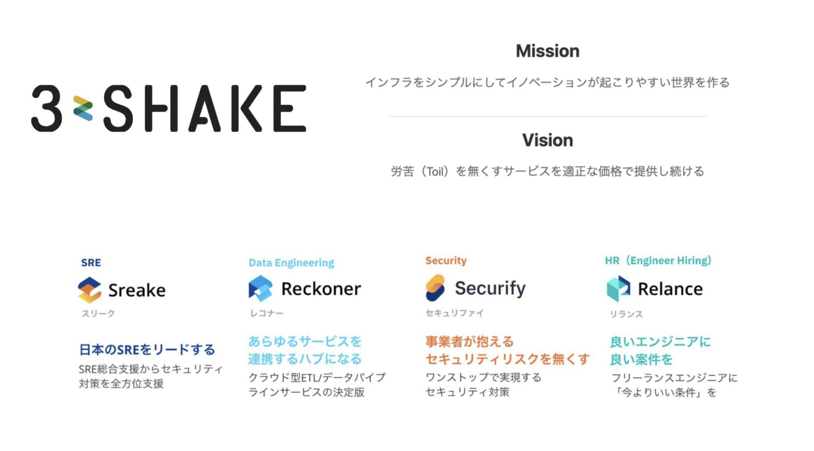
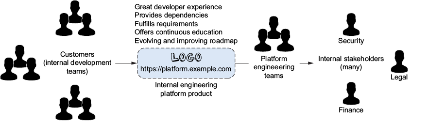
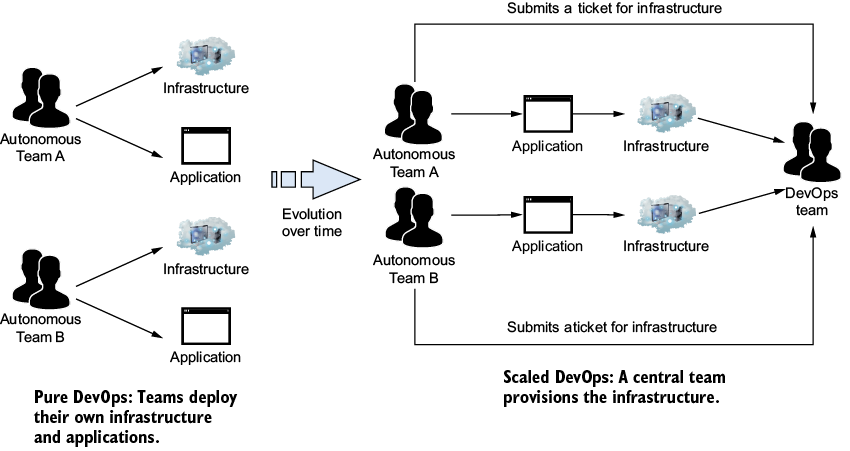
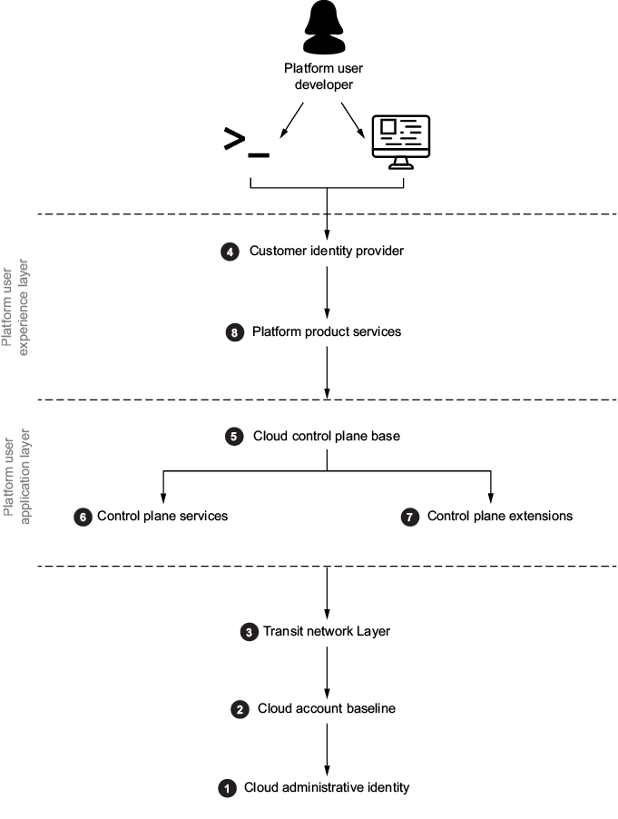
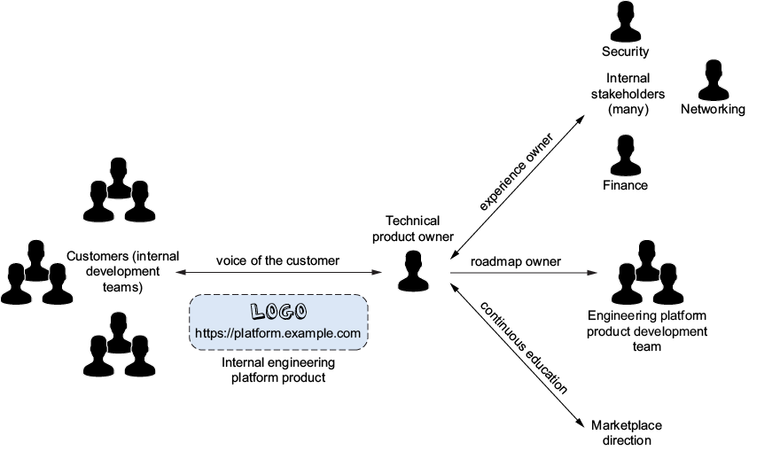
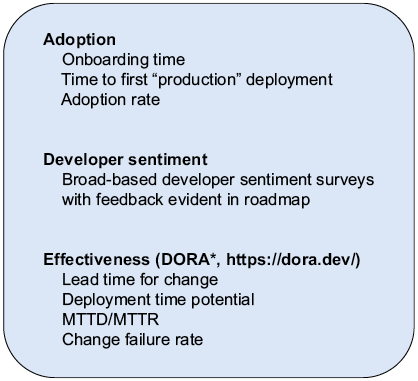
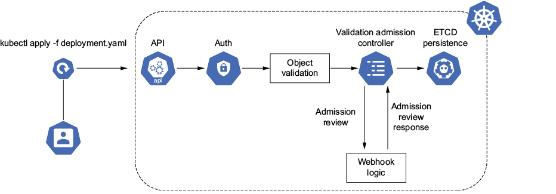
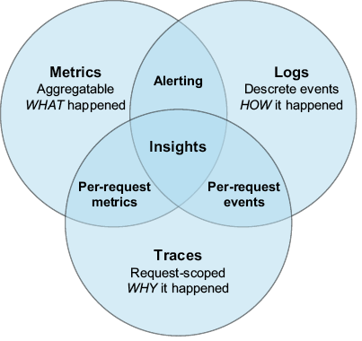
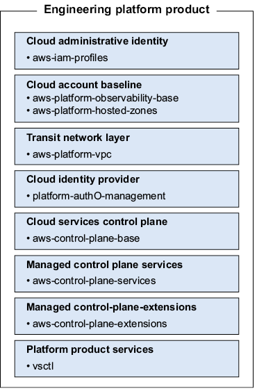

<!--
_backgroundColor: #0a1929
_color: white
_class: title dark
-->

# 30分でわかる Effective Platform Engineering

### 書籍の全体像を掴む

2026/XX/XX 3-shake SRE Tech Talk 
@nwiizo 30min

---

<!-- _backgroundColor: white -->

## nwiizo

株式会社スリーシェイクでプロのソフトウェアエンジニアをやっているものです。格闘技、読書、グラビアが趣味でよく本を紹介しています。

技術書翻訳を手がけるたび、わかることが1つ増えるのと引き換えに、わからないことが3つ増えていく。

インターネット上では **nwiizo** を名乗り、ブログ「**じゃあ、おうちで学べる**」を運営しています。X / GitHub もこのIDでやっています。

---

## about 3-shake

  

---

## Sreakeのお仕事

<strong>クラウドネイティブなアプローチで、お客様の事業をより安全に、競争力のあるサービスへ</strong>

### 提供サービス

<strong>SRE/DevOps支援</strong>

- Kubernetes構築・運用
- クラウドネイティブ化推進
- Observability導入

<strong>プラットフォームエンジニアリング</strong>

- 内部開発者プラットフォーム
- 開発者体験の改善
- セルフサービス基盤構築

<strong>データ活用支援</strong>

- データ基盤構築
- BigQuery/Snowflake
- 分析基盤最適化

ご依頼・ご相談お待ちしております 
https://sreake.com/

---

## この発表で解決できること

<strong>こんな悩みを持っていませんか？</strong>

<strong>「プラットフォームを作ったが使われない」</strong>

→ 開発者を顧客として扱うプロダクトデリバリーモデルを紹介します。「作ったから使え」ではなく「使いたくなるものを作る」発想への転換

<strong>「DevOpsとどう違うのか説明できない」</strong>

→ プラットフォームエンジニアリングはツール導入ではなく、ソフトウェア・デファインドな内部プロダクト開発であることを整理します

<strong>「成功をどう測ればいいか分からない」</strong>

→ 認知負荷・本番環境への道・採用率といった測定可能な指標で、プラットフォームの価値を経営層に語る武器を提供します

今日の30分で「この本、読んでみよう」と思えるようになること 
※30分で10章を扱う以上、各手法の実践詳細は書籍本体に委ねます。原則は組織規模を問わず適用できます

---

## 書籍の概要

### Effective Platform Engineering

- <strong>著者</strong>: Ajay Chankramath, Sean Alvarez, Bryan Oliver, Nic Cheneweth
- <strong>翻訳</strong>: 株式会社スリーシェイク
- <strong>原書</strong>: Manning Publications, 2024

### 本書の一言要約

<strong>プラットフォームエンジニアリングを「ツールの寄せ集め」ではなく「内部開発者向けのプロダクト開発」として捉え直すための実践書。プロダクト思考・ソフトウェア・デファインド・認知負荷の3つを軸に、構築からスケーリングまでを通貫して扱う。</strong>

---

## 本日の流れ

1. <strong>Part 1: 基礎</strong> — なぜプラットフォームエンジニアリングか
2. <strong>Part 2: 構築</strong> — どう作るか

3. <strong>Part 3: スケーリング</strong> — どう育てるか
4. <strong>まとめ</strong> — 何を持ち帰るか

<strong>書籍の構成に沿って、各パートの核心を紹介します</strong>

---

## 書籍は3つのパート・10章で構成されている

| Part                            | テーマ     | 章      | 問い                               | 主要な概念・手法                                   |
| ------------------------------- | ---------- | ------- | ---------------------------------- | -------------------------------------------------- |
| <strong>1. 基礎</strong>        | Why        | Ch.1-3  | なぜ・何を・どう測るか             | プロダクトデリバリーモデル、SDP、認知負荷          |
| <strong>2. 構築</strong>        | How        | Ch.4-8  | 何を作り、どう統治・観測・拡張するか | ガバナンス、オブザーバビリティ、コントロールプレーン |
| <strong>3. スケーリング</strong> | Scale      | Ch.9-10 | どう育てるか                       | イベント駆動、プロダクト進化、文化変革             |

<strong>基礎 → 構築 → スケーリング の流れ。「内部プロダクトを進化させる」が一貫したメッセージ</strong>

---

<!--
_backgroundColor: #0a1929
_color: white
_class: transition
-->

# Part 1: 基礎

Ch.1-3

<strong>最初の問い：「プラットフォームエンジニアリングとは何か？」</strong>

---

## Ch.1 プラットフォームエンジニアリングの定義

Figure 1.2 統一されたプロダクトチームとして働くプラットフォームエンジニア より引用

<strong>定義：開発者にインフラ・セキュリティ・デプロイ機能へのセルフサービスアクセスを提供する内部ソフトウェアシステムを構築する実践</strong>

「ツールを集めて開発者に渡す」ではない。「開発者を顧客とした内部プロダクトを開発する」こと。プロダクトマネジメント・アーキテクチャ・エンジニアリングを統合した専任チームが、完全なオーナーシップを持って作り続ける。

### DevOps/SRE/開発者体験との関係

| 領域           | 焦点                            | プラットフォームとの関係                |
| -------------- | ------------------------------- | --------------------------------------- |
| DevOps         | 開発と運用の壁を壊す文化        | 文化基盤として前提                       |
| SRE            | 信頼性をエンジニアリングで担保  | プラットフォーム上で実装                 |
| 開発者体験(DX) | 開発者の摩擦を減らす            | プラットフォームの成果指標の1つ          |

<strong>DevOpsの「次」ではなく、DevOpsを成立させるための内部プロダクトという位置づけ</strong>

---

## Epetechの現場——どこかで見た景色

<strong>本書はEpetech社（架空のヘルスケアテック・100名超のエンジニア組織）を事例に展開する。</strong> 「どこかで見たことがある」と感じる読者は多いはず。

### Epetechで起きていたこと

| 観察された事象                              | 数値・規模                                  |
| ------------------------------------------- | ------------------------------------------- |
| 開発者の業務時間の使い道                    | 半分が調整作業（DNS、FW、ストレージ、監視等） |
| インフラ変更のハンドオフ数                  | 最大4チームを経由                           |
| デプロイプロセスの所有権                    | 別チームが管理。リリースに数週間             |
| 結果                                        | 本番インシデント増加 → 顧客満足度低下         |

「最適化は各チームの責任範囲のみ許可」——これが組織全体の摩擦を増やしていた

---

## DevOpsだけでは足りない理由

Figure 1.1 DevOps文化を採用する企業における典型的な出発点 より引用

<strong>多くの組織のDevOps導入はツールに偏り、プロセスとエンジニアリング文化の変革は十分ではなかった。</strong> 「You build it, you run it」のスローガンの下、各開発チームが個別にインフラを抱え込み、車輪の再発明と認知負荷の爆発を招いた。

### よくある現状

| 状態                              | 何が起きるか                                |
| --------------------------------- | ------------------------------------------- |
| 各チームが個別にCI/CDを構築        | 同じパイプラインが乱立、知見が共有されない  |
| インフラ変更が4チームを経由       | 1リリースに数週間。責任は自エリアのみ       |
| 開発者が10種以上のツールを使い分け | 認知負荷が上限を超え、ドメインに集中できない |

DevOpsの理想は正しい。ただし「全員にフルスタックを求める」と認知負荷で潰れる

---

## プラットフォームの主要プロダクトドメイン

Figure 1.4 エンジニアリングプラットフォームにおける8つの主要プロダクトドメイン より引用

<strong>プラットフォームは1つの巨大なシステムではなく、独立した8つのプロダクトドメインの集合体。</strong> 構築の順序にも依存関係がある。基盤から積み上げないと崩れる。

| #   | ドメイン               | 役割                              |
| --- | ---------------------- | --------------------------------- |
| 1   | クラウドアカウント基盤 | アカウント・課金・最小権限の土台  |
| 2   | ネットワーク           | トランジット、セグメンテーション  |
| 3   | アイデンティティ       | 顧客ID・サービスアカウント         |
| 4   | コントロールプレーン   | プロビジョニングと統治の中核      |
| 5   | オブザーバビリティ     | メトリクス・ログ・トレース        |
| 6   | アプリケーション配信   | ビルド・デプロイ・リリース        |
| 7   | データ・セキュリティ   | データ保護・シークレット管理      |
| 8   | 開発者ポータル         | セルフサービスのフロントドア      |

<strong>「全部一気に」ではなく「依存順に積む」。最初は1〜4、次に5〜6、最後に7〜8</strong>

---

## Ch.2 ソフトウェア・デファインドのプロダクトとアーキテクチャ

<strong>プラットフォームエンジニアリングの核心は、ソフトウェアエンジニアリングの一カテゴリであるという認識。</strong> インフラを「クリックして設定するもの」から「コードで定義し、テストし、リリースするプロダクト」へ。

### よくあるアンチパターン

| アンチパターン                          | 何が起きるか                       | 正しいアプローチ                                  |
| --------------------------------------- | ---------------------------------- | ------------------------------------------------- |
| Ops出身者が手動運用の延長で構築        | スクリプトの寄せ集め、再現性なし   | プラットフォームをソフトウェアプロダクトとして開発 |
| ツール選定が単発プロジェクト化         | 数年使い回されるレガシー化         | 進化を前提とした継続的な投資                       |
| インフラ変更を直接ユーザーに渡す       | ハンドオフ地獄、責任の押し付け合い | プロダクトオーナーが体験を所有                     |

<strong>「インフラの調達」ではなく「プロダクトの開発」。発想の転換が出発点</strong>

---

## プロダクトデリバリーモデル

Figure 2.1 テクニカルプロダクトオーナーは顧客の声として機能する より引用

開発者を「内部の顧客」として扱い、テクニカルプロダクトオーナー(TPO)が顧客の声として機能する。提供される価値を継続的に評価し、必要なものだけを作る。

### TPOの役割

<strong>顧客の代弁</strong>

開発者が何に困っているかを継続的にヒアリング。仮説ではなく観察に基づいて優先順位を決める。

<strong>価値の計測</strong>

機能をリリースして終わりではなく、採用率・満足度・効果を計測。使われない機能は削る勇気を持つ。

<strong>ロードマップ</strong>

MVPから始めて段階的に進化。「全部入り」を最初から目指さない。

<strong>使われないプラットフォームは存在価値がない。採用は強制ではなく選ばれることで成立する</strong>

---

## 進化的プラットフォームアーキテクチャ

<strong>「最初から完璧なアーキテクチャ」は存在しない。</strong> プラットフォームはユーザー数・要件・スケールに応じて進化させる。設計時の判断は「今のための最善」であり、半年後には書き換える前提で作る。

### 進化のための設計原則

| 原則                       | 意味                                                      |
| -------------------------- | --------------------------------------------------------- |
| <strong>抽象化</strong>     | コントロールプレーンの実装をユーザーから隠す               |
| <strong>イベント駆動</strong> | 同期的な依存を減らし、コンポーネント単位で進化可能にする   |
| <strong>境界の明確化</strong> | プロダクトドメイン間の契約を定義し、内部実装を入れ替え可能 |
| <strong>テスト可能</strong>  | 全変更がコードと同じくCI/CDを通る                         |

<strong>「未来の自分が困らないように」設計する。今のためだけに作るとすぐに負債化する</strong>

---

## Ch.3 プラットフォームエンジニアリング成功の計測

Figure 3.6 あらゆるプラットフォームの共通計測項目 より引用

<strong>「採用されないプラットフォーム」は失敗する。</strong> 経営層が予算を出し続けるためには、価値を数値で語れなければならない。プラットフォームの計測には3つの軸がある——開発者の生産性、認知負荷、組織の健全性。収益だけでは語れない。

### 3つの計測軸

<strong>開発者生産性</strong>

リードタイム、デプロイ頻度、変更失敗率、MTTR（DORA 4キーメトリクス）

<strong>認知負荷</strong>

開発者が把握すべきツール・概念の数。ドメインに集中できる時間の割合。

<strong>組織の健全性</strong>

エンジニアの満足度、採用率、離職率、ステークホルダー整合性

<strong>1つの指標に偏らない。生産性だけ追うと幸福度が下がり、結局生産性も落ちる</strong>

---

## 認知負荷を計測するということ

<strong>認知負荷</strong> = 任意の時点でワーキングメモリが使う精神的努力の総量。Geraldine Weinberg『The Psychology of Computer Programming』(1971) 以来、ソフトウェア開発の本質的な制約として議論されてきた。

### プラットフォームが減らすべき負荷

| 負荷の種類                       | 例                                                       | プラットフォームの対応                       |
| -------------------------------- | -------------------------------------------------------- | -------------------------------------------- |
| <strong>外在性（不要）</strong>   | ツールの設定方法を覚える、社内固有の運用手順              | セルフサービス化、ドキュメント自動生成       |
| <strong>関連性（必要）</strong>   | ドメイン知識、ビジネス要件                                | 開発者のここに集中できるようにする           |
| <strong>本質的（やむを得ない）</strong> | 分散システムの複雑性、トレードオフ判断                | 適切な抽象化で隠蔽、ただしブラックボックス化はしない |

外在性負荷を減らせば、関連性負荷に振れる脳の容量が増える。これがプラットフォームの本質的価値

---

## 本番環境への道を地図にする

<strong>Path to Production</strong> = アイデアから本番稼働までの全ステップを可視化したバリューストリームマップ。コンウェイの法則がチーム境界を決め、その境界がそのままバリューストリームの摩擦になる。

### 計測の対象

| 指標                       | 何を見るか                                            |
| -------------------------- | ----------------------------------------------------- |
| リードタイム               | コミットから本番までの時間                             |
| デプロイ頻度               | 安全に頻繁にデプロイできるか                           |
| 変更失敗率                 | デプロイの何%が問題を起こすか                         |
| MTTR                       | 障害から復旧までの平均時間                             |
| 待ち時間 vs 実作業時間     | バリューストリームのどこで時間が溶けているか           |

<strong>「忙しい」は仕事をしている時間ではなく、待っている時間が長い証拠であることが多い</strong>

---

## 基礎はわかった。では何をどう作るか

Part 1で<strong>プラットフォームをプロダクトとして扱い、ソフトウェア・デファインドで作り、3軸で計測する</strong>という土台を見てきました。問いはここから具体になる。

ガバナンスはどう実装する？オブザーバビリティはどこまで作り込む？コントロールプレーンの中身は？Part 2では、<strong>実際に何を作るか</strong>——統治・観測・配信・コントロールプレーンを順に扱います。

---

<!--
_backgroundColor: #0a1929
_color: white
_class: transition
-->

# Part 2: 構築

Ch.4-8

<strong>次の問い：「実際に何を、どの順番で作るか？」</strong>

---

## Ch.4 ガバナンス、コンプライアンス、信頼

Figure 4.3 Kubernetes Admission Controller より引用

<strong>セルフサービスを開放するほど、ガバナンスをコードで実装する必要が出てくる。</strong> レビュー会議で守るのではなく、ポリシーで自動的に守る。これがプラットフォームの信頼を支える。

### ガバナンスの3層

| 層                                | 何をするか                                            | 実装例                                          |
| --------------------------------- | ----------------------------------------------------- | ----------------------------------------------- |
| <strong>ポリシーアズコード</strong> | コンプライアンス要件をコードで宣言・検証              | OPA/Gatekeeper、Kubernetes Admission Controller |
| <strong>プロベナンス</strong>      | コードからデプロイまでの来歴を自動記録                 | SLSA、署名されたアーティファクト                 |
| <strong>信頼の管理</strong>        | プラットフォーム自身が「誰が何をできるか」を管理       | IDフェデレーション、最小権限                     |

<strong>「ガバナンス vs 自律性」はトレードオフではない。コード化すれば両立できる</strong>

---

## 開発者の自律性とガードレールの両立

<strong>自律性の敵は「ゲートキーパー」。</strong> セキュリティチームやアーキテクトが各リリースを手動で承認する仕組みは、開発者の自律性を奪い、ボトルネックになる。代わりに、Admission Controllerがデプロイメント時に自動で検証する仕組みを作る。

### Before / After

| 状態           | Before（ゲート型）              | After（ガードレール型）                       |
| -------------- | ------------------------------- | --------------------------------------------- |
| 検証タイミング | リリース直前のレビュー会議      | コミット時、PR時、デプロイ時に自動検証         |
| 失敗時の影響   | 数日〜数週間の遅延              | 数秒で開発者にフィードバック                   |
| 検証の一貫性   | レビュアーの気分次第            | 全環境・全チームで同じルール                   |
| ガバナンスの可視性 | 暗黙知                       | コードとしてバージョン管理                     |

<strong>ゲートを置くな、ガードレールを敷け。守りながらスピードを落とさない設計</strong>

---

## ポリシーアズコードの実装——OPAとRego

<strong>「テストカバレッジ90%以上を全パイプラインで強制したい」</strong>——これを集中管理されたDevOpsチームではなく、各チームが自律しながら満たすにはポリシーエンジンが必要。

### 主要な選択肢

| ツール                | 特徴                                                | 適用範囲                              |
| --------------------- | --------------------------------------------------- | ------------------------------------- |
| <strong>Open Policy Agent (OPA) + Rego</strong> | CNCF卒業プロジェクト、宣言的ポリシー言語Rego | Kubernetes, Terraform, API認可など全般 |
| <strong>Gatekeeper</strong>                     | OPAをKubernetesアドミッションコントローラに特化   | Kubernetesリソース検証                |
| <strong>Kyverno</strong>                        | YAMLでポリシー記述、Rego不要                       | Kubernetes中心                        |
| <strong>HashiCorp Sentinel</strong>             | Terraform環境向けのベンダーソリューション           | IaC全般                               |

### 事前 vs 事後

事前チェック（アドミッション時）で違反を弾くか、事後スキャンで違反を検出してアラートする。<strong>パイプラインの所有権を開発者から奪わずにガバナンスを成立させる</strong>のがポリシーアズコードの本質。

<strong>共通標準（Regoなど）を選ぶ理由は、Kubernetes以外の領域にもポリシーを横展開できるため</strong>

---

## Ch.5 進化するオブザーバビリティ

Figure 5.1 オブザーバビリティはメトリクス・ログ・トレースを含む より引用

<strong>オブザーバビリティはメトリクスを超え、ログとトレースを含む。</strong> 「何が起きているか」「なぜ起きたか」「どうやって今の状態になったか」を答えるためのデータ基盤。プラットフォームの初期では同梱で十分だが、スケールするにつれ独立したオブザーバビリティ基盤が必要になる。

### 3つのテレメトリ

| 種類      | 答える問い                       | 主な用途                                |
| --------- | -------------------------------- | --------------------------------------- |
| メトリクス | 何が、いつ、どれくらい起きたか   | アラート、ダッシュボード、SLO監視       |
| ログ      | 詳細に何が起きたか                | デバッグ、監査、セキュリティインシデント |
| トレース  | リクエストがどう流れたか           | レイテンシ分析、依存関係の理解           |

<strong>オブザーバビリティは目的ではなく、判断のためのデータ。データを集めるだけで意思決定が変わらないなら無価値</strong>

---

## SLI/SLO/SLAとプラットフォームの責任

プラットフォームは内部プロダクトであり、利用者（開発チーム）に対して<strong>ソフトウェアとしての契約</strong>を持つ。「ベストエフォート」では信頼されない。

### 階層関係

<strong>SLI</strong>

実際に計測する指標。可用性、レイテンシ、エラー率。

<strong>SLO</strong>

社内に約束する目標。「99.9%」「p99 200ms以下」。

<strong>SLA</strong>

外部に契約する保証。違反時のペナルティを伴う。

### よくある落とし穴

オブザーバビリティ基盤自体の障害監視を、その基盤の中で行ってしまう。<strong>オブザーバビリティプラットフォームは外部から観察する</strong>必要がある——でないと完全障害時にアラートが鳴らない。

<strong>SLOダッシュボードを公開することで「プラットフォーム側の問題ではない」を即座に示せる</strong>

---

## Ch.6 エンジニアリングプラットフォームの構築

<strong>真のセルフサービス体験を提供する内部プロダクトを作る。</strong> アプリケーションの構想・設計・構築・リリース・運用を、開発者が摩擦なく行える状態を目指す。

### ツール選定の評価軸

| 軸                       | 問い                                                |
| ------------------------ | --------------------------------------------------- |
| 統合性                   | 他のプラットフォーム要素と疎結合に組み合わせられるか |
| API/拡張性               | コードから操作・自動化できるか                       |
| マルチテナンシー         | チーム単位で隔離できるか                             |
| 運用負荷                 | プラットフォームチーム自身が運用できるか             |
| 顧客と同じツールを使えるか | ドッグフーディングができるか                         |

<strong>「ベストツール」ではなく「組み合わせやすいツール」を選ぶ。プラットフォームは進化するから</strong>

---

## シークレット管理をセルフサービスにする実装

<strong>「チケットでシークレットをもらう」体験を完全に消す。</strong> Epetechの実装は<strong>自動オンボーディング+ローテーション+真の単一ソース</strong>の3点で構成される。

### 構成要素

| コンポーネント                   | 役割                                                                |
| -------------------------------- | ------------------------------------------------------------------- |
| <strong>Vault等のシークレットマネージャ</strong> | 単一かつセキュアな権威あるソース。すべての自動化はここから取得 |
| <strong>チームスペース自動払い出し</strong> | チームオンボーディング時にRBAC込みで作成。手動申請なし          |
| <strong>OIDCトラスト/サービスアカウント</strong> | パイプライン用クレデンシャルを動的に発行・ローテーション      |
| <strong>external-secrets-operator</strong> | Kubernetes Namespaceにシークレットを自動同期                  |
| <strong>Argo CD / Flux</strong>             | GitOpsデプロイで上記を組み合わせる                              |

### 設計原則

<strong>単一の権威あるソース</strong>でしかシークレットを取得しない。ローテーションを自動化することでセキュアな構成プラクティスの維持コストを劇的に下げる。<strong>「使う場所」を増やしてはいけない。「作って配る場所」が分散すると整合性が崩れる</strong>。

<strong>セルフサービス化はガバナンスの放棄ではない。むしろ自動化されたガードレールで強化される</strong>

---

## パイプラインを「共有コードライブラリ」で標準化する

<strong>各チームが個別のCI/CDを持つと、ベストプラクティスの伝搬が止まる。</strong> 解決策はパイプラインサーバー側のプラグインではなく、<strong>パイプラインコード側の共有ライブラリ</strong>。

### ツール別の共有メカニズム

| ツール                  | 共有の単位                              |
| ----------------------- | --------------------------------------- |
| GitHub Actions          | Reusable Workflows / Composite Actions  |
| CircleCI                | Orbs                                    |
| GitLab CI               | `include:` で外部ファイル参照           |
| Tekton                  | Catalog tasks                           |

### なぜサーバー側プラグインを避けるか

サーバー（Runner）拡張型は<strong>脆弱でメンテナンスコストが高い</strong>。バージョン管理されたコードとして共有ライブラリを管理すれば、<strong>パイプラインコード自体がインフラ・アプリと同じリポジトリ</strong>で進化できる。トリガーは「ソースコード変更」のみ。リポジトリ間でパイプラインがパイプラインを呼ぶのは<strong>不健全な結合の兆候</strong>。

<strong>共有ライブラリの社内開発も、統合テスト・バージョニング・リリースなどソフトウェア開発の規律で運用する</strong>

---

## Ch.7 プラットフォームコントロールプレーンの基礎

Figure 7.1 プラットフォームコントロールプレーンの基礎 より引用

<strong>コントロールプレーン</strong> = プラットフォームの中枢神経。リクエストを受け、ポリシーを評価し、リソースをプロビジョニングし、状態を管理する。Kubernetes APIサーバーが具体例。

### コントロールプレーンが扱う4層

| 層                       | 役割                                                  |
| ------------------------ | ----------------------------------------------------- |
| クラウドアカウントベースライン | アカウントの初期設定、ガードレール、課金            |
| トランジットネットワーク    | VPC接続、セグメンテーション、エグレス制御             |
| 顧客ID                   | チーム・サービス単位の認証・認可                       |
| サービスコントロール基盤  | プロビジョニング、スケジューリング、ポリシー実行       |

<strong>コントロールプレーンが薄いと「何でもPRで」になる。厚すぎると「何でも申請」になる</strong>

---

## Ch.8 コントロールプレーンのサービスとエクステンション

<strong>コントロールプレーンは1つの巨大システムではなく、サービスとエクステンションの集合体。</strong> イベント駆動アーキテクチャを採用し、各統合・構成リソースがイベントに応答する形にすると、担当チームの移行とスケーリングが容易になる。

### 統合オーケストレーター

主要な顧客ペルソナ（チーム）を中心にモデル化された<strong>単一のプライマリ統合オーケストレーター</strong>が、標準イベントストリームを維持する。これがある限り、統合活動はプラットフォームとともに進化できる。

| 設計判断                  | 選択肢A（避ける）                | 選択肢B（推奨）                      |
| ------------------------- | -------------------------------- | ------------------------------------ |
| サービス間連携            | 同期API呼び出し                  | イベント駆動、非同期メッセージング   |
| 状態管理                  | 中央集中型のステートストア       | 各サービスが自分の状態を持つ         |
| 拡張の方法                | コア改修                          | エクステンションポイントで追加        |

<strong>コントロールプレーン自体に進化的アーキテクチャを適用する。これがスケーリングの前提</strong>

---

## 構築できた。次はスケーリング

Part 2では<strong>ガバナンス・オブザーバビリティ・コントロールプレーン</strong>を作りました。最初の数チーム、最初のいくつかのワークロードでは、これで動く。

しかし、組織が10チーム、100チーム、1000サービスへとスケールすると、最初のアーキテクチャは破綻し始める。同期通信は詰まり、ロールが機能境界を超え、文化が追いつかなくなる。Part 3では、<strong>スケールに耐える進化</strong>——アーキテクチャの組み換え、組織変革、プロダクトとしての進化を扱います。

---

<!--
_backgroundColor: #0a1929
_color: white
_class: transition
-->

# Part 3: スケーリング

Ch.9-10

<strong>最後の問い：「どう育て続けるか？」</strong>

---

## Ch.9 スケールを支えるアーキテクチャの変更

<strong>スケールするとアーキテクチャは破綻する。</strong> 同期APIは詰まり、ロールは機能境界を超え、変更速度は鈍る。スケールフェーズではアーキテクチャを「組み直す」必要がある。

### 3つのスケーリング戦略

<strong>ロールのスケーリング</strong>

1人/1チームでは捌けなくなった責務を分割。テクニカルプロダクトオーナー複数化、ドメイン別チーム化。

<strong>オーケストレーションのスケーリング</strong>

中央集中型のオーケストレーターから、ドメイン別のエクステンション群へ。コア + プラグインの構造。

<strong>イベントストリーミング</strong>

同期呼び出しを非同期イベントに置き換え、コンポーネント間の結合度を下げる。

<strong>スケールの本質は「結合を減らすこと」。リソースを増やしても、結合があれば詰まる</strong>

---

## イベントストリーミングが変える設計判断

プラットフォームの内部通信を「同期API」から「イベントストリーム」へ寄せると、各エクステンションが独立してスケール・進化できるようになる。

### 同期 vs イベント駆動

| 観点                       | 同期APIの場合                          | イベント駆動の場合                          |
| -------------------------- | -------------------------------------- | ------------------------------------------- |
| 障害の伝播                 | 1サービスのダウンが連鎖する            | バッファリングされ、上流に伝播しにくい       |
| バージョンアップの調整      | 全サービスを揃えてリリース必要         | 各サービスが独自のペースで進化可能           |
| 監査・リプレイ             | 困難（ログの寄せ集め）                 | イベントログが事実上の単一の真実             |
| デバッグ難易度             | 同期トレースは追いやすい               | 非同期トレースの工夫が必要                   |

<strong>イベント駆動は「正解」ではなく「トレードオフ」。スケールが必要な箇所に絞って適用する</strong>

---

## Ch.10 プラットフォームプロダクトの進化

<strong>プラットフォームに「完成」はない。</strong> 組織のニーズ、テクノロジーの進化、規制の変化に合わせて作り変え続ける。プロダクトとしての成功は、収益ではなく組織への影響で測る。

### 成熟度に応じた焦点の変化

| フェーズ                       | 焦点                                       | 主要メトリクス                            |
| ------------------------------ | ------------------------------------------ | ----------------------------------------- |
| 立ち上げ                       | コアユースケースの自動化、初期採用者の獲得 | 採用チーム数、初回利用までの時間          |
| 拡大                           | カバー範囲の拡張、認知負荷の削減            | 採用率、開発者満足度、リードタイム短縮    |
| 成熟                           | 効率化、コスト最適化、差別化要因への進化   | TCO、ビジネス成果、人材の競争優位         |

<strong>「プロダクトとしてのプラットフォーム」は競争優位の源泉になる</strong>

---

## Epetech変革の数字

<strong>変革の効果は技術指標だけでは語れない。</strong> Epetechの事例で本書は具体的な数字を示している。

### Before / After の指標

| 指標                        | Before                   | After                    |
| --------------------------- | ------------------------ | ------------------------ |
| コミット → デプロイの時間   | 数週間                    | 数時間                    |
| 本番環境の欠陥              | 基準                      | <strong>60%削減</strong>   |
| 開発者満足度                | 基準                      | <strong>40%向上</strong>   |
| インフラ変更のハンドオフ    | 最大4チーム経由           | チーム内で完結            |

### 組織側の変化（Team Topologiesの適用）

<strong>Stream-Aligned Team</strong>（eコマース、モバイル、在庫など）が価値ストリームを所有 / <strong>Platform Team</strong>が共通基盤を内部プロダクトとして提供 / <strong>Enabling Team</strong>がクラウド移行・新技術導入を伴走支援。

<strong>「数字で語る」ことが経営層からの継続投資を引き出す。これが計測の3軸を真剣に作る理由</strong>

---

## 文化的変革——従来のオペレーション世界からの脱却

<strong>技術だけ変えても、文化が変わらなければプラットフォームは形骸化する。</strong> 旧来のOps文化（手動・チケット・ガードマン）を引きずったまま「プラットフォーム」と看板を書き換えても、開発者から見れば中身は同じ。

### 変えるべきマインドセット

| Before                              | After                                 |
| ----------------------------------- | ------------------------------------- |
| インフラチームが「守る」            | プラットフォームチームが「使われる」  |
| チケットでリクエストを受ける        | APIで自律的にリクエストされる         |
| 安定性のために変更を遅らせる        | 安定性のために変更を頻繁にする        |
| 「うちのインフラは特殊」            | 「内部プロダクトとして開発する」      |

プラットフォームエンジニアリングは技術プロジェクトではなく、組織の働き方を変える取り組み

---

## 書籍全体のメッセージ

10章を通じて書籍が一貫して伝えているのは、プラットフォームエンジニアリングは<strong>「ツールの寄せ集めを置く」ではなく「内部開発者向けのプロダクトを開発し続ける」</strong>という認識の転換。

### 3つの統合

| 軸                          | 内容                                       |
| --------------------------- | ------------------------------------------ |
| <strong>プロダクト</strong>   | 開発者を顧客として扱い、価値を計測する     |
| <strong>ソフトウェア</strong> | インフラをコードで定義し、テスト・進化させる |
| <strong>組織</strong>         | チーム構造・文化・スキルを揃える           |

プラットフォームを作るな。プラットフォームを「プロダクト」として育てよ。

---

## どこから読むか

本音を言えば、Ch.1からCh.10まで順番に読んでほしい。著者も翻訳者も、その順番で読んだときに最も学びが深くなるよう設計している。

ただ、時間がない場合は目的別に以下のルートから入ってください。

<strong>これから始める</strong>

Ch.1 → Ch.2 → Ch.6

定義 → ソフトウェア・デファインド → 構築の起点

<strong>すでに着手中</strong>

Ch.3 → Ch.4 → Ch.5

成功の計測 → ガバナンス → オブザーバビリティ

<strong>規模で詰まっている</strong>

Ch.7 → Ch.9 → Ch.10

コントロールプレーン → スケーリング → 進化

---

## 本日のまとめ

<strong>書籍の全体像</strong>: 基礎 → 構築 → スケーリングの3パート・10章。プラットフォームエンジニアリングを「内部開発者向けプロダクト」として捉え直し、プロダクト思考・ソフトウェア・デファインド・認知負荷の3軸で組み立てる。

<strong>翻訳者として一番伝えたいこと</strong>

プラットフォームエンジニアリングの本質は、「便利な内部ツールを置くこと」ではない。<strong>開発者が認知負荷から解放されてドメインに集中できる状態を、プロダクトとして作り、進化させ続けること</strong>。完成形を目指す瞬間にプラットフォームは陳腐化する。問い続けるべきは「使われているか」「価値が出ているか」「組織は変わったか」だ。

<strong>「全部読む時間がない」への回答</strong>

Ch.1（定義）、Ch.3（計測）、Ch.6（構築）——この3章だけで実践に着手できる。Ch.1だけだと「概念は分かったが何を作るかわからない」、Ch.6だけだと「作るものは分かったが価値を語れない」。<strong>Ch.1 → Ch.3 → Ch.6</strong> の順で読むのが最短経路。

プラットフォームは作るものではなく、育て続けるもの。今日から始めれば、組織はもう変わり始めている。

---

## 参考資料

- [Effective Platform Engineering](https://www.manning.com/books/effective-platform-engineering) - Ajay Chankramath, Sean Alvarez, Bryan Oliver, Nic Cheneweth（Manning, 2024）
- [Effective Platform Engineering 日本語版](https://www.oreilly.co.jp/) - 株式会社スリーシェイク訳
- [Team Topologies](https://teamtopologies.com/) - Matthew Skelton, Manuel Pais（IT Revolution, 2019）
- [Platform Engineering](https://platformengineering.org/) - コミュニティとリソース
- [The Psychology of Computer Programming](https://leanpub.com/thepsychologyofcomputerprogramming) - Gerald M. Weinberg（1971）
- [Accelerate](https://itrevolution.com/product/accelerate/) - Nicole Forsgren, Jez Humble, Gene Kim（IT Revolution, 2018）
- [Building Microservices, 2nd Edition](https://www.oreilly.com/library/view/building-microservices-2nd/9781492034018/) - Sam Newman（O'Reilly, 2021）
- [Wardley Maps](https://learnwardleymapping.com/) - Simon Wardley
- [The DevOps Handbook](https://itrevolution.com/product/the-devops-handbook-second-edition/) - Gene Kim et al.（IT Revolution, 2021）
- [Internal Developer Platform](https://internaldeveloperplatform.org/) - IDPの定義とリファレンス

---

<!--
_backgroundColor: #0a1929
_color: white
_class: title dark
-->

# ありがとうございました

### ご質問・ご相談はお気軽にお問い合わせください

@nwiizo | https://3-shake.com

