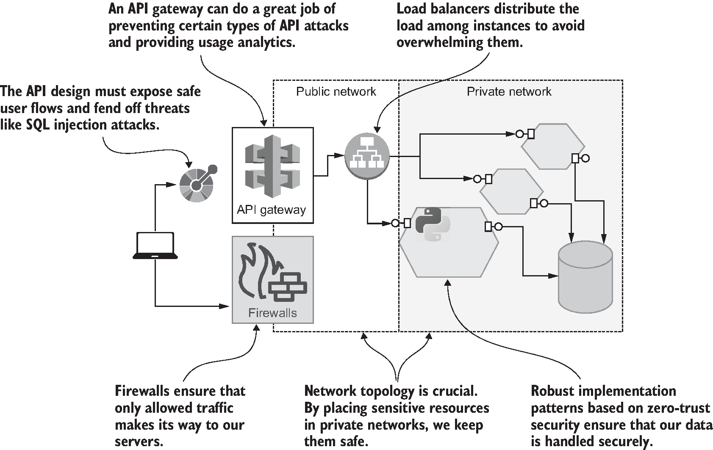
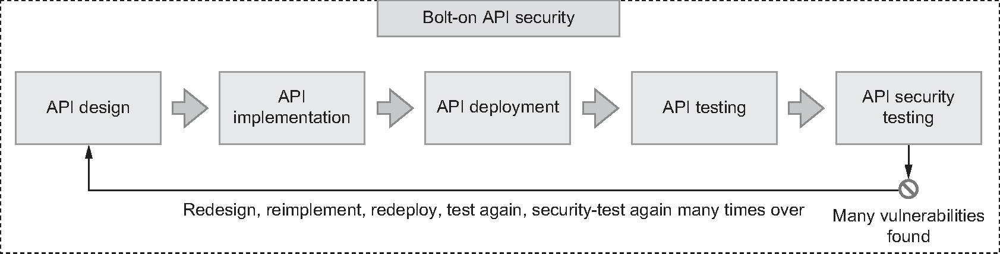
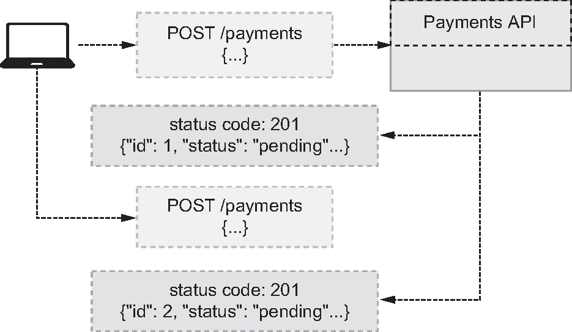

<!--
_backgroundColor: #0a1929
_color: white
_class: title dark
-->


<div class="title" style="text-align: left; margin-top: 100px; margin-left: 80px; padding-left: 0; max-width: 70%;">

# <span style="font-size: 1.2em;">30分でわかる</br>Secure APIs</span>

### 書籍の全体像を掴む

</div>

<div class="author-info" style="text-align: left; padding-left: 0; text-indent: 0;">
2026/XX/XX 3-shake SRE Tech Talk</br>
@nwiizo 30min
</div>

---

<!-- _backgroundColor: white -->


## nwiizo

<div style="font-size: 0.75em;">

株式会社スリーシェイクでプロのソフトウェアエンジニアをやっているものです。格闘技、読書、グラビアが趣味でよく本を紹介しています。

技術書翻訳を手がけるたび、わかることが1つ増えるのと引き換えに、わからないことが3つ増えていく。

インターネット上では **nwiizo** を名乗り、ブログ「**じゃあ、おうちで学べる**」を運営しています。X / GitHub もこのIDでやっています。

</div>

---

## about 3-shake

<div style="text-align: center; margin-top: 30px;">
  
</div>

---

## Sreakeのお仕事

<div style="font-size: 0.68em;">

<div style="background-color: #f5f5f5; padding: 12px; border-radius: 8px; margin-bottom: 12px;">

<strong>クラウドネイティブなアプローチで、お客様の事業をより安全に、競争力のあるサービスへ</strong>

</div>

### 提供サービス

<div style="display: flex; gap: 8px; flex-wrap: wrap; align-items: center;">
<div style="flex: 1; min-width: 180px; background-color: #f5f5f5; padding: 10px; border-radius: 8px;">

<strong>SRE/DevOps支援</strong>

- Kubernetes構築・運用
- クラウドネイティブ化推進
- Observability導入

</div>
<div style="flex: 1; min-width: 180px; background-color: #f5f5f5; padding: 10px; border-radius: 8px;">

<strong>セキュリティ支援</strong>

- セキュア・バイ・デザイン
- ゼロトラスト導入
- 脆弱性診断・改善支援

</div>
<div style="flex: 1; min-width: 180px; background-color: #f5f5f5; padding: 10px; border-radius: 8px;">

<strong>データ活用支援</strong>

- データ基盤構築
- BigQuery/Snowflake
- 分析基盤最適化

</div>
</div>

<div style="margin-top: 12px; padding: 12px; background-color: #e0e0e0; border-radius: 8px; text-align: center;">
<span style="font-weight: bold; font-size: 1.1em;">ご依頼・ご相談お待ちしております</span></br>
<span style="font-size: 0.9em;">https://sreake.com/</span>
</div>

</div>

---

## この発表で解決できること

<div style="font-size: 0.75em;">

<div style="background-color: #f5f5f5; padding: 15px; border-radius: 8px; margin-bottom: 12px;">

<strong>こんな悩みを持っていませんか？</strong>

</div>

<div style="display: flex; gap: 15px; align-items: center;">
<div style="flex: 1; background-color: #f5f5f5; padding: 12px; border-radius: 8px;">

<strong>「APIセキュリティは認証・認可だけと思っていた」</strong>

<span style="font-size: 0.85em;">→ APIセキュリティは設計・実装・インフラの3軸にまたがる包括的な分野。OWASP API Top 10の脆弱性を体系的に整理します</span>

</div>
<div style="flex: 1; background-color: #f5f5f5; padding: 12px; border-radius: 8px;">

<strong>「リリース前にチェックリストで確認している」</strong>

<span style="font-size: 0.85em;">→ 後付けセキュリティの限界を知り、シフトレフト・ゼロトラスト・セキュア・バイ・デザインを実装する道筋を提示します</span>

</div>
<div style="flex: 1; background-color: #f5f5f5; padding: 12px; border-radius: 8px;">

<strong>「内部APIだから保護しなくていい」</strong>

<span style="font-size: 0.85em;">→ 「内部APIというものは存在しない」という原則を、ゼロトラストの考え方とともに学びます</span>

</div>
</div>

<div style="margin-top: 12px; padding: 10px; background-color: #e0e0e0; border-radius: 5px; text-align: center;">
<span style="color: #e65100; font-weight: bold;">今日の30分で「この本、読んでみよう」と思えるようになること</span></br>
<span style="font-size: 0.8em;">※30分で12章を扱う以上、各手法の実装詳細は書籍本体に委ねます</span>
</div>

</div>

---

## 書籍の概要

<div style="font-size: 0.75em;">

### Secure APIs

- <strong>著者</strong>: Jose Haro Peralta
- <strong>翻訳</strong>: 株式会社スリーシェイク
- <strong>原書</strong>: Manning Publications

### 本書の一言要約

<div style="background-color: #f5f5f5; padding: 15px; border-radius: 8px; margin-top: 10px;">

<strong>APIセキュリティを「認証・認可の話」から「設計・実装・インフラを貫く包括的な実践」へ拡張する実装ガイド。OWASP API Top 10の脆弱性を起点に、シフトレフト・ゼロトラスト・セキュア・バイ・デザインを具体的なコード・アーキテクチャに落とし込む。</strong>

</div>

</div>

---

## 本日の流れ

<div style="font-size: 0.75em;">

<div style="display: flex; gap: 20px; align-items: center;">
<div style="flex: 1; background-color: #f5f5f5; padding: 15px; border-radius: 8px;">

1. <strong>Part 1: 原則</strong> — APIセキュリティとは何か（Ch.1-3）
2. <strong>Part 2: 脆弱性</strong> — 主要な攻撃ベクトル（Ch.4-5）

</div>
<div style="flex: 1; background-color: #f5f5f5; padding: 15px; border-radius: 8px;">

3. <strong>Part 3: 設計と実装</strong> — セキュア・バイ・デザイン（Ch.6-9）
4. <strong>Part 4: 高度な領域</strong> — FAPI・観測・テスト（Ch.10-12）

</div>
</div>

<div style="margin-top: 15px; padding: 12px; background-color: #e0e0e0; border-radius: 5px; text-align: center;">
<strong>原則 → 脆弱性 → 設計と実装 → 高度な領域 の流れ</strong>
</div>

</div>

---

## 書籍は12章で構成されている

<div style="font-size: 0.7em;">

| Part                          | テーマ           | 章        | 主要な概念                                                  |
| ----------------------------- | ---------------- | --------- | ----------------------------------------------------------- |
| <strong>1. 原則</strong>      | Why & 基礎       | Ch.1-3    | セキュア・バイ・デザイン、シフトレフト、ゼロトラスト        |
| <strong>2. 脆弱性</strong>    | OWASP API Top 10 | Ch.4-5    | BOLA, BFLA, 認証不備, SSRF, リソース消費, 設定ミス          |
| <strong>3. 設計と実装</strong> | How              | Ch.6-9    | 安全な設計、JWT/OAuth/OIDC、認可ミドルウェア、APIゲートウェイ |
| <strong>4. 高度な領域</strong> | 応用             | Ch.10-12  | FAPI、オブザーバビリティ、セキュリティテスト                |

<div style="margin-top: 15px; padding: 12px; background-color: #e0e0e0; border-radius: 5px; text-align: center;">
<strong>原則を理解 → 脅威を知る → 安全に設計・実装 → 運用で守り続ける</strong>
</div>

</div>

---

<!--
_backgroundColor: #0a1929
_color: white
_class: transition
-->

<div style="display: flex; flex-direction: column; justify-content: center; align-items: center; height: 80%; text-align: center;">

<div style="font-size: 1.5em; font-weight: bold;">

# Part 1: 原則

Ch.1-3

</div>

<strong>最初の問い：「APIセキュリティとは認証・認可だけなのか？」</strong>

</div>

---

## Ch.1 APIセキュリティとは

<div style="font-size: 0.72em;">

<div style="background-color: #f5f5f5; padding: 12px; border-radius: 8px; margin-bottom: 10px;">

<strong>定義：APIの脆弱性を研究し、検出・防止する分野。</strong> 単なる認証・認可ではない。設計・実装・インフラの全層にまたがる包括的なアプローチを必要とする。

</div>

### 数字で見るAPIセキュリティの現在地

| データ                                          | 出典                                       |
| ----------------------------------------------- | ------------------------------------------ |
| インターネットトラフィックの57〜83%がAPI         | Cloudflare 57% / Akamai 83%                |
| 2023年Q1のAPI攻撃は前年比400%増                 | Salt Security 2023 Q1レポート              |
| 2022年の世界全体のAPI攻撃試行は90億回超         | Akamai                                     |
| API侵害1件あたりの平均被害額 610万ドル          | Kong                                       |

<div style="margin-top: 10px; padding: 8px; background-color: #e0e0e0; border-radius: 5px; text-align: center;">
<strong>APIはシステムのゲートウェイ。ドアを開けるなら、鍵をかける方法を知らねばならない</strong>
</div>

</div>

---

## APIセキュリティの3つの軸

<div style="font-size: 0.7em;">

<div style="display: flex; gap: 15px; align-items: center; margin-bottom: 10px;">
<div style="width: 38%;">

<div style="font-size: 0.6em; color: #999; text-align: center; margin-top: 5px;">図1.1 APIセキュリティの構成要素 より引用</div>
</div>
<div style="flex: 1; background-color: #f5f5f5; padding: 10px; border-radius: 8px;">

<strong>APIセキュリティは「設計」「実装」「インフラ」の3軸を同時に考える必要がある。</strong> どこか1つだけ強化しても、他の軸の弱点から侵入される。

</div>
</div>

<div style="display: flex; gap: 12px; align-items: center;">
<div style="flex: 1; background-color: #f5f5f5; padding: 12px; border-radius: 8px;">

<strong>設計</strong>

安全なユーザーフロー、データモデル、認可境界。SQLインジェクションのような脅威に防御を組み込む。

</div>
<div style="flex: 1; background-color: #f5f5f5; padding: 12px; border-radius: 8px;">

<strong>実装</strong>

データ検証、エラー処理、ライブラリ選定、依存関係。シークレット管理、暗号化。

</div>
<div style="flex: 1; background-color: #f5f5f5; padding: 12px; border-radius: 8px;">

<strong>インフラ</strong>

APIゲートウェイ、ファイアウォール、ロードバランサー、ネットワークセグメンテーション、WAF。

</div>
</div>

<div style="margin-top: 10px; padding: 8px; background-color: #e0e0e0; border-radius: 5px; text-align: center;">
<strong>「ゲートウェイで守ればいい」「実装はライブラリ任せ」——この発想がAPI侵害の根本原因</strong>
</div>

</div>

---

## Ch.2 組織とAPIセキュリティの整合

<div style="font-size: 0.72em;">

<div style="background-color: #f5f5f5; padding: 12px; border-radius: 8px; margin-bottom: 10px;">

<strong>APIセキュリティは技術問題であると同時に組織問題。</strong> ステークホルダーがその重要性を理解し、作業時間を割り当てなければ、いくら技術的に正しくても実装されない。データ侵害が起きるまで表面化しないという厄介さがある。

</div>

### 組織で動かすための3ステップ

| ステップ                       | やること                                                         |
| ------------------------------ | ---------------------------------------------------------------- |
| <strong>1. 評価</strong>       | 現在のセキュリティ・ポスチャーを把握。NIST/CIS/ISOフレームワーク参照 |
| <strong>2. 脅威モデリング</strong> | チームスポーツとして実施。STRIDEで脅威カテゴリーを整理         |
| <strong>3. プログラム化</strong> | 継続的なセキュリティチェックを開発プロセスに組み込む            |

<div style="margin-top: 10px; padding: 8px; background-color: #e0e0e0; border-radius: 5px; text-align: center;">
<strong>「監査が来たから慌てて対応」では遅い。今すぐ評価を始める</strong>
</div>

</div>

---

## Ch.3 シフトレフトAPIセキュリティ

<div style="font-size: 0.7em;">

<div style="display: flex; gap: 15px; align-items: center; margin-bottom: 10px;">
<div style="width: 45%;">

<div style="font-size: 0.6em; color: #999; text-align: center; margin-top: 5px;">図3.1 SDLCの最後にAPIセキュリティテストを実行する従来アプローチ より引用</div>
</div>
<div style="flex: 1; background-color: #f5f5f5; padding: 10px; border-radius: 8px;">

<strong>従来：完成したAPIにセキュリティテストを後付け（ボルトオン）→ 表面的な脆弱性しか見つけられない。</strong></br>
<strong>シフトレフト：設計段階からセキュリティを組み込み、開発サイクル全体で検証する。</strong>

</div>
</div>

### Before / After

| 観点                         | ボルトオン（従来）             | シフトレフト（本書の推奨）         |
| ---------------------------- | ------------------------------ | ---------------------------------- |
| セキュリティ対応のタイミング | リリース直前のテストフェーズ   | 設計・実装・デプロイの全段階       |
| 発見できる脆弱性             | SSL欠如、XSS、表面的な脆弱性   | ビジネスロジック、アクセス制御の不備 |
| 修正コスト                   | 高（再設計・再実装が必要）     | 低（設計時に潰せる）               |
| フィードバックループ         | 数週間〜数ヶ月                 | 数分〜数日                         |

<div style="margin-top: 10px; padding: 8px; background-color: #e0e0e0; border-radius: 5px; text-align: center;">
<strong>API侵害の多くはビジネスロジックの欠陥。表面検査だけでは見つからない</strong>
</div>

</div>

---

## Ch.3 ゼロトラストAPI

<div style="font-size: 0.7em;">

<div style="display: flex; gap: 15px; align-items: center; margin-bottom: 10px;">
<div style="width: 38%;">

<div style="font-size: 0.6em; color: #999; text-align: center; margin-top: 5px;">図3.8 NIST 800-207の原則を適用するゼロトラストAPI より引用</div>
</div>
<div style="flex: 1; background-color: #f5f5f5; padding: 10px; border-radius: 8px;">

<strong>ゼロトラスト</strong> = 「信頼するな、検証せよ」。NIST 800-207に基づくモデル。すべてのリクエスト・データソース・認証情報を、起源に関係なく検証する。

</div>
</div>

### 4つの実践原則

<div style="display: flex; gap: 10px; flex-wrap: wrap; align-items: center;">
<div style="flex: 1; min-width: 180px; background-color: #f5f5f5; padding: 10px; border-radius: 8px;">

<strong>すべてを検証する</strong>

入力、トークン、レスポンス、サードパーティAPI。データの起源を信頼しない。

</div>
<div style="flex: 1; min-width: 180px; background-color: #f5f5f5; padding: 10px; border-radius: 8px;">

<strong>内部APIも保護する</strong>

「内部だから安全」は幻想。横展開（lateral movement）への耐性を持つ。

</div>
<div style="flex: 1; min-width: 180px; background-color: #f5f5f5; padding: 10px; border-radius: 8px;">

<strong>知らないものは守れない</strong>

シャドウAPI・ゾンビAPI・ゴーストAPIを発見し、カタログ化する。

</div>
<div style="flex: 1; min-width: 180px; background-color: #f5f5f5; padding: 10px; border-radius: 8px;">

<strong>DevSecOps</strong>

CI/CDにセキュリティを統合し、自動的に検証する。

</div>
</div>

<div style="margin-top: 10px; padding: 8px; background-color: #e0e0e0; border-radius: 5px; text-align: center;">
<span style="color: #e65100; font-weight: bold;">「内部APIというものは存在しない」——これがゼロトラストの第一原則</span>
</div>

</div>

---

## 原則はわかった。次は具体的な脅威

<div style="font-size: 0.75em;">

<div style="background-color: #f5f5f5; padding: 15px; border-radius: 8px;">

Part 1で<strong>セキュア・バイ・デザイン、シフトレフト、ゼロトラスト</strong>という3つの原則を見てきました。原則は明確になった。

しかし、原則だけでは「具体的に何を防ぐか」が分からない。Part 2では、OWASP API Security Top 10に基づく<strong>主要な脆弱性</strong>を扱います。実際の攻撃ベクトルを知ることで、設計・実装の指針が具体になります。

</div>

</div>

---

<!--
_backgroundColor: #0a1929
_color: white
_class: transition
-->

<div style="display: flex; flex-direction: column; justify-content: center; align-items: center; height: 80%; text-align: center;">

<div style="font-size: 1.5em; font-weight: bold;">

# Part 2: 脆弱性

Ch.4-5

</div>

<strong>次の問い：「実際にどんな脅威があるのか？」</strong>

</div>

---

## OWASP API Security Top 10 (2023) と書籍の対応

<div style="font-size: 0.65em;">

<div style="background-color: #f5f5f5; padding: 10px; border-radius: 8px; margin-bottom: 10px;">

<strong>OWASP API Security Top 10は3年毎の改訂で更新されたAPI特有の脆弱性ランキング。</strong> 本書のCh.4-5はこの分類に沿って構成されている。

</div>

| #     | OWASP API Top 10 (2023)                | 書籍での扱い                       |
| ----- | -------------------------------------- | ---------------------------------- |
| API1  | Broken Object Level Authorization (BOLA) | Ch.4.2-4.3                       |
| API2  | Broken Authentication                    | Ch.4.4-4.5                       |
| API3  | Broken Object Property Level Authorization | Ch.4.6 (マスアサインメント・過剰露出) |
| API4  | Unrestricted Resource Consumption        | Ch.5.1                           |
| API5  | Broken Function Level Authorization (BFLA) | Ch.4.7-4.8                     |
| API6  | Unrestricted Access to Sensitive Business Flows | Ch.4.9-4.10                |
| API7  | Server Side Request Forgery (SSRF)       | Ch.5.2-5.3                       |
| API8  | Security Misconfiguration                 | Ch.5.4-5.5                       |
| API9  | Improper Inventory Management             | Ch.5.6 (シャドウ/ゾンビ/ゴーストAPI) |
| API10 | Unsafe Consumption of APIs                | Ch.5.7-5.8                       |

<div style="margin-top: 8px; padding: 8px; background-color: #e0e0e0; border-radius: 5px; text-align: center;">
<strong>1位がBOLA、5位がBFLAであり続けている事実が、認可境界の設計の難しさを示す</strong>
</div>

</div>

---

## Ch.4 BOLA — オブジェクトレベル認可の不備

<div style="font-size: 0.7em;">

<div style="display: flex; gap: 15px; align-items: center; margin-bottom: 10px;">
<div style="width: 38%;">

<div style="font-size: 0.6em; color: #999; text-align: center; margin-top: 5px;">図4.1 BOLAの発生 より引用</div>
</div>
<div style="flex: 1; background-color: #f5f5f5; padding: 10px; border-radius: 8px;">

<strong>BOLA (Broken Object Level Authorization)</strong> = ユーザーAが、ユーザーBのみがアクセスできるはずのリソース（投稿、注文、医療記録など）にアクセスできてしまう脆弱性。OWASP API Security Top 10で長らく1位。

</div>
</div>

### 典型的な攻撃シナリオ

```
GET /api/users/123/orders/456   ← 自分の注文（許可）
GET /api/users/124/orders/789   ← 他人の注文（本来NG）
                                  ↑ ID変更だけで通ってしまう
```

### 防ぐためのチェックポイント

| チェック項目                       | 設計で考えること                              |
| ---------------------------------- | --------------------------------------------- |
| すべての操作でリソース所有者を検証 | 一覧取得・詳細取得・更新・削除すべて          |
| 予測可能なIDを使わない             | UUID/ULIDで列挙攻撃を困難に                   |
| 認可をライブラリ任せにしない       | フレームワークのデフォルトでは不十分          |

<div style="margin-top: 10px; padding: 8px; background-color: #e0e0e0; border-radius: 5px; text-align: center;">
<strong>BOLAは「ロジックバグ」。SAST/DASTでは検出できない。設計レビューと手動テストが必須</strong>
</div>

</div>

---

## USPS事件——BOLAで6000万人の個人情報が漏洩

<div style="font-size: 0.7em;">

<div style="background-color: #f5f5f5; padding: 10px; border-radius: 8px; margin-bottom: 10px;">

<strong>2018年11月、米国郵便公社（USPS）はInformed Visibility APIの脆弱性を修正した。</strong> 認証済みであれば誰でも他のユーザーのメール・電話・住所を取得できる状態だった。報告は Brian Krebs「USPS Site Exposed Data on 60 Million Users」。

</div>

### 何が起きたか

| 段階                | 状況                                              |
| ------------------- | ------------------------------------------------- |
| 1. 認証は通っていた | 「ログインできる人」なら誰でもAPIにアクセス可能    |
| 2. 認可は機能せず   | クエリで他ユーザーのデータをそのまま取得できた     |
| 3. 影響             | 約6000万人分のPII漏洩                              |

### この事件が示すこと

- <strong>「認証 = 認可」ではない</strong>。ログインできる ≠ 何でも見ていい
- <strong>BOLAは医療・金融・防衛のような機密分野で侵害の主要因</strong>
- <strong>API自体は仕様通りに動いていた</strong>。脆弱性はビジネスロジックの設計欠陥

<div style="margin-top: 10px; padding: 8px; background-color: #e0e0e0; border-radius: 5px; text-align: center;">
<span style="color: #e65100; font-weight: bold;">SAST/DASTでは検出されない。設計レビューと所有者検証テストでしか守れない</span>
</div>

</div>

---

## Ch.4 BFLA — 機能レベル認可の不備

<div style="font-size: 0.7em;">

<div style="background-color: #f5f5f5; padding: 10px; border-radius: 8px; margin-bottom: 10px;">

<strong>BFLA (Broken Function Level Authorization)</strong> = 通常ユーザーが管理者用APIにアクセスできてしまう脆弱性。「URLが分からないだろう」という想定（Security by Obscurity）に依存している実装で発生する。

</div>

### 典型例

```
POST /api/admin/users/delete   ← 通常ユーザーが叩けてしまう
PUT  /api/admin/config         ← ロールチェックなし
```

### 防ぐ戦略

| 戦略                       | 内容                                                       |
| -------------------------- | ---------------------------------------------------------- |
| アクセストークンにロール宣言 | JWTのclaimsにロール情報を含める                            |
| すべてのリクエストでロール確認 | ミドルウェアで一元的にチェック。各エンドポイント任せにしない |
| デフォルト拒否              | 明示的に許可されたロール以外は弾く                          |

<div style="margin-top: 10px; padding: 8px; background-color: #e0e0e0; border-radius: 5px; text-align: center;">
<strong>「URLを公開しないから安全」は幻想。攻撃者はOpenAPI仕様も漏洩トークンも入手する</strong>
</div>

</div>

---

## Ch.4 認証の不備とマスアサインメント

<div style="font-size: 0.7em;">

<div style="background-color: #f5f5f5; padding: 10px; border-radius: 8px; margin-bottom: 10px;">

<strong>認証の不備</strong>: 署名されていないトークンや期限切れトークンを受け入れる、推測可能なパスワードリセットトークンなど。<strong>マスアサインメント</strong>: クライアントから送られたフィールドを無条件にモデルにマッピングする問題。

</div>

### マスアサインメントの例

```javascript
// 危険：クライアントが is_admin: true を送ると昇格してしまう
User.update(req.body)

// 安全：許可されたフィールドだけを抽出
User.update({ name: req.body.name, email: req.body.email })
```

### 関連脆弱性：過剰なデータ露出

APIが必要以上のフィールドを返してしまう問題。「フロントエンドで隠せばいい」と考えると、攻撃者は生のレスポンスを見る。<strong>サーバー側で必要なフィールドだけを返す。</strong>

<div style="margin-top: 10px; padding: 8px; background-color: #e0e0e0; border-radius: 5px; text-align: center;">
<strong>「クライアントが信頼できる入力をくれる」前提で設計してはいけない</strong>
</div>

</div>

---

## Ch.5 SSRF — サーバーサイドリクエストフォージェリ

<div style="font-size: 0.7em;">

<div style="display: flex; gap: 15px; align-items: center; margin-bottom: 10px;">
<div style="width: 38%;">

<div style="font-size: 0.6em; color: #999; text-align: center; margin-top: 5px;">図5.5 Capital OneへのSSRF攻撃 より引用</div>
</div>
<div style="flex: 1; background-color: #f5f5f5; padding: 10px; border-radius: 8px;">

<strong>SSRF</strong> = サーバーが外部URLを受け取って通信する機能を悪用し、攻撃者が本来アクセスできない内部ネットワークにアクセスさせる攻撃。Capital Oneの大規模侵害（2019）の根本原因。

</div>
</div>

### Capital One事件の構造

WAF設定ミスを悪用 → EC2インスタンスメタデータエンドポイント（169.254.169.254）にリクエストを中継 → IAMロールの一時クレデンシャルを窃取 → AWSアクセスキー漏洩。

### 防御策

| 対策                            | 内容                                                |
| ------------------------------- | --------------------------------------------------- |
| URLの厳格な検証                 | 許可リストでドメインを限定                          |
| プライベートIPへの接続を禁止     | 169.254.x.x、10.x.x.x、127.x.x.xを拒否              |
| メタデータエンドポイントの保護   | IMDSv2必須化（AWSの場合）                            |
| ネットワークセグメンテーション   | 外部URLを叩くサービスを隔離                          |

<div style="margin-top: 10px; padding: 8px; background-color: #e0e0e0; border-radius: 5px; text-align: center;">
<strong>「画像URLを取りに行く」「Webhookを呼ぶ」——便利な機能ほどSSRFの温床になる</strong>
</div>

</div>

---

## 直近の事例——Solarman (2024) と 7pay (2019)

<div style="font-size: 0.68em;">

<div style="background-color: #f5f5f5; padding: 10px; border-radius: 8px; margin-bottom: 10px;">

<strong>API認証・認可の不備は今も新規発生し続けている。</strong> 直近で書籍が言及するのは Solarman事件、日本では 7pay事件。

</div>

### Solarman事件 (2024年8月、Bitdefender公表)

| 項目         | 内容                                                                      |
| ------------ | ------------------------------------------------------------------------- |
| 対象         | 世界最大級の太陽光発電監視・管理プラットフォーム                            |
| 脆弱性       | アクセストークンの検証が不適切。攻撃者がトークンを偽造して他ユーザーに成りすまし可能 |
| 影響         | 個人データ窃取に加え、<strong>電力供給を妨害できる状態</strong>                  |

### 7pay事件（2019年7月、セブン＆アイ）

| 項目         | 内容                                                                |
| ------------ | ------------------------------------------------------------------- |
| 対象         | スマートフォン決済サービス（リリース直後）                          |
| 脆弱性       | 大規模なアカウント乗っ取り                                          |
| 影響         | 数日間で<strong>808名・約3,860万円の被害</strong>。サービス終了に至る |

<div style="margin-top: 10px; padding: 8px; background-color: #e0e0e0; border-radius: 5px; text-align: center;">
<span style="color: #e65100; font-weight: bold;">「動いているからOK」ではない。トークン署名検証や認可のロジックは新規実装の最大リスクポイント</span>
</div>

</div>

---

## Ch.5 リソース消費・設定ミス・APIスプロール

<div style="font-size: 0.68em;">

### 無制限のリソース消費

ページネーションパラメータが制約なし → `?limit=100000000` でサーバーが落ちる。ブルートフォース攻撃の足場にもなる。<strong>すべての入力に上限を設ける</strong>。

### セキュリティ設定ミス

エラーレスポンスに内部スタックトレースが漏洩、デフォルト認証情報のまま、不要なヘッダーで内部情報露出。<strong>本番設定は別管理、エラーハンドリングは情報を最小化</strong>。

### 不適切なインベントリ管理（APIスプロール）

| 種類             | 何か                                                   | リスク                       |
| ---------------- | ------------------------------------------------------ | ---------------------------- |
| シャドウAPI      | 把握されていないAPI                                    | セキュリティチームが防御不可 |
| ゾンビAPI        | 廃止したつもりが動いているAPI                          | 古い脆弱性が残ったまま稼働   |
| ゴーストAPI      | ドキュメントにあるが実装されていないAPI                | 認証なしの隙間として悪用     |

<div style="margin-top: 10px; padding: 8px; background-color: #e0e0e0; border-radius: 5px; text-align: center;">
<strong>「知らないAPIは守れない」。Sunsetヘッダーとオブザーバビリティでスプロールを抑制する</strong>
</div>

</div>

---

## 脆弱性は知った。次は安全に作る方法

<div style="font-size: 0.75em;">

<div style="background-color: #f5f5f5; padding: 15px; border-radius: 8px;">

Part 2でOWASP API Top 10の主要な脆弱性——<strong>BOLA、BFLA、認証不備、マスアサインメント、SSRF、リソース消費、設定ミス、APIスプロール</strong>——を見てきました。脅威の輪郭が見えた。

ここから先は「どう守るか」の具体です。Part 3では、<strong>安全な設計、認証・認可の理論と実装、APIインフラ</strong>を扱います。脆弱性を防ぐコード・アーキテクチャを作る段階に入ります。

</div>

</div>

---

<!--
_backgroundColor: #0a1929
_color: white
_class: transition
-->

<div style="display: flex; flex-direction: column; justify-content: center; align-items: center; height: 80%; text-align: center;">

<div style="font-size: 1.5em; font-weight: bold;">

# Part 3: 設計と実装

Ch.6-9

</div>

<strong>次の問い：「安全なAPIをどう作るか？」</strong>

</div>

---

## Ch.6 設計によるAPIセキュリティ

<div style="font-size: 0.7em;">

<div style="display: flex; gap: 15px; align-items: center; margin-bottom: 10px;">
<div style="width: 38%;">

<div style="font-size: 0.6em; color: #999; text-align: center; margin-top: 5px;">図6.4 予測可能なリソースID（増分整数ID）への列挙攻撃 より引用</div>
</div>
<div style="flex: 1; background-color: #f5f5f5; padding: 10px; border-radius: 8px;">

<strong>セキュリティは設計フェーズから始まる。</strong> ボルトオン型の対策は、設計の欠陥を埋められない。安全な設計は、攻撃される前提で考える。

</div>
</div>

### 設計時に潰すべき脆弱性パターン

| パターン                       | 問題                                          | 対策                                            |
| ------------------------------ | --------------------------------------------- | ----------------------------------------------- |
| 予測可能な識別子（連番ID）     | 列挙攻撃でリソースが拾われる                  | UUID/ULIDで予測困難に                            |
| 制約のないユーザー入力         | 巨大ペイロード、SQLインジェクション             | 型・長さ・列挙型でスキーマ拘束                   |
| 柔軟すぎるスキーマ             | サーバーが知らないフィールドも受け入れる      | OpenAPIで厳格に定義、追加プロパティは禁止       |
| サーバー側プロパティの露出     | `is_admin` `stock` などの内部フィールド漏洩   | 入力モデルと永続化モデルを分離                   |

<div style="margin-top: 10px; padding: 8px; background-color: #e0e0e0; border-radius: 5px; text-align: center;">
<strong>OpenAPI仕様は「ドキュメント」ではなく「セキュリティ契約」。先に書け、テストで守れ</strong>
</div>

</div>

---

## Ch.7 認証と認可の理論——JWT・OAuth・OIDC

<div style="font-size: 0.7em;">

<div style="background-color: #f5f5f5; padding: 10px; border-radius: 8px; margin-bottom: 10px;">

<strong>認証 (Authentication)</strong> = 誰であるかを確認する。<strong>認可 (Authorization)</strong> = 何をしてよいかを決める。両者を混同すると、「ログインできる = 何でもできる」という穴ができる。

</div>

### 主要技術の整理

| 技術       | 役割                                       | 注意点                                          |
| ---------- | ------------------------------------------ | ----------------------------------------------- |
| JWT        | 署名されたトークン形式                     | 署名アルゴリズムを必ず検証。`alg: none`を拒否    |
| OAuth 2.0  | リソースアクセスの認可フレームワーク       | 認可コードフロー + PKCEを基本に                  |
| OpenID Connect | OAuthの上に構築された認証プロトコル     | アクセストークンとIDトークンを混同しない        |
| RBAC       | ロールベースのアクセス制御                 | ロールはトークンに含めるか、認可サーバーから取得 |
| 送信者制約トークン | トークン窃取への耐性を持たせる仕組み | mTLS、DPoPで結合                                  |

<div style="margin-top: 10px; padding: 8px; background-color: #e0e0e0; border-radius: 5px; text-align: center;">
<strong>「JWT使ってます」だけでは安全とは言えない。署名検証・有効期限・スコープのすべてを確認する</strong>
</div>

</div>

---

## Ch.8 認可と認証の実装

<div style="font-size: 0.72em;">

<div style="background-color: #f5f5f5; padding: 12px; border-radius: 8px; margin-bottom: 10px;">

<strong>原則は分かった。次はコードで守る。</strong> 自前実装は罠だらけ。実績のあるライブラリ・OIDCプロバイダーを使うことが最初の防御線。

</div>

### 実装で踏み込むべき領域

| 実装ポイント                       | 何をするか                                                     |
| ---------------------------------- | -------------------------------------------------------------- |
| OpenAPIで認証済みエンドポイント明示 | `security` セクションで認証要件を文書化                        |
| JWTの発行                          | 認可サーバーが署名・有効期限・スコープを設定                    |
| JWTの検証                          | 署名検証、`exp`/`iat`/`aud`/`iss`の確認、クロックスキュー考慮 |
| OIDCプロバイダーとの統合           | Auth0、Okta、Keycloakなど。自前認証は最後の手段                  |
| 認可ミドルウェア                    | リクエストパスごとの認可を一元管理。ハンドラ任せにしない        |
| RBAC実装                           | ロールはトークンクレームに含めるか、ポリシーエンジン（OPA）で評価 |

<div style="margin-top: 10px; padding: 8px; background-color: #e0e0e0; border-radius: 5px; text-align: center;">
<strong>認証・認可ライブラリは「自分で書くな」。実績のあるものを使い、設定を理解する</strong>
</div>

</div>

---

## Ch.9 安全なAPIインフラ

<div style="font-size: 0.7em;">

<div style="display: flex; gap: 15px; align-items: center; margin-bottom: 10px;">
<div style="width: 38%;">

<div style="font-size: 0.6em; color: #999; text-align: center; margin-top: 5px;">図9.1 APIゲートウェイ より引用</div>
</div>
<div style="flex: 1; background-color: #f5f5f5; padding: 10px; border-radius: 8px;">

<strong>アプリ層で完璧でも、インフラ層が緩いと侵入される。</strong> 多層防御（Defense in Depth）の考え方で、ネットワーク・ゲートウェイ・WAFを組み合わせる。

</div>
</div>

### 4層の防御

<div style="display: flex; gap: 10px; flex-wrap: wrap; align-items: center;">
<div style="flex: 1; min-width: 180px; background-color: #f5f5f5; padding: 10px; border-radius: 8px;">

<strong>APIゲートウェイ</strong>

レート制限、認証、ルーティング、利用状況分析の入口。

</div>
<div style="flex: 1; min-width: 180px; background-color: #f5f5f5; padding: 10px; border-radius: 8px;">

<strong>ネットワークトポロジー</strong>

機密リソースをプライベートサブネットへ。セグメンテーションで爆発半径を限定。

</div>
<div style="flex: 1; min-width: 180px; background-color: #f5f5f5; padding: 10px; border-radius: 8px;">

<strong>L3〜L6の保護</strong>

DDoS対策、TLS終端、不正パケットの遮断。

</div>
<div style="flex: 1; min-width: 180px; background-color: #f5f5f5; padding: 10px; border-radius: 8px;">

<strong>WAF</strong>

L7レベルの悪意トラフィックを撃退。設定ミスは脆弱性に直結する点に注意。

</div>
</div>

<div style="margin-top: 10px; padding: 8px; background-color: #e0e0e0; border-radius: 5px; text-align: center;">
<strong>各層が独立して機能することが大事。「ゲートウェイがあるからアプリは雑でいい」は最悪</strong>
</div>

</div>

---

## 設計と実装はわかった。次は応用と運用

<div style="font-size: 0.75em;">

<div style="background-color: #f5f5f5; padding: 15px; border-radius: 8px;">

Part 3で<strong>安全な設計、認証・認可、インフラ</strong>を見てきました。これでAPIを作る上での骨格は揃った。

しかし、金融や医療など高セキュリティ領域では追加のプロファイルが必要になる。本番運用後は、攻撃をリアルタイムに検出する仕組みが必要になる。リリース前には自動テストで守る必要がある。Part 4では、<strong>FAPI、オブザーバビリティ、セキュリティテスト</strong>を扱います。

</div>

</div>

---

<!--
_backgroundColor: #0a1929
_color: white
_class: transition
-->

<div style="display: flex; flex-direction: column; justify-content: center; align-items: center; height: 80%; text-align: center;">

<div style="font-size: 1.5em; font-weight: bold;">

# Part 4: 高度な領域

Ch.10-12

</div>

<strong>最後の問い：「運用しながらどう守り続けるか？」</strong>

</div>

---

## OAuth 2.0認可コードフロー + PKCE

<div style="font-size: 0.7em;">

<div style="background-color: #f5f5f5; padding: 10px; border-radius: 8px; margin-bottom: 10px;">

<strong>OAuth 2.0で「正しい」と推奨されるのは、認可コードフロー + PKCE。</strong> モバイル・SPAでも、サーバーサイドWebでも、これが基本形。Implicit Flowは廃止された。

</div>

### フローの要点

| ステップ                                  | 何が起きる                                                    |
| ----------------------------------------- | ------------------------------------------------------------- |
| 1. クライアントが`code_verifier`を生成     | ランダム文字列。後で証明として送る                            |
| 2. `code_challenge` (verifierのハッシュ)を認可リクエストに添付 | 中間者が認可コードを盗んでも使えなくなる |
| 3. ユーザー認証 → 認可サーバーが`code`発行 | URLパラメータで返ってくる                                     |
| 4. クライアントが`code` + `code_verifier`をトークンエンドポイントへ | 認可サーバーがハッシュ照合 |
| 5. アクセストークン (+ リフレッシュトークン) 発行 | スコープと有効期限が含まれる                                |

### 関連プロトコル

OpenID Connect (OIDC)は OAuth 2.0 の上に**認証**を載せる。`id_token`（JWT）でユーザーの身元情報を取得。<strong>「OAuth = 認可、OIDC = 認証」</strong>として整理する。

<div style="margin-top: 10px; padding: 8px; background-color: #e0e0e0; border-radius: 5px; text-align: center;">
<strong>RFC 9700（2024）以降、PKCEはconfidential clientでも必須推奨。「公開クライアントだけ」という旧理解を更新する</strong>
</div>

</div>

---

## Ch.10 金融グレードAPI（FAPI）

<div style="font-size: 0.72em;">

<div style="background-color: #f5f5f5; padding: 12px; border-radius: 8px; margin-bottom: 10px;">

<strong>FAPI</strong> = Financial-grade API。OpenID Foundationが策定した、金融機関レベルのセキュリティを要求するAPI向けのプロファイル。オープンバンキング、決済APIなど高リスク領域で採用。

</div>

### FAPI 2.0が要求する強化

| 領域                       | 標準OAuthとの違い                                          |
| -------------------------- | ---------------------------------------------------------- |
| 認可リクエスト             | PARでパラメータをサーバー側に保護。改ざん耐性を強化          |
| トークン                   | 送信者制約（mTLSまたはDPoP）でトークン窃取に耐性             |
| メッセージ署名             | リクエスト・レスポンスをJWSで署名し、改ざん検出              |
| クライアント認証            | private_key_jwt または mTLS。client_secret_basicは禁止       |

<div style="margin-top: 10px; padding: 8px; background-color: #e0e0e0; border-radius: 5px; text-align: center;">
<strong>FAPIは金融のためだけではない。「高い保証が必要なAPI」全般のリファレンスとして使える</strong>
</div>

</div>

---

## 送信者制約トークン——mTLS と DPoP

<div style="font-size: 0.68em;">

<div style="background-color: #f5f5f5; padding: 10px; border-radius: 8px; margin-bottom: 10px;">

<strong>OAuth 2.1の仕様で推奨される、トークン窃取への耐性を持たせる仕組み。</strong> Bearer Tokenは「持っている人＝使える人」だが、送信者制約トークンは「正当な所有者だけ使える」。FAPI 2.0でも必須要件。

</div>

### 2つの実装方式

| 方式                | 仕組み                                                                                         | 適用領域                            |
| ------------------- | ---------------------------------------------------------------------------------------------- | ----------------------------------- |
| <strong>mTLS</strong> | TLSハンドシェイクの`CertificateVerify`段階でクライアント証明書による署名。トークンはその証明書にバインド | サービス間（B2B、内部マイクロサービス）に強い |
| <strong>DPoP</strong> | クライアントの公開鍵をリクエストごとにJWTで署名して提示。証明書管理を省略可能                | パブリッククライアント（モバイル・SPA）に向く |

### Bearer Token との違い

```
[Bearer]  Authorization: Bearer eyJhbGc...   ← 持参すれば誰でも通る
[DPoP]    Authorization: DPoP eyJhbGc...
          DPoP: <signed JWT proving private-key possession>   ← 鍵を持つ者だけ通る
```

<div style="margin-top: 10px; padding: 8px; background-color: #e0e0e0; border-radius: 5px; text-align: center;">
<strong>「漏洩したトークンが悪用できない」状態を作る。これがリフレッシュトークンの再利用攻撃にも効く</strong>
</div>

</div>

---

## FAPI 2.0 vs 標準OAuth 2.0 の差分

<div style="font-size: 0.65em;">

<div style="background-color: #f5f5f5; padding: 10px; border-radius: 8px; margin-bottom: 10px;">

<strong>FAPIは英国Open Banking、ブラジルOpen Banking、豪州Consumer Data Rights Standardsで採用されている。</strong> 金融以外でも「高い保証が必要なAPI」のリファレンスとして使える。

</div>

### 標準OAuthからの主な強化点

| 領域                | OAuth 2.0 (RFC 6749)            | FAPI 2.0 セキュリティプロファイル                |
| ------------------- | ------------------------------- | ------------------------------------------------ |
| 認可リクエスト      | URLパラメータでパススルー       | <strong>PAR必須</strong> (Pushed Authorization Requests) でリクエストをサーバー側に保護 |
| クライアント認証    | `client_secret_basic` も可     | <strong>private_key_jwt or mTLS のみ</strong>。共有秘密の禁止 |
| トークン保護        | Bearer Token (持参すれば使える) | <strong>送信者制約</strong>（mTLS or DPoP）でトークン窃取に耐性 |
| メッセージ完全性    | TLSのみに依存                  | <strong>JWS署名</strong>でリクエスト・レスポンスを保護（メッセージ署名プロファイル） |
| クロスサイト        | パラメータ改ざんの余地         | PARで認可パラメータが改ざんできない              |

<div style="margin-top: 8px; padding: 8px; background-color: #e0e0e0; border-radius: 5px; text-align: center;">
<strong>FAPIは「オープンバンキング API のため」だが、ヘルスケア・公共サービスなど高保証領域にも展開可能</strong>
</div>

</div>

---

## Ch.11 APIセキュリティのためのオブザーバビリティ

<div style="font-size: 0.72em;">

<div style="background-color: #f5f5f5; padding: 12px; border-radius: 8px; margin-bottom: 10px;">

<strong>侵入を防ぐだけでは不十分。「何が起きているか」を見続け、攻撃の兆候を検出する。</strong> 通常のオブザーバビリティ（ログ・トレース・メトリクス）に、セキュリティの観点を加える。

</div>

### 検出すべきパターン

| 攻撃パターン                       | 検出のヒント                                                |
| ---------------------------------- | ----------------------------------------------------------- |
| 入力ベースの攻撃                   | 異常な文字列パターン、エラー率の急増                        |
| エンドポイント乱用                 | レート異常、botに特徴的な間隔（ms単位）でのリクエスト       |
| 認証情報の総当たり                  | 同一IPからの大量4xx、ユーザー単位の失敗集中                  |
| BOLA試行                           | 認可されていないIDへの大量アクセス試行                       |
| データ流出                         | 通常より大きなレスポンスサイズ、機密エンドポイントへの集中  |

<div style="margin-top: 10px; padding: 8px; background-color: #e0e0e0; border-radius: 5px; text-align: center;">
<strong>セキュリティイベントは独立したログにせず、通常の観測基盤に統合する。事象を関連付けやすくなる</strong>
</div>

</div>

---

## Ch.12 APIセキュリティのテスト

<div style="font-size: 0.72em;">

<div style="background-color: #f5f5f5; padding: 12px; border-radius: 8px; margin-bottom: 10px;">

<strong>セキュリティを「リリース前の手動チェック」から「CI/CDの自動テスト」に組み込む。</strong> 設計欠陥は手動レビューが、実装欠陥は自動テストが向く。両方を組み合わせる。

</div>

### テスト戦略の階層

| テスト種別                  | 何を検出するか                                       |
| --------------------------- | ---------------------------------------------------- |
| コントラクトテスト          | OpenAPI仕様との実装乖離（スプロール・ゴーストAPI予防） |
| ファジング                  | 想定外の入力でのクラッシュ・例外漏洩                   |
| アクセス制御テスト（自動化） | BOLA・BFLAをユーザー切り替えで検証                    |
| ビジネスフロー脆弱性テスト  | 多段ユーザーフローの順序バイパス、レース条件          |
| 設計レビュー（手動）         | 認可境界、データモデル、信頼境界                      |

<div style="margin-top: 10px; padding: 8px; background-color: #e0e0e0; border-radius: 5px; text-align: center;">
<strong>「リリース前にやる」ではなく「コミットごとに走る」。テストの自動化はシフトレフトの実装</strong>
</div>

</div>

---

## APIドリフトを潰す——コントラクトテストとファジング

<div style="font-size: 0.68em;">

<div style="background-color: #f5f5f5; padding: 10px; border-radius: 8px; margin-bottom: 10px;">

<strong>APIドリフト</strong> = API仕様（OpenAPI）と実装の乖離。多くのAPI侵害の根本原因はここに潜む。

</div>

### ドリフトが生む2種類のリスク

| 種別                          | 何が起きるか                                              |
| ----------------------------- | --------------------------------------------------------- |
| <strong>オーファンエンドポイント</strong> | 仕様にあるが未実装。`404`を返す。あるべきAPIが無い           |
| <strong>シャドウエンドポイント</strong>   | 実装にあるが仕様に無い。攻撃者の侵入口（OWASP API9）       |

### 主要ツール

| ツール                                    | 特徴                                                  |
| ----------------------------------------- | ----------------------------------------------------- |
| <strong>Schemathesis</strong> (Python)     | OpenAPIから動的にテストケースを生成。ファジングを兼ねる |
| <strong>Microcks</strong>                  | コンシューマー側のコントラクトテストもサポート          |
| Dredd / Restler-fuzzer / API-fuzzer        | 用途別の選択肢                                         |

### ファジングが見つけるもの

不正な形式の入力（巨大文字列、型違反、特殊文字）を投げて、<strong>クラッシュ・例外漏洩・想定外のステータス</strong>を検出。攻撃者が同じことを試す前にCIで潰す。

<div style="margin-top: 10px; padding: 8px; background-color: #e0e0e0; border-radius: 5px; text-align: center;">
<strong>OpenAPIは「ドキュメント」ではなく「契約」。コントラクトテストでドリフトを継続的に潰す</strong>
</div>

</div>

---

## 書籍全体のメッセージ

<div style="font-size: 0.7em;">

<div style="background-color: #f5f5f5; padding: 15px; border-radius: 8px; margin-bottom: 15px;">

12章を通じて書籍が一貫して伝えているのは、APIセキュリティは<strong>「認証・認可の話」ではなく「設計・実装・インフラを貫く包括的な実践」</strong>であるということ。

### 3つの原則

| 原則                                  | 意味                                       |
| ------------------------------------- | ------------------------------------------ |
| <strong>セキュア・バイ・デザイン</strong> | 設計段階からセキュリティを組み込む          |
| <strong>シフトレフト</strong>           | 開発サイクルの早い段階で検証する            |
| <strong>ゼロトラスト</strong>           | すべてを検証する。内部APIも例外ではない    |

</div>

<div style="padding: 15px; background-color: #e0e0e0; border-radius: 8px; text-align: center; font-size: 1.1em;">
<span style="color: #e65100; font-weight: bold;">セキュリティを後付けするな。設計に織り込み、コードで守り、運用で見続けよ。</span>
</div>

</div>

---

## どこから読むか

<div style="font-size: 0.75em;">

本音を言えば、Ch.1からCh.12まで順番に読んでほしい。脆弱性を知ってから設計・実装に入る流れが最も学びが深くなる。

ただ、目的別に以下のルートからでも読み始められます。

<div style="display: flex; gap: 15px; align-items: center;">
<div style="flex: 1; background-color: #f5f5f5; padding: 12px; border-radius: 8px;">

<strong>脆弱性を理解したい</strong>

Ch.4 → Ch.5 → Ch.6

OWASP Top 10 → 設定・SSRF → 設計で潰す

</div>
<div style="flex: 1; background-color: #f5f5f5; padding: 12px; border-radius: 8px;">

<strong>実装中で困っている</strong>

Ch.7 → Ch.8 → Ch.9

JWT/OAuth/OIDC → 実装 → インフラ

</div>
<div style="flex: 1; background-color: #f5f5f5; padding: 12px; border-radius: 8px;">

<strong>運用で守りたい</strong>

Ch.11 → Ch.12 → Ch.3

オブザーバビリティ → テスト → ゼロトラスト

</div>
</div>

</div>

---

## 本日のまとめ

<div style="font-size: 0.68em;">

<div style="background-color: #f5f5f5; padding: 10px; border-radius: 8px; margin-bottom: 10px;">

<strong>書籍の全体像</strong>: 原則 → 脆弱性 → 設計と実装 → 高度な領域の4部・12章。設計・実装・インフラの3軸でAPIを守り、シフトレフト・ゼロトラスト・セキュア・バイ・デザインを実践する。

</div>

<div style="background-color: #f5f5f5; padding: 10px; border-radius: 8px; margin-bottom: 10px;">

<strong>翻訳者として一番伝えたいこと</strong>

API侵害の多くはビジネスロジックの欠陥から起きる。SSL証明書を入れ、WAFを置き、JWT認証を導入しても、<strong>BOLAやBFLAのような「認可境界の設計ミス」</strong>は防げない。チェックリストにレ点を打つだけでは守れない。守るのは設計判断とコードレビューだ。「設計で潰したか」「実装で検証したか」「運用で観測しているか」——この3つの問いを離さないこと。

</div>

<div style="background-color: #f5f5f5; padding: 10px; border-radius: 8px;">

<strong>「全部読む時間がない」への回答</strong>

Ch.3（原則）、Ch.4（OWASP脆弱性）、Ch.6（設計）——この3章を順に読めば、設計レビューに必要な視点は手に入る。Ch.4だけだと「攻撃は知っているが防ぎ方が断片的」、Ch.6だけだと「正しく作る前提が抜ける」。<strong>Ch.3 → Ch.4 → Ch.6</strong> の順で読むのが最短経路。

</div>

<div style="margin-top: 12px; padding: 12px; background-color: #e0e0e0; border-radius: 8px; text-align: center;">
<span style="color: #e65100; font-weight: bold;">APIを公開する瞬間にあなたはドアを開けている。鍵をかけ続けるのは作る人の責任だ。</span>
</div>

</div>

---

## 参考資料

<div style="font-size: 0.65em;">

- [Secure APIs](https://www.manning.com/books/secure-apis) - Jose Haro Peralta（Manning）
- [Secure APIs 日本語版](https://www.oreilly.co.jp/) - 株式会社スリーシェイク訳
- [OWASP API Security Top 10](https://owasp.org/API-Security/) - 2023版
- [OWASP API Security Top 10 日本語訳](https://coky-t.gitbook.io/owasp-api-security-ja/)
- [NIST SP 800-207 Zero Trust Architecture](https://csrc.nist.gov/pubs/sp/800/207/final)
- [RFC 6749 OAuth 2.0](https://datatracker.ietf.org/doc/html/rfc6749) / [日本語訳](http://openid-foundation-japan.github.io/rfc6749.ja.html)
- [JWT.IO 日本語](https://www.jwt.io/ja/introduction)
- [FAPI 2.0 Security Profile](https://openid.net/specs/fapi-2_0-security-profile.html) - OpenID Foundation
- [API-Security-Checklist](https://github.com/shieldfy/API-Security-Checklist) - Shieldfy
- [HackerOne](https://www.hackerone.com/) - バグバウンティプラットフォーム
- [デジタル庁 APIテクニカルガイドブック](https://www.digital.go.jp/)

</div>

---

<!--
_backgroundColor: #0a1929
_color: white
_class: title dark
-->


<div class="title" style="text-align: left; margin-top: 100px; margin-left: 80px; padding-left: 0; max-width: 70%;">

# <span style="font-size: 1.2em;">ありがとうございました</span>

### ご質問・ご相談はお気軽にお問い合わせください

</div>

<div class="author-info" style="text-align: left; padding-left: 0; text-indent: 0;">
@nwiizo | https://3-shake.com
</div>
