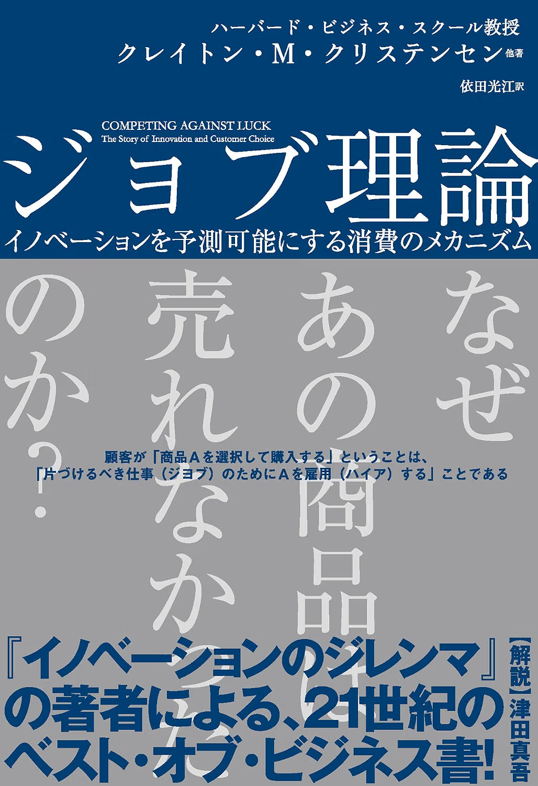
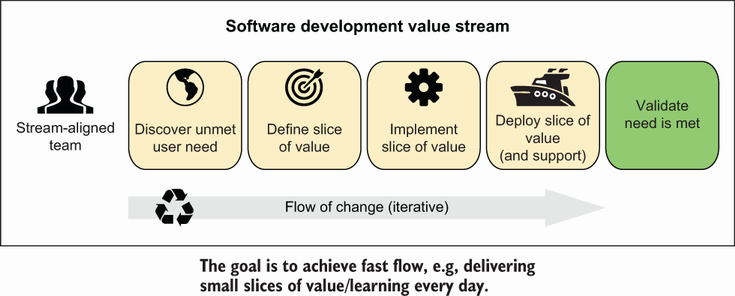
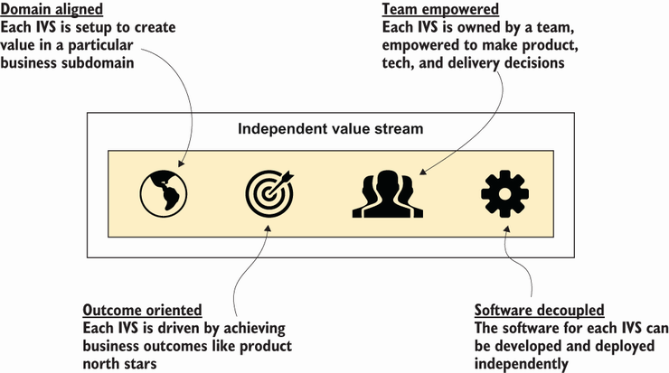
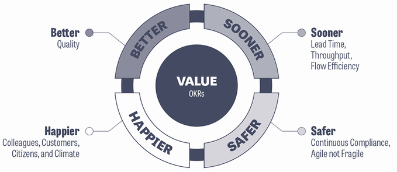
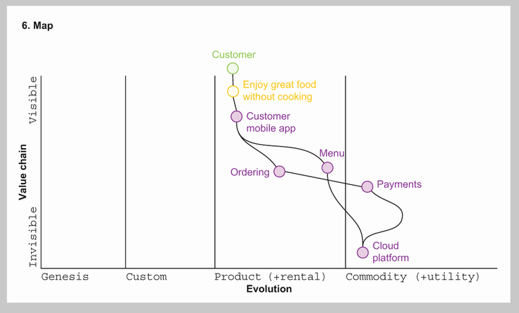
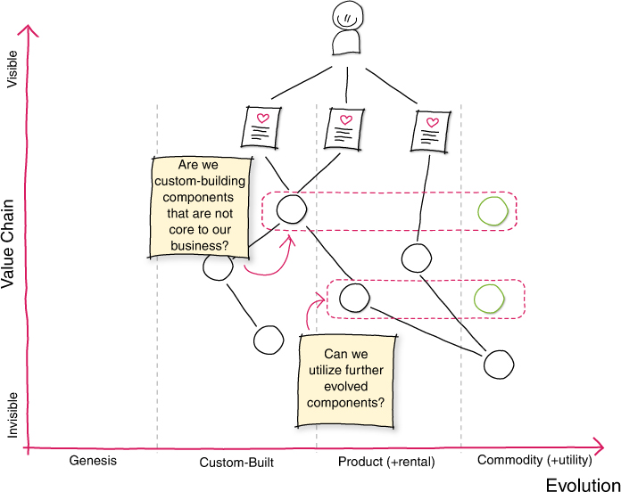
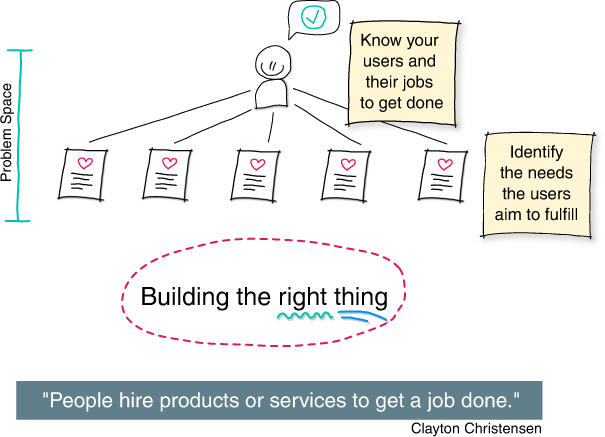
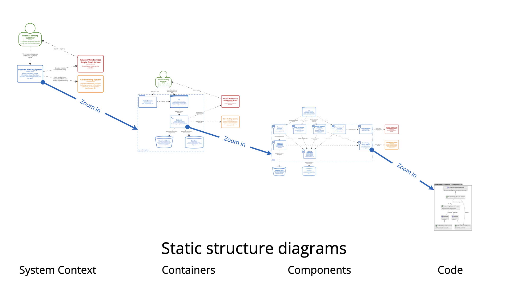
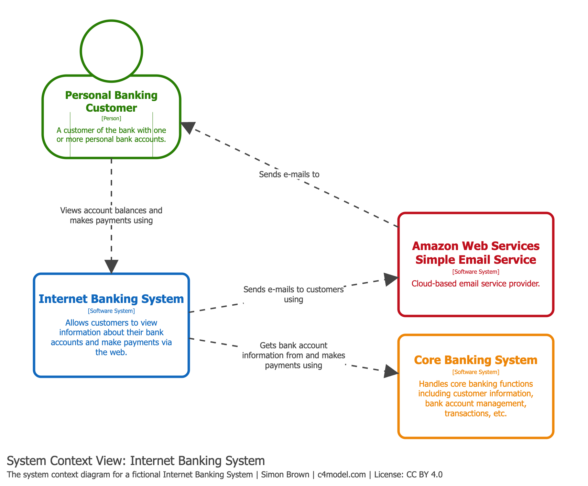
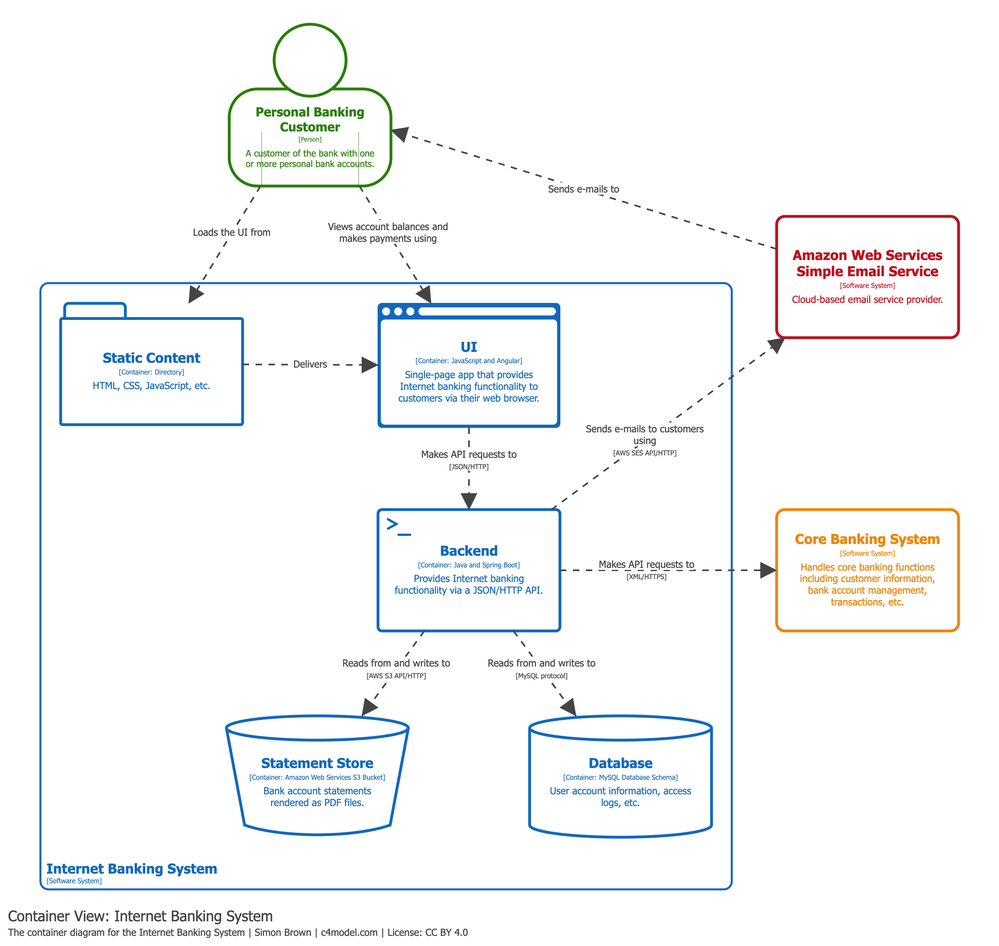

<!--
_backgroundColor: #0a1929
_color: white
_class: title dark
-->

# AIで実装は速くなった。 なのにプロダクトは速くならない。

### 職能の壁を越えて、価値が届くまでの流れを設計する

2026/09/05 Product Engineering Conference 2026 
@nwiizo 30min

---

<!-- _backgroundColor: white -->

## nwiizo

株式会社スリーシェイクでプロのソフトウェアエンジニアをやっているものです。格闘技、読書、グラビアが趣味でよく本を紹介しています。

技術書翻訳を手がけるたび、わかることが1つ増えるのと引き換えに、わからないことが3つ増えていく。

インターネット上では <strong>nwiizo</strong> を名乗り、ブログ「<strong>じゃあ、おうちで学べる</strong>」を運営しています。X / GitHub もこのIDでやっています。

---

## about 3-shake

  

---

## 初めての単著が出ました

書影：ダイヤモンド社

<strong>『おい、とりあえず終わらせろ』</strong>

完璧に準備しようとして動けなくなるより、まず終わらせ、そこから直していく。そんな進め方をまとめた本です。

<strong>2026年に翻訳に携わった本</strong> 
『アーキテクチャモダナイゼーション』 
『セキュアAPI』 
『実践 プラットフォームエンジニアリング』

最近では本を読むだけでは飽き足らず、書いたり、訳したりしています。『アーキテクチャモダナイゼーション』の翻訳で考えてきた「価値が届くまでの流れ」も、今回の発表につながっています。

---

## この発表で解決できること

<strong>こんな状況ではありませんか</strong>

AIでPull Request（PR）は増え、手を動かす速さも上がったように感じる。けれど、価値が届くまでの時間や成果は、同じようには変わっていない。<strong>速くなった実感と、届いた価値が噛み合わない。</strong>

<strong>持ち帰れるもの</strong>

なぜ、実装が速くなってもプロダクト全体は速くならないのか。価値が届くまでの流れを測り、<strong>全体の速さを決める詰まりを見つける手順</strong>と、ユーザーが達成したいことから「作るべきか」「いつやめるか」を決める<strong>判断の基準</strong>を持ち帰れます。

<strong>見る範囲を、実装からユーザーの結果まで広げる。すると、次に何を速くすべきかが見えてくる。</strong>

<strong>先に白状します。</strong>伝えたいことを絞り切れず、スライドが多くなりました。今日は何枚か飛ばします。すべてを読もうとせず、<strong>気になった言葉と、話がどうつながるか</strong>だけ追ってください。細部は公開版で、あとからじっくり読めます。

---

## 本日の流れ

1. 増えた生産量はどこに消えたのか
2. 測りやすい数字は、価値が届いた証拠ではない
3. 役割ごとの前提を対話で確かめる
4. ユーザーが達成したいことから「作る・任せる・やめる」を判断する

まず、AIで実装が速くなっても、価値が届くまでの時間が同じだけ縮まない理由を数字で見ます。次に、アウトプットとアウトカムを分け、バリューストリームから待ちを探します。そこで見つけた詰まりを、営業・PM・デザイナー・エンジニアが対話できる図にします。最後に、ユーザーのジョブから「作る」を決め、AIへ「任せる」範囲と「やめる」条件・判断日までつなげます。

---

<!--
_backgroundColor: #0a1929
_color: white
_class: transition
-->

<h2 style="color: white !important;">1. 増えた生産量はどこに消えたのか</h2>

<strong>個人は速くなったと感じる。組織の流れは別に測る。</strong>

---

## AIで実装は確かに速くなった

AIを使うと、動くコードを書くまでの時間は短くなります。ただし、<strong>個人が感じる作業の速さ</strong>と、<strong>ユーザーや事業に起きた変化</strong>は、同じ指標では測れません。

<strong>個人は速くなったと感じる</strong>

DORAは、ソフトウェア開発組織を継続的に調査しています。2025年の調査では、世界の技術職約5,000人のうち90%が仕事でAIを使い、80%以上が生産性の向上を感じている。

<strong>個人の体感だけでは組織の流れは決まらない</strong>

同じ調査では、AIをよく使う組織ほど、一定期間にユーザーへ届けた変更の件数が多く、ユーザーや事業の成果も高い傾向がありました。その一方で、変更による障害や手戻りは増えていました。DORAの2026年レポートも、コーディングが速くなるだけでは投資対効果（ROI）につながらないとしています。

<strong>AIを入れると、組織の強みは伸び、弱いところの問題も大きくなる。個人の体感と、ユーザーが結果を得るまでの流れは、別の指標で見る。</strong>

---

## ジョブ理論では、ユーザーの目的から考える

クレイトン・M・クリステンセンほか『ジョブ理論』

<strong>Jobs to Be Done（ジョブ理論）</strong>は、ユーザーがなぜ製品やサービスを選ぶのかを、達成したいことから考える方法です。ここでいう<strong>ジョブ</strong>は、ユーザーがある状況で片付けたいことです。

<strong>状況</strong>候補が多く、比較に時間がかかっている

<strong>ジョブ</strong>必要な情報へ早くたどり着き、購入を判断したい

<strong>選べる手段</strong>検索条件、比較表、担当者への相談

ジョブ理論では、ユーザーはジョブを片付けるためにプロダクトを「雇う」と表現します。検索機能は手段の一つです。別の手段の方がうまく片付くなら、ユーザーはそちらを選びます。

<strong>ジョブは機能名ではない。ユーザーが置かれた状況と、達成したいことを表す。</strong>

出典：<a href="https://www.christenseninstitute.org/theory/jobs-to-be-done/">Christensen Institute, Jobs to Be Done Theory</a> ／ 書影：クレイトン・M・クリステンセンほか『ジョブ理論』

---

## 完全に余談なのですが

クレイトン・M・クリステンセンの本では、『ジョブ理論』以外に、この二冊も好きです。

<strong>『イノベーションのジレンマ』</strong>

優良企業は、既存顧客の要望を聞き、収益の上がる改善へ投資します。その合理的な判断が、当初は主流顧客の求める性能に届かず、市場も小さい新技術への対応を遅らせます。

新技術が別の顧客に受け入れられ、改良を重ねて既存製品を脅かす。この動きを<strong>破壊的イノベーション</strong>として説明した本です。

<strong>『イノベーションの経済学』</strong> 
「繁栄のパラドクス」に学ぶ巨大市場の創り方

高価、複雑、手に入りにくいといった理由で、既存の製品を利用できない人々がいます。本書では、この状態を<strong>無消費</strong>と呼びます。

手頃で使いやすい解決策が新しい市場をつくり、販売や流通、雇用も育てていく。これを<strong>市場創造型イノベーション</strong>として、各国の事例から説明します。

クレイトン・M・クリステンセンほか『イノベーションの経済学』

<strong>いま見えている顧客だけを前提にすると、次に生まれる市場を見落とす。この視点が好きです。</strong>

出典：<a href="https://www.seshop.com/product/detail/2241">翔泳社『イノベーションのジレンマ 増補改訂版』</a> ／ <a href="https://www.harpercollins.co.jp/hc/books/detail/15576">ハーパーコリンズ・ジャパン『イノベーションの経済学』</a>

---

## 実装が終わっても、価値が届いたかはまだ分からない

実装完了は、予定した機能がコードとして動き、テストを通った状態です。リリースすれば、ユーザーが利用できるようになります。ここまでで確認できるのは、<strong>チームが予定したものを作り、利用できるようにしたこと</strong>です。

<strong>必要な人が利用できるか</strong>  
対象のユーザーが機能を知り、必要なときに使えるとは限りません。

<strong>実際の状況で使われるか</strong>  
使える機能でも、ユーザーが別の手段を選ぶことがあります。

<strong>望んだ結果が起きるか</strong>  
使われても、探す時間や購入の判断が変わらないことがあります。

<strong>価値が届くのは、実装が終わったときではなく、ユーザーのジョブが片付いたときです。</strong>

---

## 価値が届くのは、ユーザーのジョブが片付いたとき

ジョブが片付いたとは、機能を使った結果、ユーザーが望んでいた変化が実際に起きた状態です。検索機能を操作できても、必要な情報へ早くたどり着けなければ、ジョブはまだ片付いていません。

作って出したものを<strong>アウトプット</strong>、利用後に生じたユーザーや事業の変化を<strong>アウトカム</strong>と呼びます。

<strong>アウトプット</strong> 検索条件を実装し 本番で利用できる

→

<strong>利用</strong> 対象のユーザーが 商品を探すときに使った

→

<strong>アウトカム</strong> 必要な情報へ早くたどり着き 購入を判断できた

利用回数はアウトプットとアウトカムをつなぐ手がかりです。ただし、利用回数だけではジョブが片付いたか分かりません。利用後の変化まで確かめます。

<strong>プロダクトの速さは、機能を出すまでではなく、結果を確かめるまでで見る必要があります。</strong>

---

## たとえば、実作業が30%の流れなら

まず、アウトプットを本番で利用できる状態にするまで、つまりチケットに着手してから本番へ反映するまでを、実作業30%、待ち70%と置いた例で考えます。

実作業 30%

待ち 70%

設計　・　実装　・　テスト

判断待ち　・　レビュー待ち　・　他チーム待ち

この例では、実作業以外の7割が、仕様や範囲が決まるのを待つ時間、レビューと承認を待つ時間、依存先のチームの変更やリリースを待つ時間です。

比率は説明のための仮定です。自分たちの比率は、実際の記録から測ります。

---

## 実作業を半分にしても、全体は15%しか縮まない

いま

30

70

AIで実作業を半分にした後

15

70

全体を100と置くと、待ちの70は、実作業だけをAIで速めても残ります。実作業を半分にしても、全体の短縮は15%にとどまります。

この例では、合意と判断の待ち時間が、全体の速さを決める詰まりになる。 次に、AIが短くしやすい仕事と、その外側に残る仕事を分けて見る。

---

## 実作業を速めても、外側の待ちは残る

先ほどの30/70の例を、AIを使う場面に重ねます。AIが直接短くしやすいのは、一人が手元で作って確かめる繰り返しです。これを<strong>内側のループ</strong>と呼びます。その成果をチームが受け入れ、利用できる状態にする繰り返しが<strong>外側のループ</strong>です。

<strong>内側のループ</strong>

設計し、コードを書き、動かし、手元でテストする。実作業30%と重なる部分が多く、AIで短くしやすい。

<strong>外側のループ</strong>

優先順位を決め、レビューし、統合し、リリースする。役割をまたぐ判断や調整があり、待ち70%が生まれやすい。

AIで内側の成果が早く出ても、外側で一日に受け入れられる件数は自動では増えません。レビューの観点、判断する人、依存先との進め方を変えなければ、早くできたPRが外側の工程に並びます。

<strong>30/70の例では、内側を半分にしても外側の70は残る。 AIの効果は、変更を利用でき、結果を確かめるまでの流れで見る。</strong>

---

## バリューストリームは発見から結果の確認まで

Figure 6.1 The high-level activities in an independent value stream より引用

内側と外側のループで整理したのは、主にチケットへ着手してからアウトプットを利用できる状態にするまでです。しかし、プロダクトの仕事は着手前から始まり、リリース後も続きます。ユーザーのジョブを見つけ、求めるアウトカムと確かめ方を決め、アウトプットを届け、ジョブが片付いたか確かめるまで。この全体を<strong>バリューストリーム</strong>と呼びます。

<strong>開始条件</strong>　ユーザーのジョブが、まだ片付いていない 
<strong>完了条件</strong>　ジョブが片付き、期待した結果を確認できた

出典：Susanne Kaiser, <em>Architecture for Flow</em>, Addison-Wesley, 2025

---

## 実装は、バリューストリームの真ん中にある

範囲をバリューストリームまで広げると、実装の位置づけが見えてきます。実装は、その途中でアウトプットを作って届ける仕事です。前には、ジョブを見つけて何を作るかを決める仕事があり、後には、利用後のアウトカムを確かめる仕事があります。

<strong>ジョブを見つける</strong> 
ユーザーが困る状況、いま試している手段、達成したいことを、観察や対話から確かめる。

<strong>アウトカムと確かめ方を決める</strong> 
ユーザーの行動や事業の数字がどう変われば価値が届いたと言えるかを、実装前に決める。

<strong>アウトプットを作って届ける</strong> 
設計し、実装してテストする。リリースして、ユーザーが変更を利用できる状態にする。

<strong>アウトカムを確かめる</strong> 
実際に使われ、期待した変化が起きたかを見る。続ける、変える、やめるを判断する。

<strong>つまり、アウトプットを作る前には判断があり、届けた後にはアウトカムの確認があります。実装だけを速くしても、前後が遅ければ、バリューストリーム全体は速くなりません。</strong>

---

## バリューストリームマッピングは、作業と待ちを分ける

バリューストリームの工程を時系列に並べ、各区間を実際に手を動かしていた時間と、判断や作業を待っていた時間に分けて可視化する方法を、<strong>バリューストリームマッピング</strong>と呼びます。

<strong>直近10件を選ぶ</strong> 大きさで選別せず、 実際に進めた案件を使う

→

<strong>時刻を記録から拾う</strong> ジョブの確認、着手、PR、承認、 本番反映、利用開始、結果確認

→

<strong>区間を分ける</strong> 作業か、誰かを待ったか。 待った相手の役割を書く

<strong>実際の記録を使い、作業していた時間と待っていた時間を分ける。</strong>

---

## 待ち時間は、相手と理由まで記録する

工程を並べたら、最初に二つを見ます。個人の働き方を評価するためではありません。役割の間で仕事をどう渡し、どこで止まっているかを知るためです。

<strong>作業していた時間の割合</strong>  
着手から結果を確認するまでに、設計、実装、確認など、実際に進めていた時間がどれだけあったか。

<strong>最も長く待った工程</strong>  
どの工程で、誰の、どんな判断や作業を待ったか。件数だけでなく、待った理由も記録する。

待ちのすべてが無駄ではありません。本番前の確認のように、安全のために設ける待ちもあります。担当と判断日が決まった保留は、期限のない放置と分けます。見直すのは、目的を説明できない確認、担当が曖昧な引き継ぎ、処理できる量を超えて積み上がる待ちです。

<strong>待ちの合計が大きい工程を、最初の制約候補にする。相手と理由が分かれば、減らす方法を選べる。</strong>

---

## 独立したバリューストリームの四つの条件

Figure 1.4 Independent value stream より引用

バリューストリームマッピングで長い待ちを見つけたら、チームが流れをどこまで自分たちで進められるかを見直します。ここでいう独立とは、関係するチームがあっても、日常的な変更を発見から結果の確認まで大きな待ちなしに進められることです。そのために、チームの担当範囲、判断できる範囲、目標の置き方、ソフトウェアの分け方という四つの条件を揃えます。

<strong>事業の仕事に合わせて担当範囲を決める</strong>　どのジョブを扱うかが明確 
<strong>チームが判断できる</strong>　製品・技術・リリースを決められる 
<strong>利用後の変化から作るものを決める</strong>　届けた結果まで確かめる 
<strong>ソフトウェアを分ける</strong>　単独で変更して届けられる

この四つは別々ではありません。担当範囲と目指すアウトカムが決まっていても、判断のたびにほかのチームを待ち、ソフトウェアも一緒に変更しなければならないなら、流れは独立していません。

出典：Nick Tune, Jean-Georges Perrin, <em>Architecture Modernization</em>, Manning, 2024

---

## 四つの条件は、「何を担うか」と「どう進めるか」

先ほどの四つは、「何を担うか」と「どう進めるか」の二つに分けて考えます。事業の仕事と目指すアウトカムは、チームが引き受ける範囲を決めます。判断できる範囲とソフトウェアの分け方は、その仕事を大きな待ちなしに進められるかを決めます。

<strong>事業の仕事に合わせて担当範囲を決める</strong> 
「注文」「決済」のように、事業の中で一つの役割を担う範囲へ集中する。関係の薄いジョブを同じチームへ集めない。

<strong>チームが判断できる</strong> 
何を作るか、どう実装するか、いつ届けるかをチームで決める。変更のたびに外部の承認を待たない。

<strong>利用後の変化から作るものを決める</strong> 
機能の完成ではなく、利用後に起きてほしい変化を目標にする。届けた後の結果まで同じチームが確かめる。

<strong>ソフトウェアを分ける</strong> 
ほかのシステムを同時に変えなくても、開発・テスト・リリースできる。依存があっても、接続方法やデータ形式を安定させる。

<strong>四つの条件を揃えるのは、チームを閉じるためではありません。ジョブの発見からアウトカムの確認までを、大きな待ちなしに進めるためです。</strong>

---

## 仕事を引き継ぐところで、待ちが生まれやすい

四つの条件が揃わないと、仕事は役割の間を何度も移動します。ここでは、変更を利用できるようにするまでに、誰から誰へ仕事を渡し、何を待っているかを見ます。

<strong>優先順位を決める人 → 実装する人</strong> 何を作るかの判断を待つ

→

<strong>実装する人 → レビュアー</strong> 正しさの確認を待つ

→

<strong>実装する人 → 運用担当・他チーム</strong> 出してよいかの合意を待つ

ここでは、判断や作業を一つの役割から別の役割へ引き継ぐところを<strong>責任の境界</strong>と呼びます。この例では、別の役割の判断が必要になるたびに待ちが発生していました。引き継ぐたびに説明と調整が加わり、次の作業へすぐには進めなくなります。

<strong>AIで作業を速くしても、引き継ぐ回数と待つ順番は変わらない。</strong>

---

## 依存は、待つ理由で三つに分ける

<strong>依存</strong>とは、自分たちだけでは次へ進めない状態です。何を待っているかで、対処が変わります。

<strong>仕組みへの依存</strong>  
別のシステムや接続先の変更を待つ → 接点を安定させ、別々に変更できるようにする

<strong>人の知識への依存</strong>  
特定の人に聞くまで判断できない → 判断の根拠と手順を共有する

<strong>順番への依存</strong>  
先の確認や承認が終わるまで進めない → 同時に進めるか、確認条件を明示する

<strong>依存をゼロにはしない。待ちが長い依存から、本当に必要かを確かめ、待ちを減らす方法を決める。</strong>

---

## 制約理論では、一番遅い工程から直す

各工程には、一日に処理できる仕事の量があります。実装から渡される量が次の工程で処理できる量を超えると、終わっていない仕事がその手前に積み上がります。全体の速さを決めている工程を<strong>制約</strong>と呼び、そこから改善する考え方が<strong>制約理論</strong>です。

<strong>AI支援で実装</strong>  
1日に10件のPRを作る

→

<strong>レビュー</strong>  
意図・影響・テストを 1日に5件確認できる

→

<strong>レビュー待ち</strong>  
一日ごとに5件増える

この例では、レビューできる件数が変わらない限り、利用できる状態になるのは一日5件までです。実装済みのPRが増えるほど、着手から利用可能になるまでの時間は長くなります。数字は仕組みを説明するための例です。実際の制約は、工程ごとの件数と待ち時間から確かめます。

<strong>制約を変えないまま実装だけを速めると、利用可能になるまでの時間は長くなる。</strong>

---

## 制約が実装にある現場もある

前の例ではレビューが制約でした。しかし、どの工程が制約かは、人数や役割の数だけでは決まりません。直近の仕事がどこで列になり、次の工程が何を待っていたかを見ます。

<strong>実装が制約になっている状態</strong>

作る内容は決まり、レビューする人も待っている。それでも、実装を待つ案件が増えている。ここなら、AIで実装時間を短くすると全体も速くなりやすい。

<strong>判断やレビューが制約になっている状態</strong>

実装は終わっているのに、優先順位、仕様、レビュー、リリースの判断を待つ案件が増えている。ここでは、実装だけを速めても全体は速くならない。

バリューストリームマッピングで直近10件を作業と待ちに分け、待ちが集中する工程と、その手前に積み上がる件数を見ます。制約が分かったら、そこへ入れる仕事を絞る、不要な確認を減らす、必要な人や時間を増やす、という順で対処します。

<strong>AIをどこに使うかは、いまの制約を動かせるかで決める。</strong>

---

<!--
_backgroundColor: #0a1929
_color: white
_class: transition
-->

<h2 style="color: white !important;">2. 測りやすい数字は、価値が届いた証拠ではない</h2>

<strong>PR数も、速くなった体感も、AIで伸びやすい。</strong>

---

## 測りやすい数字はAIで伸びる

PR数、コード変更の記録（コミット）の数、変更行数。どれもダッシュボードに出しやすく、AIを入れると増やしやすい数字です。ただ、これらが表すのは<strong>アウトプットの量</strong>です。たとえば、データベース内で動く処理（ストアドプロシージャ）の作成数を個人目標にすると、必要性より作成数が優先されます。PR数を個人目標にしても、アウトプットそのものが目的になる同じ問題が起きます。

<strong>AIで増えやすいのはアウトプット。価値を判断するにはアウトカムを確かめる。</strong>

頼まれた機能を作り続け、アウトカムよりアウトプットの量と出す速さだけを見るチームを<strong>フィーチャーファクトリー</strong>と呼びます。機能を作ること自体が目的になり、使われた結果を確かめない状態です。

アウトプットの量ではなく、アウトカムを測る。

---

## 価値は「速く」だけでは測れない

Figure 1.3 Better Value Sooner Safer Happier (Source: Smart et al., Sooner Safer Happier [IT Revolution, 2020]) より引用

変更を良くしたかは、速さだけでは決まりません。品質、アウトカム、速さ、安全性、関わる人の満足を一緒に見ます。

AIで作る時間が短くなっても、手戻りや障害が増え、レビューする人の負担が重くなれば、改善したとは言い切れません。

<strong>「早くなったか」だけでなく、「何が良くなり、どこに負担が移ったか」を見る。</strong>

出典：Nick Tune, Jean-Georges Perrin, <em>Architecture Modernization</em>, Manning, 2024 ／ Jonathan Smartほか, <em>Sooner Safer Happier</em>, 2020

---

## 同じ変更を、五つの面から確かめる

五つは、同じ変更を別の面から見るための観点です。速さを上げた結果、品質や安全性、関わる人の満足を悪化させていないかを確かめます。

<strong>Better</strong>期待した動作を安定して行えるか。品質は上がったか

<strong>Value</strong>ユーザーのジョブが片付き、事業のアウトカムが変わったか

<strong>Sooner</strong>小さな変更を、早く、繰り返し届けられたか

<strong>Safer</strong>変更による失敗と、起きたときの影響を減らせたか

<strong>Happier</strong>ユーザーと、開発・運用に関わる人の負担を減らせたか

<strong>五つを一つの点数にまとめず、どこが良くなり、どこが悪くなったかを並べて判断する。</strong>

---

## アウトプットを届ける速さを三つに分ける

五つのうち、まず<strong>Sooner</strong>を測ります。アウトプットを届ける流れは、一つの数字だけでは分かりません。かかった時間、届けた件数、その時間のうち実際に作業していた割合を分けて見ます。

<strong>リードタイム</strong>  
作業に着手してから、変更を利用可能にするまでの<strong>経過時間</strong>

<strong>スループット</strong>  
1週間などの一定期間に、利用できる状態まで進んだ変更の<strong>件数</strong>

<strong>流れの効率</strong>  
リードタイムのうち、実際に手を動かした<strong>時間の割合</strong>

30/70の例なら、流れの効率は30%。残り70%は待ち時間。

この三つで分かるのは「アウトプットを届ける速さ」です。使われた結果であるアウトカムは、別に確かめます。

---

## アウトプットの速さとアウトカムを並べて見る

リードタイムやスループットで分かるのは、アウトプットを届ける速さです。価値まで見るには、<strong>同じ期間と対象ユーザー</strong>について、利用とアウトカムを並べます。検索条件を追加した例なら、次の三つです。

<strong>アウトプットを届ける流れ</strong>  
着手から利用可能になるまでの時間と、そのうち誰かを待っていた時間

<strong>利用の手がかり</strong>  
対象ユーザーが新しい検索条件を使った割合と、検索を途中でやめた割合

<strong>アウトカム</strong>  
必要な情報へたどり着くまでの時間と、その後に購入へ進んだ割合

<strong>アウトプットを早く届けても、利用とアウトカムが変わらなければ、価値が届く速さは変わっていない。</strong>

---

## 作る速さだけを上げると、使われない機能も積み上がる

顧客のジョブよりスケジュールを優先して機能を量産する状態を、Melissa Perriは<strong>ビルドトラップ</strong>と呼びました。アウトプットの量だけをAIで増やすと、この罠に入りやすくなります。多くのチームは、新しいものを足すのは得意でも、古いものを消すのは苦手だからです。かつて入ったプロジェクトでは、データベース内で動く処理を調べたところ、約30%がすでに使われていませんでした。

<strong>機能というアウトプットが1つ増えるたびに</strong>

レビューで読む範囲、テストの対象、運用で守る対象、ユーザーが比べる選択肢が増える。

<strong>増えた複雑さが、次の変更を遅くする</strong>

複雑さは、コードの行数よりも、安全に変更するために把握すべきことの多さとして表れます。古い設定や依存、テストが残っているほど、判断とレビューに時間がかかります。

<strong>古いものを減らさず生成だけを増やせば、次の変更は遅くなる。</strong>

---

## 速くなった体感も、測定の代わりにならない

AIの影響を調べる研究組織METRは、経験豊富なオープンソースソフトウェア（OSS）開発者16人に、普段扱うコード群の246課題をAIツールあり・なしで解いてもらい、所要時間と本人の体感を比べました。

<strong>実測</strong>

各課題は、AIツールを使える条件と使えない条件へ無作為に割り当てられました。AIを使える条件では、完了まで<strong>平均19%長く</strong>かかりました。課題は平均2時間で、単純に時間へ置き換えると約23分の差です。

<strong>体感</strong>

事前には「24%速くなる」と予想し、終わった後も「20%速くなった」と感じていた。測定と体感が、逆向きだった。

大規模で成熟したコード群に詳しい開発者という条件つきで、ほかの現場へそのまま当てはめることはできません。ただ、少なくともこの条件では、<strong>「速くなった気がする」だけでは判断できません</strong>。体感と、実際に時間を使っているところがずれた例もあります。あるネット銀行では、開発者が「コードを実行可能な形にするビルドが遅い」と訴えました。ところが測ってみると、時間の大半はPRのレビュー待ちでした。

<strong>PR数や体感だけで決めない。バリューストリームマッピングで流れを測り、アウトカムと並べて見る。</strong>

---

<!--
_backgroundColor: #0a1929
_color: white
_class: transition
-->

<h2 style="color: white !important;">3. 役割ごとの前提を対話で確かめる</h2>

<strong>長い待ちの一部は、情報不足ではなく、役割ごとの前提の違いから生まれる。</strong>

---

## 役割が違えば、同じ機能でも見え方が変わる

購入前の相談から開発までに関わる役割を例にします。営業、PM（プロダクトマネージャー）、デザイナー、エンジニアは、同じ機能について別の情報を持っています。

<strong>営業</strong>  顧客との会話 購入の条件

<strong>PM</strong>  目指す結果 優先順位

<strong>デザイナー</strong>  利用する場面 操作のつまずき

<strong>エンジニア</strong>  コードと依存 レビューとテスト

情報が別々の資料や会話に散らばっているだけなら、一か所へ集めれば解決します。難しいのは、同じ情報を見ても、役割が背負う責任によって<strong>何を問題と考えるか</strong>が変わることです。

<strong>情報を揃えるだけで、判断の前提まで揃うとは限らない。</strong>

---

## 「違う情報」の奥に、違う解釈がある

宇田川元一『他者と働く』

宇田川元一さんは、物事をどう理解し、何を正しいと考えるか、その<strong>解釈の枠組み</strong>をナラティヴと呼びます。立場、経験、背負っている責任が違えば、同じリリース延期にも別の意味が生まれます。

<strong>営業</strong>　商談の機会を逃す

<strong>デザイナー</strong>　利用者が途中で迷う

<strong>エンジニア</strong>　次の変更が難しくなる

<strong>SRE</strong>　信頼性と運用を担い、障害対応の負担が増える

どれか一つだけが正しいとは限りません。相手の判断が不合理に見えるときほど、その役割から何が問題に見え、何を守ろうとしているかを確かめます。

<strong>「相手が分かっていない」と決める前に、相手からは何が問題に見えているかを確かめる。</strong>

出典：宇田川元一『他者と働く――「わかりあえなさ」から始める組織論』2019 ／ <a href="https://publishing.newspicks.com/books/9784910063010">NewsPicks Publishing</a>

---

## 仕組みで解ける問題と、対話が要る問題を分ける

『他者と働く』では、既存の知識を当てはめられる<strong>技術的問題</strong>と、関係者が問題の捉え方から見直す<strong>適応課題</strong>を分けます。ソフトウェア開発の待ちには、両方が混ざっています。

<strong>技術的問題</strong>  
原因と目標の認識が揃っており、既存の手順や専門知識を使える。たとえば、ビルド時間をキャッシュで短くする。

<strong>適応課題</strong>  
何を問題とみなすか、何を優先するかが役割ごとに違う。一つの役割だけで解決策を決めても、仕事の進め方は変わりにくい。

承認待ちのすべてが適応課題ではありません。重複した確認は仕組みで減らせます。一方、期日、使いやすさ、変更の難しさ、障害リスクのどれを優先するかで止まっているなら、先に互いの前提を確かめます。

<strong>手順の問題は仕組みで減らす。前提の違いから生じる待ちは、対話から始める。</strong>

---

## 対話は、同意を急ぐことではない

ここでいう対話は、説得や情報共有の言い換えではありません。互いを、指示に従わせる相手ではなく、問題を一緒に扱う相手として関係を作り直すことです。『他者と働く』では、次の四つを行き来しながら進めます。

<strong>準備</strong> 分かり合えていないと認め、自分の前提をいったん保留する

<strong>観察</strong> 相手の言葉、行動、置かれた状況から、何を守ろうとしているかを見る

<strong>解釈</strong> 相手の立場なら、なぜその判断が合理的なのかを考える

<strong>介入</strong> 双方が動ける小さな働きかけを試し、反応を見てまた観察する

一度で分かり合うための順番ではありません。相手の反応から見立てを直し、次の働きかけを変える反復です。この発表では、その対話の材料として一枚の図を使います。

<strong>図は結論を出すためではなく、違う前提を出し、次に確かめることを決めるために使う。</strong>

---

## 判断待ちを短くする三つの取り決め

前提を確かめる対話と並行して、判断の依頼そのものにも形を与えます。判断が止まりやすいのは、誰が決めるのか、何をいつまでに返すのか、返事がないときにどう進めるのかが曖昧なときです。

<strong>決める人を一人にする</strong>  
最も詳しい人か、最も影響を受ける人を、決める人にする。役職の高い人とは限らない。

<strong>全員一致を待たない</strong>  
反対意見は記録に残す。決まった後は、その方針で動く。

<strong>依頼に四つを書く</strong>  
誰に、何を、いつまでに、返事がないときはどうするか。「なるべく早く」は期限ではない。

会議は、決める権限のある人がいるときだけ同期で開きます。進捗の共有や下書きへの意見は非同期で足ります。10人が1時間集まれば、10時間分の作業が止まります。

<strong>判断待ちの多くは、内容ではなく「誰が・いつまでに」が決まっていないことで生まれる。</strong>

---

## 対話の材料を、ウォードリーマップに置く

ユーザーが得たい結果、その結果に必要な要素、各要素の成熟度を一枚に並べると、どこへ投資し、どう運用するかを比べられます。この図を<strong>ウォードリーマップ</strong>と呼びます。

<strong>ジョブ</strong>  誰が、どんな状況で、何を達成したいか

<strong>要素同士の依存</strong>  待ち時間ではなく、ジョブを満たすために何が何を必要とするか

<strong>成熟度</strong>  作り方や市場の選択肢が、どれだけ確立しているか

システム構成図は、要素同士の接続を表します。ウォードリーマップでは、そこへ<strong>ユーザーのジョブと成熟度</strong>を加えます。答えを自動で出すための図ではありません。どこへ投資するか、既製サービスと自前運用をどう比べるか、何をやめるかを話すために使います。一枚に全部は描きません。知りたいことが違う図を一枚に混ぜると、誰にも読めなくなります。この図は最も抽象度の高い一枚で、詳細は別の図へつなぎます。

<strong>要素だけでなく、「誰のため」と「どの段階」を同時に見る。</strong>

---

## 縦は見えやすさ、横は成熟度

Figure 5.7 Step 6 of the Wardley Mapping Canvas, a Wardley Map より引用

<strong>縦</strong>はユーザーからの見えやすさ（可視性）です。一番上にユーザーとジョブを置き、そこから下へ、ジョブを満たすために必要な要素を線でつなぎます。線は、上の要素が下の要素を必要とする関係です。上にあるほどユーザーから見えやすく、下にあるほどユーザーからは見えにくい内部の要素です。

<strong>横</strong>は成熟度です。左から、まだ答えを探している段階、独自に作り込む段階、製品として選べる段階、電気のように誰もが使える共通基盤へ進みます。

横軸は優劣を表しません。置く位置によって、試行錯誤する、独自に作る、製品を選ぶ、共通基盤として扱うなど、適した進め方が変わります。

<strong>縦で「なぜ必要か」を確認し、横で「どう扱うか」を考える。</strong>

出典：Nick Tune, Jean-Georges Perrin, <em>Architecture Modernization</em>, Manning, 2024

---

## 検索の例で、図の読み方を確かめる

先ほどの検索機能を置くと、縦方向にはジョブを支える依存が見え、横方向には要素ごとに適した進め方が見えてきます。

<strong>ジョブから依存をたどる</strong>  
必要な情報へ早くたどり着きたい ↓ 検索画面 ↓ 商品データ・検索エンジン ↓ 計算資源・保存領域

<strong>成熟度で進め方を変える</strong>  
どの検索条件が役立つかは、ユーザーと小さく試す。検索エンジンは、既製サービスと自前運用を比べる。計算資源や保存領域は、共通基盤として扱えるかを確かめる。

一つの機能でも、すべてを同じ方法で作る必要はありません。ジョブに近く、まだ答えがない部分には試行錯誤の時間を使います。選択肢が確立した部分は、必要な制御、運用の負荷、総費用で選びます。

<strong>どこで試し、どこで既製の選択肢を使うかを、要素ごとに決める。</strong>

---

## 同じ図に、役割ごとに見ている情報を置く

検索機能を例に、PM、デザイナー、エンジニア、SREが持つ情報を、同じウォードリーマップに並べます。役割が違えば、確かめたいことも変わります。

<strong>PM</strong>  誰のどのジョブか 何が変われば価値か

<strong>デザイナー</strong>  どこで利用者が迷うか どんな使われ方をするか

<strong>エンジニア</strong>  どの要素が必要か 変更がどこへ影響するか

<strong>SRE</strong>  自前で運用すると何が増えるか 障害がどこまで影響するか

<strong>誰のジョブを、何が、どの成熟度で支えるかを一枚で確かめる。</strong>

---

## 差別化だと思っていたものが、右端へ動いていた

私たちが差別化の中心（コア）だと信じて作り込んでいた領域が、あるとき<strong>クラウド事業者が運用するマネージドサービスを呼ぶ数十行のコード</strong>に置き換わりました。

「自分たちで作っている」と「まだ独自に作る必要がある」は別のことです。自分たちが独自だと思っていても、市場には既製の選択肢が増え、ユーザーも特別な機能とは見なくなることがあります。ウォードリーマップでは、こうした変化を右への移動として表します。

横軸の右端では、まず既製サービスと比べ、自前運用を続ける理由を問い直します。ただし、必要な制御、性能、障害の切り分け、法令対応、総費用が合わなければ、自前運用へ戻すこともあります。

<strong>右端は「買え」ではなく、既製サービスと自前運用を比較し直す合図。</strong>

Figure 1.10 Are we investing efficiently?（Architecture for Flow）より引用

出典：Susanne Kaiser, <em>Architecture for Flow</em> ／ Nick Tune, Jean-Georges Perrin, <em>Architecture Modernization</em>

---

## 半年計画の刷新は、ジョブにつながっていなかった

半年かける予定だった大規模刷新を、4ヶ月目にロールバックしました。つまり、変更を取り消して元に戻しました。振り返ると、「誰のどのジョブを片付けるのか」を問わないまま、<strong>作れるものを作っていた</strong>。

<strong>ウォードリーマップで見ると</strong>

ユーザーのジョブとの関係を説明できない要素は、どれだけ大きくても価値につながっていない。刷新の対象はシステムの内部で、ジョブとの関係は確かめていなかった。

<strong>バリューストリームで見ると</strong>

ロールバックで、4ヶ月分の変更は誰のジョブも片付けずに消えた。作れることは分かりました。しかし、作るべきだったかは最後まで確かめられませんでした。

4ヶ月分を取り消すとなると、やめる判断そのものが重くなります。最初の判断が間違いだったように見えることも、決断を遅らせます。判断が疑われるまでの時間が長いほど、直す費用は高くなる。やめる判断を早くする方法は、このあと扱います。

<strong>ユーザーのジョブとの関係を説明できない計画は、始める前に問い直せたはず。</strong>

---

## 図に並べると、何を話し合うかが揃う

PM・デザイナー・エンジニアに、ユーザーと直接話す営業やCS（カスタマーサクセス）も加わって30分だけ集まり、ユーザーのジョブ、必要な要素、依存をざっくり並べます。最初から正確でなくても、見ている情報の違いが分かれば話し合いを始められます。

<strong>ジョブとの関係を説明できない要素</strong> 今回の範囲外。捨てずに、別のジョブとの関係を確かめ直す

<strong>横軸の右端にある要素</strong> 既製サービスと自前運用を比較。必要な制御と総費用で決める

<strong>依存の線が集まる要素</strong> 複数の機能や仕組みが共通して必要とする要素。先ほど測った待ち時間と見比べ、担当するチームを決める

図の目的は、関係者全員が見ている情報を揃え、投資を決める理由をはっきりさせることです。最初から現状の細部まで正確に描く必要はありません。まず、合意にかかる時間を短くします。次に、<strong>ジョブの発見から結果の確認までを、どのチームが担当するか</strong>を見直し、チーム間の引き継ぎそのものを減らします。

図で意見の違いを具体化する。計測で、次に確かめることを選ぶ。

---

## 計測と図を、日々の判断へつなぐ

長い待ちや前提の違いを見つけても、眺めているだけでは流れは変わりません。何が一番の問題かを絞り、どこへ力を集めるかを決め、日々の仕事へ反映します。

<strong>診断 いま何が起きているか</strong>  
実際の記録と各役割の見方から、全体の流れを最も止めているものを一文で説明する。

<strong>方針 何を選ぶか</strong>  
どのジョブとアウトカムを優先し、いまは何をやらないかまで決める。

<strong>進め方 どう続けるか</strong>  
決める人、判断日、確認する数字、例外の扱いを、日々の流れに組み込む。

<strong>「改善する」だけでは進めない。何に力を集め、いまは何をしないか、どう確かめるかまで決める。</strong>

---

<!--
_backgroundColor: #0a1929
_color: white
_class: transition
-->

<h2 style="color: white !important;">4. ジョブから「作る・任せる・やめる」を判断する</h2>

<strong>作る理由を決め、確かめられる範囲をAIへ任せ、やめる条件と判断日を残す。</strong>

---

## ジョブは、解決策が変わっても残る

ジョブ理論では、ユーザーは目的を果たすためにプロダクトを「雇う」と考えます。機能が揃っていてもジョブが片付かなければ、別の手段へ乗り換えます。

状況とジョブが同じなら、<strong>解決策を変えてもジョブそのものは変わりません</strong>。AIで作れるものは増え続けますが、ユーザーのジョブは、私たちの実装能力に合わせて増えません。

<strong>作れるものがいくら増えても、ユーザーのジョブは増えない。</strong>

Figure 1.1 Starting from the user perspective to build the right thing（Architecture for Flow）より引用

出典：<a href="https://www.christenseninstitute.org/theory/jobs-to-be-done/">Christensen Institute, Jobs to Be Done Theory</a>／ Susanne Kaiser, <em>Architecture for Flow</em>

---

## 作るべきかは、四つの問いで決める

四つの問いで、作る理由、実際の困りごと、アウトカムまでの時間、代わりの手段を確かめます。実装案を比べる前に、そもそも作る必要があるかを判断します。

<strong>作るものとジョブの関係を説明できるか</strong> 
手段を消し、「どんな状況で、何を達成したいのか。なぜそれが大切か」を一文で書く

<strong>最近、実際に困った場面があったか</strong> 
抽象的な賛否より、直近の行動を見る。そのとき何を試し、何が決め手だったか

<strong>アウトカムを確かめるまでの時間を短くするか</strong> 
一つの作業だけでなく、判断や引き継ぎを含む全体の流れで確かめる

<strong>既存の手段や小さな実験で、先に確かめられないか</strong> 
まず既製サービスと比べる。必要な制御や総費用が合わなければ自前で持つ。不確かなら小さく試す

<strong>答えられない問いがあれば、実装を始める前に、ユーザーの行動や実際の待ち時間を確かめる。</strong>

---

## 曖昧な依頼は、AIの数だけ別の実装へ分かれる

作る理由を決めたら、その判断をAIへ渡します。一人のAIなら、実装中に読み違いを直せます。複数を別々に走らせると、書かなかった判断をそれぞれが埋めます。

<strong>曖昧な依頼</strong>  
「検索を速くする」

→

<strong>PR A</strong>　APIの応答時間を縮める

<strong>PR B</strong>　検索条件を増やす

<strong>PR C</strong>　検索基盤を置き換える

どれも、依頼に反しているとは言い切れません。しかし、ユーザーが情報へたどり着く時間を短くしたいのか、システムの応答時間を短くしたいのかが決まっていなければ、どのPRが正しいかも判断できません。生成する数が増えるほど、レビューで意図を確かめ直す仕事も増えます。

<strong>仕様に前提を書けば、どこに異論があるかを実装前に話せる。AIを増やすのは、その後です。</strong>

---

## 仕様を書くと、実装前の判断が表に出る

ここでいう仕様は、新しい文書の種類を増やす話ではありません。Design DocやPRの説明に、AIがコードを書く前に読む判断材料を置きます。仕様を書く時間の中心は、文章を整えることより、誰のジョブをどう満たし、何を守り、どこで止めるかを決めることです。

<strong>目標</strong>　誰のどのジョブを、なぜ解くか 
<strong>受け入れ基準</strong>　結果を見て判定できる条件

<strong>不変条件</strong>　変えてはいけない動作や品質 
<strong>境界</strong>　対象と対象外。越えるなら止める

<strong>完了の定義</strong>　テスト、文書、確認結果など、PRを受け入れられる状態

<strong>先行事例</strong>　似た実装と、過去に試して失敗した案 
<strong>未解決の問い</strong>　決める人と、最初の調べ方

この七つを、作業の大きさに合わせて使います。機能ごとに約800語を上限の目安とし、背景はリンクへ分けます。小さな変更はPRの説明へ、複数のPRにまたがる変更はDesign Docへ書き、リポジトリで更新しながら各PRから参照します。繰り返し使うルールはAGENTS.mdへ分けます。

<strong>長く詳しく書けばよいわけではない。曖昧な言葉、隠れた前提、古い情報を減らし、一度で読み切れる量に絞る。</strong>

---

## AIには、実装より先に計画を出してもらう

仕様で「何を満たすか」を決めたら、「どう進めるか」はAIに提案してもらいます。人は、その計画が目標、受け入れ基準、不変条件、境界を外していないかを確認します。実装を始めるのは、その後です。

<strong>チーム</strong> 仕様で判断をそろえる

→

<strong>AI</strong> 調査結果と計画を出す

→

<strong>人</strong> 仕様と照らしてから着手を決める

<strong>計画が仕様から外れている</strong>  
AIが意図を読み違えたか、必要な情報を渡せていません。計画か、参照する情報を直します。

<strong>計画は仕様どおりだが、望ましくない</strong>  
依頼した内容に問題があります。ジョブやアウトカムへ戻り、仕様そのものを見直します。

<strong>数百行の差分から意図を推測する前に、計画の段階で方向のずれを止める。</strong>

---

## 計画を読んだだけでは、検証したことにならない

計画の確認で分かるのは、目的へ向かう道筋が妥当かどうかです。実際に正しく動くか、安全か、アウトカムにつながるかは、成果物を動かして初めて分かります。流暢で詳しい計画も、その証拠にはなりません。

<strong>計画</strong> 方向と前提を確認する

→

<strong>小さな実装</strong> 確認できる単位まで進める

→

<strong>検証</strong> テスト・計測・利用結果を見る

大きな作業を一度に実装すると、最初の読み違いが後続の変更へ広がります。まず作る理由を確かめ、次に構造を決め、最後に小さく動くところまで作ります。区切りごとに結果を確かめてから、次へ進みます。

<strong>計画は方向をそろえる。検証は、実際に起きたことを確かめる。両方を混ぜない。</strong>

---

## AIに任せるのは、確かめて戻せる範囲まで

作るべきかをチームで決めた後も、AIへどこまで任せるかは一律ではありません。失敗をすぐに見つけられ、元に戻せる作業ほど広く任せられます。影響が大きく、誤りを見つけにくい作業ほど、小さく区切って人が途中で確認します。

仕様が伝えられるのは、チームが言葉にした意図と条件です。その変更がプロダクト全体にふさわしいか、ユーザーの負担に見合うかは、成果物を見て人が判断します。

<strong>広く任せやすい作業</strong>  ビルド、型検査、既存の動作を固定したテストで、成否を低い負担で確かめられる。失敗しても元に戻せる。

<strong>小さく区切る作業</strong>  権限、決済、本番データのように、誤りの影響が大きい。変更範囲を絞り、途中で人が確認する。

<strong>要約ではなく証拠を確認する</strong>  AI自身の説明をレビューの代わりにしない。可能なら作業を担当したAIとは確認役を分け、差分、テスト結果、計測、画面、分かっている不足を確かめる。

本番へ出す変更は、数か月後にも、何が変わり、なぜ安全だと判断したかを説明できる状態にします。

AIへ任せる範囲は、誤りを見つけて元に戻せるところまで。 作業は任せても、作るべきかと受け入れるかは人が決める。

---

## 同じ見落としは、コード・Lint・テストで防ぐ

AIが作る量が増えるほど、人が同じ見落としを毎回指摘するやり方は詰まります。レビューで見つけた失敗は、次回もっと早く見つけられる形へ戻します。

<strong>原因をコードで直す</strong>  
使い方を間違えやすいAPIや、読まないと分からない境界は、説明を増やす前に構造を直す。

<strong>構造規約をLintで止める</strong>  
一般的な規約は既存のLintを使う。コードベース固有で、構文から判定できる規約は自作し、CIで実行する。

<strong>振る舞いをテストで固定する</strong>  
値の条件や業務の動作など、実行結果で確かめるものはテストへ移す。

同じ注意を文章で読ませ続ける前に、コードの構造で防ぐか、Lint・テストで判定できないかを考えます。

<strong>機械で判定できることは、レビューより前に止める。</strong>

---

## コンテキストに残すのは、機械では決められないこと

ここでいう<strong>コンテキスト</strong>は、AIが作業前に読むAGENTS.md、Design Doc、PRの説明です。誤用はコードの構造で防ぎ、構文や実行結果から判定できる規則はLint・テストへ移し、危険な操作は権限で止めます。そこへ移せない判断だけを、読む範囲と期間に合わせて残します。

<strong>リポジトリ全体で繰り返す前提</strong>  
対象とするディレクトリ、ビルド手順、役割分担など、作業をまたいで使う情報はAGENTS.mdへ短く残す。

<strong>作業固有の判断</strong>  
目標、受け入れ基準、境界など、先ほど仕様として決めた作業固有の判断はDesign DocやPRの説明へ残す。

ソフトウェアの変更と一緒にコンテキストも更新します。使われなくなった情報は削除し、現在の判断に必要な情報が埋もれないようにします。

<strong>コンテキストは、機械では決められない判断を、人とAIへ渡すために使う。</strong>

---

## 機能を消す方が、作るより難しい

AIへ任せて作れる量が増えても、機能を消す判断は自動化できません。加えるときは、期待する新しい動作に確認を絞れます。消すときは、<strong>今ある大切な動作を失わないこと</strong>を確かめます。その判断材料は、コードだけには残っていません。

<strong>利用実態と重要性を判断しにくい</strong>  
短期間の利用記録だけでは、誰が、どんな状況で使っているかを捉えにくい。利用回数が少なくても、特定の顧客の業務や障害時の復旧に欠かせないことがあります。

<strong>依存が見えにくい</strong>  
設定、データ、バッチ、帳票、運用手順、他チームの仕組みが、明示されないまま機能に依存していることがあります。

<strong>利用回数だけでも、コードだけでも、消してよいとは判断できない。</strong>

---

## 止める前に、利用者と依存先を確かめる

同じ機能について、利用者にとっての重要性と、仕組みが受ける影響を別々に確かめます。どちらか一方だけでは、安全に止められません。

<strong>利用者にとっての重要性</strong>  
営業やCSには顧客の業務への影響を、デザイナーには利用する場面を確かめます。利用回数が少なくても、特定の業務や復旧時に欠かせない場合があります。

<strong>仕組みが受ける影響</strong>  
エンジニアにはコードとデータの依存を、SREや運用担当には障害時の使われ方を確かめます。設定や帳票など、コードの外に依存が残ることもあります。

<strong>新しい利用を止める</strong>

→

<strong>関係者へ知らせる</strong>

→

<strong>元に戻せる状態で止める</strong>

<strong>重要性を確かめた後、C4モデルで構造上の影響を絞る。両方が揃ってから削除する。</strong>

---

## C4モデルは、構造の詳しさを四段階にそろえる

機能を消した影響を確かめるとき、最初からコード全体を追う必要はありません。<strong>C4モデル</strong>は、システムコンテキスト、コンテナ、コンポーネント、コードの四段階で、ソフトウェアの構造を表します。図の色や形より先に、どの詳しさを話しているかをそろえます。まず全体を見て、判断に必要な箇所だけ詳しくします。

<strong>この発表では、上の二つを使います。システムコンテキスト図で「誰に影響するか」を、コンテナ図で「どのアプリやデータに影響するか」を確かめます。</strong>

画像：<a href="https://c4model.com/diagrams">Simon Brown, C4 model</a>, CC BY 4.0

---

## システムコンテキスト図で、利用者と外部連携を見る

最も大きな範囲で見るのが、<strong>システムコンテキスト図</strong>です。対象システムを一つの箱として扱い、その周りに利用者と外部システムを置きます。

<strong>最初に確かめること</strong> 
誰がその機能を使い、どのジョブを片付けているのか。どの外部システムから呼ばれるのか。止めたとき、誰の仕事や外部連携に影響するのか。

営業やCSが知る利用場面と、エンジニアが知る外部連携を、同じシステムの周りへ置けます。ここで、ジョブの理解と仕組みの範囲がつながります。

画像：<a href="https://c4model.com/diagrams/system-context">Simon Brown, System Context diagram</a>, CC BY 4.0

---

## コンテナ図で、アプリ・データ・通信を見る

対象システムの中へ一段詳しく入るのが、<strong>コンテナ図</strong>です。アプリケーション、データストア、それらの通信に分けて表します。

<strong>C4モデルでいう「コンテナ」</strong> 
Dockerコンテナに限りません。Webアプリ、API、バッチ、データベースなど、実行するアプリケーションかデータストアを指します。

<strong>次に確かめること</strong> 
どのアプリ、データ、通信が依存しているか。止めたときに使える代替経路があるか。

システムコンテキスト図で影響を受ける相手を絞り、コンテナ図で変更や停止が波及する経路を絞ります。コンポーネントやコードを見るのは、経路をまだ特定できない箇所だけです。

画像：<a href="https://c4model.com/diagrams/container">Simon Brown, Container diagram</a>, CC BY 4.0

---

## C4図だけでは、「残す・消す」は決められない

C4図が受け持つのは、現在の構造と依存関係です。ジョブが重要か、価値が届くまでどこで待つか、なぜその設計を選んだかは、ここまで使ってきた図や記録で確かめます。

<strong>バリューストリーム</strong> ジョブの発見からアウトカムの確認まで、どこで作業し、どこで待つかを見る

<strong>ウォードリーマップ</strong> ジョブに必要な要素と成熟度を並べ、どこへ投資し、どう運用するかを考える

<strong>C4図</strong> 誰が使い、どの外部システム、アプリ、データが依存しているかを確かめる

<strong>利用記録・Design Doc・必要ならADR</strong> 実際の利用と、設計した理由、見直す条件を残す

<strong>一つの図へ詰め込まず、知りたいことに合う図や記録を使い分ける。</strong>

---

## 残すか消すかは、利用と構造をそろえて決める

C4図だけで分かるのは構造上の影響です。同じ機能について、利用者にとっての重要性と並べて初めて、残す、縮小する、置き換える、消すという判断ができます。

<strong>利用者にとっての重要性</strong>  
ジョブ、アウトカム、利用記録、問い合わせを見る。利用回数が少ない場合も、特定の業務や障害時に欠かせないかを確かめる。

<strong>構造上の影響</strong>  
C4図で、利用者、外部システム、アプリ、データの依存を見る。止めたときの代替経路と、元に戻す方法も確かめる。

Design DocやADRには、選んだ理由と見直す条件を残します。図や文書は、ソフトウェアの修正と一緒に更新できる詳しさへ絞ります。古い記録を判断材料に残すくらいなら、更新するか、削除します。

<strong>重要性は利用者に確かめる。影響範囲は構造を見て確かめる。両方が揃ってから決める。</strong>

---

## いつやめるかは、作る前に決める

機能を消すのが難しいからこそ、削除の判断を後回しにしません。作る前に置いた前提も、利用や市場の変化で古くなります。先ほどの半年計画では、4ヶ月目まで中止を判断できませんでした。やめる条件と判断日を、機能を作る前に書いておけば、継続か中止かをもっと早く決められます。「2ヶ月の調査が終わる7月16日に、続けるかを決める」のように。

<strong>ジョブが別の手段で片付いている</strong> マネージドサービスや既存機能で足りる。置き換える

<strong>想定したジョブには使われていない</strong> 別のジョブを確かめるか、機能を消す

<strong>維持が流れを遅くしている</strong> 変更のたびにレビュー範囲と障害を増やす。消す

判断日には、利用記録、問い合わせ、依存先、障害時の代替手段を見直します。条件を満たしていなければ、同じ形で続けるのではなく、縮小・停止・置き換えを選びます。使った費用の大きさは、続ける理由になりません。

<strong>「この条件になったらやめる」と「いつ判断するか」を、作る前のDesign Docに書く。 小さな変更ならPRの説明に、大きな設計判断を後から単独で参照したいときだけADRにも残す。</strong>

---

## まとめ　実装を速めても待ちは残る

AI支援で、動くコードを書く時間は短くなり、個人が作れる量も増えます。ただし、ジョブの発見から結果の確認までには、実装以外の時間があります。

<strong>アウトプットを作る</strong>  
設計・実装・テスト。AI支援で短くしやすく、PR数や生成量にも表れやすい。

<strong>待ち</strong>  
優先順位の判断、レビュー、他の役割との合意。仕事の進め方を変えなければ残る。

<strong>アウトカムを確かめる</strong>  
本番で使われ、狙った変化が起きたかを確かめる。リリースしただけでは分からない。

30/70の例では、実作業を半分にしても全体は15%しか縮まらない。 速くなった実感と届いた価値が噛み合わないのは、実装の外にある待ちが残るから。

---

## まとめ　作るべきかは流れとジョブで決める

「作る・任せる・やめる」は、次の順序で考えます。

<strong>作る</strong>  
最近困った場面と、片付けたいジョブ、確かめたいアウトカムを見る。既存の手段で足りるなら作らない。

<strong>任せる</strong>  
前提を仕様へ書き、AIの計画を確認する。テストと計測で確かめられ、元に戻せる範囲まで任せる。

<strong>やめる</strong>  
利用者への重要性と構造上の影響を調べる。やめる条件と判断日を、作る前に決める。

AIは「どう作るか」の候補を増やす。 チームは「何を作るか」「どこまで任せるか」「いつやめるか」を決め、計画と結果を照らす。

---

<!--
_backgroundColor: #0a1929
_color: white
_class: title dark
-->

# AIは作れる。 作るべきかを決めるのが私たちの仕事。

### 職能の壁を越えて、価値が届くまでの流れを設計する

ありがとうございました 
@nwiizo

