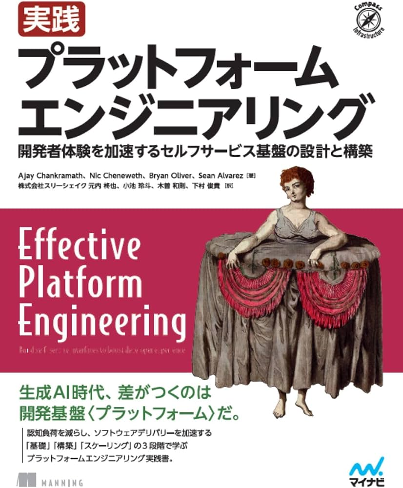
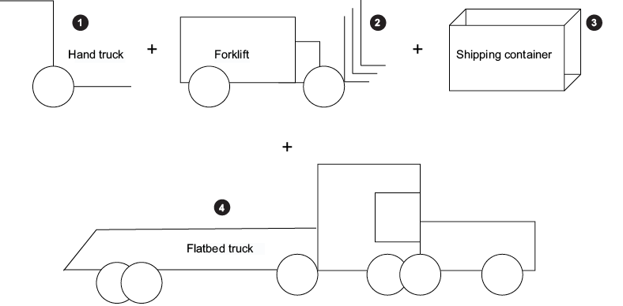
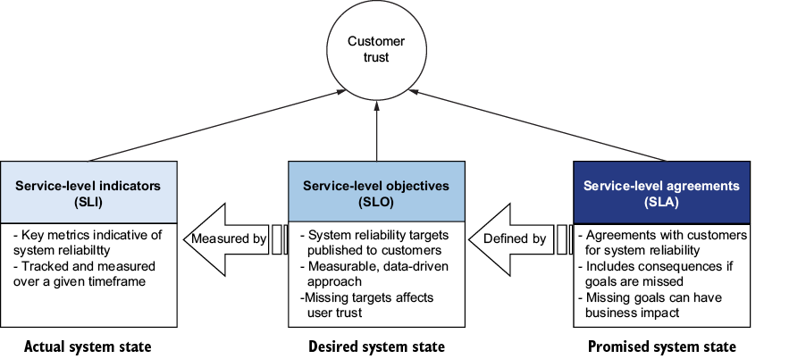
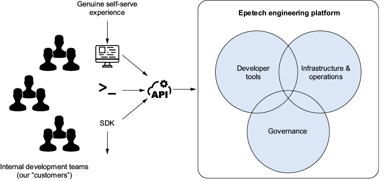
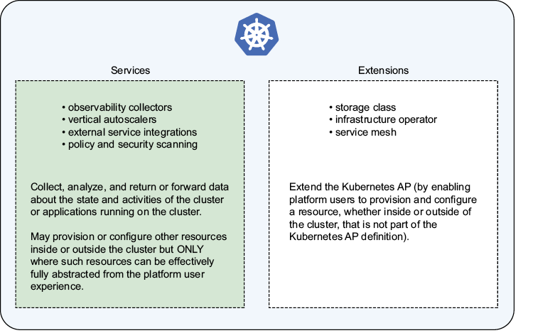
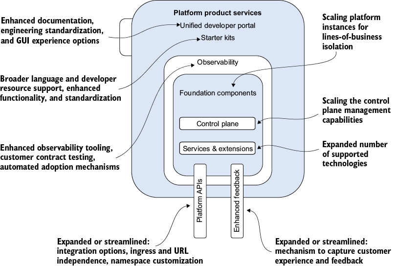
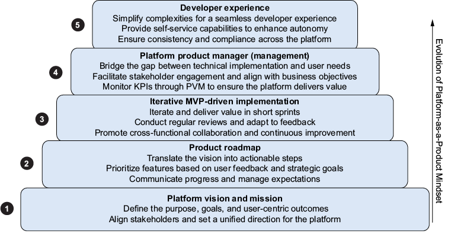
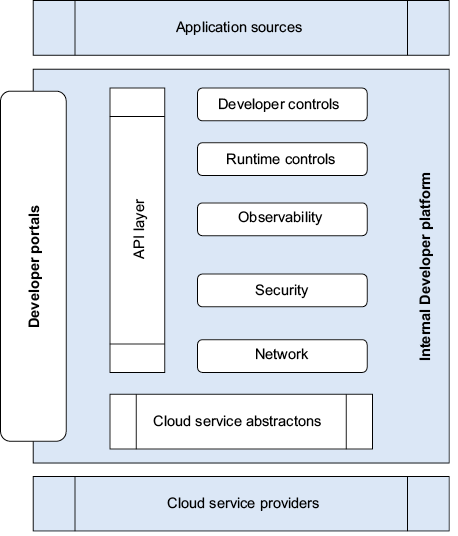

<!--
_backgroundColor: #0a1929
_color: white
_class: title dark
-->

# 35分でわかる Effective Platform Engineering

### 『実践 プラットフォームエンジニアリング』翻訳者と考える、 開発者体験を加速する基盤のセルフサービス化

2026/08/19 Findy オンラインイベント 
@nwiizo 35min

---

<!-- _backgroundColor: white -->

## nwiizo

株式会社スリーシェイクでプロのソフトウェアエンジニアをやっているものです。格闘技、読書、グラビアが趣味でよく本を紹介しています。

技術書翻訳を手がけるたび、わかることが1つ増えるのと引き換えに、わからないことが3つ増えていく。

インターネット上では <strong>nwiizo</strong> を名乗り、ブログ「<strong>じゃあ、おうちで学べる</strong>」を運営しています。X / GitHub もこのIDでやっています。

---

## about 3-shake

  

---

## 作ったのに、使われない

### 機能不足とは限らない

開発者が困っていることを見ずに作ると、機能が多くても選ばれません。

本書は、開発者を<strong>社内の顧客</strong>として扱い、利用状況とフィードバックから育てる方法を示します。

プラットフォームは「使わせる基盤」ではない。「使いたくなる内部プロダクト」だ。

---

## DevOpsとの違いを、一言で説明できない

<strong>DevOps</strong>

開発と運用が一緒に価値を届ける<strong>文化と働き方</strong>

→

<strong>Platform Engineering</strong>

その働き方を続けやすくする<strong>開発者向けの内部プロダクト</strong>

<strong>DevOpsは文化。Platform Engineeringは、その文化を毎日使える形にする内部プロダクト。</strong>

---

## 成功を、数字で説明できない

<strong>アウトプット＝作ったもの。アウトカム＝使った結果に生じた変化</strong>

<strong>開発者の生産性</strong> 
変更リードタイムと待ち時間

<strong>認知負荷</strong> 
仕事に必要な精神的リソース

<strong>組織の健全性</strong> 
利用率と開発者センチメント

本書は、プラットフォームの価値を測る言葉をくれる。

---

## 35分後に持ち帰るもの

<strong>説明できる</strong> 
プラットフォームエンジニアリングの本質を、自分の言葉で話せる

<strong>全体が見える</strong> 
基礎・構築・成長のどこに自分の課題があるか分かる

<strong>最初の章を選べる</strong> 
いまの悩みに合う章から本を開ける

Ch.1-3で目的と計測、Ch.4-8で実装、Ch.9-10で規模拡大をたどる。

---

## 日本語版『実践プラットフォームエンジニアリング』

### 開発者体験を加速する セルフサービス基盤の設計と構築

- <strong>著者</strong>: Ajay Chankramath, Nic Cheneweth, Bryan Oliver, Sean Alvarez
- <strong>翻訳</strong>: 株式会社スリーシェイク
- <strong>日本語版</strong>: マイナビ出版、2026年8月24日発売
- <strong>原書</strong>: Manning Publications, 2024

<strong>プラットフォームを「ツール置き場」ではなく、開発者が使い続ける社内プロダクトとして作り、測り、育てるための実践書。</strong>

---

## この本は、設計判断を追体験できる

- <strong>Epetech社</strong>の変革を10章で追う
- 「何を使うか」だけでなく、<strong>なぜそう設計するか</strong>を学ぶ
- アーキテクチャ、コード例、演習で<strong>自分の現場へ移す</strong>

<strong>何を測り、何を作り、何をやめたか。Epetechの10章を追う。</strong>

---

## 本日の流れ

1. <strong>Part 1: 基礎</strong> — なぜプラットフォームエンジニアリングか
2. <strong>Part 2: 構築</strong> — どう作るか

3. <strong>Part 3: スケーリング</strong> — どう育てるか
4. <strong>まとめ</strong> — 何を持ち帰るか

<strong>「なぜ必要か」→「どう作るか」→「どう育てるか」の順で進みます</strong>

---

## 書籍は3つのパート・10章で構成されている

| Part                            | 章      | 答える問い                         | 手に入る視点                                     |
| ------------------------------- | ------- | ---------------------------------- | ------------------------------------------------ |
| <strong>1. 基礎</strong>        | Ch.1-3  | なぜ必要で、どう価値を測るのか     | 開発者を顧客として扱い、余分な負担を減らす       |
| <strong>2. 構築</strong>        | Ch.4-8  | 安全なセルフサービスをどう作るのか | ルール・観測・自動化をプロダクトへ組み込む       |
| <strong>3. スケーリング</strong> | Ch.9-10 | 組織と技術をどう育て続けるのか     | 規模に合わせて設計と責任を変える                 |

<strong>一貫する問いは「開発者の仕事は、本当に良くなったか？」</strong>

---

## 本書を読むための4つの基本語

<strong>プラットフォーム顧客</strong>

実際に機能を使う社内開発チーム。要件へ影響するだけのステークホルダーとは区別する。

<strong>ケイパビリティ</strong>

APIやUIを通じて利用できる、デプロイ・観測・認証などの能力。

<strong>プロダクトドメイン</strong>

独自のバックログと優先順位を持つ責任領域。利用者体験を境界にして分ける。

<strong>エンジニアリング上の摩擦</strong>

待ち時間、手作業、重複、学習コスト、認知負荷など、価値提供を妨げるもの。

<strong>以降は、この4語を各章の設計判断につなげる。</strong>

---

<!--
_backgroundColor: #0a1929
_color: white
_class: transition
-->

# Part 1: 基礎

Ch.1-3

<strong>最初の問い：「プラットフォームエンジニアリングとは何か？」</strong>

---

## Ch.1 プラットフォームエンジニアリングの定義

書籍 Figure 1.2 より引用

### ひとことで言うと

<strong>開発者が、他チームを待たずに安全に仕事を進められる内部プロダクトを作ること。</strong>

インフラ、セキュリティ、デプロイのケイパビリティを、セルフサービスで使える<strong>社内エンジニアリングプラットフォームプロダクト</strong>として提供します。専任チームは、構築だけでなく運用と継続的改善まで担います。

<strong>Ch.1を読むと：</strong> 何をプラットフォームと呼び、いつ投資すべきかを判断できる

<strong>ツール群ではなく、開発者体験とデリバリーフローをプロダクトとして届ける。</strong>

---

## DevOps・SRE・開発者体験を置き換えない

| 領域              | 目指すこと                         | プラットフォームとの関係                  |
| ----------------- | ---------------------------------- | ----------------------------------------- |
| <strong>DevOps</strong> | 開発と運用が一緒に価値を届ける     | その文化を実践しやすい共通基盤を提供する   |
| <strong>SRE</strong>    | 信頼性を仕組みと計測で高める       | 信頼性の機能を再利用できる形にする         |
| <strong>開発者体験</strong> | 待ち時間や学習コストを減らす    | プラットフォームの成果として測る           |

新しい流行へ乗り換える話ではない。既存の実践をつなぐ話。

---

## Epetechの現場——どこかで見た景色

<strong>本書は、架空のヘルスケア企業Epetech社の変革を10章で追います。</strong>

### Epetechで起きていたこと

| 起きていたこと                   | 現場への影響                                  |
| -------------------------------- | --------------------------------------------- |
| 業務時間の半分が調整             | DNS、FW、ストレージ、監視の依頼で時間が消える |
| インフラ変更に最大4回のハンドオフ | 小さな変更でも待ち時間が積み重なる            |
| デプロイを別チームが所有         | リリースまで数週間かかる                      |
| 本番インシデントが増える         | 顧客満足度まで下がる                          |

---

## 問題は「作業量」より「待ち時間」だった

<strong>各チームの中</strong> 
自分の担当を正しく、速く処理している

≠

<strong>組織全体</strong> 
引き継ぎと承認のたびに仕事が止まる

全員が速くても、組織は遅くなる。

---

## DevOpsだけでは足りない理由

書籍 Figure 1.1 より引用

<strong>DevOpsの理念が間違っているのではありません。</strong>

ツールだけ導入し、責任やチーム境界を変えないと、中央の待ち行列が残ります。

反対に、すべてを各開発チームへ渡すと、共通のインフラやセキュリティまで全員が学ぶことになります。

そこで、専門性が必要な共通部分はプラットフォームチームが引き受け、開発チームは安全な標準ルートをセルフサービスで選べるようにします。

中央集権でも、全部お任せでもない。共通部分をプロダクトにする。

---

## ツールだけ変えると、同じ問題が戻ってくる

| よくある状態                       | 何が起きるか                                  |
| ---------------------------------- | --------------------------------------------- |
| 各チームが個別にCI/CDを構築        | 同じパイプラインが乱立し、知見が共有されない  |
| インフラ変更が複数チームを経由     | 小さなリリースにも数週間かかる                |
| 多数のツールを開発者が使い分ける   | 本来のプロダクト開発に集中できない            |

<strong>全員がすべてを学ぶ代わりに、共通の責任を再利用できる領域へ分ける。</strong>

---

## プラットフォームは、8つの領域でできている

書籍 Figure 1.4 より引用

<strong>1つの巨大システムを作る話ではありません。</strong>

アカウント管理から開発者ポータルまでを、責任の異なる8つの領域に分けます。

分けることで、領域ごとに改善し、担当を変え、必要な場所だけ伸ばせます。

8つを同じ速さで完成させる必要はありません。開発者の待ち時間を生んでいる領域から、小さく改善します。

<strong>分割の目的は、複雑さを消すことではなく、責任の境界を作ること。</strong>

---

## サービス実行に必要な4領域

| # | 領域                         | 平たく言うと                               |
| - | ---------------------------- | ------------------------------------------ |
| 1 | <strong>クラウドアカウント基盤</strong> | アカウント、課金、最小権限の出発点 |
| 2 | <strong>ネットワーク</strong>           | サービス間を安全に接続する通信経路 |
| 3 | <strong>アイデンティティ</strong>       | 人とサービスが誰かを確かめる仕組み |
| 4 | <strong>コントロールプレーン</strong>   | 要求の受付・判断・実行・状態管理   |

<strong>開発者ポータルを作る前に、アカウント・ネットワーク・ID・制御APIを用意する。</strong>

---

## 次に、開発者が使う体験を作る

| # | 領域                         | 平たく言うと                              |
| - | ---------------------------- | ----------------------------------------- |
| 5 | <strong>オブザーバビリティ</strong>   | 何が起きているか説明できる仕組み  |
| 6 | <strong>アプリケーション配信</strong> | ビルド・テスト・リリースの実行手順 |
| 7 | <strong>データ・セキュリティ</strong> | データと秘密情報を守る仕組み      |
| 8 | <strong>開発者ポータル</strong>       | セルフサービスの入り口            |

<strong>各領域の設定をコード化し、テスト・リリース・運用を同じチームが担当する。</strong>

---

## Ch.2 ソフトウェア・デファインドのプロダクトとアーキテクチャ

<strong>ソフトウェア・デファインド</strong>とは、手作業ではなく、コードから同じ状態を再現できることです。インフラも、設計・テスト・リリース・運用の対象にします。

### 作り方を変える

| 従来の作り方                     | 起きること                     | 本書の提案                         |
| -------------------------------- | ------------------------------ | ---------------------------------- |
| 手動運用の延長で作る             | 再現できない作業が残る         | コード化し、変更をテストする       |
| ツール導入を単発案件にする       | 使い方が変わっても直せない     | 継続的に改善するプロダクトにする   |
| 利用者と作る人を分ける           | 使いづらさが設計へ戻らない     | 同じチームが運用と改善まで担う     |

<strong>コードは状態を再現する。価値の優先順位は、顧客の声から決める。</strong>

---

## プロダクトデリバリーモデル

書籍 Figure 2.1 より引用

開発者を<strong>プラットフォーム顧客</strong>として扱います。テクニカルプロダクトオーナー（TPO）は、要望を集める人ではなく、<strong>顧客の声</strong>を代弁して優先順位を決める人です。

聞き取り、実際の利用状況、顧客体験、計測可能な価値を組み合わせて、バックログとロードマップを作ります。期待した価値が得られなければ、ロードマップを変更します。

### TPOの役割

<strong>顧客の声</strong>

誰がなぜ使い、何に価値を感じるのかを理解する。

<strong>体験オーナー</strong>

ステークホルダーの要件を、顧客体験を損なわずに満たす。

<strong>ロードマップオーナー</strong>

利用状況と顧客体験から、優先順位とリリース順を変える。

要望件数ではなく、利用状況・顧客体験・価値で決める。

---

## MVPは「機能が少ない完成品」ではない

書籍 図2.5「MVPデリバリープロセス」より引用

<strong>MVP（最小実行可能プロダクト）</strong> 
顧客へ段階的な価値を届け、最初の仮説を検証できる最小のプロダクト。

<strong>アーリーアダプター</strong> 
初期版を実際の仕事で使い、行動とフィードバックを返す最初の利用者。

最初の決定は仮説として扱い、利用のエビデンスが裏付けなければ優先順位を変えます。

MVPは小さな完成品ではない。大きな間違いを小さくする仕組みだ。

---

## 進化的プラットフォームアーキテクチャ

<strong>最初から完成形を当てることはできません。</strong> 少数の利用者へ価値を届け、実際の利用から学び、変更できる状態を設計します。

### 進化のための設計原則

| 原則                       | 意味                                                      |
| -------------------------- | --------------------------------------------------------- |
| <strong>抽象化</strong>       | 通常利用では、裏側の複雑さを見せない                 |
| <strong>イベント駆動</strong> | 相手の完了を待たず、変更の事実を受け渡す             |
| <strong>境界の明確化</strong> | 約束を守れば、内側の実装を入れ替えられる             |
| <strong>テスト可能</strong>   | インフラの変更も、自動テストを通して届ける           |

<strong>変えられるだけでは足りない。その変化が価値になったかを計測で確かめる。</strong>

---

## Ch.3 プラットフォームエンジニアリング成功の計測

書籍 Figure 3.6 より引用

<strong>利用率だけでは、成功を証明できません。</strong> 使った結果、開発者の生産性・認知負荷・組織の健全性がどう変わったかを合わせて見ます。

選択肢がない仕組みなら、利用率100%でも使いやすいとは限りません。初回デプロイまでの時間や待ち時間を導入前後で比べ、対話やアンケートで「本来の仕事に集中できたか」も確かめます。

利用率100%でも、価値が出たとは限らない。

---

## 成功を測る3つの軸

<strong>開発者の生産性</strong>

オンボーディング時間、初回デプロイ時間、変更リードタイム

<strong>認知負荷</strong>

内在的負荷、外在的負荷、コンテキストスイッチ（作業文脈の切り替え）

<strong>組織の健全性</strong>

利用率、開発者センチメント、有効性

<strong>使われた。どう感じた。仕事が変わった。3つは別の証拠だ。</strong>

---

## 利用率・センチメント・有効性は別物

<strong>利用率</strong>

対象の開発者やチームのうち、ケイパビリティを実際に使った割合。

<strong>開発者センチメント</strong>

使いやすさ、信頼、満足度を、対話やアンケートで捉えた主観評価。

<strong>有効性</strong>

オンボーディングやデプロイが速くなるなど、仕事の結果が改善したか。

<strong>利用率だけで終わらせない。初回デプロイ時間と待ち時間も測る。</strong>

---

## 本書の用語：認知負荷は2種類

利用されても、使うたびに多くの判断を要求するなら、開発者の仕事は良くなりません。<strong>認知負荷</strong>は、課題を遂行するために必要な精神的リソースの量です。本書は、何に由来する負荷かで2つに分けます。

### プラットフォームが扱う2つの負荷

| 種類 | 例 | プラットフォームの役割 |
| --- | --- | --- |
| <strong>内在的負荷</strong> | ビジネスロジック、分散システムなど、課題そのものの複雑さ | 消しきれない。学習、観測、適切な分割で扱いやすくする |
| <strong>外在的負荷</strong> | 不明瞭なエラー、不完全な文書、読みにくいコード、反復的な手作業 | API、自動化、ガードレール、文書で減らす |

セルフサービスは、作業だけを渡すことではない。不要な判断を減らすことだ。

---

## 本発表の補助語：「理解負債」

外在的負荷を減らしても、暗黙の判断が残れば理解コストは戻ります。<strong>「理解負債」は本書の用語ではありません。</strong> その判断が蓄積し、変更や障害対応のたびに理解コストを払い続ける状態を、この発表ではこう呼びます。

<strong>蓄積するもの</strong> 
暗黙の前提、例外、担当者だけが知る判断経緯

<strong>現れる場面</strong> 
変更、障害対応、オンボーディングのたびに調査がやり直しになる

<strong>減らす方法</strong> 
ADR（設計判断の記録）、コントラクト、文書、テンプレートへ判断を外在化する

<strong>認知負荷は「いま必要な理解」、理解負債は「将来も繰り返す理解コスト」。</strong>

---

## 抽象化しても、メカニカルシンパシーは残す

判断を外在化しても、基盤の振る舞いまで隠すと障害時に原因を追えません。<strong>メカニカルシンパシー</strong>とは、必要なときに基盤を理解し、パフォーマンス・信頼性・効率性を引き出すための知見です。

<strong>露出しすぎる</strong>

利用者が基盤の詳細を毎回判断し、外在的認知負荷が高くなる。

<strong>ペイブドロード</strong>

組織が推奨する実行経路を標準化・自動化し、判断理由も見えるようにする。

<strong>隠しすぎる</strong>

ブラックボックス化し、障害時や例外対応で原因を追えなくなる。

<strong>良い抽象化は、普段は隠す。必要なときは説明できる。</strong>

---

## 本番への経路をバリューストリームで捉える

個々の操作を改善しても、承認や待ち時間が残ればデリバリー全体は速くなりません。そこで、アイデアが本番で価値になるまでの一連の流れを<strong>本番への経路</strong>として捉えます。

<strong>バリューストリームマッピング（VSM）</strong>とは、現状を可視化し、ムダを取り除いた将来の流れを設計する手法です。環境準備、レビュー、承認、待機、障害対応までを一続きで見ます。

実作業時間だけでなく、チーム間の待ち時間も記録します。最も長い待ち時間が、次にプラットフォームで解く候補です。

<strong>承認・環境準備・レビュー。最も長く待つ工程から自動化する。</strong>

---

## 測ると、待ち時間が見えてくる

### 計測の対象

| 指標                       | 何を見るか                                            |
| -------------------------- | ----------------------------------------------------- |
| リードタイム               | コミットから本番までの時間                             |
| デプロイ頻度               | 安全に頻繁にデプロイできるか                           |
| 変更失敗率                 | デプロイの何%が問題を起こすか                         |
| MTTR                       | 障害から復旧までの平均時間                             |
| フロー効率                 | 総リードタイムのうち、価値を生む実作業時間の割合       |

<strong>待ち時間を工程ごとに比べ、最も長い工程から改善する。</strong>

---

## 測っただけでは、待ち時間は減らない

<strong>Part 1で決めたこと</strong> 
開発者を顧客として扱い、設定をコードで再現し、利用率・待ち時間・認知負荷を測る。

<strong>Part 2で実装すること</strong> 
ルールを自動検証し、失敗理由を観測し、チケットなしで実行できるAPIを作る。

最も長く待つ工程を見つけ、Ch.4-8の自動化へつなぐ。

---

<!--
_backgroundColor: #0a1929
_color: white
_class: transition
-->

# Part 2: 構築

Ch.4-8

<strong>次の問い：「安全なセルフサービスを、どう作るか？」</strong>

---

## Ch.4 ガバナンス、コンプライアンス、信頼

書籍 Figure 4.3 より引用

<strong>セルフサービスは、ルールをなくすことではありません。</strong> 人が毎回承認する代わりに、守るべき条件をコードにし、変更が入る場所で自動確認します。

判定理由をその場で返せば、開発者は承認者を待たずに直せます。誰が、何を、どのルールで確認したかも記録でき、監査の証拠になります。

### 安全を仕組みにする3つの方法

| 方法                                  | 平たく言うと                                  | 例                                      |
| ------------------------------------- | --------------------------------------------- | --------------------------------------- |
| <strong>ポリシーアズコード</strong>   | ルールをコードで表し、自動確認する            | OPA、Gatekeeper、Admission Controller   |
| <strong>プロベナンス（来歴）</strong> | 誰が何を作り、どこを通ったか記録する          | SLSA、署名付きアーティファクト          |
| <strong>信頼の管理</strong>            | 誰が何をできるかを一貫して管理する            | ID連携、最小権限                        |

統制を弱めず、待ち時間だけを減らす。

---

## 開発者の自律性とガードレールの両立

<strong>作業する人と、完了を検証する仕組みを分けます。</strong> 開発チームは自分の流れでテストやスキャンを実行し、プラットフォームはデプロイ直前に必要な証拠があるかを確認します。

### Before / After

| 観点           | ゲート型                        | ガードレール型                                |
| -------------- | ------------------------------- | --------------------------------------------- |
| 確認する時     | リリース直前の会議              | コミット、PR、デプロイ時に自動確認            |
| 問題の発見     | 後から見つかり、手戻りが大きい  | 早く見つかり、その場で直せる                  |
| 判断基準       | 人や部署ごとに解釈が揺れる      | 同じルールをすべての環境へ適用できる          |
| ルールの見え方 | 手順書や暗黙知に分散する        | コードとして履歴を追える                      |

<strong>承認を減らして、検証をコードにする。</strong>

---

## ポリシーアズコードは、ルールを自動確認する

<strong>例：「必要なテスト結果がそろっている変更だけ、デプロイを許可する」</strong>

<strong>Rego</strong> 
守る条件を書くための言語

→

<strong>OPA</strong> 
入力が条件を満たすか判定するエンジン

ルールは文書に書くだけでは自動確認されない。コードにして、デプロイ時に検証する。

---

## 用途に合うポリシーツールを選ぶ

| ツール                | 特徴                                                | 適用範囲                              |
| --------------------- | --------------------------------------------------- | ------------------------------------- |
| <strong>OPA + Rego</strong>     | 汎用のポリシー判定エンジン              | Kubernetes、Terraform、API認可など     |
| <strong>Gatekeeper</strong>     | OPAをKubernetes APIへの登録時に使う     | Kubernetesリソース検証                 |
| <strong>Kyverno</strong>        | YAMLでKubernetesポリシーを書く           | Kubernetes中心                         |
| <strong>HashiCorp Sentinel</strong> | HashiCorp製品と組み合わせる          | IaC全般                                |

### 事前 vs 事後

変更を適用する前に止める<strong>事前チェック</strong>と、稼働後に見つける<strong>事後スキャン</strong>を使い分けます。共通標準を選ぶと、Kubernetes以外の領域にも同じ方法を広げられます。

<strong>ツール名より先に「どこで、何を、いつ確認するか」を決める。</strong>

---

## Ch.5 進化するオブザーバビリティ

書籍 Figure 5.1 より引用

ルールを自動化しても、実行後に何が起きたか分からなければ、その仕組みを信頼できません。

<strong>オブザーバビリティ</strong>とは、外から得られるデータを使い、システムの中で何が起きているかを説明できることです。監視画面を作ること自体が目的ではありません。

決めた異常を知らせる監視に加え、想定していなかった障害でも原因をたどれる状態を目指します。メトリクス・ログ・トレースを、同じサービスやリクエストの文脈で結びつけることが重要です。

見えない自動化は、信頼できない。

---

## 3つのテレメトリを結びつける

<strong>テレメトリ</strong>とは、システムの振る舞いを外から観測するために収集するデータです。

| 種類      | 答える問い                       | 主な用途                                |
| --------- | -------------------------------- | --------------------------------------- |
| メトリクス | 何が、いつ、どれくらい起きたか   | 傾向、アラート、SLO                      |
| ログ       | その場で何が起きたか              | デバッグ、監査、セキュリティ調査         |
| トレース   | リクエストがどこを通ったか        | 遅い場所や依存関係の特定                 |

<strong>データを結びつけたら、「何を測るか」「どこを目標にするか」「何を約束するか」を決める</strong>

---

## SLI/SLO/SLAとプラットフォームの責任

書籍 Figure 5.11 より引用

<strong>SLI</strong>：実際に測るもの 
可用性、応答時間、エラー率など

<strong>SLO</strong>：目指す水準 
「99.9%」「p99 200ms以下」など

<strong>SLA</strong>：顧客との合意 
未達時の影響や対応を含む

測れない目標は、SLOではなく願望になる。

---

## 観測基盤そのものも、外から観測する

SLI・SLO・SLAを決めても、観測基盤が止まれば、その約束を検証できません。オブザーバビリティ基盤の障害を、その基盤の中だけで監視すると、完全に止まったときにアラートも止まります。

そのため、<strong>観測基盤は別の仕組みから観測</strong>します。

<strong>監視の監視を、同じ監視に任せない。</strong>

---

## Ch.6 エンジニアリングプラットフォームの構築

書籍 図6.1「真のセルフサービス体験を実現する社内プロダクト」より引用

安全と観測の条件が決まったら、次はそれらを<strong>一つのセルフサービス体験</strong>へまとめます。

<strong>セルフサービスは、開発者にすべてを任せることではありません。</strong>

構想から運用まで、開発者が他チームを待たずに前へ進めるケイパビリティを作ります。裏側では複数のツールが動いていても、利用者からは一貫したプロダクトとして見える状態を目指します。

よくある判断と作業を<strong>ペイブドロード（舗装された道）</strong>へまとめます。これは、組織が推奨する標準的な実行経路です。例外では、専門チームと相談できる余地を残します。

セルフサービスは自由放任ではない。安全な判断を再利用する仕組みだ。

---

## ツールは、つながり方と運用まで見て選ぶ

### ツール選定の評価軸

| 軸                       | 問い                                                |
| ------------------------ | --------------------------------------------------- |
| 組み合わせやすさ         | 他の部品と強く依存せずに接続できるか                 |
| APIと拡張性              | 画面操作だけでなく、コードから自動化できるか         |
| チームごとの分離         | 複数チームが安全に共用できるか                       |
| 運用の重さ               | プラットフォームチームが維持し続けられるか           |
| 自分たちでも使えるか     | 利用者と同じ体験を自分たちで検証できるか             |

<strong>導入できるかより、運用し続けられるか。</strong>

---

## シークレットを、チケットで受け取らない

Epetechは、認証情報を人から受け取る流れをなくしました。チームが自分で使い始められ、期限が来れば自動で更新される仕組みにします。

<strong>自動オンボーディング</strong> 
申請を待たずに使い始める

<strong>自動ローテーション</strong> 
認証情報を安全に更新する

<strong>1つの正本</strong> 
作る場所を分散させない

---

## 認証情報の「作る場所」を1つにする

| 構成要素                                  | 役割                                      |
| ----------------------------------------- | ----------------------------------------- |
| <strong>Vaultなどのシークレット管理</strong> | 認証情報の正本を1か所に置く             |
| <strong>チーム領域の自動作成</strong>       | 権限設定を含め、手動申請なしで用意する   |
| <strong>OIDC（OpenID Connect）/ サービスアカウント</strong> | パイプライン用の認証情報を安全に発行する |

<strong>コピーを増やすのではなく、必要な場所から正本を参照する</strong>

---

## 認証情報は、使う場所へ自動で届ける

| 構成要素                                      | 役割                                         |
| --------------------------------------------- | -------------------------------------------- |
| <strong>External Secrets Operator</strong>    | Kubernetesの必要な場所へ自動同期する         |
| <strong>Argo CD / Flux</strong>               | Gitを望ましい状態の正本にするGitOpsの手順へ組み込む |

ローテーションと配布を自動化すると、安全な運用を続けるコストが下がります。利用者の手作業を減らしながら、統制はむしろ強くできます。

<strong>セルフサービスは、管理の放棄ではない。管理の自動化だ。</strong>

---

## パイプラインを「共有コードライブラリ」で標準化する

<strong>共通の判断を、コピーではなく再利用できるコードにします。</strong> 各チームは自分のパイプラインを持ったまま、組織の標準を取り込めます。

### ツール別の共有メカニズム

| ツール                  | 共有の単位                              |
| ----------------------- | --------------------------------------- |
| GitHub Actions          | Reusable Workflows / Composite Actions  |
| CircleCI                | Orbs                                    |
| GitLab CI               | `include:` で外部ファイル参照           |
| Tekton                  | Catalog tasks                           |

<strong>標準は共有する。所有権は奪わない。</strong>

---

## 共有ライブラリも、プロダクトとして運用する

サーバー側のプラグインへ処理を隠すと、更新と検証が難しくなります。

共有ライブラリをバージョン管理されたコードとして扱い、<strong>統合テスト・バージョニング・リリース</strong>を行います。

<strong>共有コードにするなら、共有責任も引き受ける。</strong>

---

## Ch.7 プラットフォームコントロールプレーンの基礎

書籍 Figure 7.1 より引用

共有するサービスやライブラリが増えるほど、個別には動いても、全体として誰が要求と状態をまとめるかが曖昧になります。

<strong>コントロールプレーン</strong>は、要求と現在の状態をまとめて扱う制御系です。

利用者から受け取った要求と現在の状態を比較し、必要な処理を判断します。Kubernetesは、APIとコントローラーでこの役割を実現する代表例です。

<strong>望ましい状態を宣言し、差分を機械に埋めさせる。</strong>

---

## 宣言的API・自己修復・冪等性

<strong>宣言的API</strong>

処理の手順ではなく、利用者が望ましい状態を指定するAPI。

<strong>自己修復能力</strong>

現状が望ましい状態からずれたら、プラットフォーム自身が修正する。

<strong>冪等性</strong>

同じ処理を繰り返しても結果が変わらない性質。安全な再試行を支える。

自動化は、失敗しないことより、安全にやり直せること。

---

## コントロールプレーンを支える4つの層

| 層                       | 役割                                                  |
| ------------------------ | ----------------------------------------------------- |
| クラウドアカウント基盤     | 初期設定、ガードレール、課金                          |
| 共通ネットワーク           | VPC接続、分離、外向き通信の制御                       |
| 顧客ID                     | チームやサービス単位の認証と認可                     |
| サービス制御基盤           | リソースの作成、配置、ポリシー実行                   |

<strong>機能が少なすぎると手作業が残る。集めすぎると変更が中央待ちになる。</strong>

---

## Ch.8 サービスとエクステンション

書籍 図8.2「サービスとエクステンションの違い」より引用

コントロールプレーンへ機能を足し続けると、変更要求とデプロイがそこへ集中します。

<strong>コントロールプレーンへ、すべての機能を詰め込みません。</strong>

安定して共有したい判断を中心に置き、用途ごとのケイパビリティは<strong>サービス</strong>または<strong>エクステンション</strong>として追加します。コアの安定性と拡張性を両立するためです。

<strong>サービス</strong>：認証や監視など、プラットフォームを支える機能

<strong>エクステンション</strong>：APIを広げ、利用者が新しいリソースを作れるようにする機能

<strong>すべてをコントロールプレーンに入れると、変更とデプロイが中央待ちになる。</strong>

---

## 部品同士は「変更の事実」でつなぐ

チームの作成や変更を受け付ける<strong>統合オーケストレーター</strong>（処理の順序と連携を調整する仕組み）が、標準イベントとして変更を知らせます。各サービスは、そのイベントを受けて自分の仕事を行います。

| 設計判断                  | 選択肢A（避ける）                | 選択肢B（推奨）                      |
| ------------------------- | -------------------------------- | ------------------------------------ |
| サービス間連携            | 同期APIの呼び出し順へ依存する     | イベントで疎結合にする               |
| 状態管理                  | 共有データベースへ集約する        | 各サービスが状態を所有する           |
| 拡張の方法                | コアを直接変更する                | 明示した拡張ポイントへ追加する       |

同期は順序を共有する。イベントは事実を共有する。

---

## 利用チームが増えると、中央の処理が滞留する

Part 2では、ルール・観測・自動化・コントロールプレーンを中央へまとめました。規模が増えると、次の処理が同じ場所へ集中します。

| 増えるもの | 中央で滞留する処理 |
| --- | --- |
| 利用チーム | API要求、問い合わせ、権限設定 |
| サービス | 実行順の調整、リリース、状態管理 |
| 地域・契約 | ポリシーの例外、監査、関係者との調整 |

Part 3では、要求が滞留したドメインから担当チームと実行系を分ける。

---

<!--
_backgroundColor: #0a1929
_color: white
_class: transition
-->

# Part 3: スケーリング

Ch.9-10

<strong>最後の問い：「どう育て続けるか？」</strong>

---

## Ch.9 スケールを支えるアーキテクチャの変更

書籍 図9.1「プラットフォームコンポーネントの進化的スケーリング」より引用

<strong>規模が変われば、それまで正しかった設計も合わなくなる。</strong>

利用者・機能・チームが増えると、中央へ集めた責任が新しい待ち行列になります。

図のように、ポータル、観測、コントロールプレーンなど、<strong>詰まった領域ごとに違う方法で広げます。</strong>

<strong>分けた後は、イベント・コントラクトテスト・複数のコントロールプレーンで連携する。</strong>

---

## スケール時に使う4つの設計語

<strong>イベント駆動型自動化</strong> 
直接呼び出しを連鎖させず、「何が起きたか」を受けて各サービスが処理する。

<strong>フェデレーテッドコントロールプレーン</strong> 
共通標準を保ちながら、複数のコントロールプレーンを領域ごとに管理する。

<strong>分散オーケストレーション</strong> 
実行と調整を中央へ集めず、責任を持つサービスへ分散する。

<strong>コントラクトテスト</strong> 
提供側と利用側が合意したインターフェースを、自動テストで検証する。

<strong>中央サービスを増築する前に、要求が滞留した機能を別サービスへ分ける。</strong>

---

## 人を足す前に、責任とつながり方を見直す

### 3つの見直し方

<strong>オーナーシップを分ける</strong>

中央へ集まった責任を、プラットフォームドメインごとに分ける。

<strong>実行系を分散する</strong>

コントロールプレーンだけで動かさず、領域ごとのサービスへ任せる。

<strong>サービスを疎結合にする</strong>

必要な場所ではイベントを使い、サービス同士の同期依存を減らす。

<strong>一括分割はしない。要求が滞留したドメインから分ける。</strong>

---

## イベントは「起きたこと」を後から届ける

同期APIは、その場で相手の返事を待つ。イベントは「何が起きたか」を記録し、必要な仕組みが後から受け取る。

### 同期APIとイベントの違い

| 観点 | 同期API | イベント |
| --- | --- | --- |
| 相手が停止中 | 呼び出し元も待ちやすい | 復旧後に処理しやすい |
| 変更の進め方 | 相手との調整が増えやすい | それぞれのペースで変えやすい |
| 履歴 | 複数のログをつなぐ | 起きたことを再確認しやすい |
| デバッグ | 呼び出し順を追いやすい | 非同期の流れを追う工夫が必要 |

<strong>イベントは万能ではない。同期依存を減らす必要がある境界に絞って使う。</strong>

---

## Ch.10 プラットフォームプロダクトの進化

規模に合わせて分けても、利用者から学ぶ流れが止まれば、また「作ったのに使われない」へ戻ります。

<strong>Platform as a Product</strong>とは、明確なユーザー、解くべき課題、計測可能な価値提案を持つプロダクトとして、プラットフォームを扱う考え方です。

利用者の仕事、技術、規制が変われば、必要な体験も変わります。だから「完成」はありません。

MVPから始め、利用データと対話をフィードバックループへ戻します。

使われない機能を廃止する判断も、プロダクトライフサイクルに含めます。

書籍 図10.4「Platform as a Productのライフサイクル」より引用

プラットフォームに完成はない。利用者の仕事が変わり続けるから。

---

## IDPと開発者ポータルは、同じものではない

書籍 図10.5「IDPと開発者ポータルの連携」より引用

<strong>内部開発者プラットフォーム（IDP）は「実行する」</strong> 
主にバックエンドで、デプロイ、リソースのプロビジョニング、環境管理をセルフサービス化する。

<strong>開発者ポータルは「見つける」</strong> 
主にフロントエンドで、ドキュメント、API、ツール、ナレッジを見つけやすくする。

<strong>ポータルでAPIや文書を見つける。IDPで環境作成やデプロイを実行する。画面だけではセルフサービスにならない。</strong>

---

## 成長段階で、見る数字を変える

ポータルとIDPの役割を分けたら、成長段階に応じて、どちらへ投資するかも変えます。

| 段階 | いま優先すること | 確かめる数字 |
| --- | --- | --- |
| <strong>立ち上げ</strong> | MVPで価値仮説を検証する | 最初の本番デプロイまでの時間、初期利用率 |
| <strong>拡大</strong> | ケイパビリティと対象チームを広げる | ゴールデンパス（推奨する標準経路）の利用率、認知負荷、リードタイム |
| <strong>成熟</strong> | ポートフォリオと運用コストを最適化する | 総保有コスト（TCO）、事業アウトカム、組織の健全性 |

<strong>同じ数字を追い続けるのではなく、次の課題に合わせて問いを変える。</strong>

---

## Epetechは、待ち時間と品質を変えた

<strong>「使われた」だけで終わらず、仕事と組織への効果まで測る。</strong>

| 指標 | Before | After |
| --- | --- | --- |
| コミットからデプロイまで | 数週間 | 数時間 |
| 本番環境の欠陥 | 導入前の水準 | <strong>60%削減</strong> |
| 開発者満足度 | 導入前の水準 | <strong>40%向上</strong> |
| インフラ変更の受け渡し | 最大4回のハンドオフ | チーム内で完結 |

<strong>利用率ではなく、待ち時間・欠陥・満足度が変わったか。</strong>

---

## 技術だけでなく、チームの責任も変えた

Epetechは、Team Topologiesの考え方を使って、チーム同士の関係も組み直した。

| チーム | 担うこと |
| --- | --- |
| <strong>ストリームアラインドチーム</strong> | 顧客価値のバリューストリームをエンドツーエンドで担当する |
| <strong>プラットフォームチーム</strong> | 共通基盤を、開発者向けのプロダクトとして提供する |
| <strong>イネーブリングチーム</strong> | クラウド移行や新技術の習得を、一時的に伴走する |

セルフサービスは、画面だけでは作れない。責任の置き方まで設計する。

---

## 文化は、毎日の仕事の決め方に現れる

看板を「Ops」から「Platform」に変えても、依頼と承認が同じなら、開発者の体験は変わらない。

| Before | After |
| --- | --- |
| 中央集権的な承認ゲート | ポリシーアズコード（ルールをコード化した自動検査）によるガードレール |
| チケット駆動のプロビジョニング | セルフサービスAPIと開発者ポータル |
| トイル（反復的な手作業）で安定を守る | 小さな変更を継続的デリバリーする |
| チーム単位の局所最適 | バリューストリーム全体を最適化する |

部署名をPlatformに変えても、チケットと承認が残れば、開発者は待ち続ける。

---

## 35分で見てきた3つの答え

<strong>作ったのに使われない</strong>

開発者をプラットフォーム顧客として扱い、利用状況・顧客体験・価値からバックログを優先する。

<strong>DevOpsとの違いが曖昧</strong>

DevOpsやSREの実践を、API・CI/CD・自動検証から開発チームが利用できるようにする。

<strong>成功を数字で説明できない</strong>

開発者の生産性・認知負荷・組織の健全性を合わせて測る。

判断の中心は、いつも「開発者の仕事は、本当に良くなったか？」

---

## 書籍全体のメッセージ

10章を通じて一貫しているのは、<strong>「ツールを集める」のではなく「開発者の仕事を良くするプロダクトを育てる」</strong>という考え方。

### 3つを一緒に設計する

| 軸 | この本が答えること |
| --- | --- |
| <strong>プロダクト</strong> | 誰のどんな問題を解くのか |
| <strong>ソフトウェア</strong> | どう安全に自動化し、変更し続けるか |
| <strong>組織</strong> | 誰が責任を持ち、どう学び続けるか |

API・ルール・文書を、利用率・デプロイ時間・問い合わせ内容に合わせて更新する。

---

## あなたの詰まりは、どの章にある？

順番に読むと、考え方から実装、成長までを一つの物語として追える。いま困っている場所が明確なら、そこから入ってもよい。

<strong>何から始めるか迷う</strong>

Ch.1 → Ch.2 → Ch.6

定義 → プロダクトの考え方 → 構築の起点

<strong>作ったのに使われない</strong>

Ch.3 → Ch.4 → Ch.5

価値の計測 → 安全な利用 → 問題の発見

<strong>利用拡大で詰まった</strong>

Ch.7 → Ch.9 → Ch.10

制御の仕組み → 責任の分割 → 継続的な進化

---

## 全部読む時間がないなら

### Ch.1 → Ch.3 → Ch.6

<strong>Ch.1</strong> 
何を目指すか

<strong>Ch.3</strong> 
何を測るか

<strong>Ch.6</strong> 
どう作り始めるか

<strong>迷ったら、定義・計測・構築の順に読む。Ch.1 → Ch.3 → Ch.6。</strong>

---

## 本書の関連資料

- [Effective Platform Engineering](https://www.manning.com/books/effective-platform-engineering) - Ajay Chankramath, Sean Alvarez, Bryan Oliver, Nic Cheneweth（Manning, 2024）
- [実践 プラットフォームエンジニアリング](https://book.mynavi.jp/ec/products/detail/id=151794) - マイナビ出版、株式会社スリーシェイク訳
- [Team Topologies](https://teamtopologies.com/) - Matthew Skelton, Manuel Pais（IT Revolution, 2019）
- [Platform Engineering](https://platformengineering.org/) - コミュニティとリソース
- [The Psychology of Computer Programming](https://leanpub.com/thepsychologyofcomputerprogramming) - Gerald M. Weinberg（1971）

---

## 参考資料：実践を深める

- [Accelerate](https://itrevolution.com/product/accelerate/) - Nicole Forsgren, Jez Humble, Gene Kim（IT Revolution, 2018）
- [Building Microservices, 2nd Edition](https://www.oreilly.com/library/view/building-microservices-2nd/9781492034018/) - Sam Newman（O'Reilly, 2021）
- [Wardley Maps](https://learnwardleymapping.com/) - Simon Wardley
- [The DevOps Handbook](https://itrevolution.com/product/the-devops-handbook-second-edition/) - Gene Kim et al.（IT Revolution, 2021）
- [Internal Developer Platform](https://internaldeveloperplatform.org/) - IDPの定義とリファレンス

---

<!--
_backgroundColor: #0a1929
_color: white
_class: title dark
-->

# ありがとうございました

### ご質問・ご相談はお気軽にお問い合わせください

@nwiizo | https://3-shake.com

