<!--
_backgroundColor: #0a1929
_color: white
_class: title dark
-->

# おい、エージェントを使って終わらせろ

### 誰かが次へ進めるところまで。

2026/09/16 Forkwell Library #133 
@nwiizo · 40分

---

<!-- _backgroundColor: white -->

## nwiizo

株式会社スリーシェイクで、プロのソフトウェアエンジニアをやっています。  ブログ「<strong>じゃあ、おうちで学べる</strong>」。X / GitHub も <strong>@nwiizo</strong>。

- 趣味は格闘技、読書、グラビア。よく本を紹介しています。
- 格闘技はリフレッシュのため、と言っています。 たぶん普通に強くなりたいだけです。
- ソフトウェアで有名になるつもりが、 技術以外の文章で見つかりました。
- 技術書を訳すたび、わかることが1つ増え、 わからないことが3つ増えます。

---

## 書籍を出しました

<strong>『おい、とりあえず終わらせろ』</strong> そうすれば「動けない自分」が変わるから

やることはあるのに、始められない。 手は動いているのに、終わりが見えない。 できているのに、人に見せられない。

<strong>どこで止まっているかを言葉にして、 次に動けるところまで考える本です。</strong>

nwiizo 著 · ダイヤモンド社、2026年 <a href="https://www.diamond.co.jp/book/9784478124192.html">書籍の詳細</a>。書影：ダイヤモンド社。

---

## 今日お話しすること

<strong>書籍で、仕事が止まる理由をどう考えたか。</strong> 「決めろ・分けろ・始めろ・出せ・回せ」と、完了の考え方を紹介します。

<strong>AIが手伝ってくれても、なぜ終わりが見えなくなるのか。</strong> 作る速さ、判断する手間、相手へ届くまでの時間を分けて見ます。

<strong>エージェントと、5ステップをどう進めるか。</strong> 目標、プロンプト、判断に使う情報、実行を支える仕組みを揃えます。 ループエンジニアリングを、日々の依頼と改善にどう使うかも考えます。

いま止まっている仕事の、次の一歩を考える40分です。

---

<!-- _class: reading transition -->
<!-- _backgroundColor: black -->
<!-- _color: white -->

## 書籍で、仕事が止まる理由を どう考えたか。

同じ「進まない」でも、止まっている場所は違います。

終わりが見えないのか。最初の一歩が大きいのか。人に見せるのが怖いのか。 理由を分けると、頑張り方ではなく、次に何を変えるかを考えられます。

---

## 手順があれば、うまくいくと思いたくなる

私はプログラマーなので、仕事にも名前をつけて、分けて、手続きにしたくなります。 手順どおりに進めれば、何かよい結果に近づけるはずだと思ってしまうところがあります。

「なんだか進まない」を、「終わりが決まっていない」「一歩が大きすぎる」と言葉にする。 同じ「進まない」でも、名前をつけて分けると、どこを変えればよいかを話せるようになる。

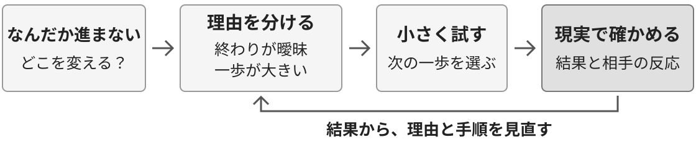

手順を決めた時点では、相手の事情まで全部わかっているわけではありません。 進めた結果を見て、足りなかった前提や、変えたほうがよい手順を探します。

手順があると、進んだところと、まだ止まっているところを話しやすくなる。

---

## 分けた先でも、終わりを決める

大きな仕事を細かくしても、一つひとつの終わりが曖昧なら、終わらない仕事が増えるだけです。 「何ができれば終わりか」という条件を、分けた一つにも置きます。

一歩が大きすぎるなら、さらに分ける。情報や判断が足りないなら、それを確かめる仕事にする。 仕事の一部分にも、終わりを決め、動ける大きさにする進め方を使います。

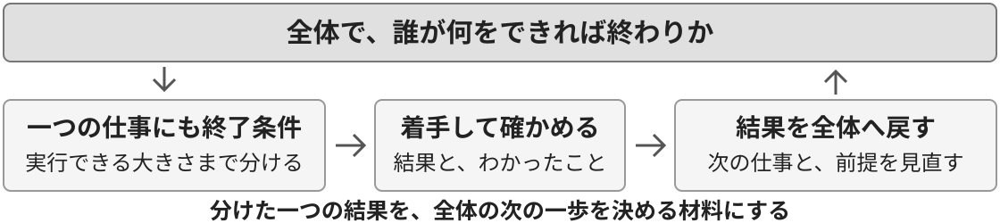

実行して確かめられる大きさになったら、分けるのを止めて着手する。一つ終えた結果を全体へ戻し、次に進める仕事を確かめます。前提が違っていたなら、最初に置いた終わりから考え直してよい。

何をすれば進むか。何がわかったら、どこへ戻るか。それが見えれば、途中から他の人にも仕事を渡せます。

一人で抱えた仕事を、途中からでも任せられる形にしたい。

---

## 終わらせるための5ステップ

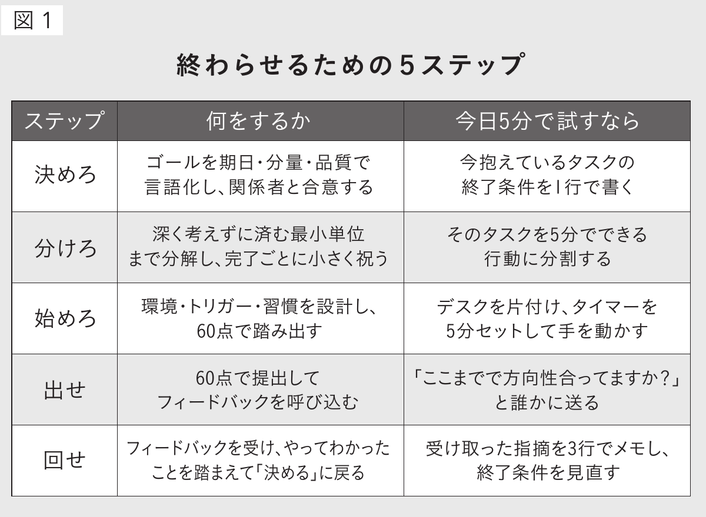

本書では、仕事を終わらせる ための進め方を、<strong>5つの手順</strong>として 定義しました。

<strong>決めろ。分けろ。 始めろ。出せ。回せ。</strong>

終わりが曖昧なら決める。 大きすぎるなら分ける。 始められる環境を作り、相手へ出して、反応から次を変える。

順番を一度守れば終わる、という保証ではありません。<strong>止まった理由に応じて戻り、進め方を変えるための手順です。</strong>

『おい、とりあえず終わらせろ』図1

---

## 決めろ。終わりを、まず仮に置く

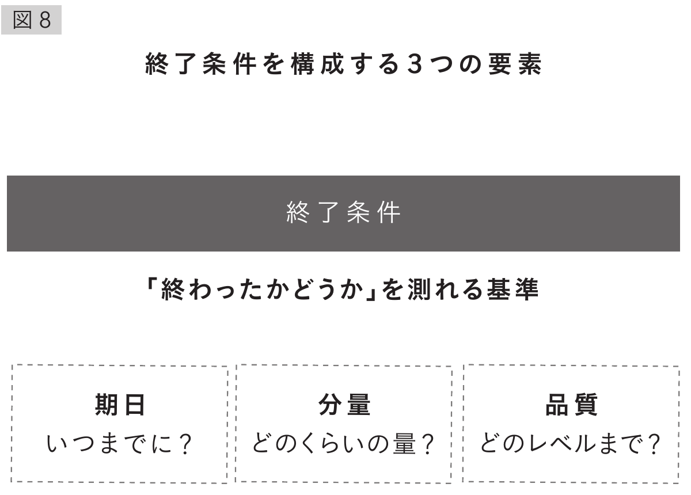

「十分に調べる」だけでは、調べるほど対象が広がり、出す時点を選べません。

<strong>いつまでに。どこまで。 何ができていればよいか。</strong>

たとえば、明日の打ち合わせに向けて、候補2つの違いと選ぶ理由を1枚にする。何を揃えたら出すかを、先に仮置きします。

終了条件は仮説です。今の状態と比べれば、足りない材料を選べる。相手と確かめて違うとわかったら、理由を残して見直します。

『おい、とりあえず終わらせろ』図8・上段

---

## 分けろ。動けない理由まで分ける

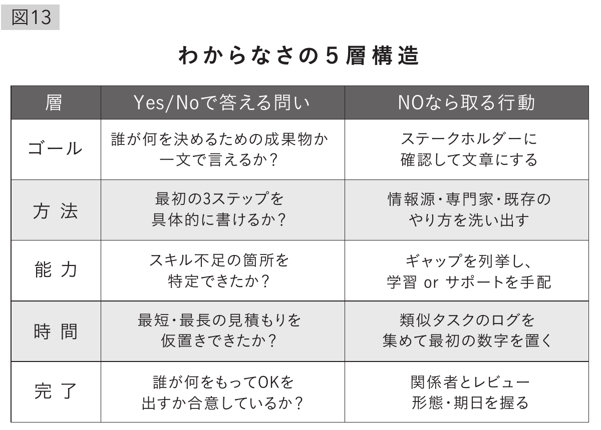

終わりを決めても、「設計する」「調査する」では、最初の操作を選べないことがあります。

<strong>何がわからないかで、 次の一歩は変わります。</strong>

ゴールが不明なら、受け手に期待を聞く。方法が見えないなら、やり方を一つ調べる。できるか不安なら、小さく試す。

「調査する」を「判断できていない点を書き出す」へ。<strong>何を開き、何をすればよいか選べる大きさにする。</strong>終えた結果を、次の判断へ使います。

『おい、とりあえず終わらせろ』図13

---

## 始めろ。始めるまでの手間を減らす

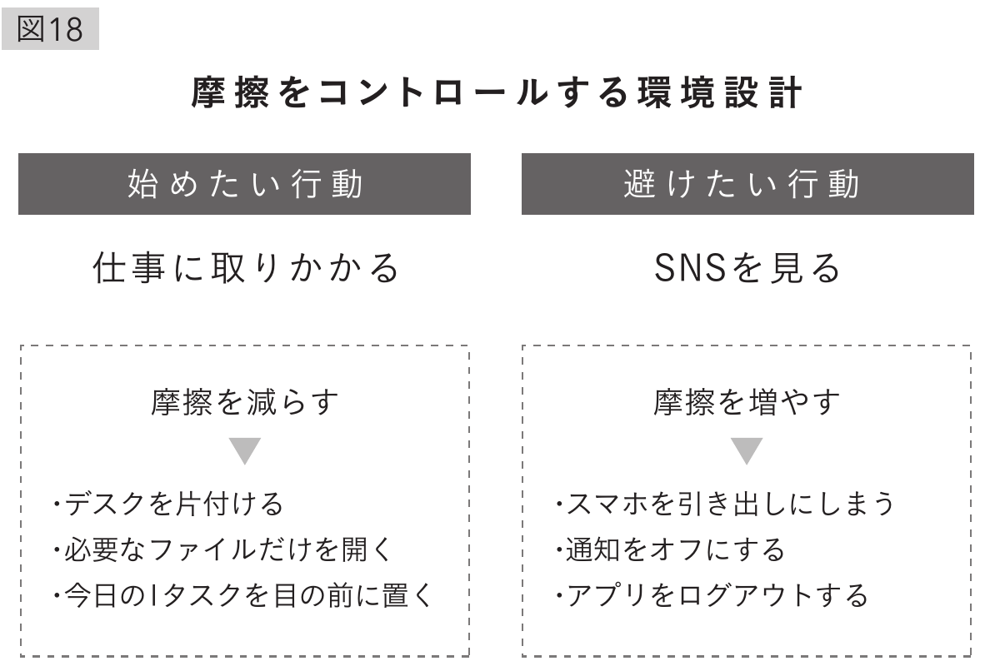

一歩を小さくしても、資料を探し、道具を開き、通知を見る間に、着手が後ろへずれることがあります。

次の一歩に使うファイルを開く。必要な資料を隣に置く。気が散る通知は止める。

<strong>やる気だけに頼らず、始めるまでに探したり迷ったりする手間を減らします。</strong>

準備は、今の一歩を実行できるところで区切る。開いたファイルに一文書けば、次に足りない材料も見えてきます。

『おい、とりあえず終わらせろ』図18・上段

---

## 出せ。相手が動ける60点で渡す

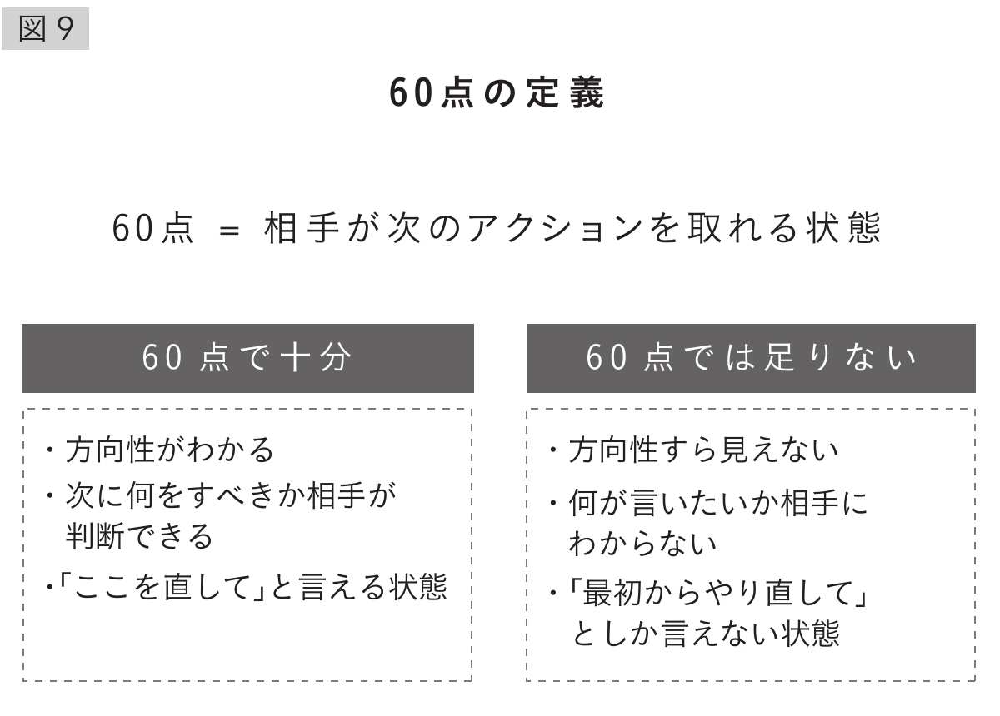

直せる所を探し続けると、いつまでも人へ渡せません。そこで本書では、出す水準を「60点」と呼びます。

<strong>相手が、次の行動や 判断を選べる状態です。</strong>

方向性を見てもらう資料なら、結論・根拠・迷っている点がわかれば、相手は修正点を返せます。実際に使うものなら、必要な動作を確かめます。

誤りを4割残してよい、という意味ではありません。<strong>渡す目的に応じて範囲を絞り、その範囲の条件を満たします。</strong>

『おい、とりあえず終わらせろ』図9

---

## 回せ。反応を、次の行動へ変える

出すと、作る側だけでは気づけなかった、相手の困りごとが見えてくることがあります。 ただ、指摘を受けて落ち込むだけでも、言われた文面を直すだけでも、次の迷いが残ることがあります。

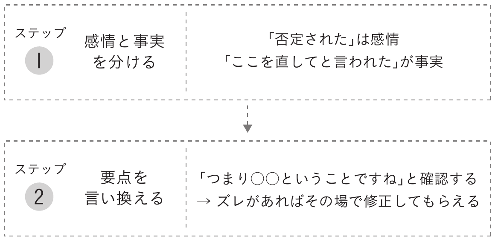

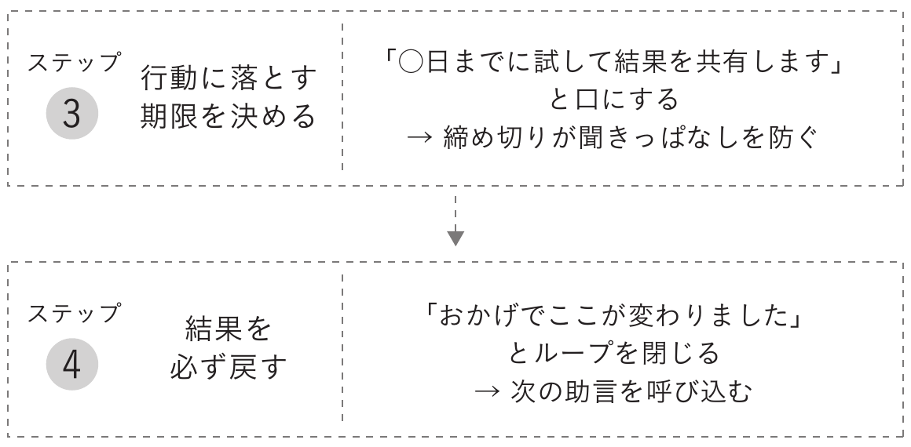

「わかりにくい」なら、結論が見えないのか、比較材料が足りないのかを確かめる。 「冒頭に結論と比較を置き、明日渡す」まで行動に落とし、直した結果を戻します。 <strong>相手の反応を、何をいつ変えるかまで具体的にするのが「回せ」です。</strong>

『おい、とりあえず終わらせろ』図26・4ステップを左右に分けて掲載

---

## 準備が進んでも、仕事が進んだとは限らない

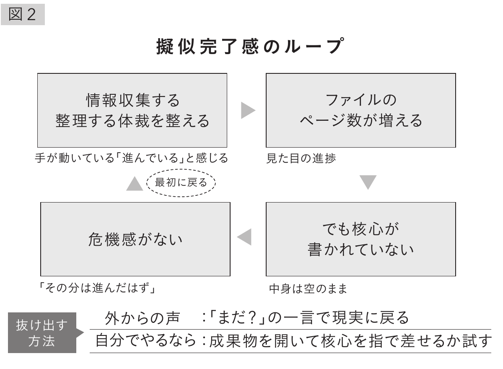

手順を知っても、準備に時間を使ったことを、完了に近づいたことと取り違える場合があります。

<strong>本書でいう「擬似完了感」です。</strong>

資料が増え、体裁が整っても、相手が必要とする結論や根拠が欠けていることがある。

準備が不要なのではありません。<strong>その準備によって、渡すべき内容の何ができたかを確かめます。</strong>

時間や作業量だけで進み具合を測らないために、この区別を使います。

『おい、とりあえず終わらせろ』図2

---

## 相手が次へ進めるかを、終了条件に入れる

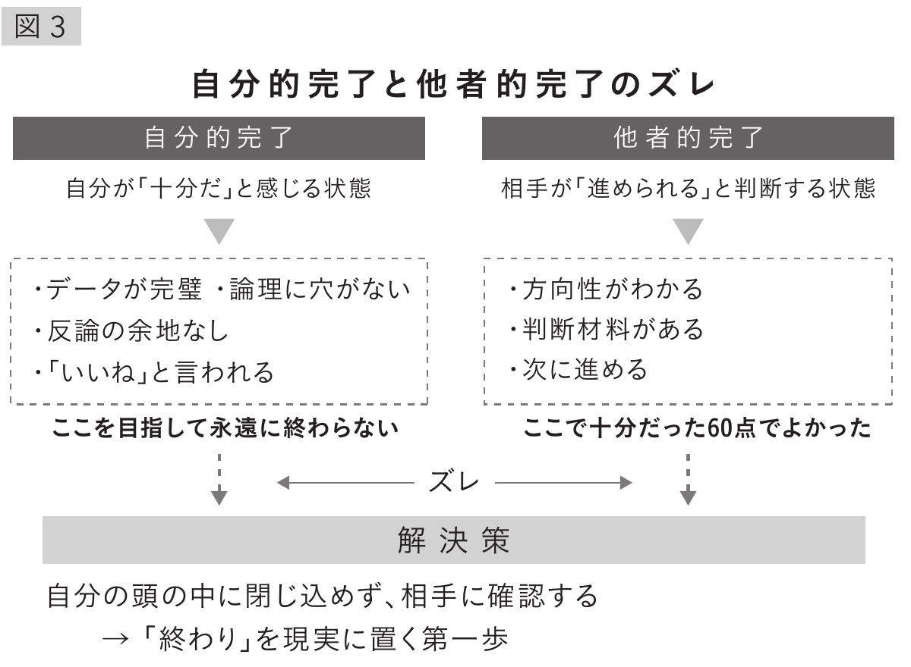

作業の手応えだけで終わりを判断しないために、成果を使う相手が次へ進めるかも確かめます。

<strong>自分的完了</strong> 自分が十分だと感じる。

<strong>他者的完了</strong> 相手が次へ進めると判断する。

たくさん調べたかに加えて、相手が選ぶための根拠が揃ったかを見る。誰が何に使うかを確かめ、終了条件に入れます。

全員を満足させる必要はありません。受け手が、明日の自分でもよい。

『おい、とりあえず終わらせろ』図3

---

<!-- _class: reading transition -->
<!-- _backgroundColor: black -->
<!-- _color: white -->

## AIが手伝ってくれても、 なぜ終わりが見えなくなるのか。

作る速さが変わっても、何をもって終えるかは残ります。

判断や確認もAIに任せられるのに、どこまで任せるかが曖昧なら、途中で止まる。 自分の作業が減ったことと、相手が使えるようになったことを分けて考えます。

---

## エージェントには、途中の判断も任せられる

仕事を相手へ届けるには、作る以外に、調べる・確かめる・選ぶ仕事も必要です。 <strong>エージェント</strong>は、道具を使い、結果を見て作業を進めるAIです。途中の判断にも使えます。

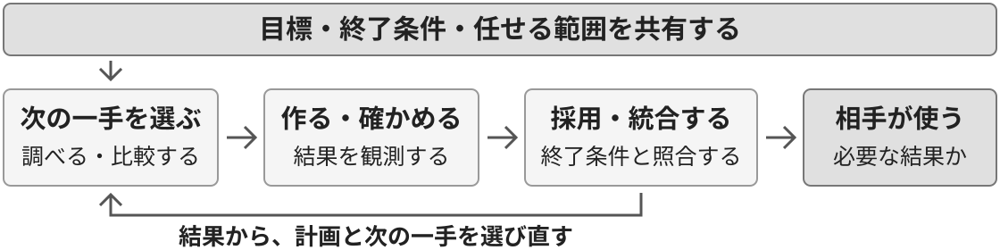

何を読むか、どの方法を試すか、結果が足りなければどこを直すか。 <strong>途中でわかったことから計画を変え、採用・統合まで進める判断も、任せる範囲に入れられます。</strong>

作業の中で「動いた」と確かめても、相手に必要なものを選んだかは別の問いです。 使った反応から目的や終了条件を見直す案も、AIと考えます。 目的や許された範囲を変える必要が出たら、理由と選択肢を相談してもらう。

<strong>一手ずつ指示する仕事を減らし、何を任せれば完了まで進めるかを考えたい。</strong>

---

## 考えることまで任せた先に、仕事がある

計画や判断をAIにも手伝ってもらえるなら、 「人間が考え、AIが作る」と役割を固定しておく必要はありません。 何を聞くかも、どの案がよいかも、一緒に考えられます。

そのうえで、提案を採用すると、誰かの仕事や生活が変わります。 案を作り直せても、その案に従って人が使った時間までは戻りません。

だから、案の出来栄えに加えて、使ったあとに困りごとを見つけ、直せるかまで考えます。 考える作業を任せられるほど、成果を使う人との関係も、任せ方に含める必要があります。

<strong>誰のために使い、結果をどう確かめ、 違っていたら誰が変えられるか。</strong>

私は、任せる能力が広がるほど、ここまでを仕事に含めたい。 不足した情報を探し、確認方法を考え、結果を調べるところからAIへ任せます。 <strong>一人で準備と確認を抱えず、相手が使えるところまで一緒に進めたい。</strong>

---

## 暗黙の判断を、確かめられる形にする

成果を誰が使い、どこまで任せてよいかは、依頼文に全部書かれているとは限りません。「この相手には先に相談する」「この品質なら一度出す」。職場では、こうした判断が人の記憶や、その場の会話に残っていることがあります。

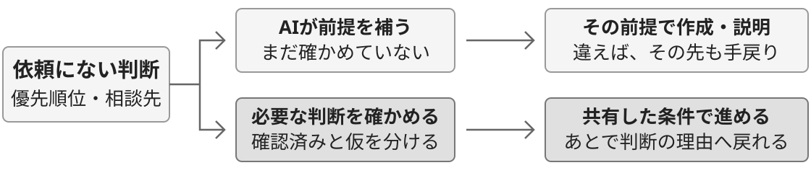

AIが不足を補えば、作業は先へ進めます。そこで補った判断が違っていたら、その判断を前提に作ったものや説明まで、あとから直すことになります。作るのが速いほど、最初の思い違いから先へ進めてしまう。

<strong>目的、優先順位、任せる範囲、確認する条件を、見える場所に置く。</strong> 私は、これを書く時間を、あとで完成品から意図を探し直さないために使いたい。

全部を先に決め切る必要はありません。AIと曖昧な点を探し、今の判断に必要なところから確かめる。人への引き継ぎにも使える形で残します。

---

## AIが速くても、仕事が終わらない理由

目的や判断の前提が曖昧なまま作ると、できたあとで選び直しや確認が必要になります。 作る部分が速くなっても、その仕事を誰がどこまで進めるかが曖昧なら、途中で止まります。

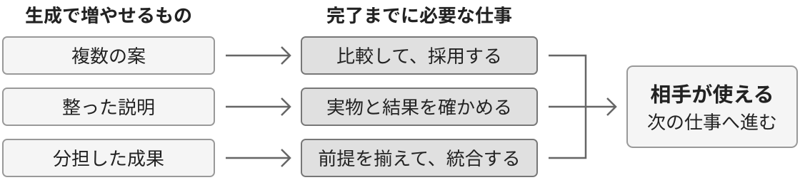

作る量に合わせて、採用・確認・統合も進める必要があります。 生成だけを速くしても、その先が止まれば、相手へは届きません。

これは、AIには作ることしか任せられない、という話ではありません。 終わりまでに必要な仕事を見つけ、その確認や判断も依頼へ含める、という話です。

5ステップを、任せた仕事を完了へつなぐために使う。

---

## 作る速さと、届く速さを分けて見る

終わりを「相手が使える状態」と考えると、作成の前後にかかった時間も見えてきます。

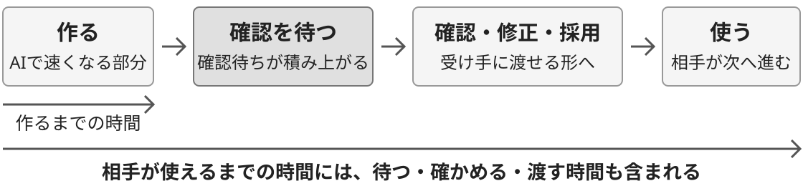

作るのが早く終わっても、確認待ちが積み上がれば、 相手が使えるまでの時間は同じようには縮まりません。

その状態で作る量だけ増やすと、受け取る側には、比較する案や 確認する差分がさらに届く。忙しく動く場所と、仕事が止まる場所が 別々になることがあります。

確認もAIへ任せる、受け手が判断できる材料を添える、一度に渡す量を絞る。 どこで待っているかがわかれば、作成をさらに速くする以外の手を選べます。

自分の作業時間に加えて、相手が使えるまでを見る。

---

<!-- _class: reading transition -->
<!-- _backgroundColor: black -->
<!-- _color: white -->

## エージェントと、 5ステップをどう進めるか。

本書の手順を、任せた仕事が相手へ届くところまで使います。

何を終えるかを共有し、任せられる単位に分ける。 情報と道具を揃えて進め、根拠とともに渡し、結果から次の任せ方を変える。

---

<!-- _class: reading transition -->
<!-- _backgroundColor: #0a1929 -->
<!-- _color: white -->

## 決めろ

終わりを仮に置く。 AIと曖昧さを調べ、何を優先するかを共有する。

手順まで全部指定しなくても、 何ができれば終わりか、何を守るかは一緒に確かめられる。

---

## 何を作るかの前に、何を解決するか

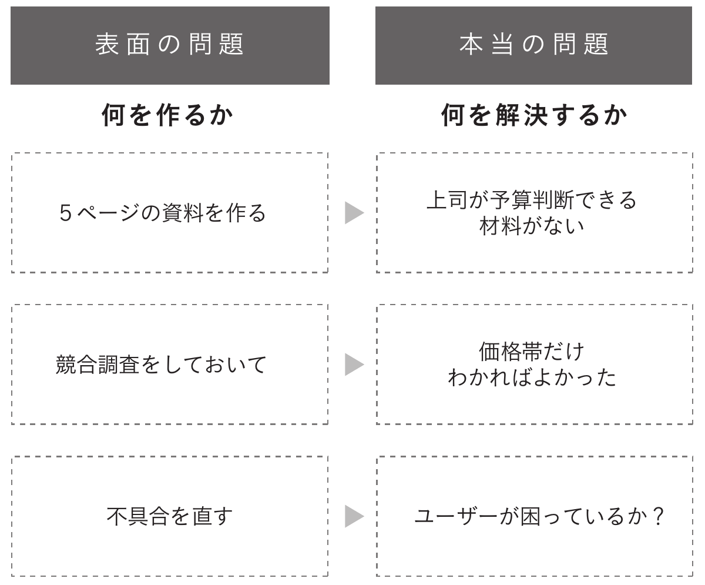

最初に決めたいのは、相手のどの困りごとを解くかです。作るものの名前だけでは、必要な内容を選べません。

AIが5ページの資料を作れても、費用と期待する効果がなければ、予算を判断する仕事は止まったままです。

<strong>何を作ったかに加えて、 相手が何をできるように なったかを確かめます。</strong>

AIへも、作るものと一緒に、誰のどんな判断や行動を助けたいかまで渡します。その目的から、調べる内容や確認方法も考えてもらいます。

『おい、とりあえず終わらせろ』図7「表面の問題と本当の問題」・比較部分

---

## 「最適」を選ぶ前に、誰の都合かを決める

相手の困りごとを選んでも、作る側と使う側で、望ましい案が違うことがあります。 AIに「早く終わる案」を頼むとき、誰の時間を短くしたいのか。

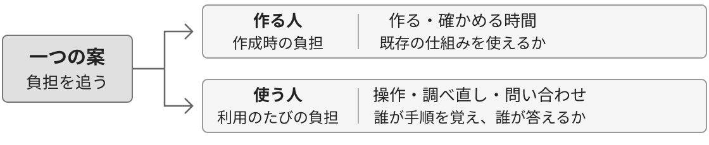

作る時間を短くした分、利用者が毎回手順を覚えるなら、負担の置き場所が変わる。 もちろん、使いやすさを際限なく作り込む時間もありません。

比較する軸が違えば、同じ案への評価も変わります。 「最適な案を選んで」だけでは、この優先順位までAIが補うことになります。

<strong>今回は誰の負担を減らし、そのために何を引き受けるか。</strong> 速さ、費用、使いやすさの優先順位と理由をAIへ渡し、案を比較します。 採用したあと誰に何が残るかまで、私は「決める」に含めたい。

---

## 終了条件を、AIと問い直す

「いい感じに調べて」では、自分も、どこで終わるかを判断できない。 先に完璧な指示を書くことまで、一人で抱えなくてよいと思います。

<strong>誰が、何を判断するための仕事か。</strong>

その判断に必要な材料と、今回調べなくてよい範囲は何か。 まだ曖昧な前提は何か。何を確かめれば、一回終えられるか。

AIに不足や選択肢を洗い出してもらい、受け手と必要な点を確かめる。 <strong>相手の意図として確認したことと、仮に置いたことを分けて残す。</strong>

たとえば「費用を優先する」と仮置きしたなら、相手が本当に優先したいのは 費用か、導入までの時間かを確かめる。AIが出したもっともらしい答えを、 相手と決めた条件にすり替えず、今回終える範囲を一緒に絞ります。

---

## 目標を、実物で確かめられる形にする

エージェントに渡すgoalは、達成したい状態です。 「手順書を書く」という作業の先で、誰が何をできるようになってほしいのかを置きます。

目標に対応する終了条件と確認方法も渡し、作業結果から、続けるか終えるかを判断できるようにします。

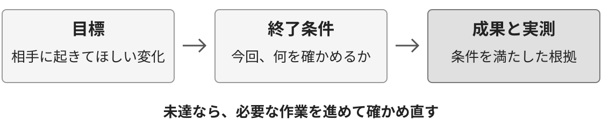

新しく参加した人が開発環境を起動できるようにするなら、文書の存在だけでは足りません。 対象の環境で手順を試し、起動できたか、途中で補った知識は何かまで確かめます。 確認方法を考え、実行するところまでAIへ任せられます。

<strong>ゴールを具体的にすると、途中の手順を任せながら、終えたかを確かめやすくなります。</strong> 本書の「終了条件」を、エージェントが途中で立ち戻れる判断基準にします。

<a href="https://learn.chatgpt.com/use-cases/follow-goals">Codex · Follow a goal</a>

---

## プロンプトには、任せる判断も書く

依頼文として書くプロンプトには、目的や制約と一緒に、調べる、作る、確かめる、そのどこまで任せるかを書けます。「何を作るか」だけだと、作った先で必要な確認が仕事から抜けることがあります。

たとえば「集計のずれを再現し、原因を調べて修正してほしい。既存の集計条件を保ち、修正前後を同じ入力で比べる。原因調査と確認方法の選定も任せる。集計条件の変更が必要なら、理由を返してほしい」。

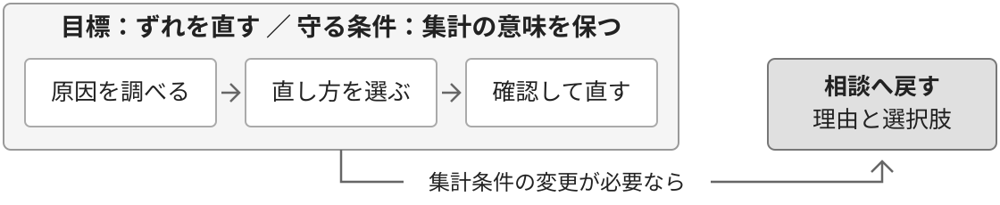

この依頼では、調べ方や直し方は選んでもらい、集計の意味を変える判断は戻してもらう。どこで相談するかがわかれば、その手前まで一手ずつ確認を挟まずに進められます。

具体的にするのは、達成したいこと、守る条件、判断を戻してほしい場面。手順を全部決め切らず、自分が知らなかった進め方を見つけてもらえる余地も残します。

<strong>うまい言い回しを探す前に、自分がどこまで任せたいのかを言葉にする。</strong>

<a href="https://www.anthropic.com/engineering/effective-context-engineering-for-ai-agents">Anthropic · Effective context engineering for AI agents</a>

---

## 任せる範囲は、間違えたときから考える

難しい作業だから細かく見る。簡単な修正だから全部任せる。 それだけでは、間違えたときに誰が困るかを見落とします。

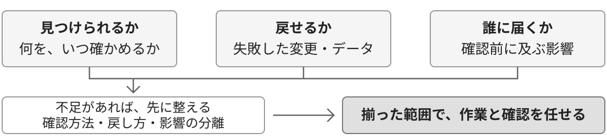

隔離した環境で試せる大きな変更なら、確認までまとめて任せられます。 一行の変更でも、多くの人が使う設定なら、反映する前に確かめる範囲は広い。

<strong>任せる範囲を広げたいなら、誤りを見つけて対処できるかも確かめる。</strong> 判断に迷うなら、必要な確認や戻し方を調べるところからAIに任せます。

---

## 終了条件を変えるなら、理由も共有する

終了条件は仮説なので、新しい事実が出たら変えてよい。 ただし、どの条件で進め、何が足りず、なぜ変えるのかを残します。

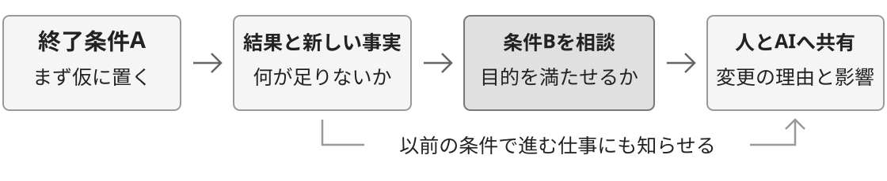

目的は変わっていないのに、テストが通らないから期待する結果を消す。 必要だった確認を黙って外す。それでは、元の目的を達成したかを測れません。

一方で、調査によって必要なデータが手に入らないとわかったなら、 代わりに何を確かめれば相手が判断できるかを相談する。先に渡した条件で 動いている人やAIがいるため、変えた点と、その影響も伝えます。

<strong>前提を更新することと、未達を隠すことを分ける。</strong> 今回は何を出せるかを決め直して、関係する人とAIへ共有します。

---

<!-- _class: reading transition -->
<!-- _backgroundColor: #0a1929 -->
<!-- _color: white -->

## 分けろ

動ける大きさから、 任せて、確かめて、つなげられる大きさへ。

AIが一度に作れる量に合わせると、 受け取る側が判断できる量を超えることがある。

---

## 分ける前に、何がわからないかを見る

AIに分解を頼んで手順が並んでも、ゴールが曖昧なままなら、AIが補ったゴールへ向かう計画になっているかもしれません。

本の「わからなさの5層」で見ると、方法の説明が増えても、ゴールや完了についての疑問が解けたとは限らない。

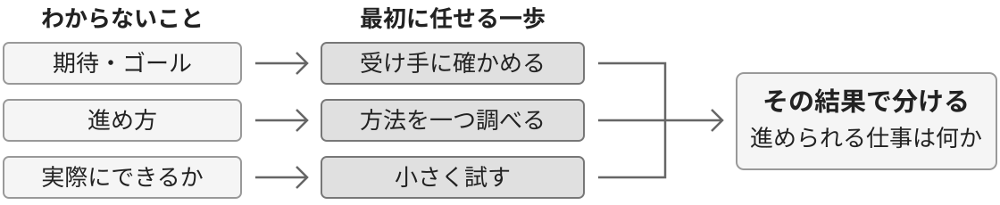

<strong>方法が不明なら、手順を調べる。期待が不明なら、受け手に聞く。</strong> まだ確かめていない前提を一つ見つけて、それを調べる仕事にする。

ゴールが揃ったら、その先の作業が頼る前提も一つ試す。必要なデータを読めるか。期待する結果を測れるか。調査や試作もAIへ任せ、確かめた結果から、次に進める仕事を分けます。

<strong>作業が細かく並んだかに加えて、何がわかり、どこから進められるかを見る。</strong>

---

## AIに任せる一回を、学べる大きさにする

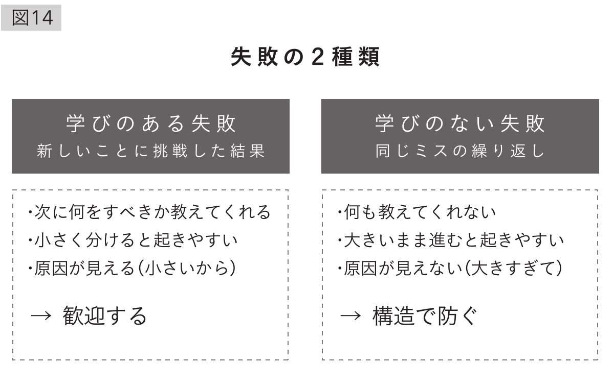

未確認の前提に頼る仕事を一度に進めると、結果が違ったとき、どの前提から直すべきかを探す仕事も増えます。

どの前提で頼み、何を変え、何が起きたか。一度に変えるものを絞ると、結果の違いを追いやすくなります。

<strong>うまくいかなかった一回から、次に変える条件を見つけます。</strong>

同じ失敗が続くなら、頼み直すだけでなく、渡す情報や確認方法も見直す。次の一回で、予想した違いが出たかを確かめます。

『おい、とりあえず終わらせろ』図14「失敗の2種類」

---

## 小さく分けても、確認が軽くなるとは限らない

一つのファイルに絞っても、その変更が多くの画面に影響するなら、 確認する範囲は広いままです。作業の小ささと、影響の小ささは 別々に見る必要があります。

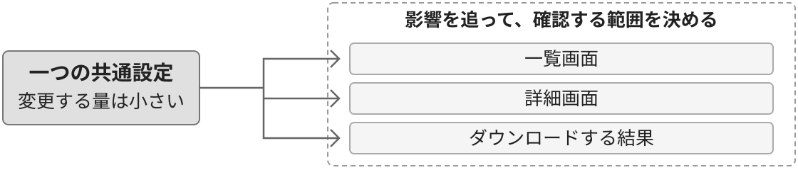

何行変えるか、誰が担当するかに加えて、一緒に変えるものと、 何を確かめれば出せるかを調べます。

分けるたびに、受け渡す形式や、共有する前提を合わせる仕事も生まれます。 一緒に変えなければ成り立たないものまで分けると、その調整で止まる。 <strong>分けろは、こちらが確かめて出せる一回分を作ること。</strong>

---

## 分けた仕事は、統合まで終わらせる

エージェントごとに「完了」が並んでも、組み合わせて使えるとは限りません。 項目の意味や受け渡す形式が違えば、別々に動いても全体では止まります。

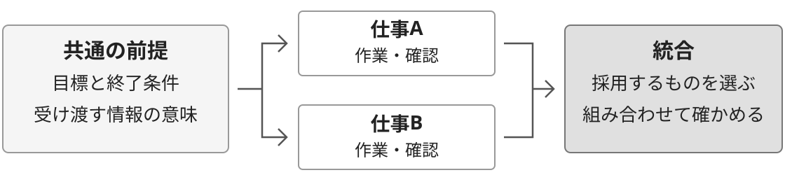

統合では、ただ全部を足すのではなく、目的に合うものを選びます。 何を採用し、何を見送り、その結果を誰が使うかまで決めます。

<strong>一体にどこまで任せるかと、何体に分担するかは、別々に決めます。</strong> 最後につなぐ担当と確認方法も置き、統合にもAIを使う。 待ち時間が調整の時間に変わるだけなら、担当を増やす理由にはしません。

---

## 待つ理由に合わせて、分け方を変える

担当を増やしても、必要な情報や判断が届かなければ、その仕事は始められません。 分担した先で、人やAIが何を待っているかを見ると、分け方を変える手がかりになります。

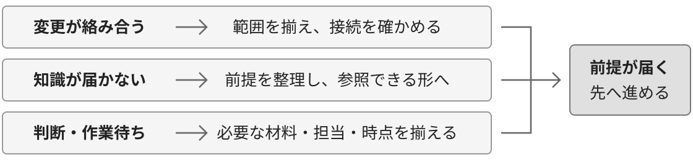

わかっていないことが多い間は、一緒に探る。前提が揃ったら、 任せて進められる範囲を広げる。分業の形も、途中で変えてよい。

エージェントを増やす前に、何を待てば進めるのかを見る。

---

<!-- _class: reading transition -->
<!-- _backgroundColor: #0a1929 -->
<!-- _color: white -->

## 始めろ

取りかかるまでの手間を減らす。 着手したあとも、結果を見て進められる環境を渡す。

必要な情報と道具を揃え、結果から次の一手を選ぶ。 途中で止まったときに、続きから再開できるところまで考えます。

---

## AIにも、始められる環境を渡す

仕事を任せられる大きさに分けても、資料を読めず、道具を動かせなければ始まりません。 必要な情報を読めて、道具を使えて、結果を確認できる。 この実行を支える仕組みを、ハーネスと呼びます。モデルと道具をつなぎ、作業を進めます。

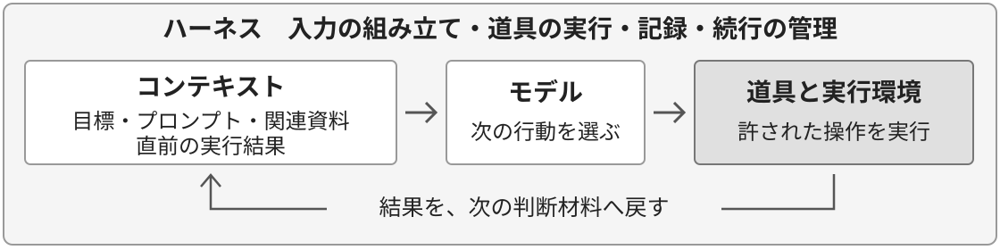

モデルがその時点で判断に使う情報を、コンテキストと呼びます。プロンプトもその一部です。 実際の入力には、製品側の指示、使える道具の説明、読んだ資料、実行結果も加わります。

<strong>いま使っているエージェントに、小さな作業を一つ、結果の確認まで任せてみる。</strong> 資料が読めない、確認用のコマンドが動かないなど、見つかった不足から整えます。 本書の「始められる環境」を、判断と実行がつながる条件として考えます。

<a href="https://openai.com/index/unrolling-the-codex-agent-loop/">OpenAI · Unrolling the Codex agent loop</a>

---

## 置いた資料と、いま読める情報は違う

まず、判断に使ってほしい情報が、実際のコンテキストへ届くかを見ます。 リポジトリに保存した情報が、すべて毎回の入力に入っているわけではありません。

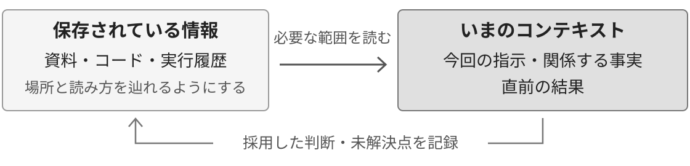

「前に説明した」「同じフォルダに置いた」だけで、今回も使われるとは考えない。 関係する資料へ辿れるか、実際に読めたか、今の作業に使える内容かを見ます。 この調査と情報の選び直しも、エージェントへ任せます。

<strong>人へ引き継ぐときと同じように、知っていてほしいことへ辿れる形を作る。</strong>

<a href="https://www.anthropic.com/engineering/effective-context-engineering-for-ai-agents">Anthropic · Effective context engineering for AI agents</a>

---

## 次に判断するための情報を選ぶ

コンテキストには上限があります。大量の情報を渡せるモデルでも、古い指示や、採用しなかった案が混ざれば、どれを使うか判断する仕事が増えます。短ければよいという話でもありません。必要な前提を削ると、推測で埋める余地が増える。

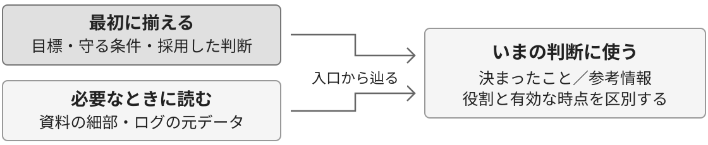

<strong>最初に、今回の目標、守る条件、資料を探す入口を渡す。</strong> 細部は必要になったときに読み、長いログは要点と元の記録の場所を返す。開始時の読み込みを減らす分、途中の検索には時間がかかる。その配分も仕事に合わせます。

依頼として守ること、採用した判断、参考として読んだ情報も分けて残します。古い資料に書かれた方針を、今回の決定として扱ってほしくはありません。

AIには「足りない資料は何か」「この情報は今も成り立つか」も調べてもらう。<strong>情報を全部こちらが選び切るより、必要な情報を探して確かめられるようにしたい。</strong>

<a href="https://www.anthropic.com/engineering/effective-context-engineering-for-ai-agents">Anthropic · Effective context engineering for AI agents</a>

---

## 指示と、実行できる範囲を揃える

必要な情報を渡したら、道具が使える範囲も、任せた範囲に合わせます。 「本番のデータは変えずに調べて」と書くことと、 その道具から本番へ書き込めないようにすることは、違う仕事です。

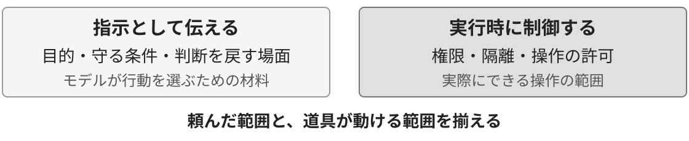

書き換えを任せないなら、読み取りだけの権限で調べられるようにする。 変更を試すなら、影響を分けた環境と、結果を確かめる手段を用意する。 指示文を強くして注意を求めるだけでなく、道具が動く範囲も合わせます。

<strong>その範囲で調べ、試し、直せるから、途中の操作を細かく見張る必要を減らせます。</strong> ハーネスを整えるのは、任せてよい仕事を実際に任せられるようにするためです。

<a href="https://www.anthropic.com/engineering/managed-agents">Anthropic · Scaling Managed Agents</a>

---

## 失敗の表示にも、次の仕事がある

道具を動かせても、結果の意味がわからなければ、次の一手を選べません。 「失敗しました」だけでは、コードを直すのか、環境を整えるのかがわからない。 テストで期待と違う結果が出たことと、テスト自体を起動できなかったことを分けます。

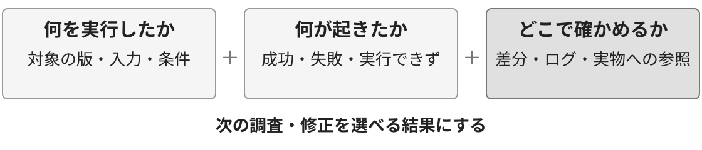

実行結果には、対象の版、試した条件、エラーの要点、詳しい記録への参照を残す。 大量のログを毎回読み直させず、必要なら元の記録へ戻れるようにします。 「成功」も、コマンドが終わったのか、必要な動作まで確かめたのかを区別します。

<strong>次の一手を選べる結果が返れば、同じ操作を繰り返す以外の進み方を選べます。</strong> 道具の返し方も、エージェントが仕事を終えられるかに関わります。

<a href="https://www.anthropic.com/engineering/writing-tools-for-agents">Anthropic · Writing effective tools for agents</a>

---

## 次の指示を、観測した結果から作る

結果が次の判断に使える形で返れば、毎回こちらが「調べて」「直して」と言わずに、 エージェントが不足を調べ、次の一手を選べます。

<strong>何を観測し、目標とどう比べ、結果を次の行動へどう戻すかを設計する。</strong> 私の考えるループエンジニアリングです。単に同じ依頼を繰り返すこととは分けて考えます。

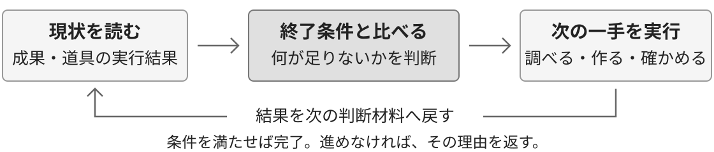

不具合なら、再現・調査・修正・検証まで任せる。 調べた結果、変更が不要なら、その根拠を残して終える。 結果が違えば、許された範囲で直し、もう一度確かめます。

<strong>自分の返事を待つ時間を減らし、確かめて直すところまで進めたい。</strong>

<a href="https://syu-m-5151.hatenablog.com/entry/2026/06/23/215158">nwiizo「ループエンジニアリングは、サイバネティクスの再発見だ」</a>

---

## 一回の応答と、仕事の完了を分ける

「ここまでできました」という応答が返っても、依頼した仕事が全部終わったとは限りません。 未達なら、何を残して、どう続きを始めるかも、ループを動かす仕組みに含めます。

Codexの<code>/goal</code>は、目標を保持し、複数の応答にまたがって作業を続ける機能です。 次の「続けて」を自分が送る部分も、仕組みに任せられます。

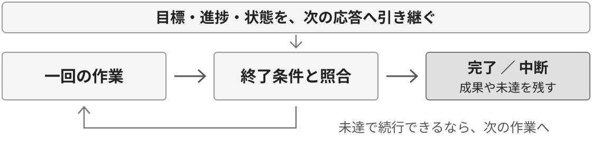

公開実装では、目標の状態を保存し、続行できる状態なら次の作業を開始します。 ただし、継続の仕組みがあることは、終了条件を必ず満たす保証にはなりません。 予算や情報不足で止まることもあり、完了と記録する判断にも誤りはあり得ます。

<strong>完了の判定まで任せるなら、条件に対応する実物と確認結果を残してもらう。</strong> 長く動いたかより、目標との差が減り、受け手へ渡せる状態になったかを見ます。

<a href="https://learn.chatgpt.com/use-cases/follow-goals">OpenAI · Follow a goal</a> ／ <a href="https://github.com/openai/codex/tree/6f39a47bb3b04de4c804187bfbf55edc56939aab/codex-rs/ext/goal">Codexのgoal実装</a>

---

## 「終わるまでやって」に、出口も渡す

終わりを目指す仕事にも、続けても進まない場面はあります。 「終わるまで」を、同じ操作を何度でも試してよい意味にはしたくありません。

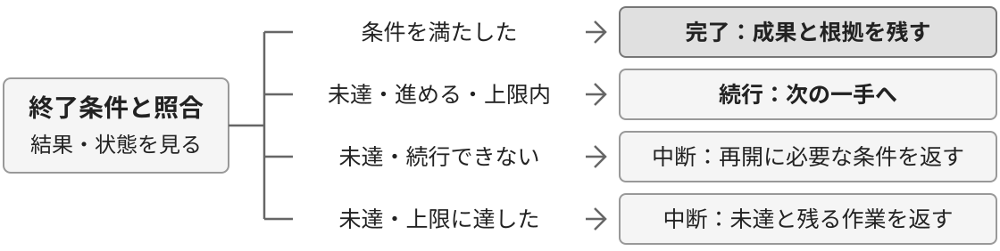

調べられる不足なら、資料や道具を見直し、許された範囲で進めてもらう。 関係者の判断が必要なら、選択肢と違い、再開に必要な判断を返す。 同じ試行から新しい情報が出ないなら、試し方を変えるか、そこで区切ります。

上限は指示に書くだけでなく、実行する仕組みでも止められるようにする。 延ばすときは、次に何がわかる見込みかを確かめます。 <strong>止まる条件と残す情報を決め、際限ない試行と、再開時の調べ直しを減らします。</strong>

---

## 会話が終わっても、仕事を再開できるようにする

長く続く仕事や、判断待ちで区切った仕事では、会話の外にも再開に必要な情報を残します。 コンパクションは、履歴を圧縮し、限られたコンテキストで作業を続ける仕組みですが、 あとで必要になる細部が、圧縮した情報から落ちることもあります。

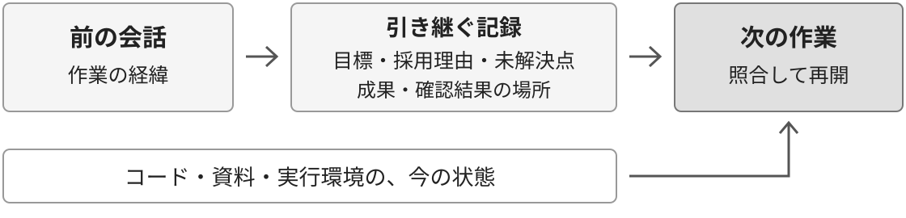

終了条件、採用した判断と理由、残る問題、次に確かめることを、あとで読める形に残す。 この引き継ぎもAIへ任せます。元の記録や実物へ戻れる参照も、一緒に残してもらう。 再開するときは今の状態と照合し、終わった調査を不要に繰り返さないようにします。

<strong>記録しただけでは、次の会話で使われるとは限りません。</strong> 再開時に読む場所を示し、次の実行が必要な記録を判断に使えるところまでつなげます。

<a href="https://www.anthropic.com/engineering/managed-agents">Anthropic · Scaling Managed Agents</a> ／ <a href="https://www.anthropic.com/engineering/effective-harnesses-for-long-running-agents">Effective harnesses for long-running agents</a>

---

## 反応が返る速さに、作業の速さを合わせる

結果が返るまでに時間がかかる仕事では、待っている間に次の修正を足せます。 けれど、前の結果を見ずに変更を重ねると、何が効いたかを見分けにくくなる。

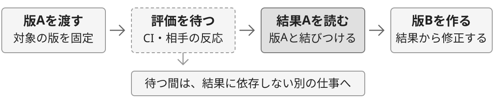

CIの結果を受け取る前に同じ不具合への修正を重ねると、前の修正が効いたかも知らずに、次の手を選ぶことになります。資料も、相手が読んでいる途中で版を増やすと、確認する対象がずれます。

<strong>渡した版と結果を結びつけ、結果に応じた修正は、その結果を見てから進める。</strong> 待っている間は、独立して進められる別の仕事へ。返事が遅いことを、内容が悪いと決めつけて直し続けない。

確認待ちが積もるなら、同時に進める量も絞ります。 <strong>作る速さを、結果を受け取って判断できる速さにつなげたい。</strong>

---

## 「動いた」と「使ってよい」の間を埋める

試作で方向性を確かめられたなら、それも一回の完了です。 ただ、手元で動いたことは、そこで試した条件の結果です。

エージェントが試作を早く作れるほど、そのまま使いたくなる場面もあります。 試作を見る人から、実際に使う人へ受け手が変わるなら、必要な確認も変わります。

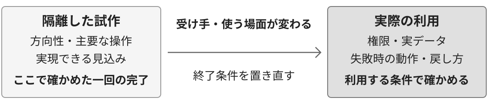

次に使う場面が変わるなら、終了条件も置き直します。 AIには確認や修正も任せられる。<strong>確かめた範囲に合わせて任せ方を変える。</strong> 60点を、未確認のまま本番へ出す理由にはしません。

---

<!-- _class: reading transition -->
<!-- _backgroundColor: #0a1929 -->
<!-- _color: white -->

## 出せ

相手が次に動ける形で渡す。 成果に、確かめた根拠と残る問いを添える。

作る時間が減っても、受け手の調べ直しが増えたなら、 仕事全体が同じだけ早く終わったとは言えない。

---

## 完了報告のあとに、確認の仕事を隠さない

「できました」だけで渡すと、受け手は、どの条件を満たし、何が残っているかを調べ直します。 成果と一緒に、確認した根拠と、次に判断してほしい点を渡します。

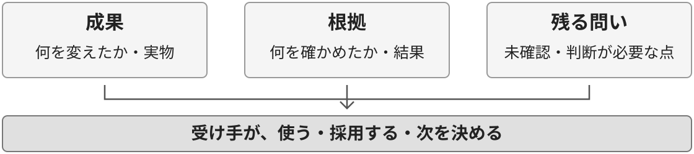

この3つを揃える仕事も、エージェントへ任せます。 実物を確認し、入力や利用場面を変えて試した結果、開いて確かめた根拠へ辿れるようにしてもらう。 未確認の条件もまとめ、報告を受け取ってから、人が全部調べ直す形を変えます。 <strong>「なぜよいか」の説明に納得しただけで、条件を満たした事実にはしません。</strong>

ログを全部貼るだけでも、読む仕事は増える。 <strong>主張から根拠へ辿れて、受け手が何を判断すればよいかわかる形にする。</strong> 私は、相手の調べ直しを減らすところまで、他者的完了に含めたい。

---

## 同じ見落としを、確認でも繰り返さない

確認結果が揃っていても、確かめた条件自体が、相手の必要と違う場合があります。 作った側と確認する側が同じ思い込みを使えば、別のエージェントに頼んでも見逃します。

たとえば、一覧の検索結果をダウンロードする仕事を考えます。

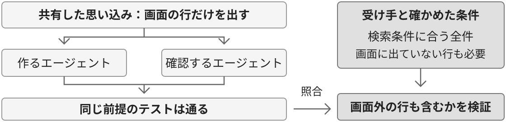

<strong>作った側の説明に加えて、受け手と確かめた条件からも検証します。</strong> どの入力で、何が起きるはずか。実際にはどうなったか。 AIにも、その比較と、まだ確かめていない条件を調べてもらいます。

確認役を増やすなら、何の見落としを補うのかを決める。 <strong>確認役の数より、必要だった結果を別の根拠から確かめられたかを見たい。</strong>

---

## 今回の合格で、何を見ていなかったか

ループに渡した評価が狭いまま、その合格だけで仕事を進めてしまうことが気になります。 確認の外に置いたものは、合格が続いても守れたとは言えません。

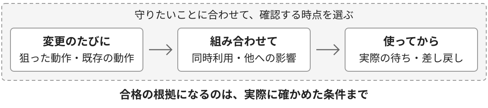

たとえば、表示を速くするために結果を保存して再利用したなら、 表示の速さに加えて、元の情報が変わったあとに古い結果を出さないかも見る。

<strong>守りたいことごとに、何を、いつ確かめるかを決めます。</strong> すべてを毎回確認する費用もある。変更の影響に合わせ、AIに調査と検証を任せます。 未確認の影響が大きいなら、使う範囲を絞ってから確かめます。

---

## 完了と改善を分ける

相手と置いた今回の条件を満たし、使う範囲と残る課題を伝えたら、 一度閉じます。その後に得る反応は、次の改善を選ぶ材料にします。

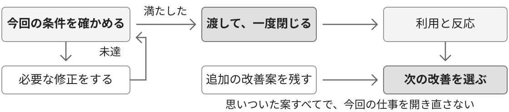

AIは追加の改善案も出せます。そのたびに今回の仕事を開き直すと、 受け手へ渡す時点が来ません。残った案は、効果を見て次に採用する。

既知の重大な問題まで「次の改善」にする話ではありません。 今回守る条件を満たしていることが、一度閉じる前提です。

「まだ良くできる」は、いつまでも出さない理由にならない。

---

## 一つ採用すると、次の仕事が動き出す

エージェントに比較や評価を任せても、条件を満たす案が複数残ることがあります。 そのとき、もっと調べれば唯一の正解が出るとは限りません。

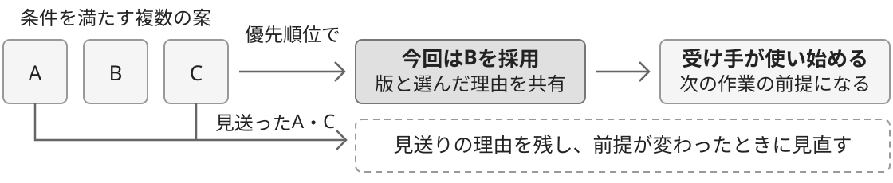

<strong>一つを採用すると、他の人は、その結果を前提に動き始められます。</strong> 作る。確かめる。使う。選んだ案には、その後に誰かが使う時間や、覚える手順も結びついていきます。

だから、完了はファイルを保存した時点だけでは考えたくありません。今回は何を採用し、何を見送り、何が変われば見直すか。採用した案と理由を共有し、受け手が使い始められるところまで進めます。

決めた優先順位で選べるなら、採用も任せる。順位を変える必要があれば、得るものと諦めるものを戻してもらいます。

<strong>終わらせることで、可能性だったものを、誰かが使えるものにする。</strong>

---

## 出す怖さには、3つの顔がある

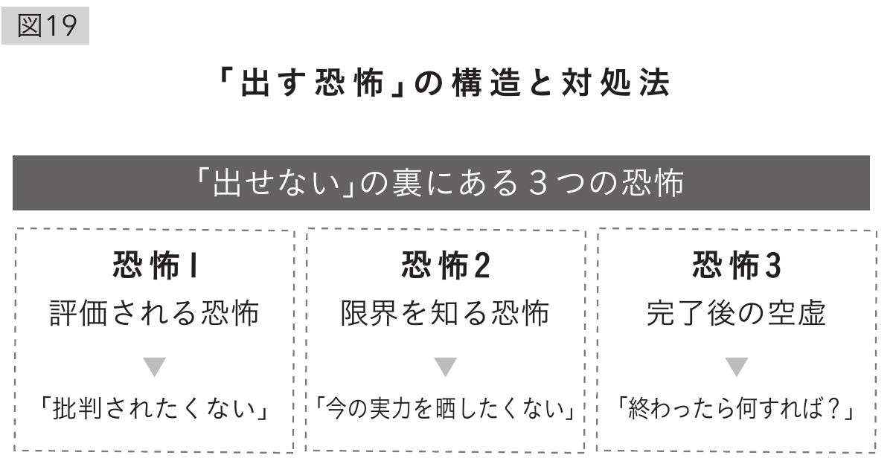

条件を満たしても、自分の名前で出す怖さが残ることがあります。AIが作れることと、人に見せられることは、別の問題です。

評価が怖ければ、<strong>見てほしい点を絞って出す。</strong>何への意見を求めるかを、先に相手と揃えます。

限界が見えるのが怖ければ、<strong>今の成果と、自分の価値を分ける。</strong>今回の成果への指摘として受け取ります。

終えたあとの空虚さが気になるなら、<strong>次にすることを一つ置く。</strong>休むことでもよい。仕事を開いたままにせず、その後の時間を考えます。

『おい、とりあえず終わらせろ』図19・上段

---

<!-- _class: reading transition -->
<!-- _backgroundColor: #0a1929 -->
<!-- _color: white -->

## 回せ

反応を次の行動へ変える。 人とAIが次に判断するときの条件を変える。

出力だけが新しくなっても、 同じ迷いを生む前提が残っていれば、また同じ所で止まる。

---

## 回す速さだけでなく、回し方も変える

一件を直して終えても、次の依頼で同じ情報が欠けていれば、同じ手戻りが起きます。 今回の成果を直すことと、次に同じ所で止まらないようにすることを分けて考えます。

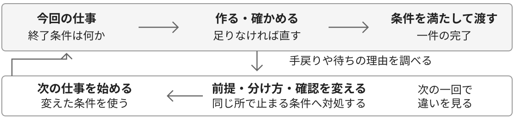

毎回同じ場所で直し直すなら、修正を速くするだけでなく、 最初に渡す前提や、確かめるタイミングも変えてみる。

この振り返りにもAIを使えます。実行記録から繰り返す問題を探してもらう。 変更案と減らしたい手戻りを挙げ、条件を一つ変えて、次の一回で違いを確かめます。

<strong>一件が終わるたび、次を任せやすくする材料を増やしたい。</strong> 本書の「回せ」を、エージェントと仕事をする仕組みそのものにも使います。

---

## 指摘の背景も、AIと確かめる

指摘は文面ごとAIへ渡せます。すぐ直せる指摘なら、そのまま進める。 何を直せばよいか曖昧なら、相手が判断できなかった点をAIと整理します。

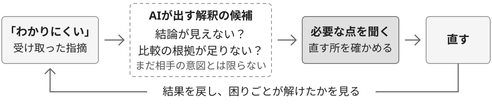

本のフィードバックの4ステップは、この整理にも使えます。感情と事実を分け、要点を言い換える。必要な点を相手に確かめてから、行動と期限を決め、直した結果を戻します。

「わかりにくい」は、結論が見えないのか、比較する根拠が足りないのか。<strong>AIには解釈の候補を出してもらい、確かめた内容から直す。</strong>相手の困りごとが解けたかまで戻って、次の頼み方を変えます。

文面の意味をAIが説明できても、相手の意図を確認したことにはなりません。解釈によって直す場所が変わるなら、必要な点を聞く。言い換えがうまくできたかより、困っていたことが解けたかを確かめます。

---

## 修正を、その場限りで終わらせない

成果物だけ直しても、次のAIに同じ不足した情報を渡せば、 また同じ所で迷うかもしれません。何を変えれば再発を減らせるかを見る。

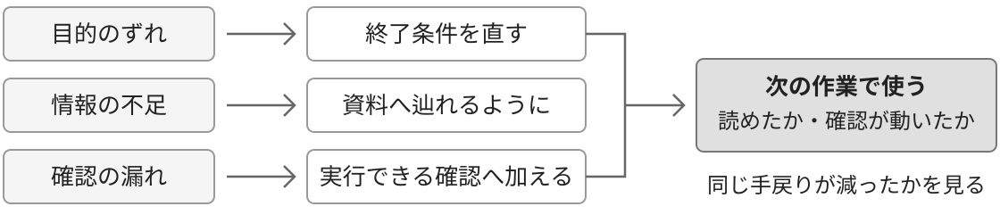

資料を置くだけでなく、次の作業で読めたかを確かめる。 テストの結果や相手の指摘も、次の判断に届く形へ直す。 その経路を直すための調査も、エージェントへ任せられます。

すべての失敗に、永続的なルールを足す必要はありません。 <strong>次にも効く変更を選び、実際に同じ指摘が減ったかを見ます。</strong>

---

## 作り直しても、守る条件と理由を残す

確認の漏れを直す方法を、ソフトウェアの作り直しで考えます。 AIが書き直したものが動いても、過去の失敗を防ぐ条件が抜けているかもしれない。 <strong>何が成り立つべきか、なぜ必要になったかを、確認方法と一緒に残します。</strong>

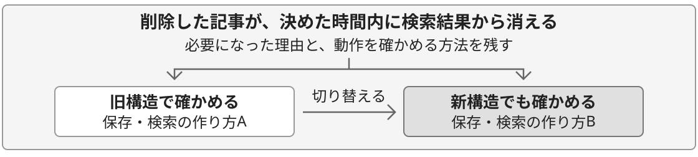

内部構造に結びついたテストを直すときも、使う人に必要な動作を確かめ続ける。 目的が同じなら、テストを通すために期待する結果まで消してはいけません。 AIにも理由の調査と記録を任せます。見つからない理由を、もっともらしく埋めずに残します。

使う側が切り替えられることを確かめ、古い経路は利用が終わってから外す。 切り替えの費用が高ければ、今回は必要な部分だけ直す選択もあります。 <strong>次の人が使えて、判断の理由も辿れるところまでを、作り直す仕事に含めたい。</strong>

---

## 残した指示が、次の仕事を重くしていないか

失敗のたびに指示を足すと、前提の違う指示が並んできます。 次の人やAIは、どれに従うべきかを調べるところから始まります。

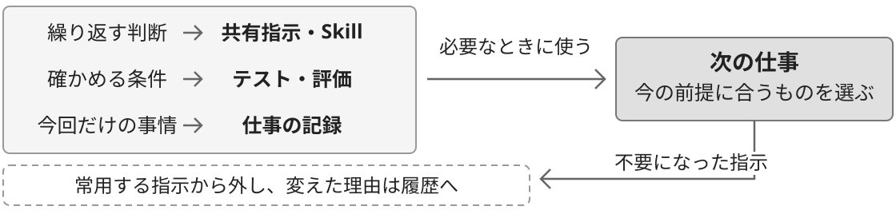

Skillは、繰り返し使う仕事の進め方をまとめる場所の一つです。 失敗を見つけたら、その原因に合う場所へ直し方を残す。 指示が長くなったことを、そのまま学習が進んだことにはしたくありません。

<strong>必要がなくなった指示は外し、変えた理由は履歴へ残す。</strong> 仕事の前提や使う道具が変わったら、以前の対策も見直します。

---

## ハーネスにも、作りすぎがある

見直す対象は、文章で残した指示だけではありません。 以前のモデルが苦手だったことを補う仕組みが、今も必要とは限りません。 細かな分割や確認役を増やした分、引き継ぎや待ち時間が増えることもあります。

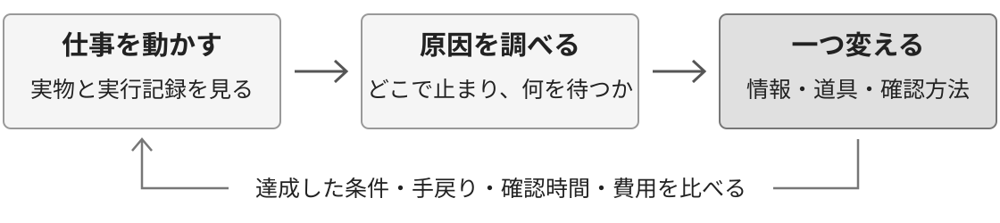

難易度や作業の種類が違う仕事を使い、補助を一つ変えた前後で結果を比べる。 同じ条件でも結果は揺れるので、複数回試し、一度の成功だけで効果を決めません。 モデルを替えたときも、繰り返していた失敗と、その対策が今も必要かを確かめます。

<strong>仕組みを増やした量より、任せた仕事が終わり、こちらの手戻りが減ったかを見る。</strong> 本書の「回せ」を、ハーネスの作り方と、作ったものを減らす判断にも使います。

<a href="https://www.anthropic.com/engineering/harness-design-long-running-apps">Anthropic · Harness design for long-running application development</a>

---

## 任せたあと、次に見る場所がわかるか

仕組みを改善する一方で、任せた自分には何が残るかも考えたい。 自分で書いた量だけで、学べたかを測る必要はないと思います。

AIが直した箇所を見て、最初の予想のどこが違ったかを考える。 「次はこの入力も見る」という判断が増えれば、任せた仕事からも学べます。

逆に、成果だけが残り、自分が何を見ればよいかはずっとわからないまま。 その状態では、任せる範囲を広げるための材料も増えません。

<strong>予想と結果を比べ、見落とした条件を一つ言葉にする。</strong> その条件を、次の確かめ方や任せ方へ反映する。

「この案を選んだ理由」を一文で残すことも試せます。 書けたことだけで理解したとはせず、別の条件でもその理由が通るかを確かめる。 全部を自分で作らなくても、次に疑う場所は増やせます。

---

## 次の改善は、仕事が待っている場所から

仕事が届いたあと、作る時間だけでなく、待った時間と差し戻しを見ます。 どこで止まり、何の情報や判断が足りなかったかを確かめます。

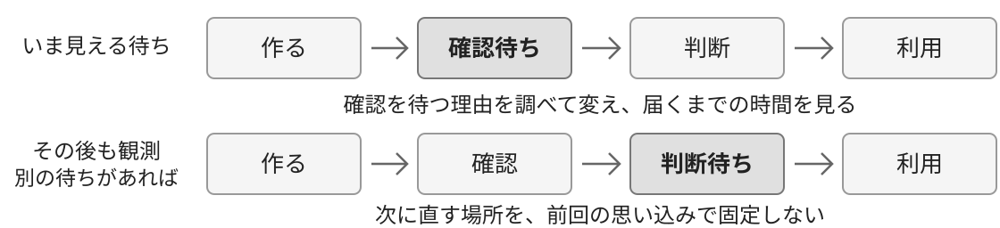

差分が大きく読み切れないなら、一回に確認する変更を小さくする。 根拠を探す時間が長いなら、結果へ辿れる資料を揃える。 確認できる量を越えるなら、同時に進める仕事の数も減らします。

<strong>いま待ちが生まれる条件を変え、使えるまでの時間が縮んだかを見る。</strong> 一つ解けると、別の場所で待ちが見えることもあります。 次に直す場所を、前回の思い込みで固定しません。

---

## やってわかったことを、次の一回へ戻す

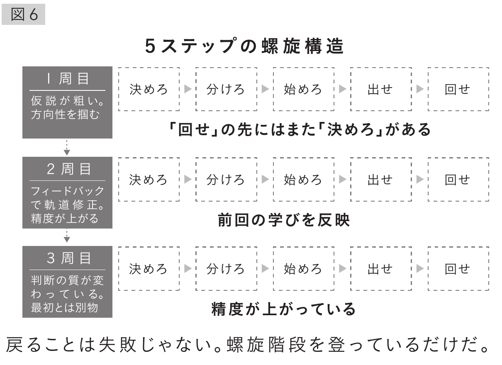

受け手に足りなかった材料。AIへ渡し忘れた前提。確認に時間がかかった理由。仕事を一回終えたから、次に直せる点が見えてきます。

<strong>その知識を持って、 もう一度「決めろ」へ。</strong>

必要な材料を終了条件へ入れる。一度に任せる量を変える。最初から使える確認方法を用意する。

回数を重ねるだけでは、よくなるとは限りません。わかったことを次の条件へ戻し、同じ手戻りや待ちが減ったかを確かめます。

『おい、とりあえず終わらせろ』図6

---

## 確認する人の時間を、無限に扱わない

確かめることや振り返ることを増やしても、最後に受け取る人の一日は長くなりません。 すべてに承認を挟めば、今度はその人が仕事を抱えることになります。 だから、何を人へ戻し、どこまでエージェントで終えるかも、結果を見て変えます。

条件と確認方法が揃い、実際の結果で確かめられる範囲は、完了の判定まで任せる。 条件の変更や優先順位の判断が必要なときに、理由と比較する材料を戻してもらいます。

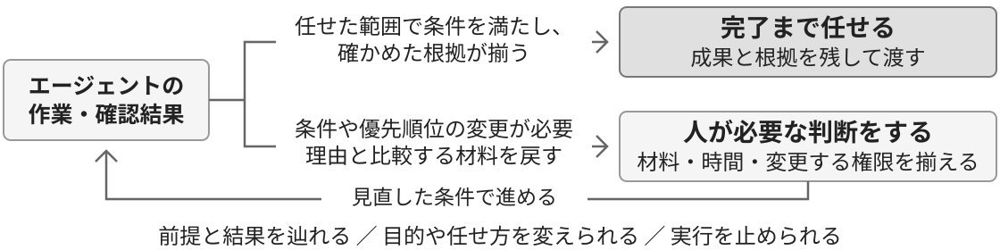

<strong>人が見ると決めたところには、材料と時間と権限を揃える。</strong> 回数を増やすだけでなく、何を決めるために見るかを絞り、 見逃しや待ち時間から、任せ方を見直します。

---

## エージェントに任せて、自分の仕事を終える

自分の仕事だと言える根拠は、自分が打った文字数だけではないと思います。 何を解決するかを選び、エージェントと作り、確かめ、相手へ渡す。 その結果で困ったことが起きたら、次の進め方を変える。

小さな仕事にも終わりを置き、確かめ方と、判断を戻してほしい条件を共有する。 任せた結果から、次の進め方も変える。 <strong>相手に渡せる成果と、次の自分やAIが引き継げる条件を残します。</strong>

<strong>自分がどれだけ操作したかに加えて、誰の仕事が進んだかを見たい。</strong> 任せたまま終えられたなら、それも自分たちの仕事の進め方が変わった成果です。

<strong>いま止まっている仕事を一つ選ぶ。 誰に何を渡せれば一回終えられるかを、エージェントと書いてみる。</strong> わからない所が残るなら、そこを調べる一歩から任せます。

一人で抱えて止まっていた仕事が、一つ相手に届く。 早く終えたあとの時間を、何に使うかも自分で選びたい。

---

## 「動けない自分」を、責める前に

<a href="https://www.diamond.co.jp/book/9784478124192.html">書籍の詳細</a> · ダイヤモンド社

あとがきには、<strong>「ここまでで確認させてください」</strong>と 言えるようになった変化を書きました。 途中でも見てもらえる形にして、必要な助言を求める。

<strong>何を終えればいいか、見えない。</strong> 第1・2章　完了の正体を知る。やることを絞る。

<strong>やることはあるのに、手が動かない。</strong> 第3・4章　動ける粒度と、始められる環境を作る。

<strong>見せるのが怖い。指摘がつらい。</strong> 第5・6章　出す怖さをほどき、反応を次へつなぐ。

全部を読んでから始めなくてもよい。 <strong>いま止まった場所から、一つ試してもらえたらうれしいです。</strong>

---

<!--
_backgroundColor: #0a1929
_color: white
_class: reading transition
-->

<strong>あなたが終わらせたものを、 誰かが待っている。</strong>

nwiizo『おい、とりあえず終わらせろ』あとがきより

AIと考え、作り、確かめて、相手が次へ進めるところまで渡す。 出してわかったことを残し、次の自分とAIが動きやすくなるようにする。

決めろ。分けろ。始めろ。出せ。回せ。

おい、エージェントを使って終わらせろ。

---

## 参考資料

<strong>nwiizo『おい、とりあえず終わらせろ』</strong> ダイヤモンド社、2026年 5ステップ、擬似完了感、他者的完了、60点、出す怖さ、フィードバック。

<strong>岡野原大輔『ヒトとAI』</strong> 岩波新書、2026年 理解、評価軸、仕事の再設計、指揮と統合、任せる範囲と注意の配分、 監査・変更・停止、人の有限性、選択と完了。

<strong>nwiizo「<a href="https://syu-m-5151.hatenablog.com/entry/2026/06/23/215158">ループエンジニアリングは、サイバネティクスの再発見だ</a>」</strong> 観測と目標の比較、停止条件、評価の範囲、任せたあとの学び。

<a href="https://www.diamond.co.jp/book/9784478124192.html">ダイヤモンド社 書籍情報</a> ／ <a href="https://www.iwanami.co.jp/book/b10170462.html">岩波書店 書籍情報</a>

