<!--
_backgroundColor: #0a1929
_color: white
_class: title dark
-->

# AI時代の「技術的負債」の変質 ー概念の終焉と再解釈、 エージェントと共に向かう先

2026/09/16 技術的負債に向き合うConference 2026 
@nwiizo · 12:00–12:40

---

## nwiizo

株式会社スリーシェイクで、 プロのソフトウェアエンジニアをやっているものです。

趣味は<strong>格闘技、読書、グラビア</strong>。 人生を通して、<strong>運動・睡眠・読書</strong>をきちんとやりたい。

技術書を訳すたび、わかることが1つ増え、 <strong>わからないことが3つ増えていく。</strong>

ブログ「<strong>じゃあ、おうちで学べる</strong>」。 X / GitHubも <strong>nwiizo</strong> です。

---

## 書籍を出しました

ダイヤモンド社 · 2026年 nwiizo 著 · <a href="https://www.diamond.co.jp/book/9784478124192.html">書籍の詳細</a> 書影：ダイヤモンド社

<strong>『おい、とりあえず終わらせろ』</strong> そうすれば「動けない自分」が変わるから

どこで止まっているかを言葉にして、 <strong>次に動けるところまで考える本です。</strong>

<strong>本日 9月16日（水）19:30から · オンライン開催</strong> Forkwell Library #133 に登壇します。

<strong>「おい、エージェントを使って終わらせろ」</strong> 書籍をもとに、エージェントと仕事を終わらせるための 判断や工夫をお話しします。

<strong>興味がある方は、ぜひ遊びに来てください。</strong> <a href="https://forkwell.connpass.com/event/405587/">イベント詳細・参加申込（connpass）</a>

---

## 目次

<strong>実装を速く作れるようになると、技術的負債は軽くなるのか。</strong> 作る費用、変更を確かめる負担、理解を得る過程は、同じようには変わりません。

<strong>1. 技術的負債の、何が変質するのか</strong> オニオンモデルの各層で、従来の理解とエージェントへの適用を分けて考える。

<strong>2. どの捉え方を終え、どう再解釈するのか</strong> 実装の修正費だけでは捉えきれない負担を見分け、対処と発生条件を見直す。

<strong>3. エージェントと、どんな開発へ進むのか</strong> 判断・検証・学習と、採用後の結果までを見据えて、開発の方向性を考える。

個々の解決策の導入手順や実装方法まで扱うには、40分では時間が足りません。 <strong>実践の詳しい話は、このConferenceのほかのセッションに譲ります。</strong> <a href="https://technical-debt-con.findy-tools.io/2026">Conferenceのプログラム</a>

---

## 技術的負債を、5つの層で捉える

Figure 1-1 より引用 技術的負債のオニオンモデル

<strong>技術</strong>：コードや設計に現れる問題。

<strong>トレードオフ</strong>：何を優先した選択か。

<strong>システム</strong>：判断を方向づける役割や評価。

<strong>経済・ゲーム理論</strong>：誰の手間が減り、 誰が負担を引き受けるか。

<strong>厄介な問題</strong>：目的・制約・解決の見方が、 関係者で異なる。

<strong>表面の問題から、その問題が生まれ、 残り続ける条件へ掘り下げるモデル。</strong> AIは、各層の費用や判断をどう変えるのか。

<blockquote>図：Andrew Richard Brown, <a href="https://doi.org/10.1007/979-8-8688-0264-5">Taming Your Dragon</a>, Apress, 2024, Ch. 1. © Dr. Andrew Richard Brown 2024。エージェントへの適用は本発表の考察。</blockquote>

---

## 技術の層：変更を重くする構造を見る

<strong>Technical Debt</strong>は、短期には都合のよい設計や実装が、 将来の変更を高コストにしたり、不可能にしたりする問題を指す。

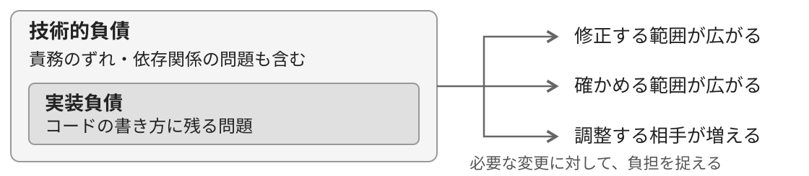

<strong>実装負債は、コードの書き方に残る技術的負債。</strong> 技術的負債には、責務のずれや依存関係など、設計に起因する問題も含まれる。

<strong>古さや好みではなく、どの変更に、どんな修正や検証の負担が生じるかを見る。</strong>

<blockquote>定義：<a href="https://drops.dagstuhl.de/entities/document/10.4230/DagRep.6.4.110">Dagstuhl Seminar 16162</a>, 2016, p. 112。分類：Ernst, Kazman &amp; Delange, <a href="https://mitpress.mit.edu/9780262542111/technical-debt-in-practice/">Technical Debt in Practice</a>, MIT Press, 2021。</blockquote>

---

## 修正の速さを、構造の改善につなげる

エージェントは、コードの修正、依存の調査、設計案の試作を支援できる。 実装を整える作業が速くなっても、同じ責務や依存を引き継げば、変更時の調整は残る。

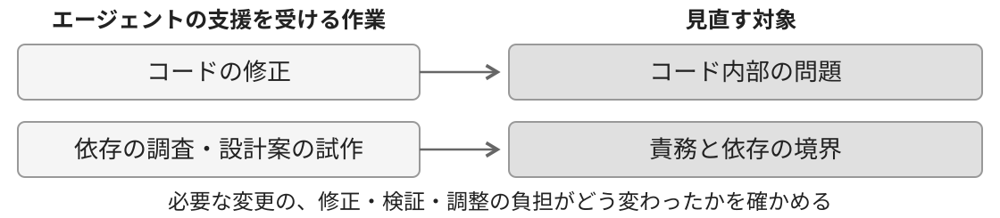

<strong>コードを整えることと、変更を妨げる設計を見直すことを区別する。</strong> 生成された量や差分の小ささだけでは、技術的負債が減ったとは判断できない。

必要な変更で、修正・検証・調整の範囲がどう変わったかを見る。 <strong>作業を速める力を、変更を重くする構造の見直しにも使いたい。</strong>

<blockquote>前頁の技術的負債の分類を踏まえた、本発表でのエージェントへの適用。</blockquote>

---

## トレードオフの層：今の速さと、将来の負担

技術的負債は、今の仕事を早く進めるために、将来の負担を引き受ける選択からも生まれる。 その選択は、限られた時間と情報のもとで、将来の負担をどう見積もるかに左右される。

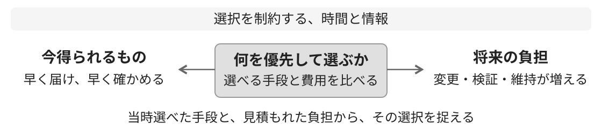

<strong>将来の負担があることだけで、そのときの選択が誤りだったとは言えない。</strong> 早く届けて確かめる必要と、後の変更を重くする費用を、当時の条件から捉える。

選んだ人の判断と、その人が何を選べる状況にいたかを、両方見る。

<blockquote>Brown, <a href="https://doi.org/10.1007/979-8-8688-0264-5">Taming Your Dragon</a>, Ch. 1・5。</blockquote>

---

## 変更の選択肢を、今の費用で見直す

調査・実装・修正を省力化できれば、以前は高すぎた変更を選べる可能性がある。 <strong>変わるのは、選択にかかる費用と、比較できる案の範囲。</strong>

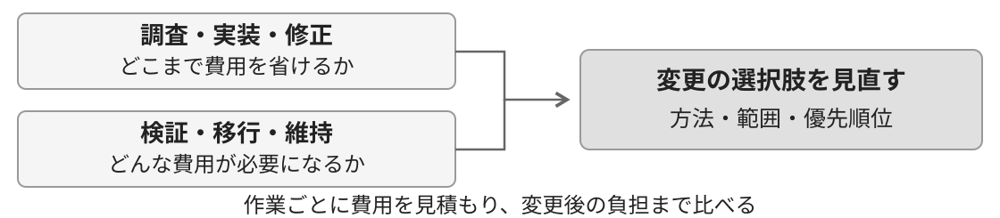

検証・移行・知識の維持にかかる費用まで、同時に消えるわけではない。 修繕・置き換え・維持のどれを選ぶかは、変更全体と、その後の負担まで比べて決める。

<strong>「高すぎて変えられない」という過去の判断を、今の費用で見直したい。</strong> 作れるものが増えたことと、作って維持する価値があることは、別に確かめる。

<blockquote>Brown, Taming Your Dragon, Ch. 1・5を踏まえた、本発表でのエージェントへの適用。</blockquote>

---

## システムの層：役割と評価が、選択を方向づける

人は組織の中で、役割ごとの目標・権限・時間の制約に応じて判断する。 その役割では合理的な選択でも、組織全体では維持しにくい構造を増やすことがある。

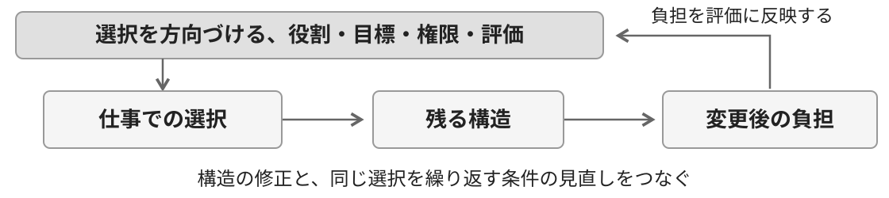

<strong>負債を直す活動と、負債を生み続ける仕事の進め方を、両方見る。</strong> 実際にかかった負担を目標や評価に反映しなければ、同じ選択を繰り返しやすい。

個人の注意だけに頼らず、何を優先し、誰が決め、結果をどう評価するかを見直す。

<blockquote>Brown, <a href="https://doi.org/10.1007/979-8-8688-0264-5">Taming Your Dragon</a>, Ch. 3・6。</blockquote>

---

## 実装の進捗から、採用後の結果まで評価する

実装を速めても、採用の権限や運用の責任は自動では変わらない。 生成した量だけを評価すると、理解や検証が追いつかない変更を増やす条件になりうる。

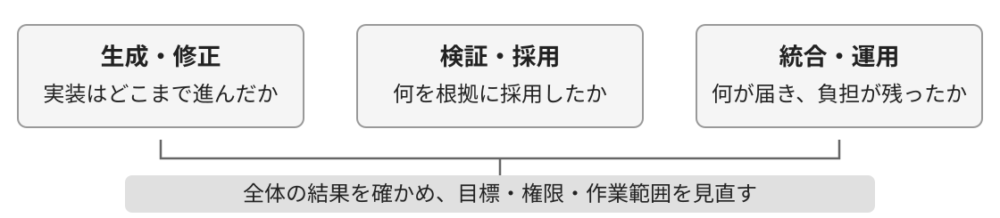

<strong>実装の進捗に加えて、採用した変更の結果と、維持する負担まで評価する。</strong> 誰が採用を決め、誰が運用し、問題が起きたら誰に判断を求めるかを決める。

エージェントを使って得た結果から、目標と役割の分け方も見直す。 <strong>作業を速くするだけでなく、何をよい仕事とするかも問われる。</strong>

<blockquote>Brown, Taming Your Dragon, Ch. 3・6を踏まえた、本発表でのエージェントへの適用。</blockquote>

---

## 経済の層：選ぶ人と、負担する人の関係を見る

経済・ゲーム理論の層では、選ぶ側の判断に含まれない、他の人への負担を見る。 ここでは、判断に関われない側へ費用が及ぶ問題を、<strong>負の外部性</strong>として捉える。

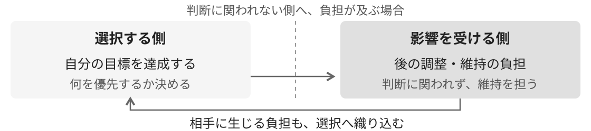

ある人や部門にとって都合のよい選択でも、必要な仕事は別の担当に発生することがある。 選ぶ側がその負担を考慮しなければ、自分たちの仕事を減らすために、全体の仕事を増やしてしまう。

<strong>誰が選び、誰が結果を引き受け、その費用を誰が負うかを見る。</strong> 選択した側にも後の負担が伝わるようにして、費用の配分と判断をつなぐ。

<blockquote>Brown, <a href="https://doi.org/10.1007/979-8-8688-0264-5">Taming Your Dragon</a>, Ch. 1・7。図は本発表で整理。</blockquote>

---

## 作る側と維持する側、両方の負担を見る

AIでコードを書く手間が減る人と、そのコードを理解・検証・運用する人が別だと、 作る側の手間は減っても、受け持つ側の仕事が増え、全体の負担が大きくなることがある。

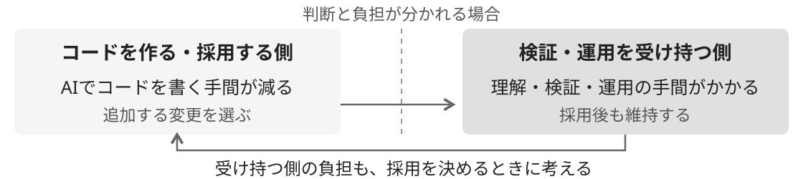

<strong>どの変更を採用するか決めるとき、理解・検証・運用の負担も含めて考える。</strong> 誰の仕事が減り、誰の仕事が増えるかを見て、担当や進め方を調整する。

実装で省けた時間や費用を、評価の整備や、理解を引き継ぐ仕事にも振り向ける。 <strong>一方の効率だけで、開発全体が軽くなったとは判断しない。</strong>

<blockquote>Brown, Taming Your Dragon, Ch. 1・7を踏まえた、本発表でのエージェントへの適用。</blockquote>

---

## 厄介な問題の層：何を解決とするかも、異なる

<strong>厄介な問題（Wicked Problem）</strong>では、関係者によって問題の捉え方が異なり、 何をよい解決とするかも一致しない。問題の理解と、対処の検討を行き来する。

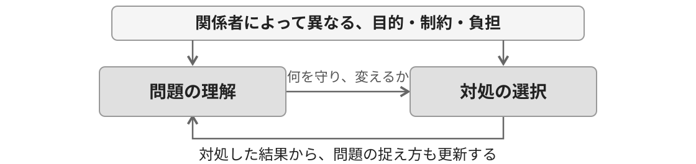

関係者ごとの目的や制約が違うため、技術的に動くことだけでは解決と決められない。 <strong>何を守り、何を変え、誰が負担を引き受けるかを確かめる。</strong>

共有理解は、全員の見方を同じにすることではない。違いを把握し、対処に必要な理解をつくる。

<blockquote>Brown, <a href="https://doi.org/10.1007/979-8-8688-0264-5">Taming Your Dragon</a>, Ch. 8。図は本発表で整理。</blockquote>

---

## わかりあえなさから、協働の条件を考える

宇田川元一 著 · 2019年 書影：NewsPicksパブリッシング <a href="https://publishing.newspicks.com/books/9784910063010">出版社の書籍紹介</a>

<strong>『他者と働く』</strong> 「わかりあえなさ」から始める組織論

同じ出来事でも、専門性や役割、組織文化が違えば、 何が問題で、何が正しいかの捉え方が変わる。

本書の<strong>ナラティヴ</strong>は、その人が状況を理解する前提や見方。 <strong>相手が理解していないと決めつける前に、自分の見方も問い直す。</strong>

技術的負債への対処でも、修正案の正しさだけで合意は決まらない。 何を守り、誰が負担するかを、関係者の立場から確かめたい。

<strong>見方の違いを捉え、共に進める条件をつくる。</strong> エージェントが整理した説明も、この対話の材料として使う。

<blockquote>宇田川元一『他者と働く』第1章・<a href="https://note.com/np_publishing/n/nb37914241b43">出版社による本文公開</a>を参照。技術的負債への接続は本発表の考察。</blockquote>

---

## エージェントの案を、合意のための材料にする

エージェントは、案を並べ、前提の違いや矛盾を調べる助けになる。 出力の中で話が整っていても、関係者が何を優先するかを決めたことにはならない。

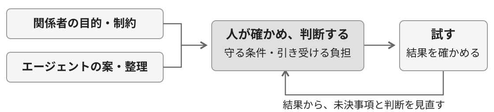

<strong>案を増やす支援と、何を引き受けるかの合意を区別する。</strong> 理由の整理を任せても、何を守り、誰が負担するかは、関係者が確かめて判断する。

決まっていない点を明らかにしておき、試した結果を次の判断に生かす。 <strong>エージェントの説明を、対話を進める材料として使いたい。</strong>

<blockquote>Brown, Taming Your Dragon, Ch. 8を踏まえた、本発表でのエージェントへの適用。</blockquote>

---

## AI時代の負債を、理解と判断理由から考える

5つの層のどの判断にも、変更の影響を理解し、選んだ理由をたどれることが要る。 <strong>理解や理由を引き継げない問題は以前からあり、AIやエージェントを使う開発でも起こる。</strong>

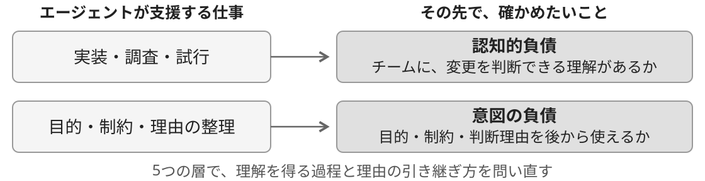

エージェントが実装や説明を作るとき、チームが理解を得る過程と、判断理由の残り方はどう変わるのか。 AIの支援で不足を補える場面もあれば、出力が揃っても、理解や理由が不足したまま進むこともある。

<strong>その変化を、認知的負債と意図の負債から考えたい。</strong> 実装・設計の問題や5つの層の判断と、これらの負債がどう影響し合うのかまで見ていく。

<blockquote>Brown (2024), Ch. 1／<a href="https://arxiv.org/abs/2603.22106v4">Storey (2026)</a>をもとに、本発表で再構成。</blockquote>

---

## 認知的負債は、共有理解に残る

<strong>Cognitive Debt：変更や運用に必要な、チームの共有理解が不足している。</strong>

変更の影響を判断できる人が限られると、その人への確認や、背景の調べ直しが増える。 説明を読んで納得できても、次の変更を自分たちで判断できるとは限らない。

全員が内部のすべてを知る必要はない。 <strong>担当する範囲で、何を変えるとどこへ影響するかを、根拠を使って確かめられる状態にしたい。</strong>

<blockquote>負債の定義：Storey, <a href="https://arxiv.org/abs/2603.22106v4">Triple Debt Model</a>, 2026。</blockquote>

---

## 認知的負債は、記録の量だけでは測れない

理由が文書に残っていても、誰も読まず、知っている人に聞いて済ませることはある。 その場では聞く方が早くても、根拠の探し方が共有されなければ、次の変更でも同じ人を頼る。

| どこで止まっているか | 変える対象 |
| --- | --- |
| 記録が読まれない | 変更箇所から根拠へたどる導線と、探して確認する時間 |
| 読んでも判断に使えない | 背景・適用条件の説明と、今の動作で確かめる機会 |
| 理解しても判断を任されない | 自分で決めてよい範囲と、他の人に判断を求める条件 |

<strong>判断が偏っていることだけから、文書不足や認知的負債とは決められない。</strong> 記録の不足、共有理解の不足、権限や仕事の進め方を、実際に止まった箇所から見分ける。

各自がAIの説明に納得しても、同じ前提を共有できたとは限らない。 <strong>同じ変更の影響を予測し合い、判断が分かれた理由を、記録と実際の動作から確かめる。</strong>

<blockquote>Storey, <a href="https://arxiv.org/abs/2603.22106v4">Triple Debt Model</a>, 2026；Brown, Taming Your Dragon, Ch. 8・11。</blockquote>

---

## 意図の負債は、判断のよりどころに残る

<strong>Intent Debt（意図の負債）</strong>は、目的・制約・判断理由の記録が欠けたり古くなったりして、 人もエージェントも、変更のよりどころとして使えない状態を指す。

現在の動作が分かっても、なぜ残したのか、どの条件なら変えてよいかまでは分からない。 理由が使えなければ、必要性を調べ直したり、不要になった制約まで引き継いだりする負担が増える。

<strong>AIが補った理由は、確認するまで推測として扱う。文章が埋まっても、判断の根拠が揃ったとは限らない。</strong> 目的・優先順位・適用条件を残し、未決事項には、誰が何を確かめて決めるかを添える。 担当者が覚えているだけでなく、次に変更する人が、維持と見直しの判断に使えるようにする。

<blockquote>Storey, <a href="https://arxiv.org/abs/2603.22106v4">Triple Debt Model</a>, 2026；Addy Osmani, <a href="https://www.oreilly.com/radar/the-intent-debt/">The Intent Debt</a>, 2026。要約。</blockquote>

---

## 意図の負債は、意図的に選んだ負債とは違う

<strong>Deliberate Debt</strong>は、負債を認識して引き受けること。慎重な判断だったかとは別の軸になる。 <strong>Intent Debt</strong>が問うのは、目的・制約・判断理由を、後から使えるかどうか。

意識して引き受けた負債でも、理由と適用条件を引き継げなければ、意図の負債は残る。 <strong>負債だと分かって選んだかと、その理由を後から使えるかは、別々に確かめる。</strong>

<blockquote>Martin Fowler, <a href="https://martinfowler.com/bliki/TechnicalDebtQuadrant.html">Technical Debt Quadrant</a>, 2009；Storey, <a href="https://arxiv.org/abs/2603.22106v4">Triple Debt Model</a>, 2026。</blockquote>

---

## すべての負債は、互いに影響する

認知的負債と意図の負債は、実装・設計の問題への対処だけでなく、5つの層すべての判断に関わる。 <strong>構造が複雑になるほど理解や理由の照合が難しくなり、理解や理由を失うほど構造を変えにくくなる。</strong>

優先順位・役割や評価・費用の分担・関係者の目的も、負債が生まれ、残る条件になる。 コードを直しても、その条件が同じなら、同じような負債が再び生まれることがある。

<strong>AIやエージェントは、このつながりのどこを軽くし、どこに負担を残すのか。</strong>

<blockquote>Brown (2024), Ch. 1・6–8／<a href="https://arxiv.org/abs/2603.22106v4">Storey (2026)</a>をもとに、本発表で再構成。</blockquote>

---

## AIで、負債の増え方と減らし方が変わる

構造・共有理解・判断理由まで掘り下げると、AIで何が楽になり、どこに負担が増えるかが見えてくる。 <strong>変わるのは作業の費用だけでなく、確認する変更の量と、人が理解を深める過程。</strong>

| 負債 | 減らすために使えること | 増えうる条件 |
| --- | --- | --- |
| 技術的負債 | 実装負債の修正、設計・境界案の試作 | 古い責務や依存を引き継ぎ、実装を増やす |
| 認知的負債 | 構造の説明、影響調査、反例の検討 | 人が試して理解を確かめる機会が抜ける |
| 意図の負債 | 目的・制約・判断理由の草案と更新 | 推測した理由を確かめず、決定事項として残す |

実装と説明が先に揃っても、チームが影響を判断できるようになるまでには、検証と学習が要る。 変更量に応じてこの時間も確保し、生成結果を使って、自分たちの理解を確かめたい。

<strong>どの負担が減り、どの負担が増え、誰が引き受けるかを問いたい。</strong>

<blockquote>Storey, <a href="https://arxiv.org/abs/2603.22106v4">Triple Debt Model</a>, 2026をもとに、エージェントの利用条件を本発表で整理。</blockquote>

---

## 「概念の終焉」を、どこまで言えるか

技術的負債は、以前から判断や組織と関わっていた。 <strong>将来の変更を重くする構造を、今の選択と結びつける考え方は、AI時代にも必要になる。</strong>

| 終えたい捉え方 | 捉え直す対象 |
| --- | --- |
| 実装の修正費だけで、負債全体の重さを測る | 調査・検証・調整・移行・維持までの費用 |
| コードが改善すれば、理解や理由も回復したとみなす | 構造・共有理解・判断理由、それぞれの状態 |
| 既存コードを直し続けることだけを返済とする | 修繕・置き換え・廃止と、発生条件の見直し |

<strong>この発表で終えたいのは、技術的負債をコードの修繕だけで考えること。</strong> 技術的負債という考え方は今も必要だ。AIで実装が速くなると、修繕だけでは解消しない負担が目立つ。

実装の修正が速くなっても、理解や理由の不足による再調査は残りうる。

<blockquote>Brown, <a href="https://doi.org/10.1007/979-8-8688-0264-5">Taming Your Dragon</a>, Ch. 1・6・7とStoreyの議論を踏まえた、本発表の立場。</blockquote>

---

## 再解釈：どこに負担があり、なぜ残るのか

変更に必要な検証や学習を、すべて負債とは呼ばない。 <strong>構造の問題や理解・理由の不足によって、余分にかかる調査や手戻りを見る。</strong>

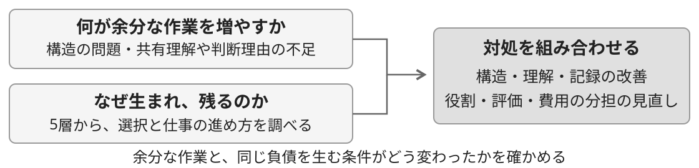

構造を直す。理解を確かめる。使える理由を残す。それぞれに必要な対処がある。 そのうえで、目標・権限・費用配分が、同じ負担を繰り返し生む状態も変える。

<strong>必要な変更で、どの負担を減らせるか。そのための対処に、どれだけかかるか。</strong> 両方を比べ、改善の優先順位を決め直す。

<blockquote>Brown, <a href="https://doi.org/10.1007/979-8-8688-0264-5">Taming Your Dragon</a>, Ch. 1・6・7・12を踏まえた本発表の整理。</blockquote>

---

## 対処が進まない理由を、5つの層へたどる

直すべき構造が分かっても、修正に着手できるとは限らない。 <strong>技術の問題から出発し、選択・役割・費用・目的のどこが対処を止めているかを調べる。</strong>

| 層 | 対処を難しくする条件 | 見直す対象 |
| --- | --- | --- |
| 技術 | 修正の影響が広く、確かめにくい | 責務・依存と、変更を検証する仕組み |
| トレードオフ | 今の進捗を優先し、後の負担を考慮できない | 変更の必要性と、対処・維持の費用 |
| システム | 直す時間や権限が、担当に与えられていない | 目標・役割・評価・判断の権限 |
| 経済・ゲーム理論 | 選ぶ側の判断に、維持する側の負担が入らない | 後の負担を伝える方法と、費用の分担 |
| 厄介な問題 | 何を守り、何を解決とするかが揃っていない | 目的・制約・未決事項と、合意する範囲 |

どの層でも、理解が揃わず、判断理由が使えなければ、調査や合意を繰り返す負担が増える。 <strong>何が対処を止めているかに応じて、構造の修正・共有理解の確認・理由の更新を組み合わせる。</strong>

<blockquote>Brown, Taming Your Dragon, Ch. 1・5・6・7・8を踏まえた、本発表での対処の整理。</blockquote>

---

## 対処を選ぶ：負担が生じるところと、全体の費用

| 負担が生じるところ | 対処の選択肢 | 確かめること |
| --- | --- | --- |
| 実装内部の構造 | 修繕・再生成・廃止 | 必要な動作、検証・移行・保守の費用 |
| 責務や依存の境界 | 設計と担当範囲の見直し | 変更の波及、調整と運用の負担 |
| 共有理解と判断理由 | 共同での検証、記録と導線の更新 | 根拠を使って、次の変更を判断できるか |
| 負債を生む仕事の進め方 | 目標・権限・費用の分担を見直す | 維持する側の負担を、採用時に考慮できるか |

<strong>再生成</strong>は、必要な振る舞いを保つよう、対象の実装を生成し直すこと。 実装負債への選択肢の一つになる。どの対処も、調査・検証・移行・維持まで含めて比べる。

変更の必要性が低い範囲は、負担を把握して維持する判断もある。 <strong>必要な変更を妨げる問題と、それを生む仕事の進め方に手を入れたい。</strong>

---

## 再生成は、実装負債を終える一つの手段

今のコードには、業務の条件だけでなく、障害や運用から学んだことも埋まっている。 <strong>必要な知識を実装の外でも使える形にして、コードを替える選択肢を持ちたい。</strong>

引き継ぐのは、利用者や周辺システムが頼る振る舞いと、それを確かめる根拠。 失敗時の動作・順序・データの扱いまで捉え、旧実装の動作をすべて無条件には保存しない。

<strong>利用・データ・運用が旧実装へ依存しなくなれば、旧実装内だけの負債は廃止で終えられる。</strong> 引き継いだ設計の問題や理解・理由の不足は残る。移行用の処理にも、廃止までの維持費がかかる。

---

## コードを整えても、境界のずれは残る

<small>Figure 8.2 より引用 一緒に変える部品の距離と、調整の負担 実測した比例関係ではなく、関係を示す概念図。</small>

同じルールを変えるたびに、複数のサービスやチームを動かす必要があると、<strong>仕様のすり合わせやリリース順序の調整</strong>も増える。

業務ルールの変更が増えれば、調整の負担も増えやすい。コードが同じでも、担当チームや仕事の進め方が変われば、以前の責任の分け方が合わなくなる。

同じ理由で変わる処理は、同じ部品や担当範囲へ集めることを検討する。別々に変わる処理は、相手の内部構造に依存せず使えるようにする。

依存の調査や試作にエージェントを使い、処理の配置も見直したい。<strong>古い分け方を固定して書き直せば、同時に変更する負担まで引き継いでしまう。</strong>

<blockquote>Vlad Khononov, <a href="https://www.pearson.com/en-us/subject-catalog/p/balancing-coupling-in-software-design-successful-software-architecture-in-general-and-distributed-systems/P200000000372">Balancing Coupling in Software Design</a>, Addison-Wesley Professional, 2024, Figure 8.2。原図は改変なし。変化に応じた境界の見直しは第11章も参照。</blockquote>

---

## 生成の速さと、変更が届く速さを分ける

修正や設計の見直しで作った候補は、検証・採用・統合を経て、利用者へ届く。 判断・検証・移行が滞れば、実装を速めても、変更全体にかかる時間は縮まりにくい。

<strong>評価へ送る候補が、採用・却下を判断できる数を上回り続ければ、判断待ちは増える。</strong>

<strong>同時に進める変更を絞り、評価や統合が追いつくように整える。</strong> 待ちがあるだけで負債とは決めず、変更量と、繰り返し判断を妨げる原因を分けて調べる。

---

## エージェントとどんな開発へ進むか

判断待ちを減らすには、生成量の調整と、判断に必要な条件・根拠の準備を一緒に進める。 <strong>何を作り、どう採用し、利用者に何が起きたかまでを、一続きの仕事として扱いたい。</strong>

調査・実装・評価のどこにエージェントを使うかを、作業ごとに決める。 <strong>チームは、自動で進める条件と、人が判断する条件を定め、運用の結果から見直す。</strong>

すべての操作を人が承認する必要はない。 <strong>採用の根拠を確かめ、問題があれば変更・停止できる仕事の進め方をつくる。</strong>

---

## 事業・ソフトウェア・チームを、同じ変更へ揃える

同じ変更でも、事業・開発・運用では、期待する成果と避けたい負担が異なる。 <strong>何を変える価値があり、どこを変え、誰が運用まで担うかを、一緒に考えたい。</strong>

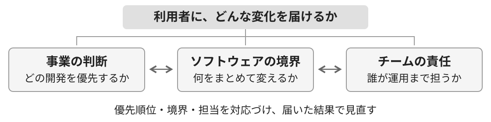

生成の費用が下がっても、すべてを自作する理由にはならない。 <strong>どこを自社の強みにし、どこは既存の仕組みを使うかを、保守や依存の負担も含めて選ぶ。</strong>

関係するチームと条件や負担を確かめ、優先順位・実装の境界・担当を一緒に見直す。 エージェントは、その範囲の調査・試作・実装を支える。

<blockquote>Kaiser, <a href="https://www.oreilly.com/library/view/architecture-for-flow/9780137392759/">Architecture for Flow</a>, Ch. 6・8・12。事業・設計・チームの整合を参照。</blockquote>

---

## 変更を止める依存は、コードの外にもある

どの部品に触れるかに加えて、誰の知識と、どの作業の完了を待つかを見る。 実装が速くなっても、担当間の受け渡しで、変更全体が滞ることがある。

| 依存の種類 | 変更が止まる構造 | 見直す対象 |
| --- | --- | --- |
| アーキテクチャ | 同じ変更が、複数の部品とチームへ波及する | 業務上の境界、データと動作の依存 |
| 専門知識 | 特定の人やチームの理解がないと進めない | 必要な知識の探し方、共同で学ぶ機会 |
| 作業 | 他の担当の作業完了を待たないと進めない | 担当範囲、作業の順序、受け渡しの回数 |

<strong>必要な連携を残しながら、日常の変更で繰り返す待ちを減らす。</strong> 一時的な共同作業で理解を揃え、安定した共通機能は自分たちで利用できる形へ整える。

依存の有無だけで負債とせず、変更を妨げる構造と、その費用から対処を選ぶ。

<blockquote>Kaiser, <a href="https://www.oreilly.com/library/view/architecture-for-flow/9780137392759/">Architecture for Flow</a>, Ch. 5・6。依存の3分類は同書で紹介するDeGrandisとDemariaの整理。</blockquote>

---

## チームの境界は、理解して運用できる範囲で決める

関連する業務ルールと変更理由をまとめ、その範囲を継続して担当するチームを決める。 業務の理解・変更の判断・運用を誰が担い、他のチームと何を相談するかを明らかにする。

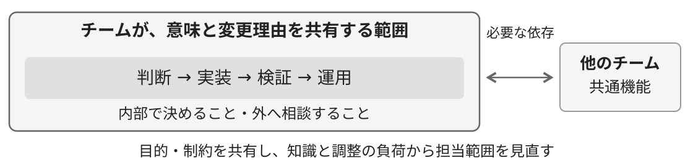

<strong>認知負荷は、仕事で同時に扱う情報や判断の負荷。認知的負債は、共有理解の不足。</strong> 理解済みでも担当範囲が広すぎれば負荷は高い。説明を増やすだけでなく、範囲や依存を見直す。

境界を分けても、他のチームへの影響は残る。互いの目的・制約と、相談する条件を共有する。 エージェントがコードを扱える量と、チームが結果を引き受けられる範囲は別に決める。

<blockquote>Kaiser, <a href="https://www.oreilly.com/library/view/architecture-for-flow/9780137392759/">Architecture for Flow</a>, Ch. 3・5・6。認知的負債との区別とエージェントへの適用は本発表で整理。</blockquote>

---

## 生成の前に、守る条件と変える範囲を決める

関係者が何を守り、どの負担を避けたいかを持ち寄り、今回守る動作と、変えてよい範囲を決める。 <strong>決めた条件を保って内部を替える仕事と、責任の分け方自体を変える判断を分ける。</strong>

コードから推測した理由は、当時の判断理由とは限らない。 <strong>事実・推測・今回の決定を分け、これから守る条件を関係者と確かめる。</strong>

守る条件は、文章に加えて、検査する項目や操作権限にも反映する。 <strong>未決事項に触れたら、影響する処理を保留し、決める人へ確認する。</strong>確認後は記録と実行条件を揃える。

---

## 評価の根拠を、生成結果の外から確かめる

同じ未確認の前提から仕様・実装・テストを作ると、誤りまで一致することがある。 <strong>守る条件は、生成結果同士の整合に加え、関係者や実際の利用に照らして確かめる。</strong>

修正でも置き換えでも、必要な動作・性能・失敗時の条件を、確かめた基準で評価する。 実装固有の検査は構造に合わせ、運用で見つかった評価の抜けも補う。

<strong>候補に合わせて期待値を動かさず、評価を変える場合は、その理由を確かめる。</strong>

---

## 今回の作業に渡す情報と、残しておく知識を分ける

<strong>コンテキスト</strong>は、エージェントが作業中に参照する情報。 目的・判断理由・設計・評価の記録から、今回の変更に必要な範囲を選び、現在の状態と合わせて渡す。

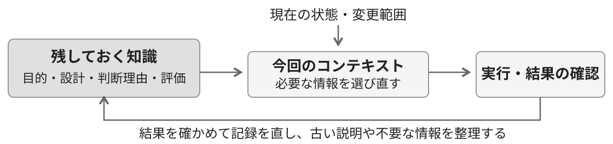

会話の中で誤りを直しても、共有の記録が古いままなら、次の作業は同じ誤った前提から始まりうる。 <strong>修正したコードに加え、判断理由と評価も更新し、次に参照する箇所へ反映する。</strong>

会話を丸ごと残すだけでは、途中の推測と採用した判断が混ざる。 <strong>何を根拠に、誰の目的・制約を踏まえて選び、何が未決なのかを残す。</strong> 有効な条件も添え、情報を渡せたかに加えて、次の判断で使えたかまで確かめる。

---

## どこまで自動で進め、どこで人が判断するか

エージェントが作業を進めてよい条件と、人に判断を戻す条件を、先に決める。 <strong>その範囲は、エージェントの能力に加え、チームが結果を確かめ、失敗に対処できるかで決めたい。</strong>

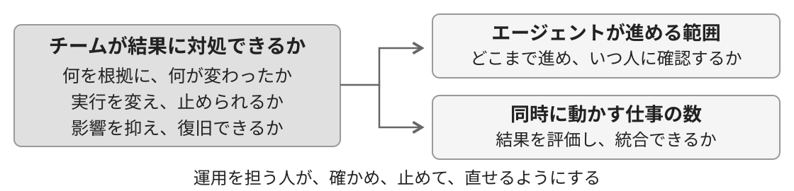

必要な動作と影響を確かめられる範囲から自動化する。内部を全部説明できることを条件にはしない。 ただし、失敗に気づけるか、影響の拡大を止められるか、復旧できるかは、実行前に確かめる。 コードを戻しても、データや外部へ起きた変化は残る。復旧の手段は、その範囲まで用意する。

<strong>運用を担う人には、判断の根拠と実行結果を追える記録、止める権限、確認する時間が要る。</strong> 承認者の名前を置くだけでは、問題へ対処する力は増えない。責任を担える条件まで、開発側で整えたい。 同時に動かす仕事の数も、結果を評価し、統合できる量から別に決める。

---

## 設計の方針を、毎回確かめる条件にする

決めた責務や依存の境界を、変更ごとに確かめる。 そのために、重要な設計上の性質を検査する<strong>フィットネス関数</strong>を用意する。

依存は変更時、組み合わせた動作は統合時、性能や安定性は実際の環境でも確かめる。 データの整合・アクセス制御を含め、<strong>必要な条件を同時に満たせるか</strong>を見る。

<strong>必要な動作・性能・設計上の条件を満たせるなら、最初に選んだ構造も見直せる。</strong> 実装を直すことと、合格の条件を変えることは区別する。条件を変えるなら、その理由を確かめる。

<blockquote>Neal Ford et al., <a href="https://www.oreilly.com/library/view/building-evolutionary-architectures/9781492097532/">Building Evolutionary Architectures, 2nd Edition</a>, O'Reilly, 2022。</blockquote>

---

## エージェントが書いても、理解する仕事は残る

検査に合格したコードでも、次の変更をチームが判断できるかは別に確かめる。 コードを書く過程には、曖昧な条件を決め、予想と違う動作を調べる機会がある。 エージェントが実装を進めると、その試行錯誤をチームが共有しないまま、完成したコードを受け取れる。

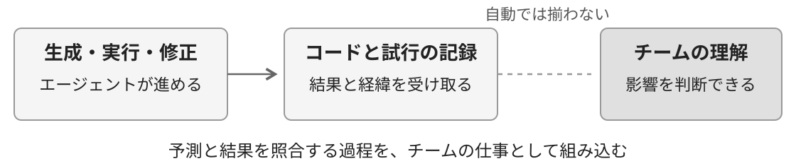

説明への納得だけでは、何を変えると壊れるか、前提が変わったらどう直すかを確かめたことにはならない。 自分で書いても理解が十分とは限らない。<strong>書いた人にかかわらず、変更を判断できるかを確かめたい。</strong>

<strong>省けた実装作業の中に、理解を得ていた機会まで含まれていないか。</strong> エージェントを調査や試行にも使い、コードを作る速さと、チームが理解を得る過程をつなぎ直す。

---

## 食い違いから、互いの判断の前提を確かめる

各自がAIの説明に納得しても、同じ前提から判断しているとは限らない。 <strong>食い違いは、知識の不足だけでなく、役割や優先順位の違いからも生まれる。</strong>

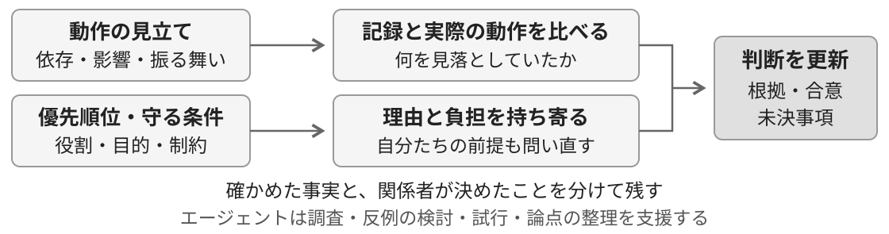

何が変わるはずかを持ち寄り、記録と実際の動作で確かめる。全員の予測が同じでも、検証は省かない。 何を守り、どの負担を引き受けるかは、相手の理由を聴き、自分たちの優先順位も問い直す。

見方の違い自体を認知的負債とは呼ばない。<strong>影響と、合意した条件・未決事項を共有し、変更を判断できる状態へ。</strong> 共同で確かめる時間も開発の仕事に含め、特定の人への依存や、同じ背景を調べ直す負担を減らす。

---

## 構造・理由・評価を、同じ対象へ結びつける

共同で確かめた依存・判断理由・採用条件を、対応する実装や担当範囲からたどれるようにする。 採用した実装から、使った仕様・設計・生成条件・評価結果へ戻れる記録も保つ。

技術的負債には、変更を妨げる依存関係を見直す。認知的負債には、予測と実際の動作を比べる。 意図の負債には、判断理由と、その判断が有効な条件を更新する。

<strong>運用で直したことは、理由を記録し、次の変更を確かめる評価項目にも加える。</strong> コードだけに修正を残すと、後の変更で同じ問題が起きかねない。次の判断で根拠を使える形にする。

---

## 運用の結果から、次の改善と作業範囲を決める

<strong>採用を決めたら、実際に使われてどうなったかまで確かめたい。</strong> 利用者に起きた変化と、調査・調整・検証・運用でかかった負担を、次の判断に生かす。

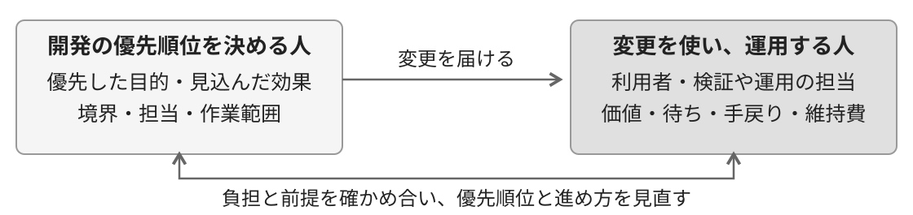

生成量だけでは、変更の流れが改善したとは言えない。待ち・手戻り・維持費まで見る。 解消した詰まりと、新たに現れた詰まりを見分け、構造や仕事の進め方を選び直す。

<strong>作る側と使う側・運用する側で、結果の受け止め方と、実際にかかった負担を確かめ合う。</strong> 決めた側の前提も問い直し、目的・優先順位・費用の分担・担当範囲、エージェントの実行条件を見直す。

---

## 技術的負債の変質を、開発の変化へつなげる

<strong>実装の費用が下がっても、次の変更を判断し、問題に対処できる状態は、自動では手に入らない。</strong> 構造・理解・判断理由と、それらを更新する仕事の進め方まで含めて、技術的負債を考えたい。

<strong>残した理由が次の判断に使われ、見つけた問題が次の検証で確かめられる開発へ。</strong> 互いの立場から前提を問い直し、変更の影響を記録と実際の動作で確かめる。 その根拠を残し、人が替わっても、判断と検証を続けられるようにする。

エージェントと、変更を届けながら学び続ける。その可能性に、かなり期待しています。

---

<!--
_backgroundColor: #0a1929
_color: white
_class: title dark
-->

# ありがとうございました

### 判断と学習を、次の変更へつなぐ

@nwiizo 
株式会社スリーシェイク

---

## 参考文献 · 負債の定義と意思決定

<a href="https://doi.org/10.1007/979-8-8688-0264-5">Taming Your Dragon: Addressing Your Technical Debt</a> Andrew Richard Brown · Apress · 2024 第1・3・5・6・7章：オニオンモデル、負債の発生条件、トレードオフ、組織と外部性。 第8・11・12章：共有理解と問題への対処。Figure 1-1を引用。エージェントへの適用は本発表の考察。

<a href="https://drops.dagstuhl.de/entities/document/10.4230/DagRep.6.4.110">Managing Technical Debt in Software Engineering</a> Paris Avgeriou et al. · Dagstuhl Seminar 16162 · 2016

<a href="https://mitpress.mit.edu/9780262542111/technical-debt-in-practice/">Technical Debt in Practice</a> Neil Ernst, Rick Kazman, Julien Delange · MIT Press · 2021。実装負債と設計・アーキテクチャの負債。

<a href="https://martinfowler.com/bliki/TechnicalDebtQuadrant.html">Technical Debt Quadrant</a> Martin Fowler · 2009。負債を意図的に引き受けたかという軸。

---

## 参考文献 · 認知的負債と意図の負債

<a href="https://arxiv.org/abs/2603.22106v4">From Technical Debt to Cognitive and Intent Debt: Rethinking Software Health in the Age of AI</a> Margaret-Anne Storey · 2026 · arXiv v4。Triple Debt Modelの提案。

<a href="https://margaretstorey.com/blog/2026/02/09/cognitive-debt/">How Generative and Agentic AI Shift Concern from Technical Debt to Cognitive Debt</a> Margaret-Anne Storey · 2026-02-09

<a href="https://www.oreilly.com/radar/the-intent-debt/">The Intent Debt</a> Addy Osmani · O'Reilly Radar · 2026-08-14

---

## 参考文献 · 構造と変更の評価

<a href="https://www.oreilly.com/library/view/architecture-for-flow/9780137392759/">Architecture for Flow</a> Susanne Kaiser · Addison-Wesley · 2025 第3・5・6・8・12章：事業・ソフトウェア・チームの整合、依存と認知負荷、変更と学習の流れ。

<a href="https://www.oreilly.com/library/view/building-evolutionary-architectures/9781492097532/">Building Evolutionary Architectures, 2nd Edition</a> Neal Ford, Rebecca Parsons, Patrick Kua, Pramod Sadalage · O'Reilly · 2022 重要な性質を確かめながら構造を変える。

<a href="https://www.pearson.com/en-us/subject-catalog/p/balancing-coupling-in-software-design-successful-software-architecture-in-general-and-distributed-systems/P200000000372">Balancing Coupling in Software Design</a> Vlad Khononov · Addison-Wesley Professional · 2024 変更の結びつき、境界をまたぐ調整。Figure 8.2を引用。

---

## 参考文献 · エージェントとの開発と学習

<a href="https://www.oreilly.com/library/view/agentic-engineering/0642572392291/">Agentic Engineering</a> Addy Osmani · O'Reilly · Early Release 第1・2・4・5章：開発全体の反復、作業範囲と検証、コンテキスト、仕様。

<a href="https://www.oreilly.com/library/view/regenerative-software/0642572383954/">Regenerative Software</a> Chad Fowler · O'Reilly · Early Release 第1〜4章：実装をまたいで残す知識、置き換えと廃止の条件、運用からの学習。

<a href="https://c2.com/doc/oopsla92.html">The WyCash Portfolio Management System</a> Ward Cunningham · OOPSLA '92 · 1992。技術的負債の比喩を述べた原文。

<a href="https://hillbig.github.io/human-and-ai/">ヒトとAI</a> 岡野原大輔 · 岩波新書 · 2026 第8・10・21章：理解の複数の観点と、知識を共有・検証・更新する学習。 第15〜18・20・23章：判断と実行、確認・変更・停止、明示する条件と残る不確実さ。

