<!--
_backgroundColor: #0a1929
_color: white
_class: title dark
-->

# AI時代の「技術的負債」の変質 ー概念の終焉と再解釈、 エージェントと共に向かう先

2026/09/16 技術的負債に向き合うConference 2026 
@nwiizo · 12:00–12:40

---

## nwiizo

株式会社スリーシェイクで、 プロのソフトウェアエンジニアをやっているものです。

趣味は<strong>格闘技、読書、グラビア</strong>。 人生を通して、<strong>運動・睡眠・読書</strong>をきちんとやりたい。

技術書を訳すたび、わかることが1つ増え、 <strong>わからないことが3つ増えていく。</strong>

ブログ「<strong>じゃあ、おうちで学べる</strong>」。 X / GitHubも <strong>nwiizo</strong> です。

---

## 目次

<strong>1. 負債は、実装・理解・意図の関係に残る</strong> 3つの負債の違いと、AI以前から続く問題を捉える。

<strong>2. AIが変える、コストと学習の経路</strong> 実装の省力化が、知識の蓄積や改善の優先順位にどう影響するか。

<strong>3. 判断と検証を、実装につなぐ</strong> 任せる範囲、実行環境、仕様・情報・図を、一続きの開発として設計する。

<strong>4. 変更し続けられるアーキテクチャを育てる</strong> 評価と運用から学び、修繕・再生成・境界の見直しを選べるようにする。

---

## 実装を速く作れるなら、何に投資するか

実装の費用が変われば、以前は高すぎた変更も選択肢に入る。 そこで、<strong>何を作るか決め、結果を確かめ、次の変更へ知識を残す仕事</strong>が効いてくる。

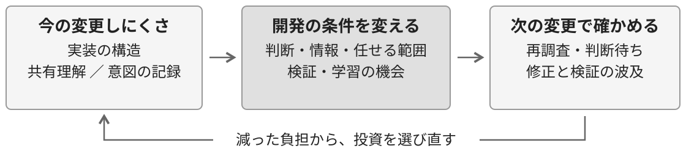

<strong>技術的負債を、直す箇所の一覧から、次の変更を妨げる関係へ捉え直したい。</strong> どこで判断が止まり、何を調べ直し、何を確かめられないのか。その違いから対処を選ぶ。

エージェントを使って、その場の実装と、次の仕事が進む条件を一緒に改善する。 再生成も、この開発の中で選べる方法の一つとして扱います。

---

## 技術的負債は、将来の変更を重くする

<strong>Technical Debt</strong>は、短期には都合のよい設計や実装が、 将来の変更を高コストにしたり、不可能にしたりする問題を指す。

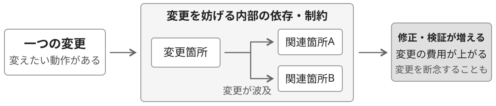

見る対象は、保守や進化を妨げる内部の構造。 古さや好みだけでなく、<strong>どの依存や制約が、どの変更を難しくするか</strong>を見る。

理解が深まれば、以前は妥当だった設計の制約にも気づく。 その理解に実装を追いつかせる仕事も、技術的負債への対処に含まれていた。

<blockquote><a href="https://drops.dagstuhl.de/entities/document/10.4230/DagRep.6.4.110">Dagstuhl Seminar 16162</a>, 2016, p. 112；<a href="https://c2.com/doc/oopsla92.html">Cunningham, The WyCash Portfolio Management System</a>, 1992。要約。</blockquote>

---

## 依存の強さだけでは、変更の重さは決まらない

部品同士が相手の内部構造や業務ルールを前提にすると、 その前提の変更が、利用する側の変更も必要にする。

| 見る観点 | 変更を重くする仕組み |
|---|---|
| 結びつきの強さ | 相手について多くを前提にするほど、一緒に変える理由が増える |
| 調整する距離 | コード・配布・チームの境界をまたぐほど、同時変更の調整が増える |
| 前提の変わりやすさ | 頻繁に変わる前提に依存するほど、調整を繰り返す |

<strong>頻繁に変わる前提を、調整しにくい相手と共有していないか。</strong> 同じ結びつきでも、事業やチームの条件が変われば、負担は変わる。

ここでの「共有」は、部品同士が持つ依存の話。 次に見る、<strong>人のあいだで理解を共有できているか</strong>とは、分けて考える。

---

## 認知的負債は、共有理解に残る

<strong>Cognitive Debt：実装の変化に、チームの共有理解が追いついていない。</strong>

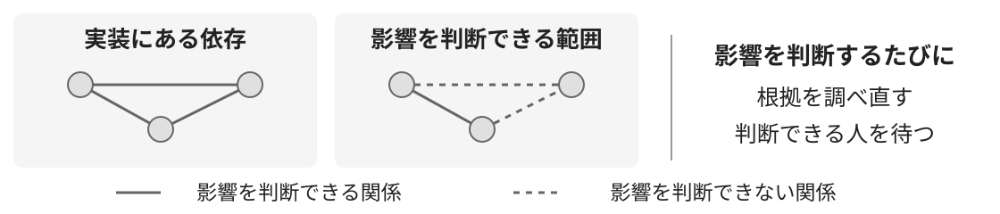

コードが残っていても、変更の影響を説明できる人が限られれば、 判断はその人を待つ。引き継げなければ、次の人は調査をやり直す。

全員にすべてを覚えてもらうことには、無理がある。 <strong>必要な知識へたどり着き、説明を確かめ合える状態</strong>を維持したい。

<blockquote>Margaret-Anne Storey, <a href="https://arxiv.org/abs/2603.22106v4">From Technical Debt to Cognitive and Intent Debt</a>, 2026。定義の要約。</blockquote>

---

## 意図の負債は、判断のよりどころに残る

<strong>Intent Debt（意図の負債）</strong>は、目的・制約・判断理由が明確に残らず、 人もエージェントも、変更のよりどころを持てない状態を指す。

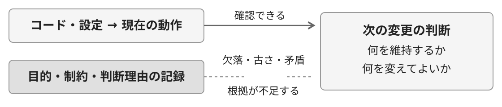

担当者が覚えていることと、他者が使える記録になっていることは別。 記録があっても、古い条件や矛盾した理由しか残っていない場合もある。

<strong>何を作ったかに加えて、何のために、何を優先したかを残す。</strong> それが、後から設計を維持する判断にも、変える判断にも使える。

<blockquote>Storey, <a href="https://arxiv.org/abs/2603.22106v4">Triple Debt Model</a>, 2026；Addy Osmani, <a href="https://www.oreilly.com/radar/the-intent-debt/">The Intent Debt</a>, 2026。要約。</blockquote>

---

## 「意図的な負債」とは、意味が違う

<strong>Deliberate Debt</strong>は、負債を認識して引き受けること。慎重な判断だったかとは別の軸になる。 <strong>Intent Debt</strong>が問うのは、目的・制約・判断理由を、後から使えるかどうか。

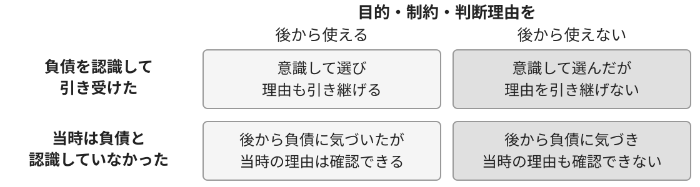

意識して引き受けた負債でも、理由が失われれば意図の負債は残る。 当時は負債だと思っていなかった設計でも、その判断理由が残り、見直しに使えることはある。

<blockquote>Martin Fowler, <a href="https://martinfowler.com/bliki/TechnicalDebtQuadrant.html">Technical Debt Quadrant</a>, 2009；Storey, <a href="https://arxiv.org/abs/2603.22106v4">Triple Debt Model</a>, 2026。</blockquote>

---

## 3つの負債は、互いに影響する

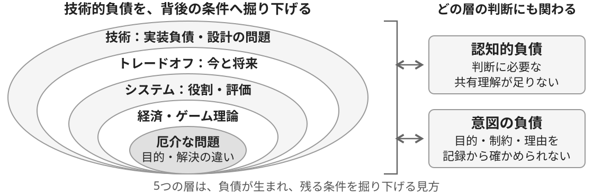

理由が残らなければ、実装を理解するために調べ直す仕事が増える。 理解が不足すれば、変更の影響を見誤り、実装の依存を複雑にすることがある。

複雑な実装は、理解と意図の照合をさらに難しくする。 逆に、構造を整理し、判断理由を確かめる作業は、共有理解も育てうる。

<strong>一つの改善が他にも効くことはあるが、自動ではない。</strong> 3つは、独立した金額として足し算する分類ではない。

<blockquote>Storey, <a href="https://arxiv.org/abs/2603.22106v4">From Technical Debt to Cognitive and Intent Debt</a>, 2026。</blockquote>

---

## 技術の背後に、判断と仕組みがある

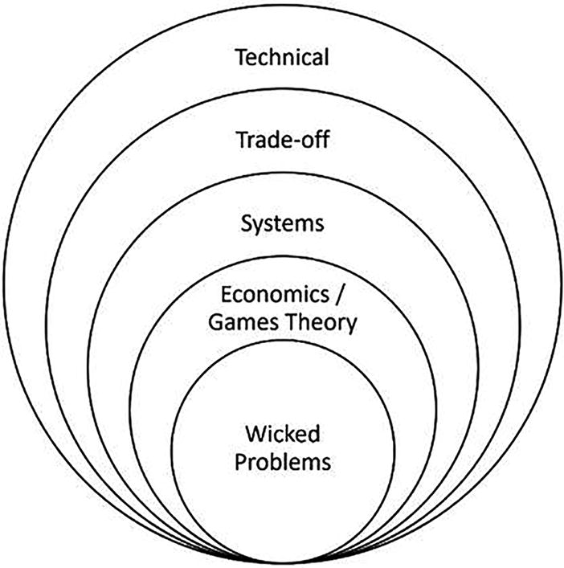

<small>Figure 1-1 The technical debt onion model より引用</small>

表面の「技術」の内側に、 <strong>判断・組織の仕組み・利害</strong>がある。

何を優先して仕事を進めるか。 その判断を、何が繰り返させるか。

関係者によって、困っていることや 望む解決も一致するとは限らない。

<strong>コードを直しても、 負債を生む条件が残ることがある。</strong>

<blockquote>Andrew Richard Brown, <a href="https://doi.org/10.1007/979-8-8688-0264-5">Taming Your Dragon: Addressing Your Technical Debt</a>, Apress, 2024. © Dr. Andrew Richard Brown 2024.</blockquote>

---

## 理解の問題は、前からあった

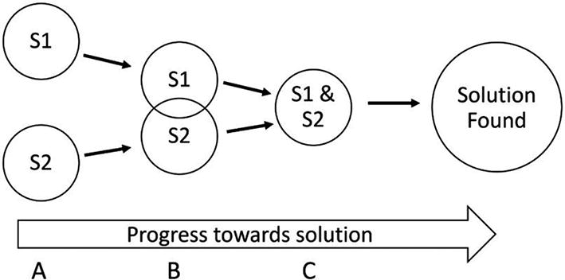

<small>Figure 8-5 より引用 Stakeholders S1 and S2 start with radically different worldviews and then progress toward a shared understanding</small>

同じ問題を見ていても、 役割が違えば、守りたい条件も違う。

<strong>共有理解は、全員が同じ意見になることではない。</strong> 互いの事情を理解し、違いを話せること。

相手の制約を知らずに改善すると、 別の仕事を難しくすることがある。 個人の知識に加えて、理解を共有する関係も要る。

<blockquote>Brown, <a href="https://doi.org/10.1007/979-8-8688-0264-5">Taming Your Dragon: Addressing Your Technical Debt</a>, Apress, 2024, Ch. 8. © Dr. Andrew Richard Brown 2024.</blockquote>

---

## 判断理由は、設計を選び直すために残す

設計には、守りたかった条件と、その条件を満たすために選んだ構造がある。 理由を残す価値は、<strong>今も必要な制約と、選び直せる実現方法を見分けられること</strong>にある。

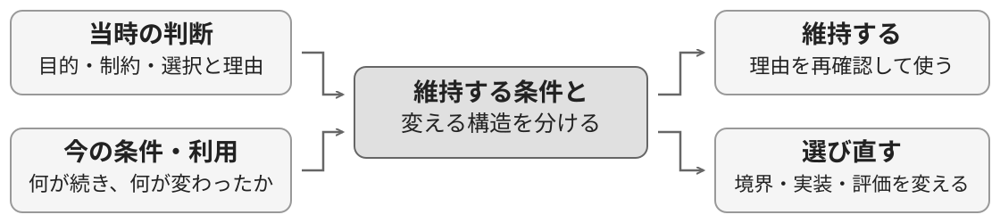

記録があれば、現在の利用や依存と照合する。過去に合理的だったことだけでは、今も同じ設計を選ぶ理由にはならない。 <strong>判断理由を、過去の説明から、次の変更を選ぶための根拠へつなげたい。</strong>

<blockquote>Brown, <a href="https://doi.org/10.1007/979-8-8688-0264-5">Taming Your Dragon</a>, 2024, Ch. 11。</blockquote>

---

## AIが変える、コストと学習の経路

人が調査・実装・検証する過程には、コードを変えながら理解を深め、判断を見直す機会もあった。 任せる範囲が広がるほど、成果物の更新と、人が学ぶ機会を別々に確かめたくなる。

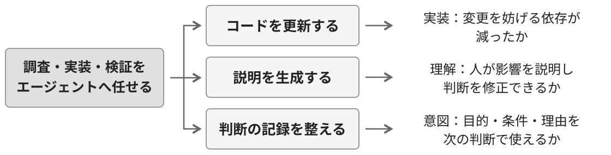

AIは、この三つの更新を支援できる。 ただし、<strong>コード・説明・文書の生成が進んでも、それぞれの負債が同時に減るとは限らない。</strong>

省力化した分を、関係者が試し、確かめ、理由を更新する機会にも使いたい。

---

## 生成の速さだけでは、変更は速くならない

生成の省力化は、広い範囲の修正や再実装を選びやすくする。 一方で、変更が使われるまでには、何を残すか決め、動作を確かめ、利用やデータを移す仕事がある。

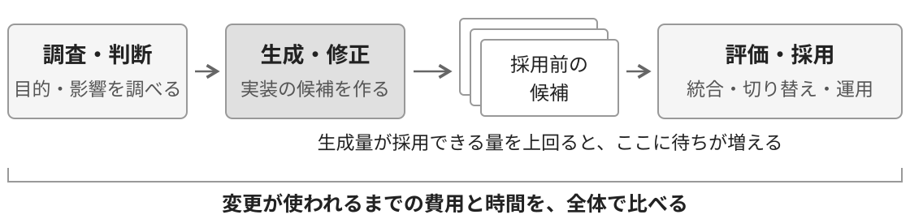

AIを各工程で使っても、<strong>候補を作る量が採用できる量を上回れば、待ちは増える。</strong>

<strong>「変更は高すぎる」という過去の判断は、総費用で見直したい。</strong> 生成で省ける費用を確かめ、判断材料・評価・統合の整備へも配分する。

---

## 説明を生成できても、採用する理由は確かめる

同じ動作は、違う目的や制約からも生まれる。 今のコードからもっともらしい意図を推測できても、それだけで当時の判断理由は確定しない。

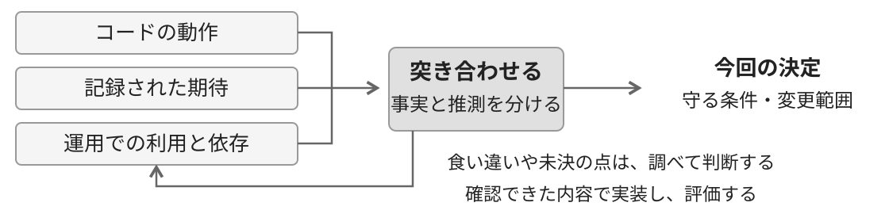

<strong>過去の意図を完全に復元できなくても、次の判断は作れる。</strong> 食い違いを関係者と確かめ、動作と影響を確認した範囲で、これから守る条件と変える理由を決める。

<strong>事実・推測・今回の決定を分け、新たな判断を過去の理由にしない。</strong>

<blockquote>Osmani, <a href="https://www.oreilly.com/radar/the-intent-debt/">The Intent Debt</a>, 2026；Chris Ford, Agentic Engineering at Scale, Ch. 1。</blockquote>

---

## 記録があっても、判断に使われるとは限らない

理由が文書に残っていても、誰も読まず、知っている人へ聞く仕事の進め方はある。 その場では聞く方が早くても、根拠をたどる経路が育たなければ、次の変更でも同じ人へ戻る。

| どこで止まっているか | 変える対象 |
|---|---|
| 記録が読まれない | 変更箇所から根拠へたどる導線と、探して確認する時間 |
| 読んでも判断に使えない | 背景・適用条件の説明と、今の動作で確かめる機会 |
| 理解しても判断を任されない | 決めてよい範囲と、他の人へ判断を戻す条件 |

<strong>判断が偏っていることだけから、文書不足や認知的負債とは決められない。</strong> 記録の不足、共有理解の不足、権限や仕事の進め方を、実際に止まった箇所から見分ける。

読了を目的にせず、今回の変更で参照した根拠と、そこから決めた内容を確かめる。 <strong>記録を使うことと、判断を引き継ぐことが、仕事の流れに入っているか。</strong>

<blockquote>Storey, <a href="https://arxiv.org/abs/2603.22106v4">Triple Debt Model</a>, 2026；Brown, Taming Your Dragon, Ch. 8・11。</blockquote>

---

## 実装を任せても、学ぶ機会を設計できる

実装は、曖昧な仕様や予想外の依存に出会い、考えを修正する場でもある。 生成結果の説明を受け取り、納得したところで終えると、その修正を経験する機会は抜ける。

<strong>影響を予測する</strong>→<strong>結果と照合する</strong>→<strong>理解を更新する</strong>

変更前に、何が変わり、何は変わらないはずかを考える。 エージェントに反例や調査を手伝ってもらい、実際の動作と比べ、予測が外れた理由を説明し直す。

<strong>認知的負債への対処では、説明に納得できたかに加えて、条件が変わっても判断できるかを見たい。</strong> 全部を覚える必要はない。必要な根拠へたどり着き、他の人と確かめ合えることを目指す。

実装を任せて得た余地を、こうした試行と対話にも使う。 学習を偶然の副産物にせず、エージェントとの仕事の進め方へ組み込める。

<blockquote>Storey, <a href="https://margaretstorey.com/blog/2026/02/09/cognitive-debt/">How Generative and Agentic AI Shift Concern from Technical Debt to Cognitive Debt</a>, 2026。</blockquote>

---

## 実装や業務の外からも、学び続ける

与えられた目的をうまく実現する学習に加えて、<strong>何を良いとするかを問い直す学習</strong>も要る。 今の仕事が置いた目的や評価だけを前提にしていると、その前提から外れた不便や負担を見落としやすい。

| 学びの入口 | 今の仕事を問い直す視点 |
|---|---|
| 歴史・科学・哲学など、専門の外を読む | 当たり前の前提にも、成り立った事情や別の説明がある |
| 別の仕事や立場の人と話す | 同じ「便利」「効率的」でも、得るものと負担が違う |
| 暮らしや趣味で観察し、試す | 説明の上では見えなかった不便や、予想とのずれがある |

<strong>すぐ業務に役立つかで、学びの入口を狭めたくない。</strong> 違う視点に触れることで、残された意図を引き継ぐだけでなく、今も妥当かを問い直せる。

人が学び続けることを、実装や日々の業務から自然に得られる経験だけに頼らない。 読む・話す・振り返る機会を、個人の余暇だけに任せず、開発の計画にも含めたい。

---

## 任せる単位を、判断と検証の範囲から考える

広い範囲の修正でも、個々の判断に必要な情報が限定され、結果を確かめられれば、分担を検討できる。 どの修正にも全体の事情が必要なら、ファイルを分けても、同じ調査と調整を繰り返す。

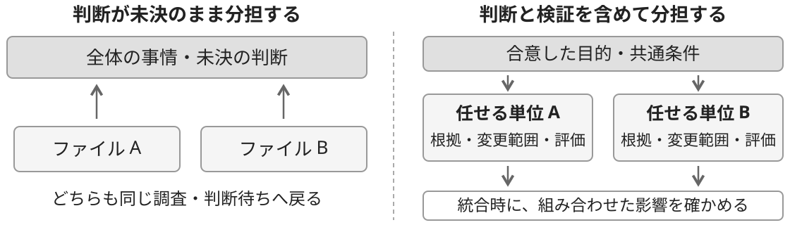

<strong>「何箇所直すか」に加えて、「採用するのに何を知り、何を確かめるか」。</strong> 判断に必要な根拠、変更範囲、評価を対応づける。前提の変更や範囲外への影響は、共通の判断へ戻す。

<blockquote>Chris Ford, Agentic Engineering at Scale, Ch. 1・3。</blockquote>

---

## 判断と検証を、実装につなぐ

人が毎回すべてを読み直し、判断し直す進め方では、生成を増やすほど確認が積み上がる。 <strong>繰り返し使える判断を記録と検査へ移し、前提が変わったときに見直せる仕組みを作る。</strong>

| 対処する負債 | 仕組みへ組み込むこと |
|---|---|
| 意図の負債 | 生成前に目的・制約・理由を参照し、採用後も次の変更へ引き継ぐ |
| 認知的負債 | 記録や構造の図を使って影響を予測し、結果とのずれから共有理解を更新する |
| 技術的負債 | 変更を妨げる依存を検査し、境界の見直しを修繕・再生成へ反映する |

実行と検証の仕組み、判断を伝える仕様、人が学ぶ機会、構造を共有する図を、この関係に沿って組み合わせる。 <strong>何を任せ、何を確かめ、どの条件で誰の判断へ戻すかを、一続きの開発として設計したい。</strong>

---

## 生成の反復を、開発全体の判断へ戻す

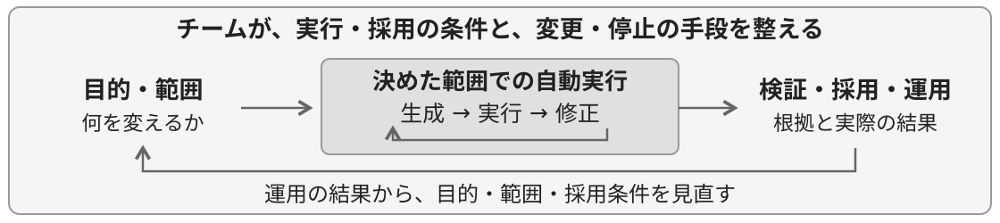

エージェントは、実装だけでなく、調査・計画・レビュー・運用の分析にも使える。 <strong>変わるのは担当する工程の線引きより、判断をどう渡し、何を根拠に結果を引き受けるか。</strong>

目的を決める、範囲を示す、結果を検証する、採用後まで責任を持つ。 各工程を任せても、このつながりはチームの仕事として残る。前提や影響範囲が変われば、判断へ戻す。

---

## 任せる仕組みが、判断を繰り返し適用する

<strong>Harness（エージェントの実行を支える仕組み）</strong>は、情報・ツール・状態・制限・検証をつなぐ。 モデルが次の操作を選ぶための材料と、選んだ操作を実行できる範囲を用意する。

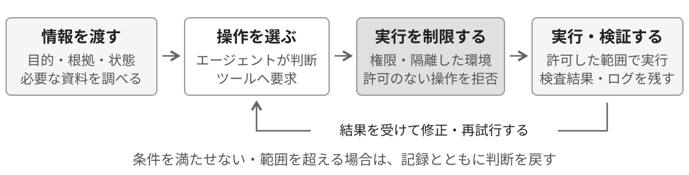

<strong>「触らないで」と書くことと、触れない権限にすることは違う。</strong> 説明は判断を助け、権限は操作を制限し、検査は結果を確かめる。それぞれの役割を混ぜない。

入力・操作・失敗を記録し、再現結果から、モデルと実行環境の不足を見分ける。

---

## 決めなかったことは、生成結果に埋まる

仕様が曖昧でも、エージェントは何らかの実装を作れる。 空白は空白のまま残らず、選ばれた動作や構造として現れる。

採用の段階で違いに気づけば、レビューが仕様を決める場になる。 仕様を書く仕事は、決まった内容の清書に加えて、まだ決めていないことを見つける仕事でもある。

| 生成前に揃えること | 次に進むための判断 |
|---|---|
| 目的・受け入れる結果 | 誰の何が変われば、この変更には価値があるか |
| 維持する動作・変更の境界 | 何を壊さず、どこまで変えてよいか |
| 未確認の条件 | 調査や小さな試作で何を確かめ、誰が決めるか |

<strong>未決のことを、エージェントの推測で決定済みにしない。</strong> 全部を先に確定する必要はない。未決の範囲と、判断材料を得る方法を渡す。

---

## 仕様は、一枚の文章で完結しない

意図を実装へ伝えるには、違う種類の記述を組み合わせる。 一つの表現ですべてを詳しく書くより、それぞれが何を制約するかを明確にする。

| 表現 | 明確にすること | 単独では残る不足 |
|---|---|---|
| 文章・判断記録 | 目的、制約の理由、優先順位 | 解釈や境界条件の曖昧さ |
| 型・スキーマ・状態モデル | データの形、可能な状態と遷移 | その動作を必要とする理由 |
| 具体例・実行できる評価 | 期待する結果、守るべき性質 | 未確認の条件、評価に含めなかった動作 |

<strong>重なり合う記述で、許容する実装の範囲を絞る。</strong> 食い違いが見つかったら、生成側の都合で解消せず、判断が必要な箇所として扱う。

---

## 毎回選び直さなくてよい判断を残す

生成のたびに設計を選び直すと、変えたかった箇所以外まで揺れ動く。

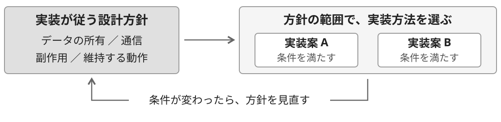

<strong>固定するのは、他の判断や動作が依存する選択。</strong>細部まで固定すれば、改善の余地も狭まる。 設計の条件が変わったら、理由と影響を確認して、任せる裁量ごと見直す。

実装で判明した条件は、方針にも戻す。コードだけを直すと、次の生成は古い理由から始まる。 <strong>誰が更新するかを決め、生成を方向づけた判断を、次の変更にも使う。</strong>

---

## 整合しているだけでは、正しいと決まらない

同じ未確認の前提から仕様・実装・テストを生成すると、 成果物同士は整合していても、必要な動作からは外れていることがある。

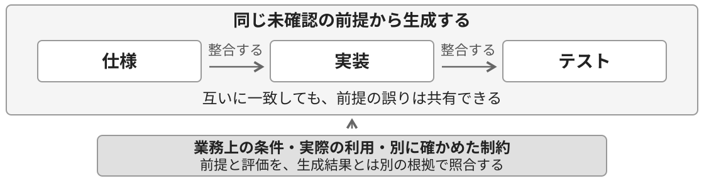

<strong>評価には、生成結果との整合とは別の根拠が要る。</strong> 業務上の条件、利用の事実、独立に確認された制約と照合する。

モデルを変えても、同じ前提を渡せば誤りは残りうる。<strong>何を根拠に評価したかを見たい。</strong>

---

## 自律性を、確かめられる範囲に合わせる

自律性は、<strong>そのタスクの影響、結果の確かめやすさ、停止・復旧の手段</strong>から決める。

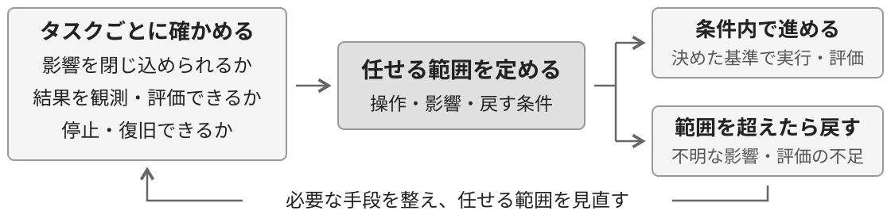

大きな機械的変更でも、影響が限定され評価と復旧が明確なら、広く任せる余地がある。 小さな変更でも、利用者への影響が不明なら、先に調査や判断が要る。

承認を担う人へ、根拠・確認する時間・変更や停止を指示する権限を渡す。 <strong>自律性を広げる前に、確かめて引き受ける力を広げる。</strong>

---

## 任せる範囲と、仕事の分け方を別々に設計する

一つの仕事をどこまで人へ戻さず進めるかと、複数の仕事をどう分担・統合するかは、別に決める。

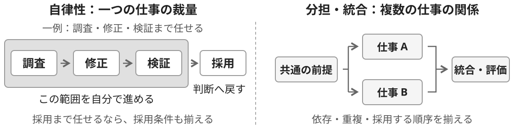

<strong>複数へ配っても、各仕事の裁量は狭くできる。</strong>一つのエージェントに広く任せることもできる。 分担するときは、共通の前提と変更箇所の重なりを確認し、組み合わせた結果まで確かめる。

共通の前提が未決なら、実装を並行させても、採用時に同じ判断を待つ。 <strong>担当を増やす前に、判断・変更・検証をどこまで分けられるかを確かめる。</strong>

---

## 知識は、経験と記録を行き来して育つ

<strong>SECIモデル</strong>は、経験に根ざす暗黙知と、言葉や図で共有できる形式知の相互作用を捉える。

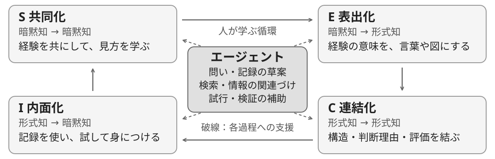

エージェントを、対話での問いかけ、図や文章の草案、記録の関連づけ、検証の補助に使う。 <strong>人が経験の意味を確かめ、試して判断を更新する循環へ組み込む。</strong>

<blockquote>SECIモデル：Ikujiro Nonaka, <a href="https://doi.org/10.1287/orsc.5.1.14">A Dynamic Theory of Organizational Knowledge Creation</a>, 1994。</blockquote>

---

## 知識を残す場所と、今渡す情報を分ける

<strong>Context Engineering</strong>では、現在の作業に必要な仕様・根拠・状態を選んで渡す。 記録を全部詰め込むと、古い指示や無関係な調査も、今の判断と競合する。

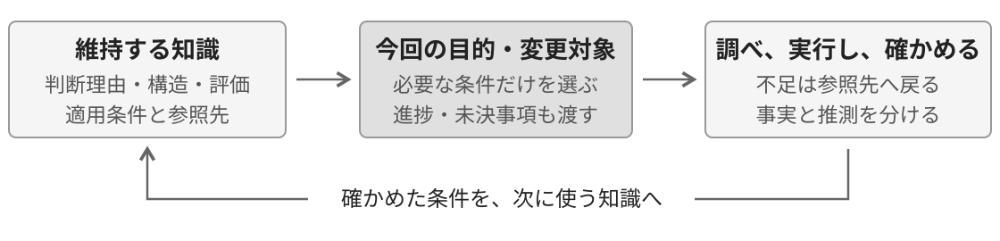

要約には、目的・進んだこと・未決事項・根拠への参照を残す。 要約された説明と、実際に確かめた結果を混同せず、不足は元の資料や実装へ戻って調べる。

<strong>意図の負債には、使える記録。認知的負債には、その記録を使って確かめる経験。</strong>

---

## C4で、同じ対象について話せるようにする

<small>Static structure diagrams 構造の詳しさを段階的に変える</small>

同じ「部品」という言葉でも、 アプリを指す人と、その中の処理を指す人がいる。 このずれは、変更の範囲の見積もりにも残る。

<strong>C4は、構造を捉える共通の語彙を持ち、 4段階の詳しさで表すモデル。</strong>

システム、アプリとデータストア、 内部の責務、コードへと近づく。

<strong>先に揃えたいのは、箱の形より、 その箱が何を表しているかです。</strong>

<blockquote>画像：Simon Brown, <a href="https://c4model.com/diagrams">C4 model — Static structure diagrams</a>, <a href="https://creativecommons.org/licenses/by/4.0/">CC BY 4.0</a>。画像は改変なし。</blockquote>

---

## 誰への影響か、何への依存かを分ける

| 構造を見る段階 | 表す対象 | 変更の判断へつなげる問い |
|---|---|---|
| System Context | システム、利用者、外部システム | 誰の利用や外部連携に影響するか |
| Container | 内部のアプリ、データストア、通信 | どの動作・データ・接続に依存するか |
| Component / Code | アプリ内の責務のまとまりと、具体的な実装 | 影響が届く内部のどこを変えるか |

処理の順序は動的図、環境ごとの配置は配置図で補う。 C4のContainerはアプリやデータストアを指し、Dockerのコンテナに限らない。

<strong>4段階すべての作図より、今回の判断に必要な範囲を選ぶ。</strong> 内部を詳しく描くことと、実行時の依存や切り替え方を調べることを使い分ける。

<blockquote>Simon Brown, C4 model：<a href="https://c4model.com/diagrams/system-context">System Context</a> / <a href="https://c4model.com/diagrams/container">Container</a> / <a href="https://c4model.com/diagrams/dynamic">Dynamic</a> / <a href="https://c4model.com/diagrams/deployment">Deployment</a>。</blockquote>

---

## 図を増やす前に、構造の定義を共有する

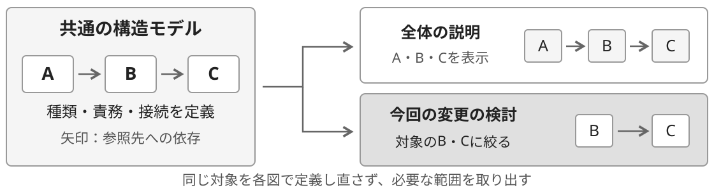

別々の図へ箱をコピーすると、名称や接続を変えるたびに、すべての図を直す必要がある。 <strong>対象の種類・責務・関係を一度定義し、その一部を図として表示する。</strong>

エージェントへも、今回の対象と依存先の定義、対応する実装を渡せる。 画像から関係を推測させる負担を減らし、全体への参照も残しておく。

---

## 図の境界を、実装で確かめられるようにする

図に「コンポーネント」と書いても、コードに同じ境界が存在するとは限らない。

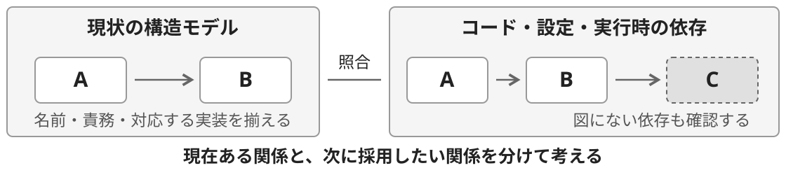

名前・責務・対応する実装を揃え、コード・設定・実行結果と照合する。 図にない関係も調べ、現状の構造と採用したい構造を分けて、変更の影響を予測する。

<strong>現状から生成した図を、そのまま次の実装の設計にしない。</strong> 残す境界と変える境界を判断し、検査へつなぐ。共有する構造は、実装の変更と一緒に更新する。

---

## 構造・理由・評価を、同じ対象へ結びつける

構造モデルだけでは、その構造を選んだ理由や、今も必要かどうかまでは決まらない。

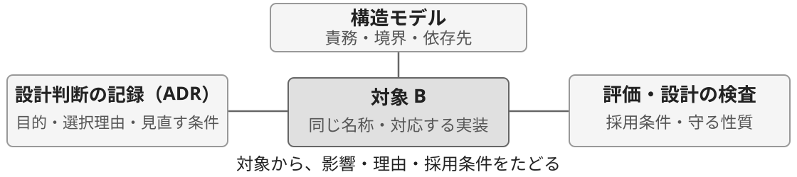

構造を使って影響を確かめることは、認知的負債に働きかける。選択理由の維持は、意図の負債に効く。 評価で不要な依存を見つけて実装を直し、技術的負債へ対処する。

<strong>構造を説明する知識を、構造を選び直す判断にも使う。</strong> 境界を守る検査や権限までつなぎ、誰がその方針を見直すかも明確にする。

---

## 変更し続けられるアーキテクチャを育てる

エージェントを、決めた構造を作るためにも、構造を選び直す調査・試作・検証にも使う。

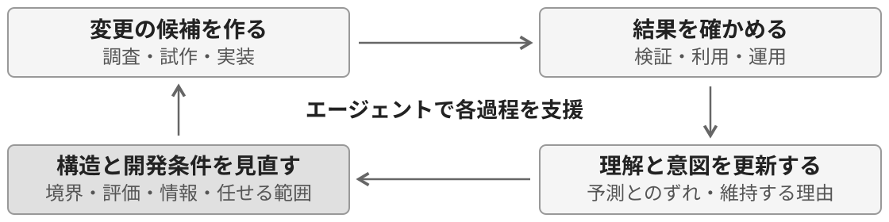

実装だけを更新しても、影響の読み方や採用理由が古いままなら、次の変更で調べ直す。 予測と結果のずれから、実装・共有理解・意図を更新し、評価や任せる範囲にも戻す。

<strong>一回の変更を終えるたび、次の変更を進める条件も育つようにしたい。</strong>

---

## 進化とは、構造を選び直し続けられること

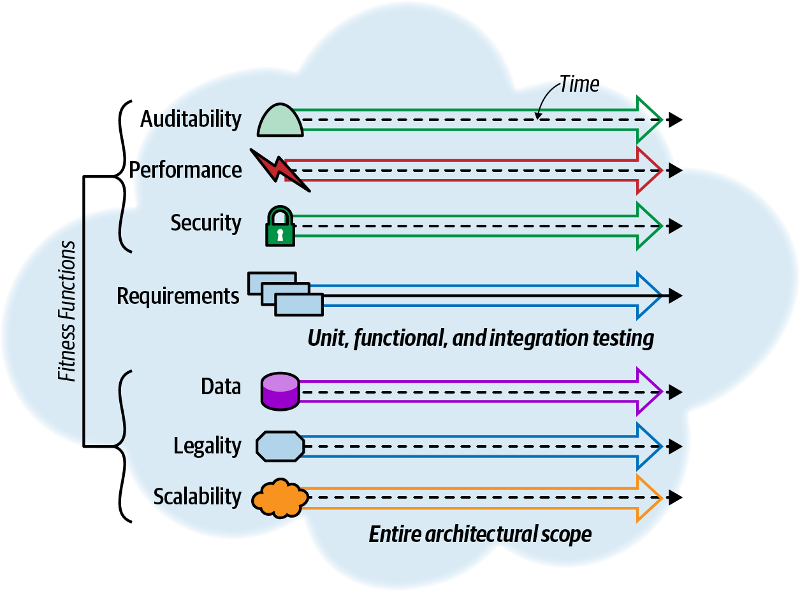

<small>Figure 1-2 より引用 時間の経過とともに、複数の性質を守る</small>

<strong>守る性質を確かめながら、 小さな単位で構造を変えていく。</strong> 進化は、技術・データ・運用にまたがる。

図では、業務上の要求と並行して、 性能や安全性などの性質を確かめ続ける。 この評価をフィットネス関数と呼ぶ。

要求のたびに特別扱いを足すだけでは、 次の変更で引き受ける制約も増えていく。

<strong>重要な性質を維持できるなら、 最初に選んだ構造からも離れられる。</strong> その選び直しを、繰り返せるようにしたい。

<blockquote>Neal Ford, Rebecca Parsons, Patrick Kua, Pramod Sadalage, <a href="https://www.oreilly.com/library/view/building-evolutionary-architectures/9781492097532/">Building Evolutionary Architectures, 2nd Edition</a>, O'Reilly, 2022, Figure 1-2。原図は改変なし。</blockquote>

---

## コードを整えても、境界のずれは残る

<small>Figure 8.2 より引用 一緒に変える部品の距離と、調整の負担</small>

図は、<strong>一緒に変える必要がある部品</strong>が 離れると、調整が増える関係を表す。 実測値から得た比例式ではない。

業務ルールが頻繁に変わるようになり、 担当チームも分かれれば、コードが同じでも 以前の境界が合わなくなることがある。

<strong>連動するルールは近くへ集め、 別々に変わる部分には内部の前提を広げない。</strong> 例外処理を足すだけで終わらせない。

エージェントによる調査や試作を、 責務の移動を検討するためにも使いたい。 <strong>古い境界を固定すれば、変更しにくさの 原因も引き継いでしまう。</strong>

<blockquote>Vlad Khononov, <a href="https://www.pearson.com/en-us/subject-catalog/p/balancing-coupling-in-software-design-successful-software-architecture-in-general-and-distributed-systems/P200000000372">Balancing Coupling in Software Design</a>, Addison-Wesley Professional, 2024, Figure 8.2。原図は改変なし。変化に応じた境界の見直しは第11章も参照。</blockquote>

---

## 設計の単位を、変更の波及で見る

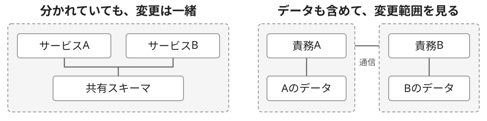

<strong>独立して配置できる、責務のまとまり</strong>を捉える。 動作に必要なデータや実行環境も含め、同期する通信による結びつきも見る。

<strong>一緒に配る必要がある範囲と、一緒に動かなければ成立しない範囲を調べる。</strong> 右側の構造でも、通信や整合性の依存によって、全体で確かめる仕事は残る。

C4の箱の数から、独立した変更の単位を決めない。 同じ業務ルールを別の場所で実装していれば、直接の通信がなくても変更は連動する。

---

## 境界に、評価と切り替えを対応づける

<strong>依存の境界</strong>＋<strong>評価の範囲</strong>＋<strong>切り替えの範囲</strong>

入出力を分けても、正しさを全体でしか確かめられなければ、 独立した変更には、全体を評価する仕事が残る。

評価できても、データや外部への影響を分けて扱えなければ、 実装だけを戻しても元の状態へ復旧できないことがある。

<strong>この三つが揃う範囲を、エージェントへ任せる範囲にも反映する。</strong> 広い依存を支える部分ほど、統合時の評価・移行・観測の時間を確保する。

---

## 設計の方針を、毎回確かめる条件にする

<strong>フィットネス関数</strong>は、重要なアーキテクチャの性質を客観的に確かめる仕組み。 業務上の結果を確かめるテストと合わせて、構造や運用上の性質を評価する。

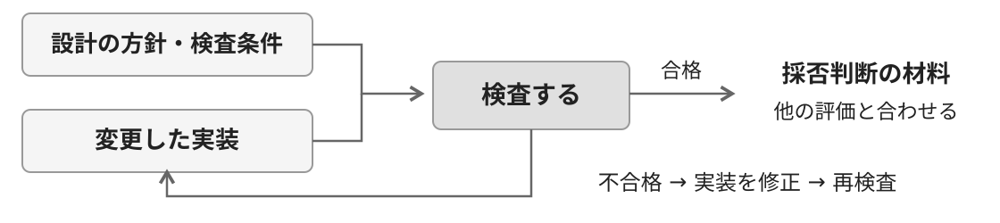

応答性能なら、想定する負荷で遅延を測る。障害からの回復なら、影響範囲と復旧時間を確かめる。 重要な性質に応じて、変更時・統合後・運用中のどこで評価するかを決める。

<strong>C4で示し、ADRで理由を残した方針を、変更のたびに働く検査へつなぐ。</strong>

---

## 一つの改善が、別の性質を壊すことがある

応答を速くするためのキャッシュが、古い権限情報を使う時間を延ばすことがある。

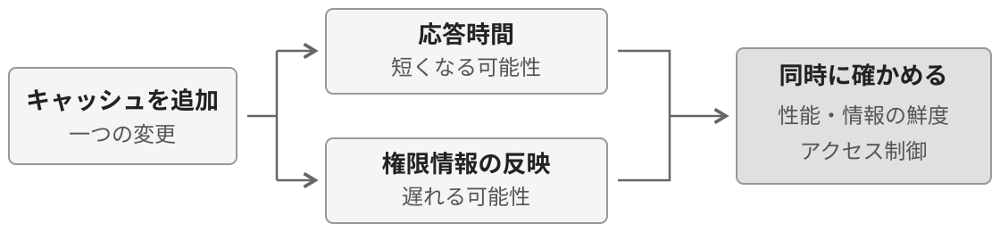

個々の性質に加えて、<strong>重要な性質が一緒に成立するか</strong>を確かめる。 単独の検査は変更の近くで実行し、組み合わせや実際の負荷は統合後・運用中にも見る。

守る条件が衝突したら、何を優先するかを判断する。優先順位を変えるなら、評価も更新する。 <strong>実装を直す判断と、何を合格とするかを変える判断を区別する。</strong>

---

## 作れる候補を、実際に選べる候補へつなぐ

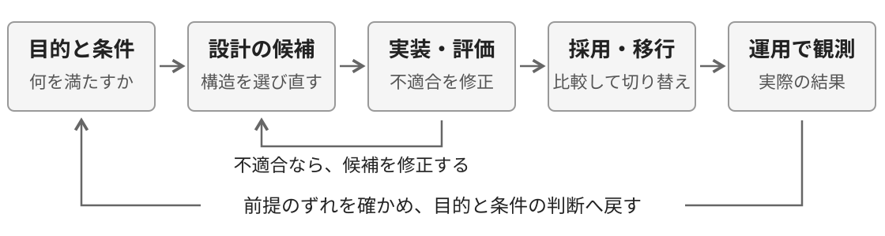

試作・修正と自動評価をつなげれば、<strong>以前なら費用で諦めた構造も比較に残せる。</strong>

設計方針から検査を作る仕事にもAIを使い、その結果を修正へ返せる。 生成した検査が違反を見逃さないかは、既知の違反を検出できるかで確かめる。

<strong>変わるのは、構造を選び直す費用と、その判断をできる頻度。</strong> 候補数だけを増やさず、評価と移行まで扱える範囲から、実際に選べる構造を増やしたい。

---

## 修繕と再生成を、変更の選択肢として比べる

| 選択 | 活かせるもの | 比較する費用 |
|---|---|---|
| 既存の実装を修繕する | 確認済みの動作、変更しない部分 | 調査・差分の修正・検証・移行・その後の保守 |
| 必要な範囲を再生成する | 実装を越えて使える仕様・設計・評価 | 知識の抽出・生成・検証・移行・その後の保守 |

生成が省力化されれば、修繕より再生成が有利な範囲は広がりうる。 <strong>旧実装を廃止できれば、その内部だけに残る重複や複雑な分岐は、直さずに終えられる。</strong>

ただし、外部の利用やデータへの依存、判断理由の不足は、コードを替えるだけでは解消しない。 実装の生成費用に加えて、評価・移行・知識の維持まで比べる。

<strong>再生成できることは、毎回再生成する理由にはならない。</strong> 変更を妨げる条件と、次に必要な動作から、方法を選びたい。

---

## 実装を置き換えながら、システムを続ける

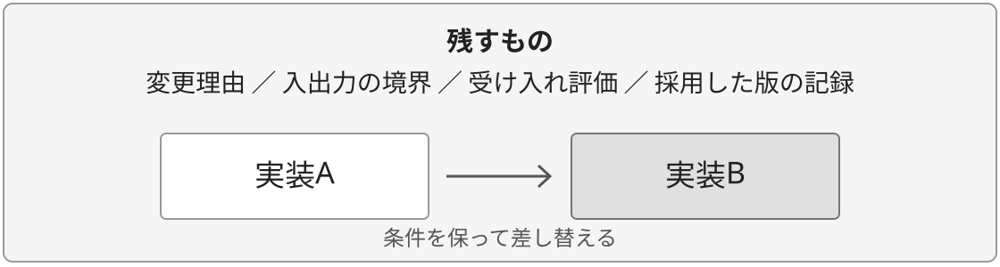

再生成の考え方で評価したいのは、<strong>維持する知識と、変更するコードの寿命を分ける</strong>点です。 必要な振る舞いを実装の外でも説明・検証できれば、今の構造を維持する以外の案を選びやすくなる。

コードにしか残っていない条件は、実際の利用や動作と照合して取り出す。 理由と評価を維持する投資は、今の実装を直す仕事にも、別の実装へ置き換える仕事にも使える。

---

## 実装が変わっても、意味のある評価を持つ

内部の構造を確かめるテストと、別の実装にも要求する動作の評価を分ける。

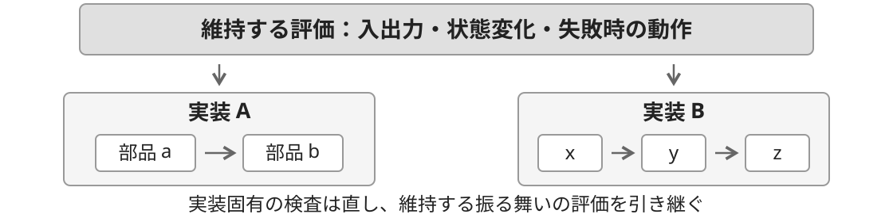

<strong>「このコードのテスト」から、「次のコードも満たす評価」へ。</strong> 同じ意味の基準で候補を比べ、性能やアクセスの条件、以前の失敗から学んだ条件も引き継ぐ。

実装固有の検査は、その構造に合わせて直す。 <strong>候補に合わせて期待値を動かさず、評価を変える場合は、その理由を確かめる。</strong>

---

## 判断が変わった箇所から、影響をたどる

目的、採用した設計、実装の版、確かめた結果を対応づける。 変更が起きたら、どの前提が変わり、何を再確認する必要があるかを、この記録から調べる。

<strong>変わった理由</strong>→<strong>依存する設計と実装</strong>→<strong>再確認する評価</strong>

エージェントに影響する候補を調べてもらい、実際の依存と照合して変更範囲を決める。 <strong>差分の説明を後付けするより前に、何の判断から必要になった差分かを追いたい。</strong>

一つの理由が複数の実装へ影響することも、一つの実装が複数の制約を満たすこともある。 記録のつながりを、そのまま正確な変更範囲とみなさず、データ・実行時の依存も確かめる。

<strong>全自動の再生成まで進めなくても、理由探しと影響調査を、途中から再開できるようにする価値がある。</strong> 変わらない根拠は使い直し、変わった前提に調査を集中させる。

---

## 実装は丸ごと替えても、移行は段階に分ける

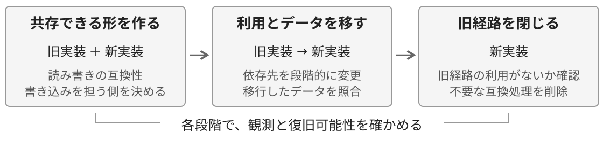

内部の実装を生成し直すことと、すべての利用者を一度に切り替えることは別。 データ構造の変更も、コードと一緒に版を管理し、評価し、段階的に適用する。

<strong>生成したコードを戻せても、更新したデータや外部への作用は戻るとは限らない。</strong> 切り替えの範囲を絞り、観測と復旧を用意することが、次の案を試す余地になる。

交換を繰り返すために、再生成の速さを利用者へ届ける経路まで設計したい。

---

## 変更の境界に、判断できるチームを対応づける

<small>Figure 1.4 Independent value stream より引用</small>

<strong>担当する業務、目指す成果、 判断の権限、ソフトウェアの境界。</strong> この四つを揃える。

実装を並行して進めても、 目的や採用の判断が別の場所で滞れば、 利用者へ届くまでの待ちは残る。

意図を決め、生成し、 利用後の結果まで確かめる。 <strong>この範囲をチームの仕事にする。</strong>

<blockquote>Nick Tune with Jean-Georges Perrin, <a href="https://www.manning.com/books/architecture-modernization">Architecture Modernization</a>, Manning, 2024, Figure 1.4.</blockquote>

---

## 失敗を直し、次の実行の条件も直す

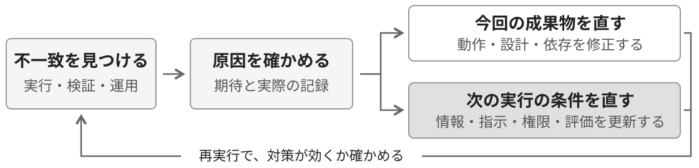

不具合を直しても、同じ情報不足や評価の抜けが残れば、次の実行でも繰り返しうる。 <strong>出力の修正と、出力を生んだ条件の修正を、別々に考える。</strong>

意図の負債には、抜けた理由や適用条件を戻す。技術的負債には、不要な依存を直し、検査へつなぐ。 人も予測と結果のずれを説明し直し、共有理解を更新することで、認知的負債へ対処する。

失敗のたびに指示を積み増すだけにはしない。必要な場所へ対策を置き、再実行で効いたかを確かめる。

---

## 役目を終えた仕組みを、維持し続けない

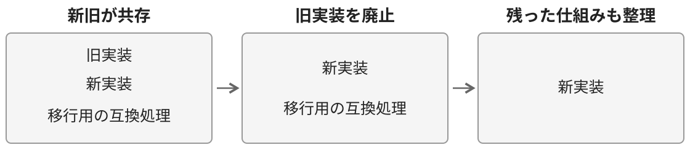

利用者・データ・運用への依存を確認して旧実装を廃止し、不要になった移行経路や設定も整理する。 実行環境でも、重複した指示、使わないツール、古い前提を引き継ぎ続けない。

<strong>判断の履歴はたどれるように残し、今の作業に適用する条件は絞る。</strong> 生成しやすくなるほど、実装・文書・ルールを増やすだけでなく、維持する対象を減らす仕事も要る。

---

## 開発を支える仕組みにも、維持費がある

境界・評価・判断理由・エージェントへ渡す情報は、業務や依存の変化に合わせて更新が要る。

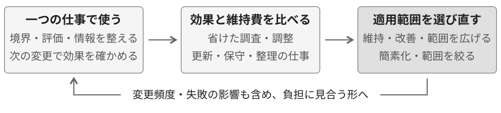

変更が続く場所では、将来省ける調査や調整と比べて投資を検討できる。 変更が少なく影響も小さい場所では、維持費が便益を上回ることもある。

<strong>変更頻度、失敗時の影響、評価を維持する費用を合わせて比べる。</strong> すべてに同じ仕組みを入れず、必要な検証と復旧を保ちながら、負担に見合う形を選ぶ。

---

## 負債は、意思決定から再生産される

生成を速めた側の成果だけを評価し、理解・検証・運用にかかる負担を 別の担当者へ渡せるなら、全体の負担を減らす判断は選ばれにくい。

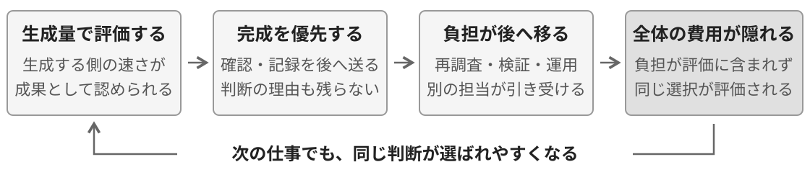

局所的には合理的な選択でも、共有理解や理由の記録が不足すれば、後の仕事が調査をやり直す。 <strong>実装の完成と、変更を引き継げる状態を、同じ計画の中で扱う。</strong>

確認・記録・学習の時間も計画に含め、誰の負担が成果の計算から抜けているかを見る。

<blockquote>Brown, <a href="https://doi.org/10.1007/979-8-8688-0264-5">Taming Your Dragon</a>, 2024, Ch. 1・11。</blockquote>

---

## 技術的負債を、変更を妨げる関係から捉え直す

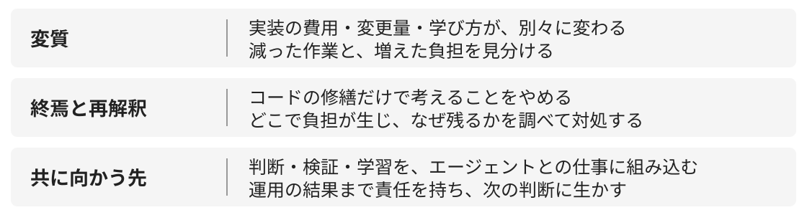

理解や判断の問題は、AI以前からあった。 エージェントへ任せる範囲が広がると、実装・共有理解・意図が、別々の速さで更新される。

<strong>終わらせたいのは、実装ができた後に、その負担だけを引き受け続ける進め方です。</strong> 同時変更、理解のずれによる再調査、理由探しは減ったか。別の人へ負担が移っていないか。

何を生成したかに加えて、<strong>次の変更で、何をやり直さずに済んだか</strong>を確かめたい。

---

## 次の変更に、判断と学習を引き継ぐ

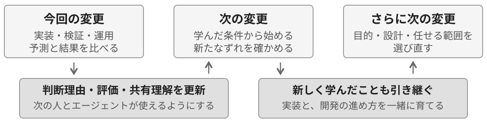

<strong>何を任せ、何を確かめ、何を学んで次へ渡すか。</strong> そのつながりを設計する仕事として、エージェント時代のエンジニアリングを考えたい。

<strong>守る性質を確かめながら、構造と開発の進め方を選び直す。</strong> 試作・評価・運用から学ぶ反復をつなげれば、真に進化的なアーキテクチャを実現できる範囲は広がる。 その可能性に、かなり期待しています。

---

<!--
_backgroundColor: #0a1929
_color: white
_class: title dark
-->

# ありがとうございました

### 学んだことを残し、実装を次へつなぐ

@nwiizo 
株式会社スリーシェイク

---

## 参考文献 · 負債と人の判断

<a href="https://doi.org/10.1007/979-8-8688-0264-5">Taming Your Dragon: Addressing Your Technical Debt</a>

Andrew Richard Brown · Apress · 2024 第1・8・11章、Figure 1-1・8-5。判断の背景、共有理解とその記録。

<a href="https://c2.com/doc/oopsla92.html">The WyCash Portfolio Management System</a>

Ward Cunningham · OOPSLA '92 · 1992 技術的負債の比喩を述べた原文。

<a href="https://www.manning.com/books/architecture-modernization">Architecture Modernization</a>

Nick Tune with Jean-Georges Perrin · Manning · 2024 Figure 1.4。担当する業務・成果・権限・ソフトウェアの境界を揃える。

---

## 参考文献 · エージェントと再生成

<a href="https://www.oreilly.com/library/view/agentic-engineering-at/0642572344306/">Agentic Engineering at Scale</a>

Chris Ford · O'Reilly

<a href="https://www.oreilly.com/library/view/agentic-engineering/0642572392291/">Agentic Engineering</a>

Addy Osmani · O'Reilly

<a href="https://www.oreilly.com/library/view/regenerative-software/0642572383954/">Regenerative Software</a>

Chad Fowler · O'Reilly

---

## 参考文献 · 進化するアーキテクチャ

<a href="https://www.oreilly.com/library/view/building-evolutionary-architectures/9781492097532/">Building Evolutionary Architectures, 2nd Edition</a> Neal Ford, Rebecca Parsons, Patrick Kua, Pramod Sadalage O'Reilly · 2022

<a href="https://www.thoughtworks.com/en-gb/insights/podcasts/technology-podcasts/how-fitness-functions-help-govern-measure-ai">How fitness functions can help us govern and measure AI</a> Thoughtworks Technology Podcast Rebecca Parsons, Neal Fordほか

<a href="https://martinfowler.com/articles/harness-engineering.html">Harness engineering for coding agent users</a> Birgitta Böckeler · 2026

---

## 参考文献 · 3つの負債の定義

<strong>Margaret-Anne Storey, 2026</strong> <a href="https://arxiv.org/abs/2603.22106v4">From Technical Debt to Cognitive and Intent Debt: Rethinking Software Health in the Age of AI</a> arXiv v4。Triple Debt Modelの提案。

<strong>Paris Avgeriou et al., 2016</strong> <a href="https://drops.dagstuhl.de/entities/document/10.4230/DagRep.6.4.110">Managing Technical Debt in Software Engineering</a> Dagstuhl Seminar 16162。技術的負債の作業上の定義。

<strong>Martin Fowler, 2009</strong> <a href="https://martinfowler.com/bliki/TechnicalDebtQuadrant.html">Technical Debt Quadrant</a> Deliberate / InadvertentとPrudent / Recklessの区別。

---

## 参考文献 · 理解と意図を残す

<strong>Margaret-Anne Storey, 2026-02-09</strong> <a href="https://margaretstorey.com/blog/2026/02/09/cognitive-debt/">How Generative and Agentic AI Shift Concern from Technical Debt to Cognitive Debt</a>

<strong>Addy Osmani, 2026-08-14</strong> <a href="https://www.oreilly.com/radar/the-intent-debt/">The Intent Debt</a> · O'Reilly Radar再掲版

<strong>Simon Brown, C4 model</strong> <a href="https://c4model.com/diagrams">Diagrams</a> / <a href="https://c4model.com/diagrams/notation">Notation</a> / <a href="https://c4model.com/diagrams/checklist">Review checklist</a> 構造の詳しさ、図の意味、理解を確かめる観点。図版はCC BY 4.0。

---

## 参考文献 · 構造と知識を育てる

<a href="https://www.oreilly.com/library/view/the-c4-model/9798341660113/">The C4 Model</a> Simon Brown · O'Reilly · 2026

<a href="https://www.pearson.com/en-us/subject-catalog/p/balancing-coupling-in-software-design-successful-software-architecture-in-general-and-distributed-systems/P200000000372">Balancing Coupling in Software Design</a> Vlad Khononov · Addison-Wesley Professional · 2024

<a href="https://doi.org/10.1287/orsc.5.1.14">A Dynamic Theory of Organizational Knowledge Creation</a> Ikujiro Nonaka · Organization Science 5(1), 14–37 · 1994 暗黙知と形式知の相互作用、個人から組織へ広がる知識創造。

