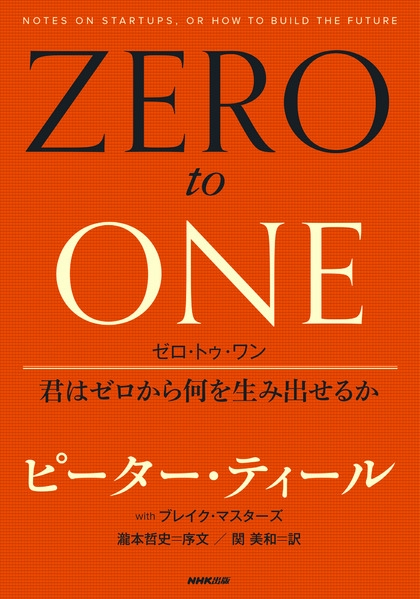
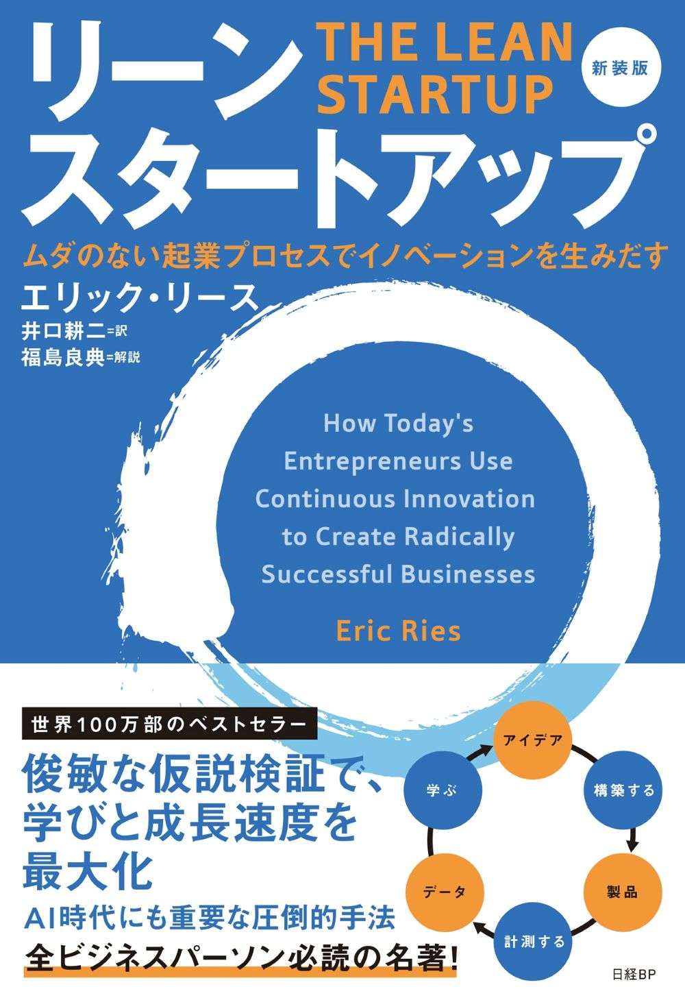
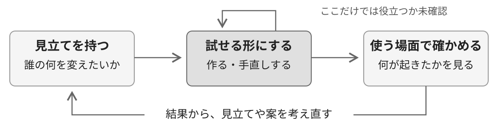
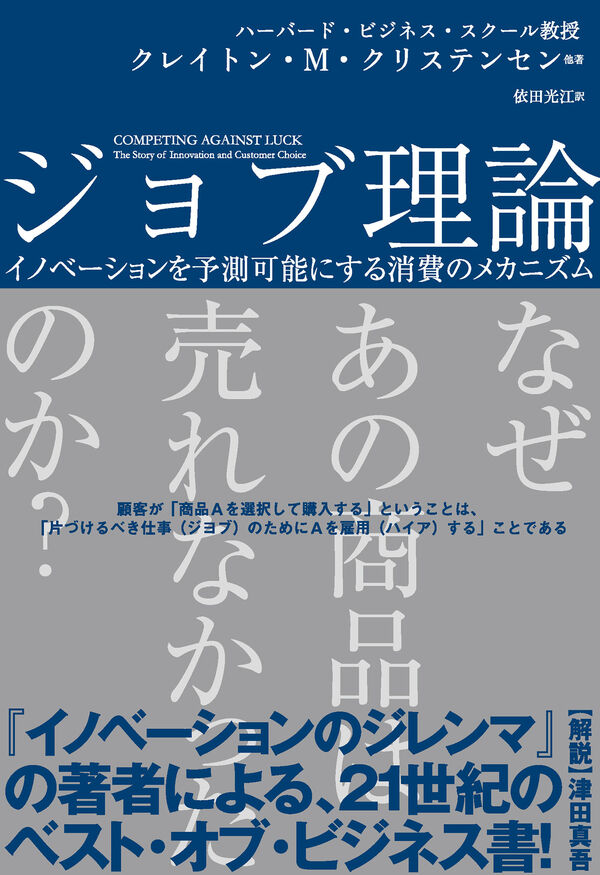
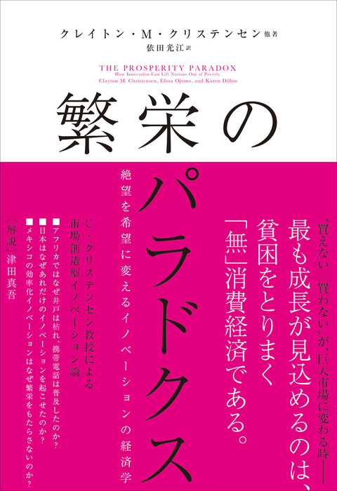
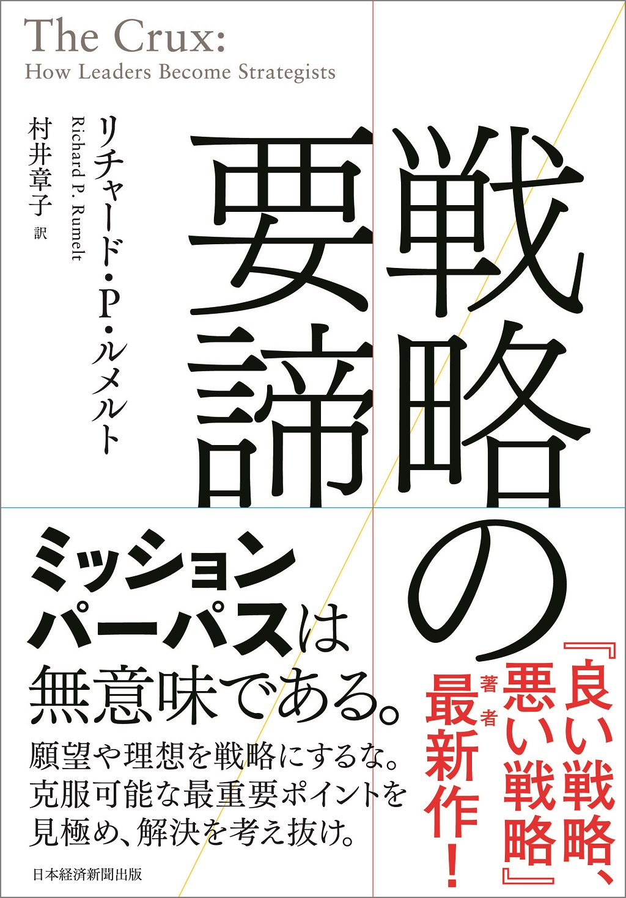
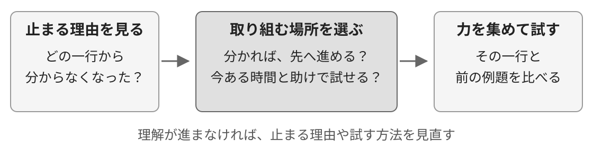
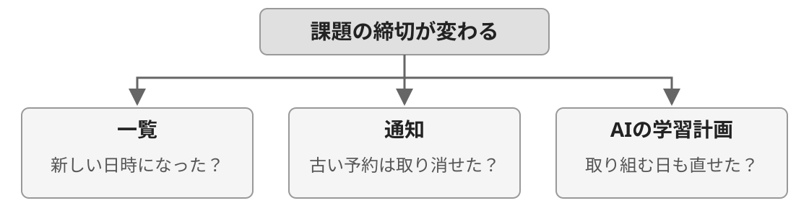
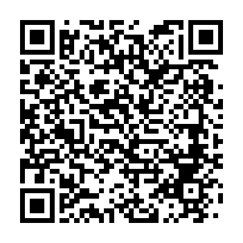

<!--
_backgroundColor: #0a1929
_color: white
_class: title dark
-->

# 足さない練習

### AIで作れる時代に、何を足すか考える

学生向けワークショップ · 60分 @nwiizo · 2026

---

## AIで、機能を試作しやすくなった

「課題の締め切りを知らせるアプリを作って」。 AIにコードを書いてもらい、動かして直すところから始められます。

作ってみたい機能は、いろいろ出てきます。 では、<strong>どれが必要で、どれは今なくてもよいのでしょうか。</strong>

---

<!-- _backgroundColor: white -->

## nwiizo

株式会社スリーシェイクで、プロのソフトウェアエンジニアをやっています。 ブログ「<strong>じゃあ、おうちで学べる</strong>」。X / GitHub も <strong>@nwiizo</strong>。

- 趣味は格闘技、読書、グラビア。よく本を紹介しています。
- 格闘技はリフレッシュのため、と言っています。 たぶん普通に強くなりたいだけです。
- ソフトウェアで有名になるつもりが、 技術以外の文章で見つかりました。
- 技術書を訳すたび、わかることが1つ増え、 わからないことが3つ増えます。

---

## 書籍を出しました

<strong>『おい、とりあえず終わらせろ』</strong> そうすれば「動けない自分」が変わるから

やることはあるのに、始められない。 手は動いているのに、終わりが見えない。 できているのに、人に見せられない。

<strong>どこで止まっているかを言葉にして、 次に動けるところまで考える本です。</strong>

今日は「何を足すかを選ぶ」ことから、 自分の次の一歩を考えてみます。

nwiizo 著 · ダイヤモンド社、2026年 <a href="https://www.diamond.co.jp/book/9784478124192.html">書籍の詳細</a>。書影：ダイヤモンド社。

---

## 足す前に、何が助けになるか考える

機能を作れることは、試せることが増えるということです。 ただ、何を足せば助かるかは、困っている場面を見ないと分かりません。

何ができるようになるとうれしい？ 今の方法と比べて、何が楽になり、何に手間がかかる？ まだ分からないなら、小さく試せる？

教材を買う、道具を替える、予定を引き受けるときも、同じ問いを使えます。 <strong>「足さない練習」は、足す以外の選択肢にも気づくための時間です。</strong>

足す、今のままにする、まだ決めない。どれも選べます。 今日の話を聞いて、一つでも気になる見方があればと思います。

---

## 考え方を知ってから、自分の選択で試す

道具を増やす、教材を買う、予定を引き受ける。そんな選択を少し振り返ります。 <strong>「こういう見方もあるんだな」が、次に迷うときのきっかけになればと思います。</strong>

<strong>0〜28分</strong>作りやすさの変化と、選ぶときに使える四つの問い

<strong>28〜35分</strong>① 題材を選び、選ぶ必要があった場面を書く

<strong>35〜42分</strong>② どうなりたいか、何を守りたいかを書く

<strong>42〜49分</strong>③ 二案を比べ、気になる案や迷う理由を残す

<strong>49〜60分</strong>④ 確かめ方を考える（56分まで）／振り返る（残り4分）

題材は、自分の最近の選択、または共通事例です。開発経験やAIは不要です。 全部書けなくても、結論が出なくても構いません。採点や提出はなく、共有は希望者だけです。

---

## 選ぶ前に、四つの問いをつなげる

「これが欲しい」「これを作りたい」と思ったところから、少し戻って考えます。

①の出来事から②を考え、その目的や条件で③を比べ、④で確かめたいことを探します。 これは考える手がかりです。試して初めて分かることもあり、途中へ戻って構いません。

---

## 作り始める負担は、以前から下がってきた

AIの前にも、Webサービスを始める負担を減らす変化がありました。

<strong>共通の仕組みを使う</strong> <a href="https://rubyonrails.org/2005/12/13/rails-1-0-party-like-its-one-oh-oh">2005年、Rails 1.0公開。</a> Webアプリで繰り返し使う仕組みを、 オープンソースとして利用できる。 全部を一から書かずに済む。

<strong>動かす設備を借りる</strong> 2006年、AWSが<a href="https://aws.amazon.com/blogs/aws/amazon_s3/">S3</a>と<a href="https://aws.amazon.com/blogs/aws/amazon_ec2_beta/">EC2のベータ版</a>を公開。 データの置き場や、動かす計算機を、 ネット越しに必要な分から使える。 設備を先にそろえる負担が減る。

一方、起業を支援するY Combinatorの共同創業者ポール・グレアムは、 <a href="https://paulgraham.com/bronze.html">2005年の文章</a>でも、人が欲しがるものを作る大切さを説いていました。

<strong>作り始めやすくなっても、何が求められるかは確かめる必要がある。</strong> AIで試作しやすくなった今にもつながる問いを、二冊から紹介します。

---

## 『Zero to One』：まだない価値をつくる

すでにある成功を広げることと、 <strong>新しい価値を生み出すこと</strong>を分ける本です。

1 → n：分かっているやり方を広げる。 0 → 1：まだないやり方を実現する。

ほかでは代わりがきかない強みをつくり、 まず特定の人に選ばれる事業を目指す。 <strong>誰の、これまで難しかった何を変えるか。</strong> 今日は、この問いを持ち帰ります。

<a href="https://www.nhk-book.co.jp/detail/000000816582014.html">『ゼロ・トゥ・ワン 君はゼロから何を生み出せるか』</a> ピーター・ティール／ブレイク・マスターズ 著 関美和 訳／NHK出版

---

## 『リーン・スタートアップ』：確かめて進む

作りたいものが、本当に使われるか。 まだ分からない中で、 <strong>確かめながら事業を育てる</strong>本です。 原著は<a href="https://www.penguinrandomhouse.com/books/210088/the-lean-startup-by-eric-ries/">2011年刊</a>。ここでは日本語の新装版を紹介します。

仮の答えを置く。 試せる形にし、使う人の反応を見る。 結果から、続けるか方向を変えるか決める。

進捗を、機能の数より検証による学びで見る。 <strong>何を見れば、役立ったと分かるか。</strong> この問いから、試す形を決めます。

<a href="https://bookplus.nikkei.com/atcl/catalog/26/05/21/02621/">『リーン・スタートアップ 新装版』</a> ムダのない起業プロセスでイノベーションを生みだす エリック・リース 著／井口耕二 訳／日経BP

---

## 作れる速さを、使う人から学ぶ機会につなげたい

私は、作れる可能性に期待し、作った後で「誰が必要としていた？」と立ち止まる物語が、 AI時代に再演されていると思います。試作の速さを、使う人から学ぶところまでつなげたい。

ここでは、身近なサービスの案を小さく試せる場面を考えます。 大規模な処理や高い信頼性が必要な仕組みでは、実装自体が難所になることもあります。 <strong>いま何が難しいかを見て、次に何を試すか決める。</strong>その考え方を、教材選びから練習します。

---

## ① 場面：新しい教材が欲しくなった

まず、こんな場面を考えます。説明用の架空の例です。

問題を解いてみたけれど、途中で止まった。 解説を読んでも、その一行が分からなかった。  「別の教材なら、分かるかもしれない。」

この時点で、「どの教材を買うか」を考えることはできます。 その前に、何が分かっていて、何がまだ分からないかを見てみます。

---

## 起きたことと、考えた理由を分ける

<strong>分かっていること</strong> 問題の途中で止まった。 今の解説の一行が分からなかった。

<strong>まだ分からないこと</strong> 別の教材なら、その一行が分かるのか。 もっと前の内容を確かめる必要があるのか。

「分からなかった」から、すぐに「教材が足りない」とは決められません。 分からない一行を誰かに見せると、どこを確かめればよいか見つかるかもしれません。

理由の候補は持っていて構いません。分かっていることと分けておきます。

---

## 困りごとは、要望の形で出てくるとは限らない

「新しい教材が欲しい」とは言わず、分からない問題を毎回飛ばしているかもしれません。 本人には、それがいつもの勉強の仕方になっている場合もあります。

何度も同じ内容を、別のメモへ書き写している。 毎回、友人に電話して締切を確認している。 分からないところは、後で聞こうと思ってそのままにしている。

こうした回避策は、困りごとを探す手がかりです。 ただし、電話なら安心できるなど、今の方法が守っているよさもあります。

<strong>最近の一回を見せてもらい、何を避け、何を守っているのか聞く。</strong> 言葉にできた悩みにも価値はあります。隠れた問題だけを探す必要はありません。

---

## 「便利な機能」だけでは、使う場面が見えない

同じ質問サービスでも、使えるかどうかは状況によって変わります。

<strong>機能としてはできる</strong> 質問を送れる。 詳しい解説が返ってくる。

<strong>その人が使うときは？</strong> 夜に困ったときも返事が来る？ いつも見る場所から見つけられる？ 答えが正しいと、何で確かめられる？

友人と一緒に使う必要があるなら、自分だけ使えても役立たない場合があります。 機能のほかに、届き方、今の習慣、信用できる理由も、使うための条件になります。

最初から成功を言い当てるのは難しい。だから、<strong>誰の、どの場面を変えるか</strong>まで絞り、 分かっていない条件を試して確かめます。まずは、その人の目的へ戻ります。

---

## ② 目的と条件：何ができるようになりたい？

ここでは、「止まった問題を、自分で一問解けるようになりたい」と考えます。

新しい教材で、別の説明を読む。 今の教材の、前の例題へ戻る。 分からない一行を、先生や友人に質問する。

できるようになりたいことを<strong>目的</strong>、そのための方法を<strong>手段</strong>と呼びます。 「何が欲しいか」から「それで何をできるようにしたいか」へ戻ると、候補が広がります。

---

## ちなみに、『ジョブ理論』という見方

人が道具を選ぶ理由を、 <strong>その状況で、何をできるようにしたいか</strong> から考える見方です。

教材の例なら、 「解説で止まった状態から、 一問を自分で解けるようになりたい。」

その変化を助けるなら、教材だけでなく、 先生への質問も選択肢になります。

<a href="https://www.harpercollins.co.jp/job/">『ジョブ理論』</a> クレイトン・M・クリステンセンほか 著 依田光江 訳／ハーパーコリンズ・ジャパン

---

## 『繁栄のパラドクス』：使えずにいる人を見る

やりたいことはある。 でも、お金・時間・技能などの壁があり、 必要な助けを使えずにいる。

この<strong>無消費</strong>に目を向け、 今まで使えなかった人が使えるようにする。 そこから新しい市場をつくる考え方です。

夜しか質問できない人なら、時間の壁がある。 AIが助けになるかは、説明の正しさや費用も含めて試す。 <strong>何が、実現を阻んでいるか</strong>を見ます。

<a href="https://www.harpercollins.co.jp/hc/books/detail/12311">『繁栄のパラドクス』</a> 絶望を希望に変えるイノベーションの経済学 クレイトン・M・クリステンセンほか 著 依田光江 訳／ハーパーコリンズ・ジャパン

---

## その目的に、道具だけで届く？

一問を自分で解けるようになる。そのための方法を、実際に使えるか考えます。 図の線は、「役立つために何が必要か」を表しています。

今の教材にも、新しい教材にも、取り組む時間が必要です。 次は、<strong>限られた時間をどこに使うか</strong>を比べてみます。

---

## 使える時間や、守りたいことも一緒に考える

できるようになりたいことに加えて、使える時間や費用も書いておきます。

<strong>目的</strong> 止まった問題を、自分で一問解けるようになる。

<strong>今回の条件</strong> 今夜使えるのは30分。 購入するなら、今月使える予算に収めたい。

今の例題へ戻るか、新しい教材の試し読みを見るか。時間と予算も選ぶ手がかりです。 もし「アプリを作ってプログラミングを学ぶ」が目的なら、作る時間にも意味があります。 <strong>目的や条件が変われば、選ぶ案も変わります。</strong>

---

## 『戦略の要諦』：どの難所に力を集めるか

目標を掲げても、 それを阻む問題が消えるわけではありません。

直面する問題を調べ、 <strong>越えれば大きく前へ進めて、 力を集めれば越えられそうな難所</strong>を探す。 そこへ、時間や人の力を集中する。

難しいものを全部引き受けるのでも、 簡単なことだけ片づけるのでもない。 どこに取り組むかから考える本です。

<a href="https://bookplus.nikkei.com/atcl/catalog/23/10/13/01057/">『戦略の要諦』</a> リチャード・P・ルメルト 著／村井章子 訳 日本経済新聞出版

---

## 今の自分が取り組める、重要なところは？

教材の例へ戻ります。「一問を解きたい」と思っても、途中で止まる。 仮に、式の変形の一行が分からないのなら、今夜はどこへ力を使うでしょうか。

色分けを整えるのは簡単でも、その一行の理解には届かないかもしれません。 「数学を全部やり直す」では、今夜の30分で取り組む範囲が広すぎます。

<strong>重要で、取り組む手がかりがあるところを選ぶ。そのために、ほかを今は見送る。</strong> 原因がまだ分からなければ、まず止まった箇所を聞くことから始めます。

---

## ③ 選択肢：よい点と、かかる手間を比べる

ここまでで、目的と条件を言葉にしました。次は、その基準で二案を比べます。

できるようになりたいことに、どう役立つ？ 時間や費用など、守りたい条件に収まる？ 使い始めるとき、使い続けるときに、何をする必要がある？

今あるものを使う案も並べると、新しく足す理由を考えやすくなります。 今のまま残る不便と、追加して増える手間を、両方見ます。 ここからは、<strong>勉強を助けるアプリ</strong>を例に、使い続けるときのことも考えます。

---

## 短い試作と、使い続けるサービスは違う

ハッカソンでアイデアを試し、発表したら閉じる。 その範囲なら、長く運用するための準備まで作り込む必要はありません。

<strong>発表までの試作</strong> まず動かして、アイデアを確かめる。 試す範囲と期間を限って作る。

<strong>その後も使うサービス</strong> 動き続けるかを見て、問題があれば直す。 やめるときは、使う人への説明や移行も要る。

発表の後も使ってもらうと決めたら、考える範囲が広がります。 <strong>作れるかに加えて、使い続けられるかまで考えます。</strong>

---

## 使い続けてもらうには、運用の仕事がある

たとえば、課題の通知アプリを友人にも使ってもらうとします。 公開した後も、使える状態を保つ仕事が続きます。これを運用と呼びます。

通知が届かなくなったら、原因を調べて直す。 「設定が分からない」と聞かれたら、説明や画面を直す。 使っている仕組みを更新したら、今までの動きも確かめる。

動かすためのお金に加えて、こうした時間と手間もかかります。 確認を自動化しても、問題が起きたときの判断や対応は残ります。

<strong>誰が続けて面倒を見るか。その時間も含めて、追加する機能を選びます。</strong>

---

## 同じ「課題が遅れる」でも、助け方は違う

通知を増やす案は、どんな場面で助けになるでしょうか。二つの架空の例で考えます。

<strong>締切を見るのを忘れた</strong> 気づいたときには、提出が終わっていた。 必要なときに通知が届けば、助かるかもしれない。

<strong>締切は知っていた</strong> 課題を開いたが、何から始めるか分からなかった。 最初にすることを相談できると、助かるかもしれない。

通知が助けるのは、思い出すところです。説明の分かりにくさが残る場合もあります。 <strong>同じ結果でも、途中のどこで困ったかによって、足したい助けは変わります。</strong>

---

## 機能を足すと、使う前の判断も増える

たとえば、勉強の記録に「タグ」「優先度」「気分」の入力欄を足したとします。

何というタグにする？　優先度は高い？　今日の気分は？ 毎回埋めるなら、問題を解く前に、この三つを考えることになる。

記録を見返して勉強の仕方を変えられるなら、その手間には意味があります。 使い道を決めずに集めると、記録を作ることだけが新しい作業になります。

入力を任意にする、後から書く、使う項目だけにする。 <strong>増えた機能の数より、使う人が毎回することを見ます。</strong>

---

## 一つ足すと、ほかの機能との確認も増える

締切を、一覧・通知・AIの学習計画で使うアプリを考えます。 締切が変わったら、一覧の表示だけ直れば十分でしょうか。

同じ情報を使う機能を足すと、変更が届く先も増えます。 自動で連動させても、<strong>必要なところまで反映されたか</strong>は確かめます。

---

## では、どんなときに足す？

たとえば、予定は登録しているのに、見るのを忘れて締切を逃す場面なら。

期待する助け：自分で開かなくても、締切に気づける。 引き受ける手間：通知の設定と、届いた内容の確認。 まず試すこと：一つの課題で、必要なときに気づいて動けるか見る。

設定の手間があっても、何度も予定を開く手間が減るなら、追加する価値はあります。 通知が多すぎて読み飛ばすなら、回数や出す場面を見直します。

<strong>誰の、どの困りごとが、どう変わるか。</strong> そこを説明でき、増える手間も引き受けられる案から試します。

---

## 一度使われた機能は、簡単には消せない

通知機能の維持が大変になり、やめたくなったとします。 でも、友人がその通知を頼りにしていたら、突然止めると困ります。

使っている人を確かめ、いつ終わるかを伝える。 別の方法で締切を知れるよう、移り方を案内する。 登録済みの予定を取り出せるようにし、残った通知の予約も整理する。

機能を消す作業に加えて、説明やデータの移動にも手間がかかります。 <strong>「要らなくなったら消す」も、使われ始めてからでは簡単とは限りません。</strong>

小さく試すなら、最初に期間と使う人を絞り、終わり方も伝えておきます。

---

## 道具が替わっても、締切は正しく知りたい

紙の予定表でも、アプリでも、正しい締切が分かることは残したいはずです。

替える前に、残す情報や使い方を書いておきます。 替えた後も同じ項目で確かめれば、必要なものを落としていないか見られます。

---

## ④ 確かめ方：完成と、役立つことを分ける

始め方に迷う人へ、最初にやることを示す予定表を試すとします。 予定を登録できても、その人が取りかかれるようになったかは、まだ分かりません。

今日のメモでは、理由の抜けや、条件の見落としを探せます。 実際に役立つかは、使う人と試すこととして残します。

---

## 作って見せると、問題の捉え方も変わる

問題を完全に言葉にできていなくても、試作を見せることで事情が分かる場合があります。

予定表に「レポートを書く」と表示して、使ってもらったとします。 「どの資料から読めばいいか、まだ分からない」と言われたら。 表示を増やす前に、課題の説明を一緒に読むことも試せます。

これは架空の結果です。実際には、どこで止まるかを決めつけずに見ます。 <strong>作ることも、何が問題なのかを探す方法になります。</strong>

何を知りたいかによって、試す形を選べます。 表示の意味なら紙でも聞けます。通知が届くかは、動く仕組みが必要です。 AIで試作を早められたら、その分、見せて聞くところまで進めたい。

---

## 人にもAIにも、知らない場面はある

「勉強を効率化するアプリ」と頼むだけでは、その人がどこで止まるかは伝わりません。 先ほどの試作で分かったことを渡せば、次に試す案も考えやすくなります。

見えたこと：「レポートを書く」という表示では、読む資料を選べなかった。 仮の見立て：資料の選び方が分かれば、取りかかれるかもしれない。 まだ不明：課題の説明には、どこまで書かれていたか。

AIが出した案も、人が思いついた案も、本人の反応を見るまでは予想を含みます。 答えが一般的なら、場面を伝える情報が足りない可能性もあります。

<strong>誰が考えたかに加えて、何を見聞きして考えたかを見る。</strong> AIには案の比較を手伝ってもらえます。反応の予想と、実際に観察した結果は分けます。

---

## まず、一つの課題で試してみる

全部の予定を移す前に、「最初の課題を選べるようになるか」を先に試せます。 選べなかったなら、予定を増やす前に、何が足りなかったかを調べます。

帰宅して、予定表を見る。 最初にやることを一つ選ぶ。 選べなかったら、どこで迷ったかを残す。

ここで見るのは、まず「取りかかる課題を選べたか」です。 課題を終えられるか、締切に間に合うかは、その後にも確かめる必要があります。

---

## 作る時間と、結果が分かる時間は違う

今日、予定表を作れた。帰宅して課題を選べるかも試せた。 でも、次の課題でも使うかは、その機会が来るまで分かりません。

<strong>今、確かめられる</strong> 表示を読めるか。 次の行動を選べるか。 登録や修正ができるか。

<strong>使い続けて確かめる</strong> 次の課題でも開くか。 忙しい日にも使えるか。 入力の手間を引き受けられるか。

AIで早く試し始められても、実際に使う機会を待つ時間は残ります。 一回使えた結果は残せますが、忙しい日など、別の条件でも役立つかは次に確かめます。

<strong>結果待ちを、機能追加で埋めなくてもよい。</strong>何をいつ見るか決め、まだ不明なことを残します。

---

## 助かったことと、面倒になったことを書く

試した後に、こんなことが分かったとします。結果を考えるための架空の例です。

助かった：今日取り組む課題を、選びやすくなった。 まだ困る：難しい問題では、やはり止まる。 増えた手間：予定の入力に、毎回時間がかかる。

助かった部分は残す。入力の手間は減らせないか考える。 道具だけでは解決しなかったところには、別の助けを探します。

---

## 選んだ理由を、一行残しておく

アプリでも、最初の教材選びでも、試す案には理由があります。 教材を「今週は買わない」と決めたなら、たとえばこう残します。

今の教材に、まだ解いていない前の例題がある。 今夜は30分使えるので、まずその例題から試す。

例題でも分からなければ、止まった箇所を見せて質問する。 時間が取れなくなれば、時期や範囲を変える。選び直して構いません。

理由を残すのは、最初の結論を守るためではなく、 <strong>何が変わったら考え直すか、自分で分かるようにするためです。</strong>

---

## ここまでを、自分の選択に使う

新しい案を思いついたら、次の四つをつなげて考えます。

足すと助かる場面も、今のものを使うほうがよい場面もあります。 <strong>何を選ぶかを急ぐ前に、自分が気になる問いから考えてみます。</strong>

---

## ここから、自分が考える題材を選ぶ

<strong>自分が最近経験した選択</strong> 道具を増やすか、教材を買うか、 活動や予定を引き受けるか、など。  選んだ後でも、迷っている途中でも構いません。

<strong>主催者が用意する共通事例</strong> 配られた事例を使います。 この資料にも、課題用の道具を増やすか考える例があります。  経験を思い出しにくい人も使えます。

一つの場面、一つの選択に絞ります。途中で共通事例へ替えても構いません。 個人的な事情を話す必要はありません。人の名前は伏せ、発表も任意です。

---

## 共通事例：課題用の道具を増やす？

<strong>架空事例。</strong>Aさんは大学1年生。課題の説明と提出先は大学の授業サイトにあり、 スマートフォンのメモとカレンダーを使っています。

「課題を出し忘れるので、新しい通知アプリを入れようか迷っています。」  「先週は前日の夜に通知を見て、金曜18時までだと分かっていました。 でも、資料をどこから読んで、何を書けばいいか決められず、画面を閉じました。 次の日も別の課題があって、提出が間に合いませんでした。」

Aさんは、今の道具の使い方を変えるか、新しいものを加えるかを考えています。 課題名と正しい締切の日付・時刻は残し、提出先は大学の授業サイトを使います。

この事例を使う場合の材料です。自分の経験や、主催者が別に用意した事例でも、同じ四つの問いを使います。

---

## 書き慣れた場所に、四つの見出しを置く

紙、メモアプリ、エディター。書き慣れたもので構いません。

<strong>① 場面</strong> 選択が必要になった出来事 分かっていたこと／不明なこと

<strong>② 目的と条件</strong> どうなりたいか 何を見れば分かるか／守ること

<strong>③ 選択肢</strong> 二案の助けと手間 気になる案／迷うところ

<strong>④ 確かめ方</strong> まだ分からないこと 試すなら何を見るか

<strong>四欄は、考えるための助けです。全部埋める必要はありません。</strong> 気になった問いだけでも、図でも構いません。画面の作成やプログラミングは不要です。

---

## ワーク①　選ぶ前の場面を書く

<strong>28〜35分：題材と指示2分 → 記入4分 → 確認1分</strong>

<ol>
<li>題材を一つ選び、①に「何を選ぼうとしていたか」を書きます。</li>
<li>その選択が必要になった出来事と、今の対処方法を書きます。</li>
<li>分かっていたことと、不明なことを分けます。</li>
</ol>

書き出し：「＿＿のとき、＿＿しようとしていた。そこで＿＿を選ぼうとした。」 理由を推測した箇所には「仮」、後から知った情報には「後」と添えます。

書けるところからで構いません。理由が不明なら、聞いてみたいこととして残します。 自分の経験でも、覚えていない理由を無理に埋める必要はありません。

---

## ワーク②　どうなりたいか、何を守りたいか

<strong>35〜42分：説明2分 → 記入4分 → 確認1分</strong>

<ol>
<li>②に「＿＿の場面で、＿＿できるようにしたい」と書きます。</li>
<li>誰のどんな行動や結果が変われば、役立ったと分かるかを書きます。</li>
<li>方法を替えても守りたい条件を、一つか二つ書きます。</li>
</ol>

「便利にする」「ちゃんとやる」で止まったら、 見るものや行うことまで具体的にしてみてください。

過去の選択を扱う人は、当時の目的を振り返ります。 今は目的が変わっているなら、その違いを追記します。

---

## 「何を増やすか」の前に、「どうなりたいか」

共通事例で、Aさんが課題を始める場面を選んだ場合です。

「AIの作業分割機能を付ける」 ↓ それで何ができるようになる？ 「課題を開いたとき、最初にやることを一つ選べる。」

こう書くと、AIの機能、今のメモ、先生に聞くことを、同じ目的で比べられます。

「提出し忘れをなくす」は大きな目標です。まず、助けたい一場面へ絞ります。 自分の題材でも、①のどの出来事から目的を決めたか確かめてください。

---

## 減らしても、失うと困るものがある

共通事例で、課題の締切を「金曜日」だけに書き直したとします。

18時までなのか、夜中までなのか分かりません。 次にやることが見えても、締切を間違えるメモでは困ります。

見やすくするために情報を減らすなら、正しい日付と時刻は残します。 必要なものまで削ることは、今回の目的ではありません。

自分の題材では、何を失うと困りますか。 時間、費用、すでに助けになっているものなどから、②の条件を確かめます。

---

## ワーク③　二案を比べ、気になるところを書く

<strong>42〜49分：例と指示2分 → 比較・記入4分 → 確認1分</strong>

<ol>
<li>③に二案を並べてみます。今あるものを使う案も候補になります。</li>
<li>②の目的に役立つか、条件を満たすか、どんな負担があるかを比べます。</li>
<li>気になる案があれば理由を書きます。選べなければ、迷うところを残します。</li>
</ol>

過去の選択なら、当時の案と、今考えた別案を並べても構いません。 ただし、後から知った情報で考えた案は、当時の案と区別してください。

「今のままでよさそう」も一つの考えです。①の場面と②の目的を手がかりに比べてみます。

---

## 比べるのは、助けになる点と負担

共通事例で「最初にやることを選べる」を目的にした場合の例です。

<strong>A：今のメモを使う</strong> 説明を読み、最初の一つを一行で残す。分からない説明は先生に聞く。  新しい道具を覚えずに試せる。 何を書くかを考える手間は残る。

<strong>B：AIで作業の候補を出す</strong> 課題の説明から候補を出し、自分で確認して一つ選ぶ。  考え始める手がかりになる。 入力と、説明に合うかの確認が要る。

どちらも課題名と正しい締切を残します。どちらが助けになるかは、まだ未確認です。 自分の案でも、よい点と、引き受ける手間を並べてみます。

---

## 「今回は見送る」にも、理由を添える

③を、①と②につなげて読んでみます。

「＿＿という場面で、＿＿できるようにしたい。 だから今回は＿＿を選ぶ。＿＿の負担は引き受ける。 ＿＿は、この目的への必要性がまだ分からないので見送る。」

すでに使っているものを消す必要はありません。 新しい購入、追加の機能、予定を増やすことなどから、今決めなくてよいものを探します。

なぜ今、その案を試せるのか。時間、費用、相談先など、以前との違いがあれば書きます。 まだ判断できない場合は、決めるために必要な情報を残せます。

---

## ワーク④　まだ分からないことを見つける

<strong>49〜56分：説明1分 → 読み直し1分 → 条件の見直し2分 → 確かめたいこと3分</strong>

<ol>
<li>①から③を読み、考えた理由と、まだ分からないことを見ます。</li>
<li>条件を一つ変えて考え、選び直す必要があるか見ます。</li>
<li>④に、確かめたいことや、小さく試せそうなことを残します。</li>
</ol>

過去の結果を知っている人も、理由を後付けしないように分けて書きます。 結果がよかったことだけでは、選んだ方法が理由だったとは言い切れません。

実行していない案の結果は、まだ分かりません。試す計画まで決まらなくても構いません。

---

## どこまで分かっていて、どこからが見込み？

<strong>50〜51分：自分のメモを読み直す</strong>

①のどの出来事が、②の目的につながった？ ③の案は、どこで助けになりそう？ 本人に聞いたことや、自分で試したことはある？

まだ確かめていない期待には、「未確認」と添えられます。 分からないところが見つかったら、使う人に聞きたいこととして残せます。

共通事例では、「通知を増やせば始められる」のか、まだ分かりません。 自分の題材でも、起きた事実と期待している効果を分けて読みます。

---

## 条件が変わっても、同じ案を選ぶ？

<strong>51〜53分：条件を一つだけ変えて考える</strong>

自分の題材：使える時間が半分なら？　予算が少なければ？ 共通事例：課題の説明を外部のAIサービスへ入力できないなら？  自分が選んだ案に関係する条件を、一つ選びます。

それでも気になる案は同じか、別案へ替わるか。思ったことを④に残せます。 選べなければ、「この条件も関係しそう」と気づくだけでも構いません。

ここで変える条件は、考えるための仮定です。実際に起きたことと混ぜずに残します。 案を変えなくても、同じ案を選べる理由が分かれば十分です。

---

## 試してみるなら、何が気になる？

<strong>53〜56分：④に、気になることや試せそうなことを残す</strong>

いつ、誰が、何を一つ試す？ ②の目的に近づいたか、何を見る？ どんな結果なら、案を見直す？

共通事例の記入例：次の課題で、Aさんが今のメモに「最初の一つ」を書く。 課題に取りかかれたか、どこで迷ったかを聞く。書く内容で止まるなら助け方を変える。

架空事例では、本人の反応は創作せず、「試すなら」と考えます。 試すことが決まらなくても、まだ分からないことや気になる問いを残せます。

---

## 少し気になった問いは、ありましたか

<strong>56〜58分：メモを眺めて、少し振り返る</strong>

今まで見ていなかった手間があった。 別の方法も、あるかもしれないと思った。 まだよく分からないけれど、気になる問いが残った。

そんなものがあれば、メモの端に残しておけます。 選択が変わらなくても、うまく言葉にならなくても構いません。

この場で考え方を身につけきる必要はありません。 次に迷ったとき、思い出すきっかけになればと思います。

---

## 次に迷ったとき、思い出す問いがあれば

<strong>58〜60分：希望者の共有とまとめ</strong>

共有したい人は30秒ほどで、気になった問いや迷ったところを話せます。 話さずに、自分のメモを読み返していても構いません。

場面から目的を決める。 目的と条件で選択肢を比べる。 試して分かったことから、選び直す。

何かを足したくなったとき、「それで、どうなりたいんだっけ」と少し戻ってみる。 すぐに答えが出なくても、選び方が少し変わるかもしれません。 <strong>今日の問いが、そんな小さなきっかけになればと思います。</strong>

---

<!--
_backgroundColor: #0a1929
_color: white
_class: title dark
-->

# 足さない練習

### 次に迷ったとき、思い出す問いがあれば。

---

## このワークを、別の場でも開くなら

今日の考え方を入れた、 ワークショップ資料を作るプロンプトです。

四つの問い、共通事例、声かけまで含め、 <strong>ほかの資料を渡さずに使えます。</strong> 主催者向けの進行メモもまとめました。

<a href="https://github.com/nwiizo/workspace_2026/blob/main/samples/practice-not-adding/README.md">github.com/nwiizo/workspace_2026/ blob/main/samples/practice-not-adding/README.md</a>

---

## 補足：次の選択で、迷ったときに

ここからは、ワークの後に読み返すための補足です。

<strong>道具を増やすか迷う</strong>今あるものでできることと、道具以外の助け方を探す。

<strong>AIに頼みたい</strong>任せる範囲を決め、四欄のメモから依頼を作る。

<strong>今の方法を替えたい</strong>残す情報と使い方を決め、替えた後の確かめ方を考える。

いま迷っていることに合うページから使ってください。 補足は60分の本編には含めません。

---

## 補足：すでに使える仕組みはある？

たとえば、サークルの参加人数を集めるために、新しいアプリを作りたくなったとします。

必要なのは、誰が、いつ参加できるかを集めること。 大学で使えるフォームで足りる？ 回答を集めるだけでなく、変更や集計にも対応できる？

すでに使えるものがあれば、試してから足りない点を探せます。 費用や使える機能が条件に合わなければ、別の方法も比べます。

自分で作るなら、「今あるものでは何が困るか」か「作って何を学びたいか」を、先に書きます。

---

## 補足：同じ名前でも、必要なルールは違う

たとえば、サークルの「参加者」を、申し込みの受付と、当日の点呼で使うとします。

<strong>申し込みの受付</strong> 誰が申し込んだかを知りたい。 連絡先や、参加を希望する日を残す。

<strong>当日の点呼</strong> 誰が会場に来たかを知りたい。 申し込んだだけの人を、出席したことにしない。

同じ「参加者」でも、申し込んだ人と、実際に来た人は同じとは限りません。 名簿を一つにまとめる場合も、この違いが分かるようにします。

情報を整理するときは、名前をそろえる前に、誰が何のために使うかを確かめます。

---

## 補足：道具を渡す以外にも、助け方がある

困っている人に、新しい道具を渡す。ほかにも、助け方はあります。

<strong>一緒に探る</strong>分からないことを、期間を区切って共同で調べる。

<strong>利用できる形にする</strong>相手が毎回頼まなくても、必要な機能を使えるようにする。

<strong>学べるように助ける</strong>足りない知識や技能を身につけ、相手が自分で進められるようにする。

道具が足りないのか、使い方が分からないのか、まだ解き方が分からないのか。 困っている場所に合わせて、助け方も選べます。

---

## 補足：作り替えても残す、四種類の知識

アプリを作り直すなら、コードのほかにも、引き継ぎたいことがあります。

<strong>何のために作るか</strong>誰が、何をできるようにしたいか。

<strong>どこを分けるか</strong>どの部分が何を受け持ち、どうつながるか。作る前の条件にする。

<strong>どう確かめるか</strong>作り方が替わっても、必要な動きが続くか確かめる。

<strong>なぜこうしたか</strong>選んだ理由、見送った案、判断に使った条件を残す。

作り直すたびに、同じことを一から調べ直さなくて済むようにします。

---

## 補足：変える速さと、減らし方も設計する

作り直す回数が増えると、古いものや重複したものが残ることもあります。

<strong>変える速さ</strong>実験する部分と、多くのものを支える部分で、変更の慎重さを変える。

<strong>削除</strong>何が頼っているかを調べ、必要な動作を守って外せるようにする。

<strong>整理する</strong>必要な意味を残しながら、重複や、今は使わないものを減らす。

確認する仕組みを作り、使い続けるにも手間がかかります。 どこを変えるか、間違うと誰が困るかに合わせて、確かめ方を決めます。

---

## 補足：小さな変更でも影響は外へ広がる

たとえば、サークルの集合場所を書いた共有メモを、新しいページへ移すとします。

新しいページには、正しい場所を書いた。 でも、先週送った案内には、古いメモへのリンクがある。 友人がその案内を見て来るなら、古いメモを消してよい？

直したページだけを見ても、ほかの人が何を見ているかは分かりません。 案内のリンクを直す、古いメモに移転先を残すなど、たどり着ける方法も考えます。

変更の小ささに加えて、そこを使っている人や情報を見ます。

---

## 補足：いつ使うかで、確かめることも変わる

今度は、サークルの集合場所を示すページを、使う場面で考えてみます。

自分のパソコンでは開けた。住所も正しい。 当日、初めて来る人がスマートフォンで見るなら？ ログインが必要なページなら、その人も開ける？ 建物に入口が二つあるなら、どちらへ行くか分かる？

「開けた」という確認は役立ちます。ただ、誰が、どこで使うかによって、まだ確かめたいことがあります。

実際に使う人に近い条件で試し、迷った場所を聞きます。 確認項目も、目的に合わせて足したり直したりします。

---

## 補足：希望と、起きた出来事を分ける

共通事例の発言を整理すると、次に聞きたいことが見えてきます。

「資料をどこから読めばよいか、説明はありましたか」と、さらに聞けます。 この一件から、ほかの課題でも通知が不要とは決められません。

---

## 補足：道具の案を、紙で試すなら

共通事例で「最初の一つ」を目立たせる案を、画面にする場合の例です。 画面作成は、希望する人向けの発展課題です。

紙で必要な情報を指せるか、書き漏れがないかを確かめられます。 実際に取りかかれるかは、使う人と試すこととして残ります。

---

## 補足：AIに実装を頼むなら、メモを使う

道具を作ることを選んだ場合は、四つの欄を依頼の材料にできます。

<strong>場面</strong>：課題を開いても、どこから始めるか迷っている。 <strong>目的と条件</strong>：最初の一つを選べる。課題名と正しい締切は残す。 <strong>選ぶ範囲</strong>：まず一行のメモを試す。達成記録は今は作らない。 <strong>確かめ方</strong>：課題を一つ入れ、次の行動と締切を確認する。

実装する場合には、保存や通知など、実際の動作を確かめる項目も必要です。 このメモだけで完成とせず、不明なことを相談しながら具体化します。

---

## 補足：決めていることは、先に伝える

AIに「勉強しやすい予定表を作って」と頼むだけでは、 何を変えたいか、何を動かしてよいかが伝わりません。

目的：帰宅後、最初に取り組む課題を一つ選べるようにしたい。 条件：今夜使えるのは30分。授業とアルバイトの予定は動かさない。 範囲：まず今夜の案だけ。来週の予定や新しい通知は作らない。

「30分取り組む予定」と「30分で終わる見込み」は別です。 終わるか分からないなら、分からないまま伝え、試して確かめます。

---

## 補足：情報の不足を、予定で埋めない

予定を考えるには、課題の締切だけでなく、今どこまで進んでいるかも必要です。

分かっている：提出は金曜18時。今夜は30分使える。 見込んでいる：例題を一つ見れば、次に進めるかもしれない。 分からない：残りの問題に、どれくらい時間がかかるか。

関係する資料だけを、入力してよい範囲で渡します。 不足があるなら質問してもらい、仮に置いた時間は仮定として表示してもらいます。

きれいな予定表が出てきても、<strong>そこに書かれた見込みまで確かになったわけではありません。</strong>

---

## 補足：出来上がったら、最初の目的に戻る

作る・動かす・直す作業の一部をAIに任せても、 最初に困っていた場面で使えるかを確かめる必要があります。

予定が重なっていないことと、本人が取りかかれることは、別々に確かめます。 案を採用する前に、実際の課題を一つ選んで使ってみます。

---

## 補足：任せる範囲を、影響に合わせて決める

予定の候補を作ることと、他の人に予定を送ることでは、影響する範囲が違います。

案だけ作る：候補を見てから、採用するものを選べる。 自分の予定を変更する：元に戻せるか、重複しないかを確かめる。 他の人に送る：送り先や内容を確認する機会を残す。

AIに任せる範囲を決めるときは、間違いを見つけられるか、戻せるかも考えます。 任せる作業が増えても、誰が結果を確かめるかを曖昧にしません。

---

## 補足：任せる範囲と、同時に頼む数は別

AIへの頼み方には、別々に決められることがあります。

<strong>どこまで任せるか</strong> 一つずつ確認して進めるか。 目標を渡して、続けて取り組んでもらうか。

<strong>いくつ同時に頼むか</strong> 一つに集中するか、複数に分担するか。 分担するなら、結果を合わせて確かめる必要もある。

一つのAIに長く任せることと、複数のAIに短い作業を頼むことは、違う選択です。 両方を最大にすることを目標にせず、影響と確認できる範囲に合わせます。

---

## 補足：作りやすくなれば、選ばれやすくなる？

作る負担が下がれば、試せる案は増やせます。 同じような機能を、ほかの人も作りやすくなるかもしれません。

困っている人に、存在を知ってもらえる？ すでに使っている方法から替える理由はある？ 大切な情報を預けてもよいと思ってもらえる？

使う人の事情を知ること、届け方、信頼を積み重ねることも、選ばれる理由になります。 速く動くことや壊れにくいことが、その場面で一番大切な場合もあります。

何が効くかは、作った量だけから予測できません。 <strong>その人に届き、使われたところまで見て、次に何を変えるか考えます。</strong>

---

## 補足：開発の価値と、仕事の需要は別の問い

AIで実装の一部を任せられても、問題をつかみ、動きを確かめ、 使い続けられるようにする仕事まで、自動的になくなるわけではありません。

ただし、必要な仕事が残ることから、 今と同じ人数や役割、報酬が続くとは言えません。 どの仕事の需要が増減するかは、別に調べる必要があります。

私は、作る技能とともに、<strong>何を作るかを考え、作った結果から学ぶ力</strong>も育てたいと思います。 実装を学ぶことは、何ができるかを試し、動きや制約を理解する助けにもなります。

今日のワークは、そのうち「選ぶ理由を考える」部分の練習です。

