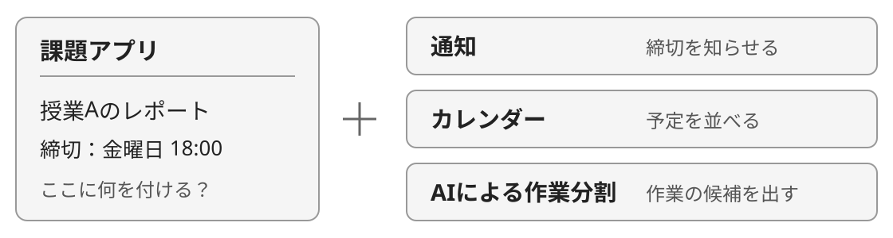
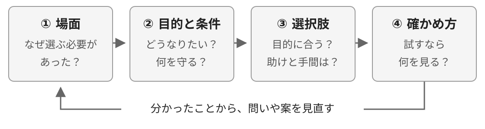
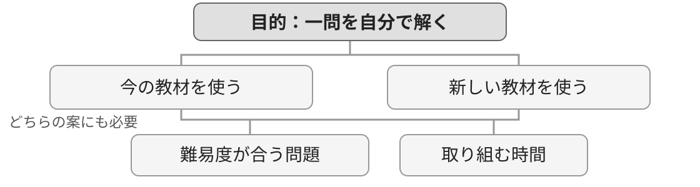
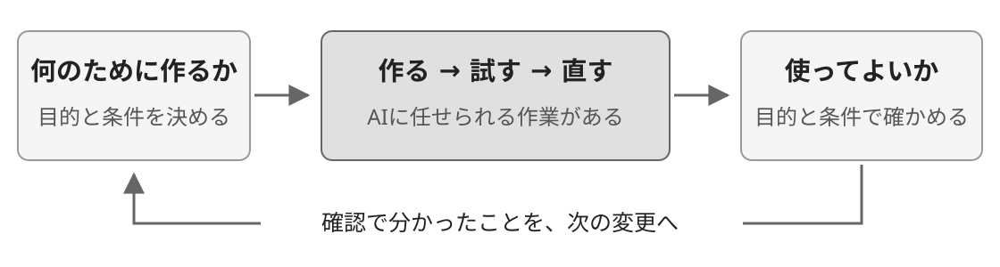
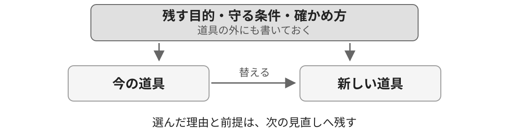
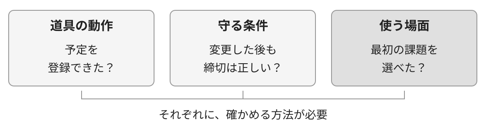
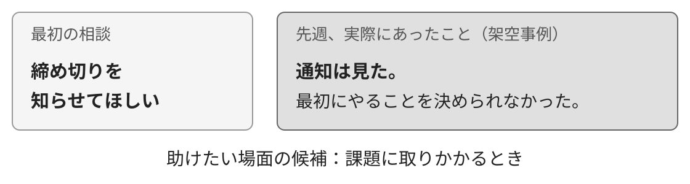
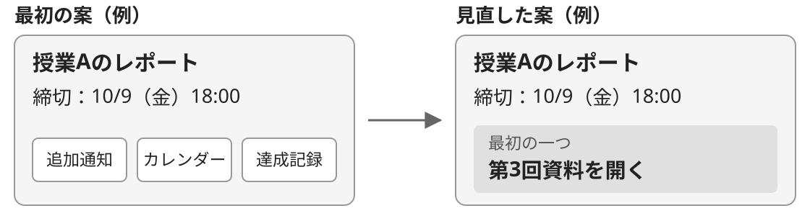

<!--
_backgroundColor: #0a1929
_color: white
_class: title dark
-->

# 足さない練習

### AIで作れる時代に、何を足すか考える

学生向けワークショップ · 60分 @nwiizo · 2026

---

## AIで、機能を試作しやすくなった

「課題の締め切りを知らせるアプリを作って」。 AIにコードを書いてもらい、動かして直すところから始められます。

作ってみたい機能は、いろいろ出てきます。 では、<strong>どれが必要で、どれは今なくてもよいのでしょうか。</strong>

参考：Osmani, <em>Agentic Engineering</em>, Early Release, <a href="https://learning.oreilly.com/library/view/agentic-engineering/0642572392291/ch01.html">第1章</a>。図は説明用の例。

---

## 考え方を知ってから、自分の選択で試す

道具を増やす、教材を買う、予定を引き受ける。そんな選択でも考えてみます。

<strong>0〜24分</strong>場面 → 目的と条件 → 選択肢 → 確認、のつながりを知る

<strong>24〜32分</strong>① 題材を選び、選ぶ必要があった場面を書く

<strong>32〜40分</strong>② どうなりたいか、何を守りたいかを書く

<strong>40〜48分</strong>③ 二案を比べ、選ぶものと見送るものを決める

<strong>48〜60分</strong>④ 確かめ方を考える（56分まで）／振り返る（残り4分）

題材は、自分が最近経験した選択、または主催者が用意する共通事例です。 個人ワークで進め、発表は希望者だけ。開発経験やAIのアカウントは不要です。

---

## 選ぶ前に、四つの問いをつなげる

「これが欲しい」「これを作りたい」と思ったところから、少し戻って考えます。

①の出来事から、②の「どうなりたいか」を考えます。 ②を使って③の案を比べ、④で本当に役立つか確かめます。

三冊を参考にした本ワークショップ独自の整理。Kaiser, <em>Architecture for Flow</em>, 第1・2・8・11章／Osmani, <em>Agentic Engineering</em>, 第5章／Fowler, <em>Regenerative Software</em>, 第3・5章。

---

## ① 場面：新しい教材が欲しくなった

まず、こんな場面を考えます。説明用の架空の例です。

問題を解いてみたけれど、途中で止まった。 解説を読んでも、その一行が分からなかった。  「別の教材なら、分かるかもしれない。」

この時点で、「どの教材を買うか」を考えることはできます。 その前に、何が分かっていて、何がまだ分からないかを見てみます。

参考：Kaiser, <em>Architecture for Flow</em>, <a href="https://github.com/nwiizo/architecture-for-flow/blob/main/content/ja/01.md">第1章</a>・第8章。以下の教材・予定表の場面は、本ワークショップの説明用の例です。

---

## 起きたことと、考えた理由を分ける

<strong>分かっていること</strong> 問題の途中で止まった。 今の解説の一行が分からなかった。

<strong>まだ分からないこと</strong> 別の教材なら、その一行が分かるのか。 もっと前の内容を確かめる必要があるのか。

「分からなかった」から、すぐに「教材が足りない」とは決められません。 分からない一行を誰かに見せると、どこを確かめればよいか見つかるかもしれません。

理由の候補は持っていて構いません。分かっていることと分けておきます。

参考：Kaiser, <em>Architecture for Flow</em>, 第1・8章の、ニーズと現状を確かめる見方を応用。

---

## 困っている場所が違えば、助け方も変わる

「勉強が進まない」だけでは、何を変えればよいか決まりません。

<strong>読んでも分からない</strong> 説明の仕方を変える。 どこで分からなくなったか、一緒に見る。

<strong>読む時間が取れない</strong> 取り組む時間や範囲を見直す。 教材を増やしても、時間は増えない。

だから最初に、「最近、いつ、何をしようとして止まったか」を確かめます。 どちらにも当てはまるなら、今いちばん考えたい場面を一つ選びます。

参考：Kaiser, <em>Architecture for Flow</em>, 第1・8章。困り方の違いを説明するための例。

---

## 教材を買って、何ができるようになりたい？

ここでは、「止まった問題を、自分で一問解けるようになりたい」と考えます。

新しい教材で、別の説明を読む。 今の教材の、前の例題へ戻る。 分からない一行を、先生や友人に質問する。

できるようになりたいことを<strong>目的</strong>、そのための方法を<strong>手段</strong>と呼びます。 目的を置くと、「買う」以外の方法も比べられます。

参考：Kaiser, <em>Architecture for Flow</em>, 第1章の、必要なことと実現手段を分ける見方を応用。

---

## 道具だけでなく、使える条件を見る

今の教材でも、新しい教材でも、取り組む時間は必要です。 図の線は、「役立つために何が必要か」を表しています。

教材を選ぶときは、説明のよさだけでなく、<strong>実際に使う時間を取れるか</strong>も見ます。

Kaiser, <em>Architecture for Flow</em>, 第1章の依存関係を参考にした自作図。ウォードリーマップの全体を表すものではありません。

---

## 今夜の30分を、何に使うか

今夜、勉強に使える時間が30分だとします。

<strong>勉強の記録を整える</strong> 項目を増やす。色をそろえる。 見返しやすい形を考える。

<strong>止まった問題へ戻る</strong> 分からない一行を確かめる。 前の例題を解き直す。

記録を整えることが助けになる場合もあります。 ただ、同じ30分を使います。今の目的に、どちらが役立ちそうでしょうか。

参考：Kaiser, <em>Architecture for Flow</em>, <a href="https://github.com/nwiizo/architecture-for-flow/blob/main/content/ja/02.md">第2章</a>の、力をかける部分を選ぶ見方を応用。30分は説明用の設定。

---

## 作ること自体が目的なら、選び方も変わる

もし「勉強の記録アプリを作って、プログラミングを覚えたい」なら、どうでしょうか。

アプリを作る時間も、目的に向かう時間になる。 既存のアプリを使うだけでは、学べないこともある。

だから、今あるものを使う案が、いつも正解とは限りません。 <strong>何をできるようにしたいかが変われば、選ぶ案も変わります。</strong>

参考：Kaiser, <em>Architecture for Flow</em>, 第2章の選択を、学習目的へ応用した例。事業上の差別化と個人の学習は異なります。

---

## ② 目的と条件：何を守りながら選ぶ？

できるようになりたいことに加えて、使える時間や費用も書いておきます。

<strong>目的</strong> 止まった問題を、自分で一問解けるようになる。

<strong>今回の条件</strong> 今夜使えるのは30分。 今回は追加のお金を使わない、と決めたとする。

この条件なら、今の教材や、すでに見られる解説から試せます。 お金や時間の条件が違えば、候補は変わります。自分の題材では、自分の条件を書きます。

参考：Osmani, <em>Agentic Engineering</em>, Early Release, 第5章／Fowler, <em>Regenerative Software</em>, Early Release, 第3章。条件は説明用の設定。

---

## AIに「勉強しやすい予定表」を頼んだら

ここからは、勉強の予定をAIに考えてもらう例で、条件の伝え方を見ます。

いつ勉強する？ どの課題から始める？ 授業やアルバイトの予定を、動かしてよい？

「勉強しやすい」の一言には、まだ決まっていないことが含まれています。 出来上がった予定表を見てから、その違いに気づくかもしれません。

参考：Osmani, <em>Agentic Engineering</em>, Early Release, <a href="https://learning.oreilly.com/library/view/agentic-engineering/0642572392291/ch05.html">第5章</a>の、依頼に含まれる判断を明示する見方。

---

## 決めていることは、先に伝える

たとえば、予定表の依頼をこう具体的にできます。

帰宅したとき、最初に取り組む課題を選べるようにしたい。 授業とアルバイトの予定は動かさない。 まず今週の案だけ作って、カレンダーにはまだ登録しない。

何のために頼むか、何を変えないか、どこまで頼むか。 先に書くと、出来上がった案を確かめるときにも使えます。

参考：Osmani, <em>Agentic Engineering</em>, Early Release, 第5章の目的・守る条件・作業範囲。

---

## その予定を考えるのに、何が必要？

課題の名前だけでは、いつ取り組むのがよいかは決めにくいはずです。

課題の締切は、いつか。 授業とアルバイトは、いつ入っているか。 そのほかに、動かせない予定はあるか。

必要な情報を、いま使えるものからそろえます。 古い時間割も残っているなら、どちらを使うか分かるようにします。

参考：Osmani, <em>Agentic Engineering</em>, Early Release, <a href="https://learning.oreilly.com/library/view/agentic-engineering/0642572392291/ch04.html">第4章</a>。AIへ渡す情報を選び、整理する見方を応用。

---

## 分からないところまで、決めたことにしない

課題に何分かかるかは、取り組んでみないと分からないかもしれません。

分かっている：締切は、明日の18時。 仮に置く：今夜、まず30分取り組む。 まだ不明：その30分で、どこまで進められるか。

「30分取り組む予定」と「30分で終わる」は、別です。 不明なところを残しておけば、試した後に、どこを直すか分かります。

参考：Osmani, <em>Agentic Engineering</em>, Early Release, 第4・5章。日時と時間は説明用の設定。

---

## 出来上がったら、最初の目的に戻る

予定表なら、帰宅したときに、最初の課題を選べそうでしょうか。 授業やアルバイトの時間は、守られているでしょうか。

動くものや、見た目の整った案ができても、<strong>使ってよいかを決める確認</strong>は残ります。

Osmani, <em>Agentic Engineering</em>, Early Release, 第1章の、作る反復とその前後の判断を整理した自作図。

---

## 案を作るところまで、任せることもできる

予定の案を出すことと、その予定を人に送ることでは、間違えたときの影響が違います。

<strong>案を出してもらう</strong> 元の時間割と比べる。 合わなければ直してから使う。

<strong>予定を変えて人に送る</strong> 誰に届くか、送る内容は正しいか、間違ったらどう直すかも確かめる。

「まず案だけ」「登録する前に見せて」と、頼む範囲を分けられます。 たくさん任せること自体を、目標にする必要はありません。

参考：Osmani, <em>Agentic Engineering</em>, Early Release, 第2・3章の、影響と確認方法に合わせて任せる範囲を決める見方。

---

## ③ 選択肢：よい点と、かかる手間を比べる

ここまでで、目的と条件を言葉にしました。次は、その基準で二案を比べます。

できるようになりたいことに、どう役立つ？ 時間や費用など、守りたい条件に収まる？ 使い始めるとき、使い続けるときに、何をする必要がある？

一つは、今あるものを使う案や、小さく試す案にします。 今のままなら、困っていることが残るかもしれません。それも比べる材料です。

参考：Kaiser, <em>Architecture for Flow</em>, 第1・2章。目的への効果と、実現・利用に必要な手間を比べる見方を応用。

---

## アプリを増やすと、直す場所も増える？

予定のアプリを、もう一つ使うとします。

最初の予定は、どちらに入力する？ 締切が変わったら、両方を直す？ 違う日時が出てきたら、どちらを確かめる？

新しい機能だけでなく、こうした手間も使う人が引き受けます。 自動で同じ情報にそろえられるなら、手間が減るかもしれません。そこまで見て比べます。

参考：Kaiser, <em>Architecture for Flow</em>, 第5章の認知負荷を、個人の道具の使い方へ応用した例。

---

## 古いメモをやめる前に、残すものを見る

新しいアプリに移したから、古いメモはもう不要。そう決める前に確かめます。

そのメモにしかない締切や、先生からの注意はない？ 友人と共有していて、まだそこを見ている人はいない？ 新しい方に移し忘れたものはない？

メモが一枚でも、そこに頼っている情報や人はいるかもしれません。 小さいかどうかに加えて、<strong>なくしたときに何が困るか</strong>を見ます。

参考：Fowler, <em>Regenerative Software</em>, Early Release, <a href="https://learning.oreilly.com/library/view/regenerative-software/0642572383954/ch02.html">第2章</a>の、置き換えと依存関係を考える見方を応用した例。

---

## 道具が替わっても、締切は正しく知りたい

紙の予定表でも、アプリでも、正しい締切が分かることは残したいはずです。

替える前に、残す情報や使い方を書いておきます。 替えた後も同じ項目で確かめれば、必要なものを落としていないか見られます。

Fowler, <em>Regenerative Software</em>, Early Release, 第3章を身近な道具へ応用した自作図。

---

## ④ 確認：予定表ができたら、助かった？

予定表は完成しました。でも、最初に困っていたことは解消したでしょうか。

目的は、帰宅したときに、最初の課題を選べるようになること。  実際に帰宅したとき、何を見る？ そこから、取り組む課題を選べる？

出来上がったものを、使う場面に戻して考えます。 完成したことと、役立ったことを、分けて確かめます。

参考：Fowler, <em>Regenerative Software</em>, Early Release, 第5章の、必要な動作と実利用を確かめる見方。

---

## どこまで確かめたかを、分けておく

予定を登録できた。それは一つ、確かめられたことです。 ただ、それだけでは締切の正しさや、使ったときの行動までは分かりません。

今日のメモでは、理由の抜けや、条件の見落としを探せます。 実際に役立つかは、使う人と試すこととして残します。

Fowler, <em>Regenerative Software</em>, Early Release, 第5章を参考にした自作図。書籍の評価基盤そのものではありません。

---

## 確認することが、目的とずれていない？

「最初の課題を選べるようにしたい」のに、見た目だけを確かめたらどうでしょうか。

文字がそろっている。予定がきれいに並んでいる。 でも、今日どれから始めるかは、まだ分からない。

丁寧に確かめても、確かめる内容が違えば、困りごとは残ります。 「役立ちそう」と思ったら、何を見てそう判断したか、目的に戻って確かめます。

参考：Fowler, <em>Regenerative Software</em>, Early Release, <a href="https://learning.oreilly.com/library/view/regenerative-software/0642572383954/ch05.html">第5章</a>。確認項目が利用者の目的を取りこぼす問題を、予定表へ置き換えた例。

---

## まず、一つの課題で試してみる

全部の予定を移す前に、次の課題一つで、使い方を試せます。

帰宅して、予定表を見る。 最初にやることを一つ選ぶ。 選べなかったら、どこで迷ったかを残す。

ここで見るのは、まず「取りかかる課題を選べたか」です。 課題を終えられるか、締切に間に合うかは、その後にも確かめる必要があります。

参考：Kaiser, <em>Architecture for Flow</em>, 第8・10・11章／Fowler, <em>Regenerative Software</em>, Early Release, 第5章。段階を分けて試し、結果を見直す考え方を応用。

---

## 助かったことと、面倒になったことを書く

試した後に、こんなことが分かったとします。結果を考えるための架空の例です。

助かった：今日取り組む課題を、選びやすくなった。 まだ困る：難しい問題では、やはり止まる。 増えた手間：予定の入力に、毎回時間がかかる。

助かった部分は残す。入力の手間は減らせないか考える。 道具だけでは解決しなかったところには、別の助けを探します。

参考：Kaiser, <em>Architecture for Flow</em>, 第8・11章の、改善した問題・残った問題・新しい問題を見直す考え方。

---

## 一度うまくいったら、毎回使える？

取りかかる課題を選べたとしても、今回だけの事情があるかもしれません。

今日は課題が一つしかなかった？ いつもより時間に余裕があった？ 誰かが横で説明してくれた？

「今回は使えた」という結果は残せます。 別の場面でも使えそうか、次に確かめたい条件を一つ考えます。

参考：Fowler, <em>Regenerative Software</em>, Early Release, 第5章の、確認した結果がどの条件で成り立つかを見直す考え方。

---

## 選んだ理由を、一行残しておく

教材の例に戻ります。「今週は買わない」と決めたら、理由も残します。

今の教材に、まだ解いていない前の例題がある。 今夜は30分使えるので、まずその例題から試す。

「買わない」という結論だけでは、あとで読んでも理由が分かりません。 何が分かっていて、何を試そうとしたのかまで残すと、次の判断に使えます。

参考：Fowler, <em>Regenerative Software</em>, Early Release, <a href="https://learning.oreilly.com/library/view/regenerative-software/0642572383954/ch06.html">第6章</a>の、判断理由を残す見方を応用。

---

## 条件が変わったら、選び直してよい

「前の例題を試す時間がある」。これが、さきほどの案を選ぶ前提です。

そこでも分からなかったら、止まった箇所を見せて質問する。 今夜の時間が取れなくなったら、取り組む時期や範囲を考え直す。

理由を残すのは、最初の結論を守り続けるためではありません。 <strong>何が変わったら考え直すか、自分で分かるようにするためです。</strong>

参考：Fowler, <em>Regenerative Software</em>, Early Release, 第6章の、判断が成り立つ前提の見直し。

---

## ここまでを、自分の選択に使う

新しい案を思いついたら、次の四つをつなげて考えます。

「足さない」は、最初から決まっている答えではありません。 足す場合も見送る場合も、<strong>何のために選んだか</strong>を説明できるようにします。

三冊を参考にした本ワークショップ独自の整理。書籍との対応は末尾の参考文献と進行ガイドに記載。

---

## ここから、自分が考える題材を選ぶ

<strong>自分が最近経験した選択</strong> 道具を増やすか、教材を買うか、 活動や予定を引き受けるか、など。  選んだ後でも、迷っている途中でも構いません。

<strong>主催者が用意する共通事例</strong> 配られた事例を使います。 この資料にも、課題用の道具を増やすか考える例があります。  経験を思い出しにくい人も使えます。

一つの場面、一つの選択に絞ります。途中で共通事例へ替えても構いません。 個人的な事情を話す必要はありません。人の名前は伏せ、発表も任意です。

---

## 共通事例：課題用の道具を増やす？

<strong>架空事例。</strong>Aさんは大学1年生。課題の説明と提出先は大学の授業サイトにあり、 スマートフォンのメモとカレンダーを使っています。

「課題を出し忘れるので、新しい通知アプリを入れようか迷っています。」  「先週は前日の夜に通知を見て、金曜18時までだと分かっていました。 でも、資料をどこから読んで、何を書けばいいか決められず、画面を閉じました。 次の日も別の課題があって、提出が間に合いませんでした。」

Aさんは、今の道具の使い方を変えるか、新しいものを加えるかを考えています。 課題名と正しい締切の日付・時刻は残し、提出先は大学の授業サイトを使います。

この事例を使う場合の材料です。自分の経験や、主催者が別に用意した事例でも、同じ四つの問いを使います。

---

## 紙を、四つの問いと同じ欄に分ける

紙と筆記具、またはメモアプリを使います。

<strong>① 場面</strong> 選択が必要になった出来事 分かっていたこと／不明なこと

<strong>② 目的と条件</strong> どうなりたいか 何を見れば分かるか／守ること

<strong>③ 選択肢</strong> 比べた二案／選んだ理由 引き受ける負担／見送るもの

<strong>④ 確かめ方</strong> 見つかった抜けや矛盾 見直す条件／次に試すこと

持ち帰るのは、選択とその理由がつながったメモです。 必要なら図を描いても構いません。画面の作成やプログラミングは不要です。

---

## ワーク①　選ぶ前の場面を書く

<strong>24〜32分：題材と指示3分 → 記入4分 → 確認1分</strong>

<ol>
<li>題材を一つ選び、①に「何を選ぼうとしていたか」を書きます。</li>
<li>その選択が必要になった出来事を、具体的に書きます。</li>
<li>分かっていたことと、不明なことを分けます。</li>
</ol>

書き出し：「＿＿のとき、＿＿しようとしていた。そこで＿＿を選ぼうとした。」 理由を推測した箇所には「仮」、後から知った情報には「後」と添えます。

共通事例なら、書かれていない事情は不明のままで構いません。 自分の経験なら、覚えていない理由を無理に埋める必要はありません。

---

## ワーク②　目的と、守る条件を決める

<strong>32〜40分：説明2分 → 記入4分 → 確認2分</strong>

<ol>
<li>②に「＿＿の場面で、＿＿できるようにしたい」と書きます。</li>
<li>それができたら、何を見れば分かるかを一つ書きます。</li>
<li>方法を替えても守りたい条件を、一つか二つ書きます。</li>
</ol>

「便利にする」「ちゃんとやる」で止まったら、 見るものや行うことまで具体的にしてみてください。

過去の選択を扱う人は、当時の目的を振り返ります。 今は目的が変わっているなら、その違いを追記します。

---

## 「何を増やすか」の前に、「どうなりたいか」

共通事例で、Aさんが課題を始める場面を選んだ場合です。

「AIの作業分割機能を付ける」 ↓ それで何ができるようになる？ 「課題を開いたとき、最初にやることを一つ選べる。」

こう書くと、AIの機能、今のメモ、先生に聞くことを、同じ目的で比べられます。

「提出し忘れをなくす」は大きな目標です。まず、助けたい一場面へ絞ります。 自分の題材でも、①のどの出来事から目的を決めたか確かめてください。

---

## 減らしても、失うと困るものがある

共通事例で、課題の締切を「金曜日」だけに書き直したとします。

18時までなのか、夜中までなのか分かりません。 次にやることが見えても、締切を間違えるメモでは困ります。

見やすくするために情報を減らすなら、正しい日付と時刻は残します。 必要なものまで削ることは、今回の目的ではありません。

自分の題材では、何を失うと困りますか。 時間、費用、すでに助けになっているものなどから、②の条件を確かめます。

Fowler, <em>Regenerative Software</em>, Early Release, 第3・5章の、実装を替えても守る動作と確認を応用。

---

## ワーク③　二案を比べ、選ぶ理由を書く

<strong>40〜48分：例と指示2分 → 比較・記入4分 → 確認2分</strong>

<ol>
<li>③に二案を書きます。一つは、今あるものを使う案や小さく試す案にします。</li>
<li>②の目的に役立つか、条件を満たすか、どんな負担があるかを比べます。</li>
<li>一つを仮に選び、理由と、今回は見送るものを書きます。</li>
</ol>

過去の選択なら、当時の案と、今考えた別案を並べても構いません。 ただし、後から知った情報で考えた案は、当時の案と区別してください。

数の少なさで採点しません。①の場面と②の目的が、選ぶ理由につながっているかを見ます。

---

## 比べるのは、助けになる点と負担

共通事例で「最初にやることを選べる」を目的にした場合の例です。

<strong>A：今のメモを使う</strong> 説明を読み、最初の一つを一行で残す。分からない説明は先生に聞く。  新しい道具を覚えずに試せる。 何を書くかを考える手間は残る。

<strong>B：AIで作業の候補を出す</strong> 課題の説明から候補を出し、自分で確認して一つ選ぶ。  考え始める手がかりになる。 入力と、説明に合うかの確認が要る。

どちらも課題名と正しい締切を残します。どちらが助けになるかは、まだ未確認です。 自分の案でも、よい点だけでなく、引き受ける手間を一つ書いてください。

---

## 「今回は見送る」にも、理由を添える

③を、①と②につなげて読んでみます。

「＿＿という場面で、＿＿できるようにしたい。 だから今回は＿＿を選ぶ。＿＿の負担は引き受ける。 ＿＿は、この目的への必要性がまだ分からないので見送る。」

すでに使っているものを消す必要はありません。 新しい購入、追加の機能、予定を増やすことなどから、今決めなくてよいものを探します。

足す必要があると考えたなら、それがないと何に困るかを書きます。 まだ判断できない場合は、決めるために必要な情報を残せます。

---

## ワーク④　理由のつながりを確かめる

<strong>48〜56分：説明1分 → 読み直し2分 → 条件の見直し2分 → 次の試行3分</strong>

<ol>
<li>①から③を読み、場面・目的・選んだ案がつながっているか確かめます。</li>
<li>条件を一つ変えて考え、選び直す必要があるか見ます。</li>
<li>④に、次に何を試し、何を見て判断するかを書きます。</li>
</ol>

過去の結果を知っている人も、理由を後付けしないように分けて書きます。 結果がよかったことだけでは、選んだ方法が理由だったとは言い切れません。

実行していない案を「うまくいった」とはせず、確認する計画までを書きます。

---

## 目的に合うと判断した根拠はある？

<strong>49〜51分：自分のメモを読み直す</strong>

①のどの出来事から、②の目的を決めた？ ③を選ぶ理由に、②の目的と条件を使っている？ 「きっと便利」「みんな使っている」だけで埋めた箇所はない？

根拠が見つからなければ、そこに「未確認」と書きます。 案を変えるか、使う人に聞きたいことを一つ足してください。

共通事例では、「通知を増やせば始められる」のか、まだ分かりません。 自分の題材でも、起きた事実と期待している効果を分けて読みます。

---

## 条件が変わっても、同じ案を選ぶ？

<strong>51〜53分：条件を一つだけ変えて考える</strong>

自分の題材：使える時間が半分なら？　予算が少なければ？ 共通事例：課題の説明を外部のAIサービスへ入力できないなら？  自分が選んだ案に関係する条件を、一つ選びます。

それでも同じ案を選ぶか、別案へ替えるか。理由を④に書きます。 条件を守る工夫が必要なら、その手間も③に足します。

ここで変える条件は、考えるための仮定です。実際に起きたことと混ぜずに残します。 案を変えなくても、同じ案を選べる理由が分かれば十分です。

---

## 次に試すことを、一つ決める

<strong>53〜56分：④に、確かめる計画を書く</strong>

いつ、誰が、何を一つ試す？ ②の目的に近づいたか、何を見る？ どんな結果なら、案を見直す？

共通事例の記入例：次の課題で、Aさんが今のメモに「最初の一つ」を書く。 課題に取りかかれたか、どこで迷ったかを聞く。書く内容で止まるなら助け方を変える。

架空事例では、試す計画までを成果にします。本人の反応は創作しません。 自分の題材なら、次に似た選択をするとき、何を確かめるかを書いても構いません。

---

## 自分の選択を、四つの問いで説明する

<strong>56〜58分：メモを見ながら、短い説明を作る</strong>

① ＿＿という場面で、選ぶ必要があった。 ② ＿＿できるようにしたい。＿＿は守りたい。 ③ だから＿＿を選び、＿＿は見送る。 ④ ＿＿を試し、＿＿なら見直す。

最初のメモを消さず、変えた箇所と理由を追記します。 新しく分かったことがあれば、それも残します。

案を替えたかどうかより、何を根拠に選んだかを、自分で説明できるか確かめます。

Fowler, <em>Regenerative Software</em>, Early Release, 第6章の判断理由と前提を残す見方を応用。

---

## 足す前に、その選択の理由を残す

<strong>58〜60分：希望者の共有とまとめ</strong>

共有する人は一人、30秒を目安に、「何を選び、何を見送ったか」を話します。 ほかの人は、自分の題材で次に確かめたいことを一つ見直してください。

場面から目的を決める。 目的と条件で選択肢を比べる。 試して分かったことから、選び直す。

足さないと決める日も、必要なものを足す日もあります。 どちらも、何をよくしたいかに戻って選ぶための練習です。

---

<!--
_backgroundColor: #0a1929
_color: white
_class: title dark
-->

# 足さない練習

### 何を選んだか。その理由を、次の選択へ。

---

## 補足：考え方をさらに知りたい人へ

<strong>Architecture for Flow</strong> · Susanne Kaiser 誰に何が必要かを考え、必要な仕組みや人の関わり方を組み立てる本。 目的と手段を分け、どこに工夫や時間を使うか考える背景にしています。

<strong>Agentic Engineering</strong> · Addy Osmani AIに何を任せ、何を確かめるかを考える本。 目的・条件・頼む範囲を言葉にする説明の背景にしています。

<strong>Regenerative Software</strong> · Chad Fowler ソフトウェアを作り直しても、必要な動きや判断理由を残すことを考える本。 道具を替える前後の確認と、選んだ理由を残す説明の背景にしています。

以下は読み返すための補足です。60分の本編には含めません。身近な例への置き換えは、本ワークショップ独自の整理です。

---

## 補足：すでに使える仕組みはある？

必要な仕組みが、すでに使える形で世の中にあるか。自分で試しながら作る必要があるか。 作るか、既存のものを使うかを考えるときの材料になります。

<strong>縦の見方</strong>：利用者のニーズから、それを支えるものへたどる。 <strong>横の見方</strong>：まだ探索中か、製品として普及しているか、広く標準化されているか。

この二つの見方を図にしたものが、ウォードリーマップです。 ただし、広く使われているものでも、自分たちの仕事の特徴を支える部分なら、自作を考える場合があります。

横軸は時間割や、作り手の技術力ではありません。自作したものが必ず左側になるわけでもありません。

Kaiser, <em>Architecture for Flow</em>, <a href="https://github.com/nwiizo/architecture-for-flow/blob/main/content/ja/01.md">第1章</a>・<a href="https://github.com/nwiizo/architecture-for-flow/blob/main/content/ja/02.md">第2章</a>。以下の補足は60分の本編に含めません。

---

## 補足：同じ名前でも、必要なルールは違う

発表を募集するときと、当日の予定を作るときでは、必要な情報が違います。

<strong>応募された発表</strong> 内容を読んで、採用するか検討する。 開催当日の部屋や時間帯は、まだ決まっていない。

<strong>予定に組み込む発表</strong> 部屋と時間帯が必要になる。 同じ発表を、重複して予定に入れないルールも必要。

「発表」という同じ名前でも、一緒に扱う情報や守るルールは違います。 こうした意味が通じる範囲を区切る考え方を、DDDでは「境界づけられたコンテキスト」と呼びます。

単に小さく分ける前に、何を一緒に考える必要があるかを確かめます。

Kaiser, <em>Architecture for Flow</em>, <a href="https://github.com/nwiizo/architecture-for-flow/blob/main/content/ja/03.md">第3章</a>の事例を要約。DDDは、対象の仕事の知識を中心に設計する考え方です。

---

## 補足：道具を渡す以外にも、助け方がある

困っている人に、新しい道具を渡す。ほかにも、助け方はあります。

<strong>一緒に探る</strong>分からないことを、期間を区切って共同で調べる。

<strong>利用できる形にする</strong>相手が毎回頼まなくても、必要な機能を使えるようにする。

<strong>学べるように助ける</strong>足りない知識や技能を身につけ、相手が自分で進められるようにする。

道具が足りないのか、使い方が分からないのか、まだ解き方が分からないのか。 困っている場所に合わせて、助け方も選べます。

参考：Kaiser, <em>Architecture for Flow</em>, <a href="https://github.com/nwiizo/architecture-for-flow/blob/main/content/ja/05.md">第5章</a>・<a href="https://github.com/nwiizo/architecture-for-flow/blob/main/content/ja/07.md">第7章</a>。Team Topologiesのチーム間の関わり方を相談へ応用。個人をチームタイプに分類するものではありません。

---

## 補足：任せる範囲と、同時に頼む数は別

AIへの頼み方には、別々に決められることがあります。

<strong>どこまで任せるか</strong> 一つずつ確認して進めるか。 目標を渡して、続けて取り組んでもらうか。

<strong>いくつ同時に頼むか</strong> 一つに集中するか、複数に分担するか。 分担するなら、結果を合わせて確かめる必要もある。

一つのAIに長く任せることと、複数のAIに短い作業を頼むことは、違う選択です。 両方を最大にすることを目標にせず、影響と確認できる範囲に合わせます。

Osmani, <em>Agentic Engineering</em>, Early Release, <a href="https://learning.oreilly.com/library/view/agentic-engineering/0642572392291/ch02.html">第2章</a>。特定ツールの現在の性能や対応状況を示すものではありません。

---

## 補足：作り替えても残す、四種類の知識

アプリを作り直すなら、コードのほかにも、引き継ぎたいことがあります。

<strong>何のために作るか</strong>誰が、何をできるようにしたいか。

<strong>どこを分けるか</strong>どの部分が何を受け持ち、どうつながるか。作る前の条件にする。

<strong>どう確かめるか</strong>作り方が替わっても、必要な動きが続くか確かめる。

<strong>なぜこうしたか</strong>選んだ理由、見送った案、判断に使った条件を残す。

作り直すたびに、同じことを一から調べ直さなくて済むようにします。

Fowler, <em>Regenerative Software</em>, Early Release, <a href="https://learning.oreilly.com/library/view/regenerative-software/0642572383954/ch03.html">第3章</a>の Intent / Compilation / Evaluations / Provenance を要約。Compilation は通常のコード変換だけを指していません。

---

## 補足：変える速さと、減らし方も設計する

作り直す回数が増えると、古いものや重複したものが残ることもあります。

<strong>変える速さ</strong>実験する部分と、多くのものを支える部分で、変更の慎重さを変える。

<strong>削除</strong>何が頼っているかを調べ、必要な動作を守って外せるようにする。

<strong>整理する</strong>必要な意味を残しながら、重複や、今は使わないものを減らす。

確認の仕組みにも費用がかかります。変化が少ない部分まで、同じ仕組みを一律に作り込みません。 また、自然言語の意図から安定して構造を生成する部分には、未解決の課題があります。

Fowler, <em>Regenerative Software</em>, Early Release, <a href="https://learning.oreilly.com/library/view/regenerative-software/0642572383954/ch03.html">第3章</a>の Pace / Deletion / Compaction、第2章の適用コスト、第4章の構想上の限界。汎用の自動再生成が完成済みとはしていません。

---

## 補足：小さな変更でも影響は外へ広がる

Chad Fowlerが、タスクを管理するアプリ「Wunderlist」で経験した話です。

小さな機能を置き換えようとした。 中身は読めたが、ほかのデータと結び付ける仕組みに、分かっていない前提があった。 置き換えると対応が崩れ、利用者にはデータが消えたように見えた。

中身が小さくても、その外側が何に頼っているか分からなければ、替えるのは難しい。 本編の「古いメモをやめる前に、そこに頼っている情報や人を見る」という説明の背景です。

Fowler, <em>Regenerative Software</em>, Early Release, <a href="https://learning.oreilly.com/library/view/regenerative-software/0642572383954/ch02.html">第2章</a>の著者の経験を要約。講演者自身の経験ではなく、一般的な発生頻度を示すものでもありません。

---

## 補足：必要な使い方が、確認から抜けていた

Chad Fowlerは、高校向けのソフトウェアを作り直した経験も紹介しています。

用意したテストには、すべて通った。 しかし、教室で必要だった使い方が、そもそも確認項目に入っていなかった。 利用者は困り、最終的に以前のシステムへ戻した。

テストは、決めた動きを確かめる助けになります。 ただし、何を確かめるべきかを取り違えると、必要な使い方を見落とします。

本編では、予定表の見た目だけを確かめても、最初の課題を選べるかは分からない、と置き換えました。

Fowler, <em>Regenerative Software</em>, Early Release, <a href="https://learning.oreilly.com/library/view/regenerative-software/0642572383954/ch05.html">第5章</a>の著者の経験を要約。この一件からテスト一般が無効とは言えません。

---

## 補足：希望と、起きた出来事を分ける

共通事例の発言を整理すると、次に聞きたいことが見えてきます。

「資料をどこから読めばよいか、説明はありましたか」と、さらに聞けます。 この一件から、ほかの課題でも通知が不要とは決められません。

図はAさんの架空事例を整理したもの。利用者一般の調査結果ではありません。補足は60分の本編に含めません。

---

## 補足：道具の案を、紙で試すなら

共通事例で「最初の一つ」を目立たせる案を、画面にする場合の例です。

紙で必要な情報を指せるか、書き漏れがないかを確かめられます。 実際に取りかかれるかは、使う人と試すこととして残ります。

演習用の案。機能を減らす効果や提出率の改善を実証したものではありません。画面作成は任意の発展課題です。

---

## 補足：AIに実装を頼むなら、メモを使う

道具を作ることを選んだ場合は、四つの欄を依頼の材料にできます。

<strong>場面</strong>：課題を開いても、どこから始めるか迷っている。 <strong>目的と条件</strong>：最初の一つを選べる。課題名と正しい締切は残す。 <strong>選ぶ範囲</strong>：まず一行のメモを試す。達成記録は今は作らない。 <strong>確かめ方</strong>：課題を一つ入れ、次の行動と締切を確認する。

実装する場合には、保存や通知など、実際の動作を確かめる項目も必要です。 このメモだけで完成とせず、不明なことを相談しながら具体化します。

Osmani, <em>Agentic Engineering</em>, Early Release, 第5章。Fowler, <em>Regenerative Software</em>, Early Release, 第3・5章。

---

## このワークの背景にある三冊

<strong>Susanne Kaiser, <em>Architecture for Flow</em></strong>（Addison-Wesley Professional, 2025） 必要なことと実現手段を分け、現状と変更案を比べる見方。 <a href="https://github.com/nwiizo/architecture-for-flow/blob/main/content/ja/01.md">第1章</a>・<a href="https://github.com/nwiizo/architecture-for-flow/blob/main/content/ja/02.md">第2章</a>・<a href="https://github.com/nwiizo/architecture-for-flow/blob/main/content/ja/08.md">第8章</a>・<a href="https://github.com/nwiizo/architecture-for-flow/blob/main/content/ja/11.md">第11章</a>

<strong>Addy Osmani, <em>Agentic Engineering</em></strong>（O’Reilly, Early Release） 作業をAIに頼むときも、目的と確認できる条件を用意する見方。 <a href="https://learning.oreilly.com/library/view/agentic-engineering/0642572392291/ch01.html">第1章</a>・<a href="https://learning.oreilly.com/library/view/agentic-engineering/0642572392291/ch05.html">第5章</a>

<strong>Chad Fowler, <em>Regenerative Software</em></strong>（O’Reilly, Early Release） 作り直せるものと、残すべき目的・動作・判断理由を分ける見方。 <a href="https://learning.oreilly.com/library/view/regenerative-software/0642572383954/ch03.html">第3章</a>・<a href="https://learning.oreilly.com/library/view/regenerative-software/0642572383954/ch05.html">第5章</a>・<a href="https://learning.oreilly.com/library/view/regenerative-software/0642572383954/ch06.html">第6章</a>

四つの問いは三冊を参考にした本ワークショップ独自の整理です。<a href="../../docs/practice-not-adding-workshop.md">進行ガイド</a>に参照した全23章の対応を記載。Aさんや学習の例・画面は架空です。Fowlerの二つの経験とKaiserのイベント運営の例は、出典を付けて書籍から要約しています。

