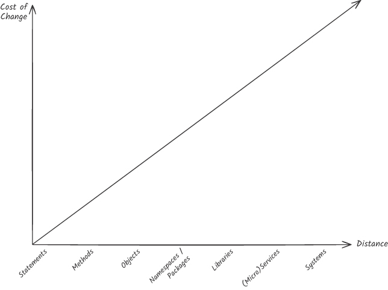
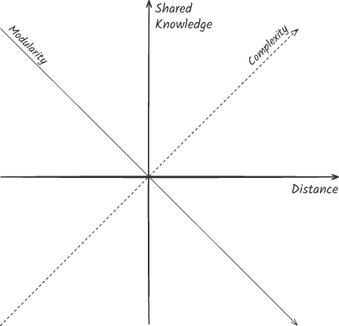
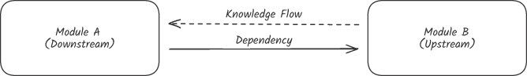

<!--
_backgroundColor: #0a1929
_color: white
_class: title dark
-->


<div class="title" style="text-align: left; margin-top: 100px; margin-left: 80px; padding-left: 0; max-width: 80%;">

# <span style="font-size: 1.0em;">型は壁、Rustでもバグを<br>直すな、表現できなくせよ</span>

### <code>is_paid = true</code> なのに <code>payment_id</code> が null、という話

</div>

<div class="author-info" style="text-align: left; padding-left: 0; text-indent: 0;">
関数型まつり2026 公募セッション<br>
@nwiizo 50min
</div>

---

<!-- _backgroundColor: white -->


## nwiizo

<div style="font-size: 0.75em;">

株式会社スリーシェイクでプロのソフトウェアエンジニアをやっているものです。SREやクラウドネイティブ技術を専門にしていますが、<strong>型システムと設計の話が好きです</strong>。

趣味は読書、格闘技、グラビア。仕事では型で壁を作り、格闘技では壁を壊そうとしています。

インターネット上では <strong>nwiizo</strong> を名乗り、ブログ「<strong>じゃあ、おうちで学べる</strong>」を運営しています。X / GitHub もこのIDでやっています。

</div>

---

## about 3-shake

<div style="display: flex; justify-content: center; align-items: center; margin-top: 20px;">

</div>

---

## 今日お話しすること

<div style="font-size: 0.78em;">

1. <strong>なぜ型を「壁」にするのか</strong>
2. <strong>関数型の考えをRustで使う</strong>
3. <strong>不正な値を作らせない4つのパターン</strong>
4. <strong>Rustの所有権と型状態を使う</strong>
5. <strong>境界と既存コードへ段階導入する</strong>
6. <strong>まとめ</strong>

</div>

<div style="margin-top: 15px; padding: 12px; background-color: #f5f5f5; border-radius: 8px; font-size: 0.72em;">
関数型まつりの参加者には<strong>当たり前の内容も含まれます</strong>。直和型や <code>Option</code> / <code>Result</code> は短く確認し、<strong>Rustで使うと何が起きるか</strong>に時間を使います。<br>
<strong>Rustが初めての方へ</strong>：記号は登場時に説明します。コードは、細部より「何を受け取り、何を返すか」を追ってください。
</div>

---

<!--
_backgroundColor: #0a1929
_color: white
_class: transition
-->

<div style="display: flex; justify-content: center; align-items: center; height: 100%; flex-direction: column; color: white;">

## <span style="color: white;">この発表の主張</span>

<div style="font-size: 1.15em; margin-top: 28px; text-align: center; color: white;">
<strong>型はコンパイラのためではない<br>不正な状態を物理的に存在させないための壁である</strong>
</div>

<div style="font-size: 0.72em; margin-top: 24px; color: #aaa;">
<code>is_paid = true</code> なのに <code>payment_id</code> が null。その組み合わせ自体を書けなくする。
</div>

</div>

---

## 壁をどこに建てるか

<div style="font-size: 0.75em;">

<p><strong>あらゆる設計原則は「変更を容易にする」の派生である</strong>、という補助線で型の壁を評価します。</p>

| 設計原則 | 変更を容易にする仕組み |
| --- | --- |
| カプセル化 | 変わりうる詳細を境界の内側へ閉じ込める |
| 疎結合 | 変更が無関係な部品へ伝播するのを止める |
| DRY / Single Source of Truth | 同じ判断を直す場所を1か所に寄せる |
| テスト / 型 | 変更が壊した前提を、利用者より先に検出する |

<p style="margin-top: 14px;">型も目的ではありません。<strong>不正な状態を閉じ、次の変更で失う時間と確信を減らす</strong>ための手段です。</p>

</div>

<div style="margin-top: 10px; padding: 10px; background-color: #e0e0e0; border-radius: 5px; text-align: center;">
<span style="color: #e65100; font-weight: bold;">主題は型の壁。変更容易性は、壁の置き場所を決める補助線</span>
</div>

---

## 疎結合は、設計のゴールではない

<div style="font-size: 0.75em;">

<p>結合とは、コンポーネント同士が<strong>接続され、知識やライフサイクルを共有すること</strong>です。結合がなければ、部品は協調できず、システムになりません。</p>

<div style="display: flex; gap: 18px; margin-top: 16px; align-items: center;">
<div style="flex: 1; background-color: #f5f5f5; padding: 14px; border-radius: 8px;">
<strong>結合を弱めすぎる</strong>
<p>本来一緒に変わるルールが別々の場所へ散り、整合性の維持と調整が難しくなる。</p>
</div>
<div style="flex: 1; background-color: #f5f5f5; padding: 14px; border-radius: 8px;">
<strong>結合を強めすぎる</strong>
<p>無関係な変更まで伝播し、1つの修正に多くのコンポーネントが巻き込まれる。</p>
</div>
</div>

<p style="margin-top: 16px;">問うべきは「結合しているか」ではなく、<strong>一緒に変わる知識が、変更しやすい場所に結合されているか</strong>です。</p>

</div>

<div style="text-align: right; font-size: 0.5em; color: #999; margin-top: 4px;">
参考: Vlad Khononov, <em>Balancing Coupling in Software Design</em>, Ch.1
</div>

---

## 変更コストは、結合の3次元で考える

<div style="font-size: 0.75em;">

<div style="display: flex; gap: 18px; margin-top: 12px; align-items: center;">
<div style="flex: 1; background-color: #f5f5f5; padding: 14px; border-radius: 8px; text-align: center;">
<strong>強度</strong>
<p>境界を越えて<br>共有する知識の量</p>
</div>
<div style="flex: 1; background-color: #f5f5f5; padding: 14px; border-radius: 8px; text-align: center;">
<strong>距離</strong>
<p>変更を調整する<br>コード・チームの隔たり</p>
</div>
<div style="flex: 1; background-color: #f5f5f5; padding: 14px; border-radius: 8px; text-align: center;">
<strong>変動性</strong>
<p>その知識が<br>変わる頻度</p>
</div>
</div>

<div style="margin-top: 22px; padding: 16px; background-color: #e0e0e0; border-radius: 8px; text-align: center; font-size: 1.1em;">
<strong>予想保守労力 ≈ 強度 × 距離 × 変動性</strong>
</div>

<p style="margin-top: 16px;">これは精密な測定式ではなく、どこを動かせば変更コストが下がるかを見るモデルです。<strong>3つすべてが高い関係</strong>を優先して直します。</p>

</div>

<div style="text-align: right; font-size: 0.5em; color: #999; margin-top: 4px;">
参考: Vlad Khononov, <em>Balancing Coupling in Software Design</em>, Ch.10
</div>

---

## 距離が大きいほど、変更の調整コストは増える

<div style="display: flex; gap: 28px; align-items: center; margin-top: 12px;">
<div style="width: 55%; text-align: center;">

</div>
<div style="flex: 1; font-size: 0.75em;">

<p>同じ変更でも、1つの関数内で完結する場合と、別チームのサービスまで同時に直す場合ではコストが違います。</p>

<p><strong>距離</strong>には、コード上の隔たりだけでなく、リポジトリ、デプロイ単位、担当チーム、タイムゾーンも含まれます。</p>

<p>距離を広げるなら、境界を越える共有知識を減らす必要があります。</p>

</div>
</div>

<div style="text-align: right; font-size: 0.5em; color: #999; margin-top: 4px;">
出典: Vlad Khononov, <em>Balancing Coupling in Software Design</em>, Figure 8.2
</div>

---

## 共有知識と距離の釣り合い

<div style="display: flex; gap: 28px; align-items: center; margin-top: 10px;">
<div style="width: 38%; text-align: center;">

</div>
<div style="flex: 1; font-size: 0.75em;">

<p><strong>共有知識と距離が反対方向</strong>なら、設計はモジュール性へ向かいます。</p>

<ul>
<li>知識が多いなら、近くに置いて高凝集にする</li>
<li>遠くへ離すなら、公開する知識を小さくする</li>
</ul>

<p><strong>両方が大きい</strong>と変更が遠くへ波及し、<strong>両方が小さい</strong>と無関係なものが同居して探索コストが増えます。</p>

</div>
</div>

<div style="margin-top: 8px; padding: 10px; background-color: #e0e0e0; border-radius: 5px; text-align: center;">
<span style="color: #e65100; font-weight: bold;">近くでは強く、遠くでは小さな契約だけを共有する</span>
</div>

<div style="text-align: right; font-size: 0.5em; color: #999; margin-top: 4px;">
出典: Vlad Khononov, <em>Balancing Coupling in Software Design</em>, Figure 14.1
</div>

---

## 型は、結合を消さず、置き直す

<div style="font-size: 0.75em;">

<div style="display: flex; gap: 20px; margin-top: 12px; align-items: center;">
<div style="flex: 1; background-color: #f5f5f5; padding: 14px; border-radius: 8px;">
<strong>bool + Option</strong>

<p><code>is_paid</code> と <code>payment_id</code> の関係を、すべての利用者が暗黙に知る。</p>

<p>共有知識がコード全体へ漏れ、変更時に遠くの <code>if</code> を探す。</p>
</div>
<div style="flex: 1; background-color: #f5f5f5; padding: 14px; border-radius: 8px;">
<strong>enum PaymentState</strong>

<p>2つの値の関係を、型定義と生成境界へ集める。</p>

<p>利用者には可能な状態だけを公開し、変更箇所は型エラーで見つける。</p>
</div>
</div>

<p style="margin-top: 16px;">型は結合を弱める魔法ではありません。<strong>一緒に変わる知識を型の内側で強く結び、不要な組み合わせを境界の外へ漏らさない</strong>道具です。</p>

</div>

<div style="margin-top: 10px; padding: 10px; background-color: #e0e0e0; border-radius: 5px; text-align: center;">
<span style="color: #e65100; font-weight: bold;">型の壁は、結合の置き場所を変える</span>
</div>

---

<!--
_backgroundColor: #0a1929
_color: white
_class: transition
-->

<div style="display: flex; justify-content: center; align-items: center; height: 100%; flex-direction: column; color: white;">

## <span style="color: white;">なぜ型を「壁」にするのか</span>

<span style="color: white; font-weight: bold;">バグを直すのではなく、存在させない</span>

</div>

---

## 3年運用したDBには、こんなレコードが眠っている

<div style="font-size: 0.75em;">

<p>新規のシステムなら、こんなデータは絶対に生まれないと思うかもしれません。でも、3年運用したデータベースには、<strong>こういう矛盾したレコードが眠っていることがあります</strong>。</p>

```json
{
  "order_id": 12345,
  "is_paid": true,
  "payment_id": null
}
```

<p>このレコードは、単体の値だけを見るとそれらしく見えます。<code>is_paid</code> も <code>payment_id</code> も、それぞれの型としては正しい。</p>

</div>

---

## 矛盾はあとから効いてくる

<div style="font-size: 0.75em;">

<p>問題は、値を<strong>組み合わせた瞬間</strong>に起きます。</p>

<div style="display: flex; gap: 18px; align-items: center; margin-top: 12px;">
<div style="flex: 1; background-color: #f5f5f5; padding: 14px; border-radius: 8px;">
<p><strong>is_paid = true なのに payment_id が null</strong></p>
<p>どの決済で完了したかの記録がなく、返金も、会計との突き合わせもできない。</p>
</div>
<div style="flex: 1; background-color: #f5f5f5; padding: 14px; border-radius: 8px;">
<p><strong>status = "verified" なのに verified_at が null</strong></p>
<p>再認証ポリシーは比較の基準日を持てず、落ちるか素通りするかの二択になる。</p>
</div>
</div>

<p style="margin-top: 12px;">こうしたレコードを作った瞬間にアラートが鳴ったりはしません。静かにDBに残り、数ヶ月後に返金業務や再認証処理で突然例外を投げる。</p>

</div>

<div style="margin-top: 12px; padding: 10px; background-color: #e0e0e0; border-radius: 5px; text-align: center;">
<span style="color: #e65100; font-weight: bold;">単独では正しい値が、組み合わせると矛盾する</span>
</div>

---

## なぜ、型はこれを止められなかったのか

<div style="font-size: 0.78em;">

<p>先ほどのレコードを受け取る型は、もしかしたらこう書かれていたかもしれません。</p>

```rust
pub struct Order {
    pub is_paid: bool,
    pub payment_id: Option<PaymentId>,
}
```

<p>この型は、<code>bool</code> と <code>Option&lt;PaymentId&gt;</code> の<strong>任意の組み合わせ</strong>を許します。「正しい組み合わせ」と「あり得ない組み合わせ」を区別する情報は、型のどこにも書かれていません。</p>

<p>つまり、<strong>型が「正しい形」を規定していない</strong>。正しさはコメントやバリデーション関数の中に散らばり、どこかで抜け落ちる。抜け落ちた瞬間、矛盾レコードが静かに誕生します。</p>

</div>

---

## バグを「直す」発想から離れる

<div style="font-size: 0.8em;">

<p>不正な状態を見つけたとき、私たちはつい <code>if</code> 文で弾き、テストで落とし、レビューで指摘して直します。どれも実行時のチェックや人間の注意力に依存した<strong>後追い</strong>です。</p>

<p>値そのものは型が許す限り流れ続けます。<strong>不正が生まれる根本原因</strong>は、手付かずのまま。</p>

<p style="margin-top: 10px;">起きたバグを追いかけるのは、<strong>火が出るたびに消して回る作業</strong>。起きえない形を先に作るのは、<strong>燃えない素材で建てる設計</strong>。どちらも要る。ただし、<strong>燃えない素材を知らなければ建てられない</strong>。</p>

</div>

<div style="margin-top: 20px; padding: 15px; background-color: #e0e0e0; border-radius: 8px; text-align: center; font-size: 1.1em;">
<span style="color: #e65100; font-weight: bold;">バグを直すな。表現できなくせよ。</span>
</div>

---

## AI Slop問題は、コードにもやってくる

<div style="font-size: 0.75em;">

<p><strong>AI Slop</strong> は、AIによって作られる低品質なデジタルコンテンツを指す言葉です。ソフトウェア開発でも、生成コードだけでなく、PR・文書・バグ報告にまで及ぶと報告されています。</p>

<div style="display: flex; gap: 18px; margin-top: 14px; align-items: center;">
<div style="flex: 1; background-color: #f5f5f5; padding: 14px; border-radius: 8px;">

<strong>生成する側</strong>

<p>短時間で、もっともらしいコードを大量に作れる。</p>

</div>
<div style="flex: 1; background-color: #f5f5f5; padding: 14px; border-radius: 8px;">

<strong>レビューする側</strong>

<p>ドメインの制約や文脈を、1件ずつ検証する必要がある。</p>

</div>
</div>

<p style="margin-top: 14px;">生成量が増えるほど、コメントに書いた制約は<strong>有限のレビュー予算</strong>を奪い合います。生成速度にレビューが追いつかなければ、人間は疲弊し、問題が見落とされたまま<strong>低品質なソフトウェアがリリースされます</strong>。</p>

</div>

<div style="margin-top: 10px; padding: 10px; background-color: #e0e0e0; border-radius: 5px; text-align: center;">
<span style="color: #e65100; font-weight: bold;">生成コストは下がる。検証コストは消えない</span>
</div>

<div style="text-align: right; font-size: 0.5em; color: #999; margin-top: 4px;">
出典: <a href="https://arxiv.org/abs/2603.27249">Baltes, Cheong, Treude (2026) “An Endless Stream of AI Slop”</a>
</div>

---

## AI時代、コメントより型は破りにくい

<div style="font-size: 0.75em;">

<p>では、AI Slopに埋もれない制約はどう作るのか。人間向けの自然言語では、こう書かれます。</p>

```rust
// payment_id は is_paid=true のときだけ Some、それ以外は None にすること
pub struct Order {
    pub is_paid: bool,
    pub payment_id: Option<PaymentId>,
}
```

<p style="margin-top: 12px;">コメントは<strong>条件付きのお願い</strong>です。「できればこうしてください」と書いても、人間もAIコーディングエージェントも読み落とすことがあります。<br>
型は<strong>機械が検査する契約</strong>です。「この形でなければビルドを通さない」という制約は、<code>cargo build</code> が検査します。</p>

<p style="margin-top: 12px;">AIはコードを生成できますが、<strong>型エラーのまま動く実行ファイルは生成できません</strong>。だから AI 時代こそ、自然言語の「お願い」を、コンパイラが検査できる「壁」へ移します。</p>

</div>

<div style="margin-top: 10px; padding: 10px; background-color: #e0e0e0; border-radius: 5px; text-align: center;">
<span style="color: #e65100; font-weight: bold;">型は、お願いをビルドエラーに変える</span>
</div>

---

## 壁は、設計図ごと壊せる

<div style="font-size: 0.78em;">

<p>型は強い壁ですが、無敵ではありません。<strong>壁を迂回する経路は3つ</strong>あります。</p>

<div style="background-color: #f5f5f5; padding: 14px; border-radius: 8px; margin-top: 12px;">

<ul>
<li><code>unsafe</code> / unchecked API：コンパイラが証明できない安全条件を人間が引き受ける</li>
<li><strong>公開フィールドや未検証の deserialize</strong>：検証付き生成関数を通らない生成経路を残す</li>
<li><strong>型定義そのものを緩めるPR</strong>：<code>NonZero</code>を<code>u32</code>に戻す、enumに<code>Option</code>を足す</li>
</ul>

</div>

<p style="margin-top: 12px;">コメントは黙って破れますが、型の壁を迂回すると痕跡が残ります。<code>unsafe</code> や unchecked API は呼び出しとして、型定義の変更は diff として可視化される。</p>

<p style="margin-top: 12px;">型は壁ですが、<strong>壁の設計図を守るのは人間のレビュー</strong>です。AI が型定義を緩める PR を出したとき、気づけるのは人間だけ。<strong>型はコードレビューを不要にはしません</strong>。</p>

</div>

<div style="margin-top: 8px; padding: 10px; background-color: #e0e0e0; border-radius: 5px; text-align: center;">
<span style="color: #e65100; font-weight: bold;">型は壁。でも、壁の設計図を守るのは人間</span>
</div>

---

<!--
_backgroundColor: #0a1929
_color: white
_class: transition
-->

<div style="display: flex; justify-content: center; align-items: center; height: 100%; flex-direction: column; color: white;">

## <span style="color: white;">なぜ壁を築くかはわかった</span>

<span style="color: white; font-weight: bold;">では、何で築くのか？</span>

<div style="margin-top: 24px; font-size: 0.8em; color: #aaa;">
関数型の道具をRustに持ち込む
</div>

</div>

---

## 型は、値の集まりに付ける名前

<div style="font-size: 0.75em;">

<p>関数型まつりの皆さんにはおなじみですが、ここでは Rust の例で確認します。</p>

<div style="background-color: #f5f5f5; padding: 18px; border-radius: 8px; margin-top: 18px; text-align: center; font-size: 1.15em;">
<strong>型 = 値の集合に付けた名前</strong>（<code>bool</code> = {true, false}、<code>u64</code> = 0〜約1800京）
</div>

<p style="margin-top: 22px;">型を「値の集まり」と考えると、設計の狙いが単純になります。<strong>正しい値だけが入るように、集合を小さくする</strong>のです。</p>

<p style="margin-top: 16px;">たとえば「0ではない整数」という型を作れば、0はその集合に入りません。0を見つけて弾くのではなく、<strong>最初から表現できなくします</strong>。</p>

</div>

<div style="margin-top: 18px; padding: 12px; background-color: #e0e0e0; border-radius: 5px; text-align: center;">
<span style="color: #e65100; font-weight: bold;">型を狭くすると、バグの置き場所も狭くなる</span>
</div>

---

## AND型は掛け算、OR型は足し算

<div style="font-size: 0.75em;">

<p>データの形は、<strong>全部を持つ</strong>か、<strong>どれか1つを選ぶ</strong>かで考えます。</p>

<div style="display: flex; gap: 18px; margin-top: 16px; align-items: center;">
<div style="flex: 1; background-color: #f5f5f5; padding: 14px; border-radius: 8px;">

<strong>AND型（struct）</strong>

<p>フィールドが<strong>全部同時に存在</strong>する。</p>

```rust
struct User {
    name: String,
    age: u32,
}
```

</div>
<div style="flex: 1; background-color: #f5f5f5; padding: 14px; border-radius: 8px;">

<strong>OR型（enum）</strong>

<p>いくつかの候補から<strong>ちょうど1つ</strong>。</p>

```rust
enum Shape {
    Circle(f64),
    Square(f64),
}
```

</div>
</div>

<p style="margin-top: 16px;"><code>Option</code>（あるか、ないか）と <code>Result</code>（成功か、失敗か）もOR型です。AND型は組み合わせが増えるので<strong>掛け算</strong>、OR型は候補を並べるので<strong>足し算</strong>になります。</p>

</div>

<div style="margin-top: 8px; padding: 10px; background-color: #e0e0e0; border-radius: 5px; text-align: center;">
<span style="color: #e65100; font-weight: bold;">掛け算で増えた組み合わせに、バグが潜む</span>
</div>

---

## 関数型の道具は、Rustにある

<div style="font-size: 0.78em;">

<p>ここでは、関数型でおなじみの道具がRustでは何に当たるかだけ整理します。</p>

| 関数型（F# / OCaml / Scala など）        | Rust                                                           |
| ---------------------------------------- | -------------------------------------------------------------- |
| Record / Sum type（Choice, DU）          | <code>struct</code> / <code>enum</code>                        |
| <code>Maybe</code> / <code>Either</code> | <code>Option&lt;T&gt;</code> / <code>Result&lt;T, E&gt;</code> |
| Pattern matching（網羅性チェック）       | <code>match</code>（網羅をコンパイラが強制）                   |
| Single case DU + Smart constructor       | タプル構造体 + <code>pub fn new() -&gt; Result</code>          |

<p><code>struct</code>、<code>enum</code>、網羅的なパターンマッチが揃っているので、関数型のドメインモデリングは<strong>ほぼそのままRustで書けます</strong>。ここからは、Rust固有の所有権も組み合わせます。</p>

<div style="margin-top: 12px; padding: 12px; background-color: #f5f5f5; border-radius: 8px; font-size: 0.9em;">
<strong>Rust豆知識（Programming Rust 3rd Early Release, Ch.10）</strong><br>
Rustの <code>enum</code> は、ML系言語の直和型に相当します。Rustでは、そこへ参照・可変性・メモリ安全性を検査する借用チェッカーも組み合わさります。
</div>

</div>

---

## Rustの記号は、ここだけ読めればいい

<div style="font-size: 0.75em;">

<p>本編で頻繁に登場する記号だけ先に整理します。これでコード例は雰囲気で読めます。</p>

<div style="display: flex; gap: 18px; margin-top: 12px; align-items: center;">
<div style="flex: 1; background-color: #f5f5f5; padding: 14px; border-radius: 8px;">

<strong>参照と所有権</strong>

- <code>&T</code>：読み取り専用で借りる
- <code>&mut T</code>：書き換え可能な状態で借りる
- 参照なし（<code>T</code>）：<strong>所有権ごと渡す</strong>。呼び出し元では使えなくなる

</div>
<div style="flex: 1; background-color: #f5f5f5; padding: 14px; border-radius: 8px;">

<strong>エラー処理</strong>

- <code>Result&lt;T, E&gt;</code>：成功 <code>Ok(T)</code> か失敗 <code>Err(E)</code>
- <code>?</code> 演算子：失敗ならその場で返し、成功なら中身を取り出す
- <code>Option&lt;T&gt;</code>：値がある <code>Some</code> か、ない <code>None</code>

</div>
</div>

<p style="margin-top: 12px;">細かい記号は登場時に補足します。<strong>構文に悩んだら「型が何を受けて何を返すか」だけ見てください</strong>。</p>

</div>

---

## ? は、失敗した時点で処理を返す

<div style="font-size: 0.75em;">

<p><code>?</code>は、処理に失敗したらその場で呼び出し元へ返し、成功したら中身を取り出します。</p>

```rust
fn parse_user_id(s: &str) -> Result<UserId, ParseError> {
    // (1) 文字列を数字にパース。失敗すれば Err で早期リターン
    let n: u64 = s.parse()?;

    // (2) UserId を作る。0 は不正なので失敗しうる
    let id = UserId::new(n)?;

    // (3) 成功したら Ok で包んで返す
    Ok(id)
}
```

<p><code>Option&lt;T&gt;</code>と <code>Result&lt;T, E&gt;</code>は、どちらも <code>?</code>でつなげられます。失敗のたびに <code>if</code>を書く必要はありません。</p>

</div>

---

## 所有権は、古い状態の使い回しを止める

<div style="font-size: 0.75em;">

<p>Rustの<strong>所有権</strong>は、「各値には所有者がいる」というルールです。家の鍵を誰かに渡すと、自分の手元には残りません。それと同じように、<code>Copy</code>でない値を関数へ渡すと所有権が移り、呼び出し元からは使えなくなります。</p>

<p style="margin-top: 12px;">この仕組みを使うと、「検証前の注文は、検証した後に残ってはいけない」を型で表現できます。「検証前の注文をもう1回使う」コードが、<strong>そもそも書けません</strong>。前の状態が残らないことを、所有権ルールが型レベルで保証してくれます。</p>

<p style="margin-top: 12px;"><strong>このルールが、後半で「状態遷移の壁」になります</strong>。コードはパターン1でお見せします。</p>

</div>

---

## Rustの値は、標準では書き換えられない

<div style="font-size: 0.75em;">

<p>Rust では変数も参照も、<strong>デフォルトで書き換え不可</strong>です。書き換えたいときは <code>mut</code> を明示する必要があります。</p>

```rust
let order = ValidatedOrder { items: vec![...] };
order.items.push(new_item);   // ← コンパイルエラー。order は不変

let mut order = ValidatedOrder { items: vec![...] };
order.items.push(new_item);   // ← これは通る
```

<p>この仕組みは、メソッドの設計にも影響します。関数型と同じく「入力を受けて<strong>新しい値を作る</strong>」が自然になります。</p>

```rust
// 関数型的な書き方: 新しい値を返す
fn apply_discount(o: PricedOrder, rate: f64) -> PricedOrder { /* ... */ }

// OOP 的な書き方: 既存の値を書き換える
impl PricedOrder {
    fn apply_discount(&mut self, rate: f64) { /* ... */ }
}
```

<p>前者は <code>&mut self</code> を要求せず、入力の所有権を受け取って次の値を返します。<strong>その場で書き換えるAPIではない</strong>ことが関数の型に現れます。</p>

</div>

---

<!--
_backgroundColor: #0a1929
_color: white
_class: transition
-->

<div style="display: flex; justify-content: center; align-items: center; height: 100%; flex-direction: column; color: white;">

## <span style="color: white;">道具は揃った</span>

<span style="color: white; font-weight: bold;">では、どう使うのか？</span>

<div style="margin-top: 24px; font-size: 0.8em; color: #aaa;">
状態を分ける、意味を分ける、作り方を絞る、正しい組み合わせだけ残す
</div>

</div>

---

## パターン1 状態が違えば、型を分ける

<div style="font-size: 0.75em;">

<p>「検証前の注文」と「検証済みの注文」を<strong>同じ型</strong>で扱うと、検証をスキップしたコードが通ります。</p>

```rust
struct Order {
    validated: bool,
    items: Vec<Item>,
}

fn calculate_total(order: &Order) -> Money {
    // validated == false でも呼べてしまう
    order.items.iter().map(|i| i.price).sum()
}
```

<p><code>validated</code> フラグは実行時の情報であり、呼び出し側が確認を忘れても<strong>コンパイラは何も言いません</strong>。</p>

</div>

---

## 別の型にすれば、順序違反は書けない

<div style="font-size: 0.75em;">

<p>検証前と検証後を<strong>別の型</strong>にします。</p>

```rust
struct UnvalidatedOrder { items: Vec<Item> }
struct ValidatedOrder   { items: Vec<Item> }

fn validate(o: UnvalidatedOrder) -> Result<ValidatedOrder, OrderError> {
    // チェックを通った場合だけ ValidatedOrder が生まれる
}

fn calculate_total(o: &ValidatedOrder) -> Money {
    o.items.iter().map(|i| i.price).sum()
}
```

<p><code>calculate_total(&unvalidated)</code> はコンパイルエラーになります。「検証前の注文を価格計算に渡す」バグは、そもそも書けません。</p>

</div>

---

## ワークフロー全体を型で貫く

<div style="font-size: 0.75em;">

<p>状態ごとに型を分ける発想を<strong>注文処理の一連の流れ</strong>に適用すると、こうなります。</p>

```rust
struct UnvalidatedOrder { items: Vec<RawItem> }
struct ValidatedOrder   { items: Vec<Item> }
struct PricedOrder      { items: Vec<Item>, subtotal: Money }
struct PaidOrder        { items: Vec<Item>, subtotal: Money, payment: PaymentId }

fn validate(o: UnvalidatedOrder) -> Result<ValidatedOrder, OrderError>;
fn price(o: ValidatedOrder)      -> PricedOrder;
fn charge(o: PricedOrder, card: &Card) -> Result<PaidOrder, PaymentError>;
```

<p>各ステップの入出力が型で固定されているので、<strong>順序を間違えるコードは書けません</strong>。検証前の注文に価格をつけるコードも、支払い前の注文を確定するコードも、コンパイルが通りません。</p>

</div>

<div style="margin-top: 8px; padding: 10px; background-color: #e0e0e0; border-radius: 5px; text-align: center;">
<span style="color: #e65100; font-weight: bold;">関数の入出力の型が、ワークフローの仕様書になる</span>
</div>

---

## パターン2 同じ数字でも、意味ごとに型を分ける

<div style="font-size: 0.75em;">

<p>状態型（パターン1）とその応用はここまで。残り3つのパターンに進みます。まずは<strong>取り違えの防止</strong>。</p>

<p>顧客IDと注文ID、どちらも <code>u64</code> で扱うと、引数の順序ミスがすり抜けます。</p>

```rust
fn charge(customer_id: u64, order_id: u64) { /* ... */ }

let customer = 1001u64;
let order = 5678u64;

charge(order, customer); // ← 引数逆でもコンパイルが通る
```

<p>これは<strong>実行時に初めて気づく</strong>バグです。ユニットテストを全網羅しない限り、本番で発覚します。</p>

</div>

---

## newtypeは、値を1つだけ包む

<div style="font-size: 0.75em;">

<p>Rust本でも紹介されている<strong>ニュータイプ</strong>パターンです。タプル構造体で1フィールドだけ包みます。</p>

```rust
#[repr(transparent)] struct CustomerId(u64);
#[repr(transparent)] struct OrderId(u64);

fn charge(customer: CustomerId, order: OrderId) { /* ... */ }

let customer = CustomerId(1001);
let order = OrderId(5678);

charge(order, customer); // ← 型エラー、コンパイルが通らない
```

<p><code>#[repr(transparent)]</code> を付ければ <code>u64</code> と同じレイアウトが保証され、取り違えはコンパイラが検出してくれます。</p>

<div style="margin-top: 10px; padding: 10px; background-color: #f5f5f5; border-radius: 8px; font-size: 0.9em;">
<strong>Rust豆知識（Programming Rust 3rd Early Release, Ch.9）</strong><br>
書籍では、コメントで意味を区別する代わりにニュータイプを使い、Rustの型検査へ任せる方法が紹介されています。<strong>意味が違う値を、同じ基本型へ戻さない</strong>のがポイントです。
</div>

</div>

<div style="margin-top: 10px; padding: 10px; background-color: #e0e0e0; border-radius: 5px; text-align: center;">
<span style="color: #e65100; font-weight: bold;">同じ u64 に別の意味を持たせると、必ずどこかで混ざる</span>
</div>

---

## パターン3 作り方を限定して、不正値を作らせない

<div style="font-size: 0.75em;">

<p>この方法は<strong>検証付き生成関数（Smart Constructor）</strong>と呼ばれます。「メールアドレスには @ が必要」という条件を、値を作るときに必ず検査します。</p>

```rust
pub struct Email(String);

impl Email {
    pub fn new(s: &str) -> Result<Self, EmailError> {
        if !s.contains('@') { return Err(EmailError::Invalid); }
        Ok(Email(s.to_owned()))
    }

    pub fn as_str(&self) -> &str { &self.0 }
}
```

<p>中身のフィールドは<strong>非公開</strong>なので、外部コードは <code>Email::new</code> を通らずに <code>Email</code> 値を作れません。この例では、一度作れた <code>Email</code> は以降のコードで必ず <code>@</code> を含みます。</p>

</div>

---

## 検証した印を、型に残す

<div style="font-size: 0.75em;">

<p>検証付き生成関数の考え方を、Alexis Kingは「Parse, don't validate」と表現しました。</p>

<div style="background-color: #f5f5f5; padding: 15px; border-radius: 8px; margin-top: 10px; font-style: italic; text-align: center;">
"Parse, don't validate."<br>
<span style="font-size: 0.85em;">検証するな。解釈せよ。</span>
</div>

<p style="margin-top: 14px;"><strong>validate</strong> は <code>bool</code> を返すだけ。通った値も通らなかった値も、同じ <code>String</code> のまま旅を続けます。<strong>parse</strong> は別の型に変換し、<strong>「検証済みである」情報が型に刻まれます</strong>。下流のコードは、もう検証を気にしません。</p>

```rust
fn validate(s: &str) -> bool;             // 情報は型に残らない
fn parse(s: &str) -> Result<Email, _>;    // 情報が型に刻まれる
```

<div style="position: absolute; bottom: 20px; right: 40px; font-size: 0.5em; color: #999;">
Alexis King (2019) "Parse, don't validate"（lexi-lambda.github.io/blog/2019/11/05/parse-don-t-validate/）
</div>

</div>

<div style="margin-top: 8px; padding: 10px; background-color: #e0e0e0; border-radius: 5px; text-align: center;">
<span style="color: #e65100; font-weight: bold;">検証済みの証明を、値そのものに運ばせる</span>
</div>

---

## この型、4通りのうち何通りがバグ？

<div style="font-size: 0.75em;">

<p>1つの値は、検証付き生成関数で守れました。次は<strong>値の組み合わせ</strong>です。「認証済みなら認証日時がある」をstructで書くと、何通りの状態が生まれるでしょうか。</p>

```rust
struct User {
    email: String,
    is_verified: bool,
    verified_at: Option<DateTime<Utc>>,
}
```

<p>この型が表現できる状態は、<strong>4通り</strong>です。</p>

| <code>is_verified</code> | <code>verified_at</code> | 意味                                            |
| ------------------------ | ------------------------ | ----------------------------------------------- |
| false                    | None                     | 未認証（正しい）                                |
| true                     | Some(t)                  | 認証済み（正しい）                              |
| true                     | None                     | <strong>不正</strong>：認証済みなのに日時がない |
| false                    | Some(t)                  | <strong>不正</strong>：未認証なのに日時がある   |

</div>

---

## 型の半分が、バグの置き場所になる

<div style="font-size: 0.8em;">

<p>4通りのうち、業務上正しいのは2通りだけです。</p>

<div style="display: flex; gap: 24px; margin-top: 22px; align-items: center;">
<div style="flex: 1; background-color: #f5f5f5; padding: 20px; border-radius: 8px; text-align: center;">

<strong>型が許す状態</strong>

<p style="font-size: 1.35em;"><code>bool</code> 2通り × <code>Option</code> 2通り<br>= <strong>4通り</strong></p>

</div>
<div style="flex: 1; background-color: #f5f5f5; padding: 20px; border-radius: 8px; text-align: center;">

<strong>業務で正しい状態</strong>

<p style="font-size: 1.35em;">未認証 + 認証済み<br>= <strong>2通り</strong></p>

</div>
</div>

<p style="margin-top: 22px;">AND型は、フィールドの選択肢を掛け算します。フラグを足すたびに状態は増えますが、<strong>増えた状態が正しいとは限りません</strong>。</p>

</div>

<div style="margin-top: 14px; padding: 12px; background-color: #e0e0e0; border-radius: 5px; text-align: center;">
<span style="color: #e65100; font-weight: bold;">正しい状態が2つなら、型にも2つだけ書く</span>
</div>

---

## 正しい状態だけをenumに書く

<div style="font-size: 0.78em;">

<p>フラグと日時を別々に持たず、「未認証」か「認証済み」のどちらか一方を <code>enum</code> で表現します。</p>

```rust
enum User {
    Unverified { email: String },
    Verified   { email: String, verified_at: DateTime<Utc> },
}
```

<p><code>Verified</code>なら <code>verified_at</code>は<strong>必ず存在</strong>します。<code>Unverified</code>には、そのフィールド自体がありません。</p>

<p>4通りを許してから2通りを弾くのではなく、<strong>正しい2通りだけを最初から型に書きます</strong>。</p>

</div>

---

## matchは、状態の書き忘れも防ぐ

<div style="font-size: 0.78em;">

<p>enumを使うコードは、<code>match</code>で状態ごとの処理を書きます。</p>

```rust
fn send_receipt(user: &User) {
    match user {
        User::Verified { email, verified_at } => { /* 送る */ }
        User::Unverified { .. } => { /* 送らない */ }
    }
}
```

<p>どちらかの状態を書き忘れると、コンパイラがエラーにします。新しい状態を追加したときも、修正が必要な <code>match</code> がすべて分かります。</p>

</div>

<div style="margin-top: 10px; padding: 10px; background-color: #e0e0e0; border-radius: 5px; text-align: center;">
<span style="color: #e65100; font-weight: bold;">不正な状態を表現不可能にする</span>
</div>

---

## 4つの基本パターン、一覧で確認

<div style="font-size: 0.78em;">

<p>ここまで駆け足で見てきた4パターンを、一枚にまとめます。</p>

<div style="display: flex; gap: 14px; margin-top: 12px; align-items: center;">
<div style="flex: 1; background-color: #f5f5f5; padding: 12px; border-radius: 8px;">

<strong>1. 状態ごとに型を分ける</strong>

<p style="font-size: 0.9em; margin-top: 6px;"><code>UnvalidatedOrder</code> と <code>ValidatedOrder</code> は別の型。検証前の注文を価格計算に渡すコードは、書けない。</p>

</div>
<div style="flex: 1; background-color: #f5f5f5; padding: 12px; border-radius: 8px;">

<strong>2. 意味ごとにnewtypeを作る</strong>

<p style="font-size: 0.9em; margin-top: 6px;"><code>CustomerId</code> と <code>OrderId</code> を別の型に。引数の順序を間違えればコンパイルが通らない。</p>

</div>
</div>

<div style="display: flex; gap: 14px; margin-top: 12px; align-items: center;">
<div style="flex: 1; background-color: #f5f5f5; padding: 12px; border-radius: 8px;">

<strong>3. 検証付き生成関数を通す</strong>

<p style="font-size: 0.9em; margin-top: 6px;">作り方を限定すれば、不正な <code>Email</code> は存在できない。検証済みという情報が型に残る。</p>

</div>
<div style="flex: 1; background-color: #f5f5f5; padding: 12px; border-radius: 8px;">

<strong>4. 正しい組み合わせだけをenumにする</strong>

<p style="font-size: 0.9em; margin-top: 6px;">フラグと <code>Option</code> を別々に持たず、正しい状態だけを候補として並べる。</p>

</div>
</div>

<p style="margin-top: 12px;">この4つだけでも、『is_paid と payment_id が矛盾する』系のバグは<strong>書きようがなくなります</strong>。</p>

</div>

---

## 出力は、依存と逆向きに知識を流す

<div style="font-size: 0.75em;">

<div style="text-align: center; margin-top: 18px;">

</div>

<p style="margin-top: 22px;">下流の Module A は上流の Module B に依存します。一方、型・variant・フィールド・エラーという<strong>知識は、Bの出力からAへ流れます</strong>。</p>

<p>出力型を豊かにするほど、Aは高度な判断ができます。同時に、Bがその型を変えたとき、Aも一緒に変わる可能性が高くなります。</p>

</div>

<div style="margin-top: 10px; padding: 10px; background-color: #e0e0e0; border-radius: 5px; text-align: center;">
<span style="color: #e65100; font-weight: bold;">出力型は、下流へ公開する知識の境界</span>
</div>

<div style="text-align: right; font-size: 0.5em; color: #999; margin-top: 4px;">
出典: Vlad Khononov, <em>Balancing Coupling in Software Design</em>, Figure 10.1
</div>

---

## 出力が豊かほど、下流の判断力と結合が増える

<div style="font-size: 0.75em;">

<div style="display: flex; gap: 18px; margin-top: 12px; align-items: center;">
<div style="flex: 1; background-color: #f5f5f5; padding: 14px; border-radius: 8px;">
<strong>ドメイン型をそのまま返す</strong>

<pre><code>fn payment_state() -&gt; PaymentState;</code></pre>

<p>下流は全状態を型安全に扱える。一方、variantやフィールドは<strong>公開した知識</strong>になり、変更が利用者へ伝播する。</p>
</div>
<div style="flex: 1; background-color: #f5f5f5; padding: 14px; border-radius: 8px;">
<strong>用途別の出力へ絞る</strong>

<pre><code>fn receipt_status() -&gt; ReceiptStatus;</code></pre>

<p>利用者に必要な知識だけを公開できる。一方、別の判断が必要になるたび、出力やAPIを追加する必要がある。</p>
</div>
</div>

<p style="margin-top: 16px;">同じモジュール内で共に進化するなら豊かな型が効きます。遠い利用者へ返すなら、<strong>利用目的に合わせた小さなコントラクト</strong>の方が変更を閉じ込めます。</p>

</div>

<div style="margin-top: 8px; padding: 10px; background-color: #e0e0e0; border-radius: 5px; text-align: center;">
<span style="color: #e65100; font-weight: bold;">出力の情報量は、利用者の力と提供者の変更自由度を交換する</span>
</div>

---

## enumは、網羅性と拡張性を交換する

<div style="font-size: 0.75em;">

<div style="display: flex; gap: 18px; margin-top: 10px; align-items: center;">
<div style="flex: 1; background-color: #f5f5f5; padding: 12px; border-radius: 8px;">
<strong>閉じた enum</strong>

<pre><code>pub enum PaymentState {
    Unpaid,
    Paid(PaymentId),
}</code></pre>

<p>利用者は網羅的に <code>match</code> できる。新しいvariantの追加は、利用者の修正を要求する<strong>破壊的変更</strong>になる。</p>
</div>
<div style="flex: 1; background-color: #f5f5f5; padding: 12px; border-radius: 8px;">
<strong>拡張を許す enum</strong>

<pre><code>#[non_exhaustive]
pub enum PaymentState {
    Unpaid,
    Paid(PaymentId),
}</code></pre>

<p>提供者はvariantを追加しやすい。利用者はワイルドカードが必須になり、未知の状態を<strong>個別には扱えない</strong>。</p>
</div>
</div>

<p style="margin-top: 12px;">同時に更新できる内部コードでは閉じた enum、独立して更新されるライブラリ境界では <code>#[non_exhaustive]</code> が候補になります。</p>

</div>

---

## エラー出力は、回復可能性と変更自由度を交換する

<div style="font-size: 0.75em;">

<div style="display: flex; gap: 18px; margin-top: 12px; align-items: center;">
<div style="flex: 1; background-color: #f5f5f5; padding: 14px; border-radius: 8px;">
<strong>型付きエラー</strong>

<pre><code>fn charge(...)
  -&gt; Result&lt;Receipt, ChargeError&gt;;</code></pre>

<p>呼び出し側は残高不足だけ再試行し、カード拒否は利用者へ返せる。variantは回復契約になり、変更しにくい。</p>
</div>
<div style="flex: 1; background-color: #f5f5f5; padding: 14px; border-radius: 8px;">
<strong>不透明なエラー</strong>

<pre><code>fn run_job(...)
  -&gt; anyhow::Result&lt;()&gt;;</code></pre>

<p>内部エラーを包みやすく、実装を変えやすい。呼び出し側は型による分岐ができず、記録して失敗させる程度になる。</p>
</div>
</div>

<p style="margin-top: 14px;">利用者に回復行動を選ばせるAPIでは型付き、最上位で記録して終了する処理では不透明なエラーが自然です。</p>

</div>

<div style="margin-top: 8px; padding: 10px; background-color: #e0e0e0; border-radius: 5px; text-align: center;">
<span style="color: #e65100; font-weight: bold;">利用者が分岐すべき失敗だけを、公開エラー型にする</span>
</div>

---

## 借用して返すか、所有して返すか

<div style="font-size: 0.75em;">

<div style="display: flex; gap: 16px; margin-top: 14px; align-items: center;">
<div style="flex: 1; background-color: #f5f5f5; padding: 12px; border-radius: 8px; text-align: center;">
<strong><code>&amp;str</code></strong>
<p>割り当て不要<br>元の値より長く保持できない</p>
</div>
<div style="flex: 1; background-color: #f5f5f5; padding: 12px; border-radius: 8px; text-align: center;">
<strong><code>String</code></strong>
<p>独立して保持できる<br>複製・割り当てコストを持つ</p>
</div>
<div style="flex: 1; background-color: #f5f5f5; padding: 12px; border-radius: 8px; text-align: center;">
<strong><code>Arc&lt;str&gt;</code></strong>
<p>安価に共有できる<br>参照カウントとAPI複雑性を持つ</p>
</div>
</div>

```rust
fn name(&self) -> &str;       // 呼び出し側を self の寿命に結合
fn into_name(self) -> String; // self を消費し、独立した値を返す
```

<p>出力の所有権はパフォーマンスだけでなく、<strong>呼び出し側が値をいつまで、どこへ運べるか</strong>を決めます。コピーを避ける代わりに寿命を結合するのか、所有権を渡して距離を切るのかを選びます。</p>

</div>

---

<!--
_backgroundColor: #0a1929
_color: white
_class: transition
-->

<div style="display: flex; justify-content: center; align-items: center; height: 100%; flex-direction: column; color: white;">

## <span style="color: white;">4つの基本パターンは揃った</span>

<span style="color: white; font-weight: bold;">ここから、Rustの型機能でさらに強くする</span>

<div style="margin-top: 24px; font-size: 0.8em; color: #aaa;">
型状態 / PhantomData / 既製の制約型
</div>

</div>

---

## 状態を型パラメータに乗せる

<div style="font-size: 0.78em;">

<p>先ほどは <code>UnvalidatedOrder</code> と <code>ValidatedOrder</code> を別々の構造体にしました。中身がほぼ同じなら、注文は1つのまま、<strong>状態だけを型で切り替えられます</strong>。</p>

<div style="background-color: #f5f5f5; padding: 14px; border-radius: 8px; margin-top: 12px;">

<strong>型状態（Type State）パターン</strong>

<p><code>Order&lt;Unvalidated&gt;</code> と <code>Order&lt;Validated&gt;</code> は、中身が同じでも<strong>別の型</strong>です。検証が終わるまで、検証済みの注文だけに許した操作は呼べません。</p>

</div>

<p style="margin-top: 18px;">別々の構造体を何度も書かずに、状態遷移を型で表せるのが利点です。</p>

</div>

---

## PhantomDataは、実体を増やさず状態を載せる

<div style="font-size: 0.78em;">

<p><code>Order&lt;State&gt;</code> と書いても、注文のフィールドには <code>State</code> の値がありません。そこで <code>PhantomData</code> を使い、<strong>この型はStateに依存する</strong>とコンパイラへ伝えます。</p>

```rust
use std::marker::PhantomData;

struct Order<State> {
    items: Vec<Item>,
    _state: PhantomData<State>,
}
```

<div style="background-color: #f5f5f5; padding: 14px; border-radius: 8px; margin-top: 14px;">

<p><code>PhantomData&lt;State&gt;</code> は実行時には0バイトです。データを増やさず、<strong>型の上だけに状態を追加します</strong>。</p>

</div>

</div>

---

## 型状態パターンのコード例

<div style="font-size: 0.75em;">

```rust
use std::marker::PhantomData;

struct Unvalidated;  struct Validated;
struct Order<State> { items: Vec<Item>, _state: PhantomData<State> }

impl Order<Unvalidated> {
    fn validate(self) -> Result<Order<Validated>, OrderError> {
        Ok(Order { items: self.items, _state: PhantomData })  // 検証は省略
    }
}
impl Order<Validated> {
    fn total(&self) -> Money {                 // Validated にだけ実装
        self.items.iter().map(|i| i.price).sum()
    }
}
```

<p><code>total()</code> は <code>Order&lt;Validated&gt;</code> にしか実装されていないので、<strong><code>Order&lt;Unvalidated&gt;</code> に対しては呼べません</strong>。状態遷移は <code>self</code> 消費で表現され、<code>Unvalidated</code> の注文は検証後には残りません。</p>

</div>

---

## 自作する前に、既製の制約型を探す

<div style="font-size: 0.75em;">

<p>ここまでの壁は全部自作でした。でも、自作する前に<strong>すでに用意されている制約型</strong>で済まないかを確認するのが先です。標準ライブラリとエコシステムに、制約が型に埋め込まれた型はいくつも揃っています。</p>

<div style="display: flex; gap: 18px; margin-top: 10px; align-items: center;">
<div style="flex: 1; background-color: #f5f5f5; padding: 14px; border-radius: 8px;">

<strong>標準ライブラリ</strong>

- <code>NonZero&lt;T&gt;</code>：ゼロではない整数型（<code>NonZero&lt;u32&gt;</code>、<code>NonZeroU32</code>は別名）
- <code>Option&lt;&T&gt;</code>：参照自体は非null。値がない場合は <code>None</code>
- <code>String</code> / <code>&str</code>：UTF-8を保証

</div>
<div style="flex: 1; background-color: #f5f5f5; padding: 14px; border-radius: 8px;">

<strong>エコシステム</strong>

- <code>nonempty</code>：<code>NonEmpty&lt;T&gt;</code>で空でないVecを保証
- <code>nutype</code>：マクロでnewtypeと検証処理をまとめて生成
- <code>bounded-integer</code>：範囲を型に持つ整数newtypeを生成

</div>
</div>

<p style="margin-top: 12px;"><code>n: u32</code> ではなく <code>n: NonZero&lt;u32&gt;</code>、<code>items: Vec&lt;Item&gt;</code> ではなく <code>items: NonEmpty&lt;Item&gt;</code> と書けば、「ゼロ・空を渡してはいけない」が型に残り、生成後のAPIでは再確認が不要になります。</p>

</div>

---

## フィールドを足すとOptionの海に戻る

<div style="font-size: 0.75em;">

<p>要件が増えたとき、つい既存の型に<strong>フィールドを足したくなります</strong>。でもそれは、組み合わせ爆発とOptionの海に戻る道です。</p>

```rust
// Before: ValidatedOrder に配送料の情報を足したい
struct ValidatedOrder {
    items: Vec<Item>,
    shipping_cost: Option<Money>,      // ← 計算前は None
    shipping_address: Option<Address>, // ← 計算前は None
}
```

<p>配送料が計算済みかどうか、配送先が確定しているかどうかが、また <code>Option</code> の組み合わせに散らばります。</p>

</div>

---

## 型エラーを、変更地図にする

<div style="font-size: 0.75em;">

<p><strong>新しい状態は、新しい型にする</strong>。配送情報が必要になったら、それを必須フィールドに持つ型を作ります。</p>

```rust
struct PricedOrder { items: Vec<Item>, subtotal: Money }
struct PricedOrderWithShipping {           // 配送情報は必須・Optionにしない
    items: Vec<Item>, subtotal: Money, shipping: ShippingInfo,
}
```

<p>型が増えると、コンパイラが依存箇所を<strong>全部追跡</strong>します。「直し忘れ」はビルドエラーになる。エラーは邪魔ではなく、<strong>次に直す場所を列挙した変更地図</strong>です。</p>

<p style="margin-top: 12px;">ただし、地図を細かくするほど型は増えます。変更の見落としは減りますが、読む負担は増える。ここからは、<strong>型が変更を難しくする境界</strong>も見ていきます。</p>

<div style="margin-top: 10px; padding: 10px; background-color: #e0e0e0; border-radius: 5px; text-align: center;">
<span style="color: #e65100; font-weight: bold;">コンパイルエラーは、変更の残作業リストになる</span>
</div>

</div>

---

<!--
_backgroundColor: #0a1929
_color: white
_class: transition
-->

<div style="display: flex; justify-content: center; align-items: center; height: 100%; flex-direction: column; color: white;">

## <span style="color: white;">非純粋な現実と向き合う</span>

<span style="color: white; font-weight: bold;">所有権・境界・DB・既存コード</span>

</div>

---

## 摩擦1 古い状態を借りたまま、次へ進めない

<div style="font-size: 0.78em;">

<p><strong>ここまで型で何でも守れるかのように話してきました</strong>。でも、実際にコードを書くと、最初につまずくのがここです。</p>

<p>状態遷移を <code>fn validate(o: UnvalidatedOrder) -&gt; Result&lt;ValidatedOrder, _&gt;</code> の形で書くと、入力の注文は<strong>所有権ごと消費</strong>されます。</p>

<p>これが摩擦になるのは、<strong>古い注文への参照を残したまま、次の状態へ進めたい場面</strong>です。</p>

```rust
let order: UnvalidatedOrder = receive();

let audit_view = &order;         // 古い状態を借りる
let valid = validate(order)?;    // ← 借用中なので move できない
log_for_audit(audit_view);       // 借用がここまで生きている
```

<p>監査ログやメトリクスへ古い値を渡したいなら、必要な情報だけコピーするか、共有したい部分を <code>Arc</code> に分けます。<strong>古い状態を誰がいつまで見るのか</strong>を明示的に決める必要があります。</p>

</div>

---

## 摩擦2 重複を消すと、matchが1段深くなる

<div style="font-size: 0.78em;">

<p>パターン4の enum では、共通の <code>email</code> が両方のバリアントで繰り返されていました。Rust には「enum 全体で共通のフィールド」を直接書く機能はありません。<strong>対処は2つ</strong>あります。</p>

<div style="display: flex; gap: 18px; margin-top: 10px; align-items: center;">
<div style="flex: 1; background-color: #f5f5f5; padding: 12px; border-radius: 8px;">

<strong>素直に繰り返す</strong>

<pre><code>enum User {
    Unverified {
        email: String,
    },
    Verified {
        email: String,
        verified_at: DateTime&lt;Utc&gt;,
    },
}</code></pre>

</div>
<div style="flex: 1; background-color: #f5f5f5; padding: 12px; border-radius: 8px;">

<strong>状態だけを enum にする</strong>

<pre><code>struct User {
    email: String,
    state: UserState,
}
enum UserState {
    Unverified,
    Verified(DateTime&lt;Utc&gt;),
}</code></pre>

</div>
</div>

<p style="margin-top: 10px;">どちらも「検証済みのときだけ <code>verified_at</code> がある」保証は同じです。後者は共通フィールドを1箇所に集められる代わりに、状態を見るたび <code>user.state</code> を1段深く <code>match</code> します。トレードオフは<strong>保証の強さではなく、重複と操作の近さ</strong>です。</p>

</div>

---

## 摩擦3 型状態は、読む人の負担を増やす

<div style="font-size: 0.75em;">

<p><code>Order&lt;Unvalidated&gt;</code> と <code>Order&lt;Validated&gt;</code> で状態を分けると壁は強固になりますが、<strong>関数の型が複雑になります</strong>。</p>

```rust
// 2状態なら、まだ読める
fn process(o: Order<Validated>) -> Result<Order<Priced>, Error>;

// 3状態以上で、複数のジェネリクスが絡むと急に重くなる
fn handle<S>(o: Order<S>) -> Result<Output, Error>
where
    S: Into<FinalState>,
    Order<S>: Processable;
```

<p>型が表す制約は強くなりますが、読み手には「この <code>S</code> は何か」「どの状態へ進むのか」を追う負荷が増えます。</p>

</div>

---

## 型状態を使う境界を決める

<div style="font-size: 0.78em;">

<p>関数型まつりの皆さんには馴染みがあっても、<strong>チームの全員がこの関数の型を読めるとは限りません</strong>。制約を増やすほど、読む負担と変更コストも増えます。</p>

<div style="background-color: #f5f5f5; padding: 14px; border-radius: 8px; margin-top: 14px;">

<ul>
<li><strong>順序違反をコンパイル時に止めたい</strong>ワークフローなら型状態パターン</li>
<li><strong>実行時に任意の状態を読み込む</strong>なら enum、状態ごとに中身が大きく違うなら別 struct</li>
<li>共有データが大きいなら、状態と共通データを分離して読む負担と複製コストを抑える</li>
</ul>

</div>

<p style="margin-top: 12px;">判断基準は「型が強いほど良い」ではありません。<strong>防げる障害と見落としのコスト</strong>が、<strong>導入・学習・変更のコスト</strong>を上回る場所にだけ壁を作ります。</p>

</div>

<div style="margin-top: 8px; padding: 10px; background-color: #e0e0e0; border-radius: 5px; text-align: center;">
<span style="color: #e65100; font-weight: bold;">変更の総コストを下げない壁は、設計ではなく障害物</span>
</div>

---

## 外から来る値には、まだドメイン型がない

<div style="font-size: 0.75em;">

<p>型で守れるのは、業務ルールを扱う<strong>ドメインの内側</strong>です。HTTPやDBから来た直後の値には、まだ専用の型が付いていません。</p>

```rust
#[derive(Deserialize)]               // HTTP入力を受ける境界型
struct CreateOrderRequest {
    customer_id: u64,      // ← まだ CustomerId ではない
    items: Vec<ItemInput>, // ← まだ ValidatedItem ではない
    email: String,         // ← まだ Email ではない
}
```

<p>HTTP、JSON、DB、メッセージキューから来る値は、最初は <code>u64</code> や <code>String</code> です。内側へ渡す前に、<code>CustomerId</code> や <code>Email</code> へ変換します。</p>

</div>

---

## 境界で型に変換し、内側へ渡す

<div style="font-size: 0.75em;">

```rust
fn create_order(req: CreateOrderRequest) -> Result<ValidatedOrder, ApiError> {
    let customer = CustomerId::new(req.customer_id)?;
    let email    = Email::new(&req.email)?;
    let items    = req.items.into_iter().map(Item::try_from)
                            .collect::<Result<Vec<_>, _>>()?;
    ValidatedOrder::new(customer, email, items)
}
```

<p><strong>境界のただ1か所</strong>で検証して型に変換します。以降は、型付きの値だけが内側を流れます。</p>

</div>

<div style="margin-top: 8px; padding: 10px; background-color: #e0e0e0; border-radius: 5px; text-align: center;">
<span style="color: #e65100; font-weight: bold;">境界で型を貼り、内側は型で守る</span>
</div>

---

## DBへ保存するとき、状態は列に戻る

<div style="font-size: 0.75em;">

<p>リレーショナルDBの行は<strong>列の組</strong>です。Rustのenumを保存するときは、<code>is_paid BOOLEAN</code>と、NULLを許す<code>payment_id UUID</code>のような列へ戻すことがあります。</p>

<p>Rust 側では決済状態を enum で受けられますが、<strong>書き込み時には再びフラグとnullに分解</strong>する必要があります。</p>

```rust
// enumからDBの列へ変換する
fn to_row(payment: &PaymentState) -> OrderRow {
    match payment {
        PaymentState::Unpaid => OrderRow {
            is_paid: false,
            payment_id: None,
        },
        PaymentState::Paid(id) => OrderRow {
            is_paid: true,
            payment_id: Some(id.clone()),
        },
    }
}
```

</div>

---

## DBの矛盾は、読み込み時にエラーにする

<div style="font-size: 0.75em;">

<p>DBから読み込むときは、列の組をもう一度ドメイン型へ変換します。</p>

```rust
fn from_row(row: OrderRow) -> Result<PaymentState, OrderRowError> {
    match (row.is_paid, row.payment_id) {
        (false, None)    => Ok(PaymentState::Unpaid),
        (true, Some(id)) => Ok(PaymentState::Paid(id)),
        (true, None)     => Err(OrderRowError::MissingPaymentId),
        (false, Some(_)) => Err(OrderRowError::UnexpectedPaymentId),
    }
}
```

<p>冒頭の「3年眠っていたレコード」と再会するのは、まさにこの <code>(true, None)</code> の行です。型は新しい矛盾を防ぎ、<strong>すでにある矛盾はここで名前付きのエラーとして表面化する</strong>。</p>

<p>読み込み時は不正な組み合わせを <code>Err</code> にし、DB側にも <code>CHECK</code> 制約を置いて新しい矛盾を拒みます。<strong>既存DBの形をそのままドメイン型へ持ち込まず、境界で相互変換する</strong>のがポイントです。</p>

</div>

---

<!--
_backgroundColor: #0a1929
_color: white
_class: transition
-->

<div style="display: flex; justify-content: center; align-items: center; height: 100%; flex-direction: column; color: white;">

## <span style="color: white;">既存コードへ、どう壁を建てるか</span>

<span style="color: white; font-weight: bold;">型を一括導入せず、不変条件を1つずつ移す</span>

</div>

---

## 最初に選ぶのは「型」ではなく「不変条件」

<div style="font-size: 0.75em;">

<p><code>u64</code> をすべて newtype にする、と決めると変更範囲が先に膨らみます。まず、<strong>何を二度と壊したくないか</strong>を1つ選びます。</p>

<div style="display: flex; gap: 18px; margin-top: 12px; align-items: center;">
<div style="flex: 1; background-color: #f5f5f5; padding: 14px; border-radius: 8px;">

<strong>最初の対象に向く</strong>

- 間違えたときの障害や手戻りが大きい
- 同じ検証や取り違え対策が繰り返されている
- HTTPやDBなど、入口と出口を特定できる

</div>
<div style="flex: 1; background-color: #f5f5f5; padding: 14px; border-radius: 8px;">

<strong>後回しにする</strong>

- 仕様が探索中で、正しい状態がまだ定まらない
- 間違えても局所的で、修正コストが小さい
- 型の読み方をチームで共有できていない

</div>
</div>

</div>

<div style="margin-top: 10px; padding: 10px; background-color: #e0e0e0; border-radius: 5px; text-align: center;">
<span style="color: #e65100; font-weight: bold;">型を選ぶ前に、守る不変条件を1つ選ぶ</span>
</div>

---

## 値の旅を、入口から保存まで1本だけ描く

<div style="font-size: 0.75em;">

<p>対象を <code>CustomerId</code> と決めたら、リポジトリ全体を直す前に、<strong>1つのユースケースで値が通る場所</strong>を並べます。</p>

<div style="background-color: #f5f5f5; padding: 18px; border-radius: 8px; margin-top: 16px; text-align: center; font-size: 1.05em;">
HTTPの <code>u64</code> → Handler → UseCase → Repository → DBの <code>BIGINT</code>
</div>

<div style="display: flex; gap: 18px; margin-top: 18px; align-items: center;">
<div style="flex: 1;">
<strong>探す場所</strong>

- 生の値を受け取る入口
- 検証や変換をしている場所
- 同じ型の値を渡す関数
</div>
<div style="flex: 1;">
<strong>残す成果物</strong>

- 最初に移行するユースケース
- 型へ変換する境界
- 生の値へ戻す出口
</div>
</div>

<p style="margin-top: 14px;">全呼び出しグラフではなく、<strong>変更を完結できる最短の縦1本</strong>だけを移行単位にします。</p>

</div>

---

## 境界に型を置き、内側のAPIを先に作る

<div style="font-size: 0.75em;">

```rust
pub struct CustomerId(u64);

impl TryFrom<u64> for CustomerId {
    type Error = CustomerIdError;

    fn try_from(raw: u64) -> Result<Self, Self::Error> {
        if raw == 0 { return Err(CustomerIdError::Zero); }
        Ok(Self(raw))
    }
}

fn find_customer(id: CustomerId) -> Result<Customer, FindError>;
```

<p>HTTPやDBの表現はすぐには変えません。入口で <code>u64</code> を <code>CustomerId</code> へ変換し、<strong>新しく作る内側のAPIだけ</strong>を型付きにします。</p>

</div>

<div style="margin-top: 8px; padding: 10px; background-color: #e0e0e0; border-radius: 5px; text-align: center;">
<span style="color: #e65100; font-weight: bold;">外側の互換性を保ち、内側から正しい形を作る</span>
</div>

---

## 互換アダプタは、移行中だけ残す

<div style="font-size: 0.75em;">

<p>既存の呼び出しを一度に直せないなら、古いシグネチャを<strong>型付きAPIへの薄いアダプタ</strong>にします。</p>

```rust
fn find_customer(id: CustomerId) -> Result<Customer, FindError> {
    repository::find(id)
}

#[deprecated(note = "CustomerId を受け取る find_customer を使う")]
fn find_customer_raw(raw: u64) -> Result<Customer, FindError> {
    find_customer(CustomerId::try_from(raw)?)
}
```

<p>検証ロジックは新APIへ1か所に寄せ、旧APIは変換して委譲するだけにします。旧API側へ機能追加すると、移行経路が<strong>恒久的な抜け道</strong>になります。</p>

</div>

---

## 呼び出し経路を、縦に1本ずつ移す

<div style="font-size: 0.75em;">

<p>レイヤーを横断して全部のHandlerを直すのではなく、<strong>1つのユースケースを入口からDBまで</strong>型付きにします。</p>

<div style="background-color: #f5f5f5; padding: 14px; border-radius: 8px; margin-top: 12px;">

<ol>
<li><strong>PR 1</strong>：<code>CustomerId</code>、生成関数、境界のテストを追加</li>
<li><strong>PR 2</strong>：顧客参照のHandler → UseCase → Repositoryを移行</li>
<li><strong>PR 3</strong>：次のユースケースを移行し、旧API利用を減らす</li>
<li><strong>PR 4</strong>：残存利用がなくなったら互換アダプタを削除</li>
</ol>

</div>

<p style="margin-top: 14px;">各PRでビルド可能な状態を保ちます。コンパイルエラーは、その縦1本の中で<strong>まだ型が届いていない場所</strong>を示します。</p>

</div>

<div style="margin-top: 8px; padding: 10px; background-color: #e0e0e0; border-radius: 5px; text-align: center;">
<span style="color: #e65100; font-weight: bold;">横に全置換せず、動く縦1本を積み重ねる</span>
</div>

---

## 生の値を作れる経路は、最後に閉じる

<div style="font-size: 0.75em;">

<p>呼び出し側が移行できたら、型の壁を迂回できる生成経路を閉じます。</p>

```rust
pub struct CustomerId(u64); // フィールドは非公開

impl CustomerId {
    pub fn get(&self) -> u64 { self.0 } // DB等の出口だけで使う
}

#[derive(Deserialize)]
struct CustomerRequest { customer_id: u64 } // 境界型は分離
```

<div style="background-color: #f5f5f5; padding: 12px; border-radius: 8px; margin-top: 10px;">

- 直接構築できる公開フィールドをなくす
- deserialize対象とドメイン型を分ける
- <code>From&lt;u64&gt;</code> ではなく、失敗を表す <code>TryFrom&lt;u64&gt;</code> を使う

</div>

<p style="margin-top: 12px;">最初から閉じると巨大な変更になります。<strong>移行経路を作ってから、抜け道を閉じる</strong>のが順序です。</p>

</div>

---

## 旧APIを消せたら、1つの導入が完了する

<div style="font-size: 0.75em;">

<p>「型を追加した」だけでは完了ではありません。次の状態まで到達して、初めて変更コストが下がります。</p>

<div style="background-color: #f5f5f5; padding: 14px; border-radius: 8px; margin-top: 14px;">

<ul>
<li>内側のAPIは <code>u64</code> ではなく <code>CustomerId</code> を受け取る</li>
<li>生成と検証は境界の1か所に集まっている</li>
<li>旧APIと直接構築の利用箇所がなく、互換アダプタを削除できる</li>
<li>不正値を入れた境界テストと、代表ユースケースのテストが残る</li>
</ul>

</div>

<p style="margin-top: 14px;">次の不変条件へ進むのは、この縦1本を閉じてからです。途中の移行を増やしすぎると、アダプタが新しい複雑性になります。</p>

</div>

<div style="margin-top: 8px; padding: 10px; background-color: #e0e0e0; border-radius: 5px; text-align: center;">
<span style="color: #e65100; font-weight: bold;">導入の単位は「型1個」ではなく「閉じた変更経路1本」</span>
</div>

---

## 型エラーは、書いた瞬間に見つける

<div style="font-size: 0.78em;">

<p>所有権、境界、DB、既存コードには、それぞれ導入の摩擦がありました。続けやすくするには、<strong>型エラーへすぐ気づけること</strong>が重要です。</p>

<p>不正な状態を型で表現できなくしても、エラーに気づくのが遅ければ使いづらくなります。<strong>rust-analyzer</strong>はコンパイラの診断をエディタへ届け、編集中に赤線を表示します。</p>

<div style="background-color: #f5f5f5; padding: 14px; border-radius: 8px; margin-top: 16px;">

<strong>rust-analyzer が壁に効く理由</strong>

- 編集中に型エラーを表示
- newtype / enum の <code>match</code> 漏れも診断として表示
- IDE の上で「書けないコード」が分かる

</div>

<p style="margin-top: 14px;">型の壁は、CI で初めて効くより、エディタで書いた瞬間に効くほうが強い。フィードバックが早いほど、壁は設計の一部になります。</p>

</div>

---

## 型で防げること、防げないこと

<div style="font-size: 0.78em;">

<p>ここまでの話を踏まえて、<strong>型の守備範囲</strong>を整理します。</p>

<div style="display: flex; gap: 18px; margin-top: 14px; align-items: center;">
<div style="flex: 1; background-color: #f5f5f5; padding: 14px; border-radius: 8px;">

<strong>型で防げること</strong>

- 「検証前の値」を「検証済みの値」として扱うこと
- 同じ表現の別の概念の取り違え
- ありえない組み合わせの同時存在
- コメントだけに頼った不変条件の流出

</div>
<div style="flex: 1; background-color: #f5f5f5; padding: 14px; border-radius: 8px;">

<strong>型で防げないこと</strong>

- ビジネスロジックの間違い（計算式の誤り等）
- 外部システムの値の変化
- パフォーマンスや可用性の問題
- 仕様の理解違い

</div>
</div>

<p style="margin-top: 14px;">型が防ぐのは<strong>「不正な状態が作れてしまうこと」</strong>であり、<strong>「何が正解か」を決めるのは人間</strong>です。この区別を忘れると、型原理主義に陥って苦しくなります。</p>

</div>

---

## 通っても、正しいとは限らない

<div style="font-size: 0.75em;">

<p>AI に「定員に空きがあれば参加登録する」と頼むと、こんな素直なコードが出ます。<strong>型も単体テストも通ります</strong>。</p>

```rust
let count = participant_count(event_id)?;        // 取得
if count < capacity {                            // 確認
    insert_participant(event_id, user_id)?;      // 登録
}
```

<p>でも残席1のとき二人がほぼ同時に申し込むと、どちらも確認を通って2件とも登録されます。<strong>確認と登録の間に割り込める</strong>からです。並行性やトランザクション整合性は<strong>この型だけでは表現できない</strong>、システム全体の制約です。</p>

<p>文脈を<strong>名前や型に込めれば、AI もそこから推論できる</strong>ようになります。それでも、何を正しい振る舞いとするかを規定し、最後に検証する責任は、<strong>外側を知る人間</strong>に残ります。</p>

</div>

<div style="margin-top: 8px; padding: 10px; background-color: #e0e0e0; border-radius: 5px; text-align: center;">
<span style="color: #e65100; font-weight: bold;">型は形を守る。正しさは、文脈に宿る</span>
</div>

---

## この考え方は、Rustに限らない

<div style="font-size: 0.78em;">

<p>ここまで、型が守れる範囲と限界まで見てきました。最後に、この設計をRustの外へ広げます。<strong>「不正な値を型で表現できなくする」という発想は、多くの言語で使えます</strong>。</p>

<div style="display: flex; gap: 18px; margin-top: 14px; align-items: center;">
<div style="flex: 1; background-color: #f5f5f5; padding: 14px; border-radius: 8px;">

<strong>関数型言語</strong>

- F# / OCaml: Discriminated Union
- Scala 3: <code>enum</code>（ADT 構文）
- Elm: Custom Types
- ReScript: Variants

</div>
<div style="flex: 1; background-color: #f5f5f5; padding: 14px; border-radius: 8px;">

<strong>マルチパラダイム言語</strong>

- TypeScript: discriminated union + literal types
- Kotlin: <code>sealed class</code> / <code>sealed interface</code>
- Swift: <code>enum</code> with associated values
- Java: <code>sealed interface</code>（Java 17+）

</div>
</div>

<p style="margin-top: 14px;">持ち帰っていただきたいのはRustの構文ではなく、<strong>正しい値だけを型で表す設計</strong>です。</p>

</div>

---

<!--
_backgroundColor: #0a1929
_color: white
_class: transition
-->

<div style="display: flex; justify-content: center; align-items: center; height: 100%; flex-direction: column; color: white;">

## <span style="color: white;">まとめ</span>

<span style="color: white; font-weight: bold;">型は壁であり、お願いではない</span>

</div>

---

## 今日の要点

<div style="font-size: 0.75em;">

<div style="display: flex; gap: 20px; align-items: center;">
<div style="flex: 1; background-color: #f5f5f5; padding: 15px; border-radius: 8px;">

<strong>設計思想</strong>

- 型は<strong>不正な状態を物理的に存在させない壁</strong>
- バグを見つけて直すだけでなく、書ける状態の集合から取り除く
- 変更容易性と結合は、<strong>壁をどこへ建てるか</strong>を決める補助線
- 読解・導入コストが便益を上回るなら、その壁は作らない

</div>
<div style="flex: 1; background-color: #f5f5f5; padding: 15px; border-radius: 8px;">

<strong>Rustで壁を築く道具立て</strong>

- 基本4パターン：状態を分ける、意味を分ける、作り方を絞る、正しい組み合わせだけ残す
- Rust固有：型状態 / <code>PhantomData</code> / 既製の制約型
- 進化のとき：フィールドを足さず、<strong>新しい型を作る</strong>
- 導入：不変条件を1つ選び、<strong>縦1本を移して旧APIを閉じる</strong>

</div>
</div>

<div style="margin-top: 15px; padding: 15px; background-color: #e0e0e0; border-radius: 8px; text-align: center; font-size: 1.15em;">
<span style="color: #e65100; font-weight: bold;">バグを直すな。表現できなくせよ。</span>
</div>

</div>

---

## 入力と出力では、壁の向きが違う

<div style="font-size: 0.75em;">

<div style="display: flex; gap: 20px; margin-top: 14px; align-items: center;">
<div style="flex: 1; background-color: #f5f5f5; padding: 15px; border-radius: 8px;">

<strong>入力型</strong>

- 狭くすると、不正な値を入口で拒否できる
- 関数の内側は再検証せずに済む
- 呼び出し側は型を作る責任と変換コストを負う

<p><strong>呼び出し側の自由</strong>を、<strong>受け取る側の保証</strong>へ交換する。</p>

</div>
<div style="flex: 1; background-color: #f5f5f5; padding: 15px; border-radius: 8px;">

<strong>出力型</strong>

- 豊かにすると、下流は型を使って判断できる
- エラーや状態を網羅的に処理できる
- 公開した知識が、提供側の将来変更を拘束する

<p><strong>提供側の自由</strong>を、<strong>利用側の判断力</strong>へ交換する。</p>

</div>
</div>

<p style="margin-top: 16px;">近くで共に進化するAPIなら豊かな型を共有し、遠くで独立して進化するAPIなら用途別の小さな出力へ絞ります。</p>

</div>

<div style="margin-top: 8px; padding: 10px; background-color: #e0e0e0; border-radius: 5px; text-align: center;">
<span style="color: #e65100; font-weight: bold;">型の強さではなく、変更する側と保証を受ける側を選ぶ</span>
</div>

---

## 参考資料① 書籍と記事

<div style="font-size: 0.68em;">

- <strong>Programming Rust, 3rd Edition（Early Release）</strong>（Jim Blandy, Jason Orendorff, Leonora F. S. Tindall 著, O'Reilly, Rust 2024 Edition対応, 2026年7月参照）
  - 第9章 構造体（タプル構造体とニュータイプ）
  - 第10章 列挙型とパターン（代数的データ型と <code>match</code>）
- <strong>Domain Modeling Made Functional</strong>（Scott Wlaschin 著, Pragmatic Bookshelf, 2018）
  - 第4章 Understanding Types（choice types / discriminated unions）
  - 第5章 Domain Modeling with Types（Constrained Values, Modeling with Choice Types）
  - 第6章 Integrity and Consistency in the Domain（smart constructors / 不正な状態を表現不可能にする / "compile-time unit tests"）
- <strong>"Designing with Types" シリーズ</strong>（Scott Wlaschin, F# for Fun and Profit, 全13回）
  - 代表記事: 「不正な状態を表現不可能にする」
  - シリーズ目次: fsharpforfunandprofit.com/series/designing-with-types/
- <strong>"Parse, don't validate"</strong>（Alexis King, 2019）
  - lexi-lambda.github.io/blog/2019/11/05/parse-don-t-validate/
- <strong>"Rustでも学べる関数型ドメイン駆動設計"</strong>（nwiizo, 2026）
  - syu-m-5151.hatenablog.com

</div>

---

## 参考資料② 結合と変更容易性

<div style="font-size: 0.75em;">

- <strong>Balancing Coupling in Software Design</strong>（Vlad Khononov）
  - 第1章：結合は接続であり、システムに不可欠
  - 第8章：距離が大きいほど、連鎖的変更の調整コストが増える
  - 第10章：統合強度・距離・変動性による結合のバランス
  - 第11章：戦略・組織・環境の変化に応じたリバランス
  - 第14章：共に変わるものを近く、独立して変わるものを遠くへ置く
- <strong>日本語翻訳プロジェクト</strong>
  - github.com/nwiizo/balancing-coupling-in
  - 本資料ではFigure 8.2、Figure 10.1、Figure 14.1を引用

<div style="margin-top: 18px; padding: 14px; background-color: #f5f5f5; border-radius: 8px;">
本資料での接続：型は結合を消す道具ではなく、<strong>一緒に変わる知識を近くへ集め、境界を越える知識を制御する道具</strong>として扱う。
</div>

</div>

---

<!--
_backgroundColor: #0a1929
_color: white
_class: transition
-->

<div style="display: flex; justify-content: center; align-items: center; height: 100%; flex-direction: column; color: white;">

## <span style="color: white;">どのバグから、表現できなくしますか？</span>

<div style="font-size: 0.85em; margin-top: 30px; color: #aaa;">
型で壁を作り、不正な状態をコンパイルの向こう側へ置く
</div>

<div style="margin-top: 16px; font-size: 0.7em; color: #888;">
<code>is_paid = true</code> なのに <code>payment_id</code> が null。あのレコードを、もう作れなくする型から。
</div>

</div>

---

<!--
_backgroundColor: #0a1929
_color: white
_class: title dark
-->


<div style="position: absolute !important; top: 5px !important; left: 5px !important; z-index: 9999 !important; margin: 0 !important; padding: 0 !important;">
  
</div>

<div style="text-align: center; margin-top: 200px;">

# ありがとうございました

### バグを直すな、書けないコードにせよ

### <span style="font-size: 0.6em; color: #ccc;">どうしても書けたら、型が足りない</span>

@nwiizo | https://3-shake.com

</div>
