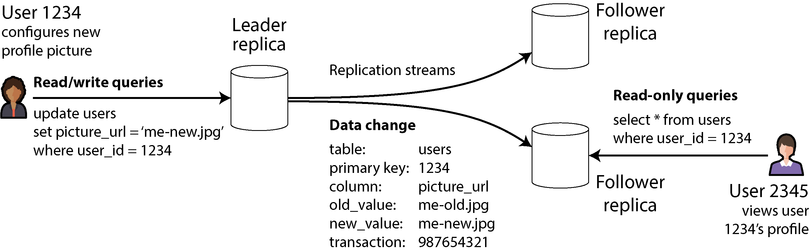
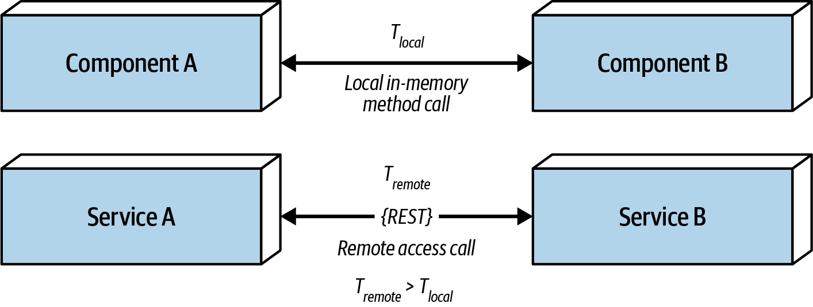
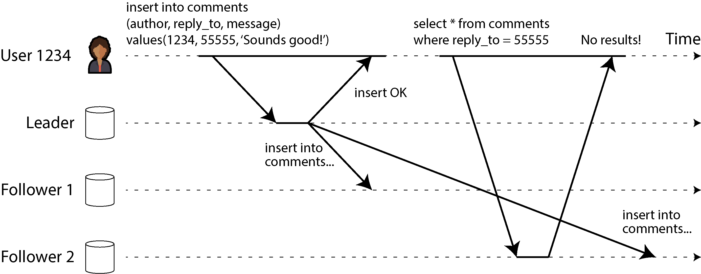
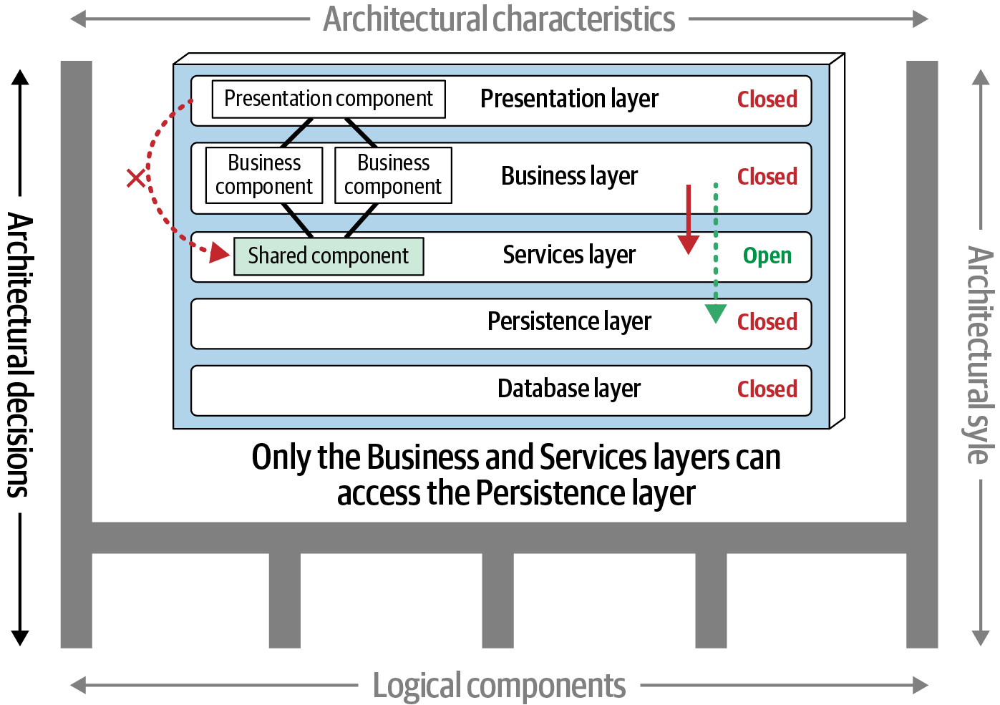

<!--
_backgroundColor: #0a1929
_color: white
_class: title dark
-->


<div class="title" style="text-align: left; margin-top: 100px; margin-left: 80px; padding-left: 0; max-width: 70%;">

# <span style="font-size: 1.0em;">システムは「動く」だけでは</br>足りない 実装編</span>

### 非機能要件・分散システム・トレードオフをコードで見る

</div>

<div class="author-info" style="text-align: left; padding-left: 0; text-indent: 0;">
2026/04/17 TECH BAR @NUTIC co-created with 3-shake</br>
@nwiizo 20min
</div>

---

## 今日お話しすること

<div style="font-size: 0.78em;">

基礎編で見た「守るものが違うと設計が変わる」を、今回は小さな Rust サンプルで確かめます。

1. **retry（やり直し）** が、なぜそのままだと危ないのかを見る
2. **レプリカ（複製側）を読むこと** が、なぜ少し古い値を連れてくるのかを見る
3. **その判断をどう残すか** までつなげる

</div>

<div style="margin-top: 18px; padding: 12px; background-color: #f5f5f5; border-radius: 8px; font-size: 0.74em;">

題材にするコード:
[workspace_2026/samples/system-tradeoffs-lab](https://github.com/nwiizo/workspace_2026/tree/main/samples/system-tradeoffs-lab)

</div>

---

## 基礎編から実装編へ

<div style="font-size: 0.75em;">

基礎編では、

- 守るものが違えば設計が変わる
- 分けると「成功したか不明」な場面が増える
- 最後は何を守るために何を引き受けるかを決める

という話をしました。

<div style="margin-top: 15px; padding: 12px; background-color: #f5f5f5; border-radius: 8px;">

実装編では、その中でも特に
retry（やり直し）と idempotency（同じ依頼を2回やらない工夫）、
`primary`（元のデータ）と `replica`（複製データ）の読み分けをコードで小さく再現します。

</div>

<div style="margin-top: 15px;">

狙いは、概念や文法を覚えることではなく、<strong>なぜその実装が必要になるのかを手触りでつかむこと</strong>です。

</div>

</div>

---

## サンプルの全体像

<div style="font-size: 0.74em;">

このサンプルは、現実のシステムをかなり単純化しています。

<div style="display: flex; gap: 18px; margin-top: 15px; align-items: stretch;">
<div style="flex: 1; background-color: #f5f5f5; padding: 14px; border-radius: 8px;">

**注文処理の系**

- `FakePaymentGateway`
- `CheckoutService`
- `OrderRequest`

</div>
<div style="flex: 1; background-color: #f5f5f5; padding: 14px; border-radius: 8px;">

**在庫参照の系**

- `InventoryStore`
- `primary`
- `replica`

</div>
</div>

<div style="margin-top: 15px;">

ポイントは、<strong>難しい仕組みを再現することではなく、何を守ると何が増えるのかだけをはっきり見せること</strong>です。

</div>

</div>

---

## 図で見るサンプルの全体像

<div style="font-size: 0.68em;">

<div style="display: flex; gap: 14px; margin-top: 16px; align-items: stretch;">
  <div style="flex: 1; background: #eaf4ff; border-radius: 10px; padding: 14px;">
    <div style="text-align: center; font-weight: bold;">注文処理の流れ</div>
    <div style="margin-top: 12px; background: white; border-radius: 8px; padding: 10px; text-align: center;">注文内容</div>
    <div style="text-align: center; color: #666; margin: 6px 0;">↓</div>
    <div style="background: white; border-radius: 8px; padding: 10px; text-align: center;">注文を進める役</div>
    <div style="text-align: center; color: #666; margin: 6px 0;">↓</div>
    <div style="background: white; border-radius: 8px; padding: 10px; text-align: center;">決済サービス役</div>
    <div style="margin-top: 10px; font-size: 0.92em; color: #444;">
      タイムアウト（timeout）に見える失敗とやり直し（retry）を再現する
    </div>
  </div>
  <div style="flex: 1; background: #fff4e5; border-radius: 10px; padding: 14px;">
    <div style="text-align: center; font-weight: bold;">在庫参照の流れ</div>
    <div style="margin-top: 12px; background: white; border-radius: 8px; padding: 10px; text-align: center;">在庫を見る役</div>
    <div style="display: flex; gap: 10px; margin-top: 10px;">
      <div style="flex: 1; background: white; border-radius: 8px; padding: 10px; text-align: center;">最新の在庫</div>
      <div style="flex: 1; background: white; border-radius: 8px; padding: 10px; text-align: center;">少し前の在庫</div>
    </div>
    <div style="margin-top: 10px; font-size: 0.92em; color: #444;">
      速さと最新性の引っ張り合いを再現する
    </div>
  </div>
</div>

<div style="margin-top: 16px; padding: 12px; background: #f5f5f5; border-radius: 8px;">

前半は <strong>「やり直しで事故が起きる」</strong> 話、後半は <strong>「速く読むと少し古いかもしれない」</strong> 話です。

</div>

</div>

---

## ファイル構成

```text
workspace_2026/samples/system-tradeoffs-lab/
├── Cargo.toml
├── README.md
└── src
    ├── lib.rs
    └── main.rs
```

<div style="font-size: 0.72em; margin-top: 15px;">

- [lib.rs](https://github.com/nwiizo/workspace_2026/blob/main/samples/system-tradeoffs-lab/src/lib.rs)
  トレードオフの再現ロジック
- [main.rs](https://github.com/nwiizo/workspace_2026/blob/main/samples/system-tradeoffs-lab/src/main.rs)
  実行時の見せ方

</div>

---

## Rust を読むための最低限の見方

<div style="font-size: 0.74em;">

Rust 初学者の人は、まずこの4つだけ押さえれば十分です。

<div style="display: flex; gap: 18px; margin-top: 15px; align-items: stretch;">
<div style="flex: 1; background-color: #f5f5f5; padding: 14px; border-radius: 8px;">

**`struct`（構造体）**

関連するデータをまとめる箱

</div>
<div style="flex: 1; background-color: #f5f5f5; padding: 14px; border-radius: 8px;">

**`enum`（列挙型）**

状態の候補を並べる型

</div>
<div style="flex: 1; background-color: #f5f5f5; padding: 14px; border-radius: 8px;">

**`match`（分岐）**

状態ごとに処理を分ける

</div>
<div style="flex: 1; background-color: #f5f5f5; padding: 14px; border-radius: 8px;">

**`HashMap`（辞書）**

「キー → 値」で覚える辞書

</div>
</div>

<div style="margin-top: 15px;">

今回は Rust の細かい文法を覚えることが目的ではありません。<strong>何を記録して、どこで分岐して、どう安全にしようとしているか</strong>が読めれば十分です。

</div>

</div>

---

## `struct`（構造体）は「ひとかたまりの情報」

<div style="font-size: 0.74em;">

`struct` は、ばらばらの情報を1つにまとめるための箱です。`pub` は「外からも見える」という印で、今回は気にしなくて大丈夫です。

<div style="display: flex; gap: 16px; margin-top: 16px; align-items: stretch;">
<div style="flex: 1; background-color: #f5f5f5; padding: 14px; border-radius: 8px;">

**注文内容の例**

- 注文番号（`request_id`）
- 金額（`amount`）

</div>
<div style="flex: 1; background-color: #f5f5f5; padding: 14px; border-radius: 8px;">

**課金記録の例**

- どの注文か（`request_id`）
- いくら課金したか（`amount`）

</div>
</div>

<div style="margin-top: 15px; padding: 12px; background-color: #f5f5f5; border-radius: 8px;">

大事なのは、<strong>別々の情報を「この話題に関するまとまり」として持てる</strong>ことです。

</div>

</div>

---

## `enum`（列挙型）と `match`（分岐）

<div style="font-size: 0.74em;">

`enum` は「この中のどれか1つが起きる」と表すための型、`match` は「その状態ごとにどう振る舞うか」を決める書き方です。

<div style="display: flex; gap: 16px; margin-top: 16px; align-items: stretch;">
<div style="flex: 1; background-color: #f5f5f5; padding: 14px; border-radius: 8px;">

**今回の候補（enum）**

- タイムアウト後に実は成功
- 一時的な失敗
- 成功

</div>
<div style="flex: 1; background-color: #f5f5f5; padding: 14px; border-radius: 8px;">

**分岐（match）のイメージ**

駅の案内表示と同じ。「遅延中なら待つ」「運休なら別ルート」のように<strong>状態ごとに行動を変える</strong>

</div>
</div>

<div style="margin-top: 15px;">

「なんとなく失敗っぽい」ではなく、<strong>失敗にも種類があり、状態ごとに対応を変える</strong>と分けて考えるのが大事です。

</div>

</div>

---

<!--
_backgroundColor: #0a1929
_color: white
_class: transition
-->

<div style="display: flex; justify-content: center; align-items: center; height: 100%; flex-direction: column; color: white;">

## <span style="color: white;">1. やり直し（Retry）だけでは危ない</span>

<span style="color: white; font-weight: bold;">タイムアウトのあとに「成功したか分からない」が残ると、retry だけでは事故になる</span>

</div>

---

## 最初の登場人物

<div style="font-size: 0.74em;">

最初に見るのはこの3つです。細かい文法は気にせず、<strong>どんなデータが登場するか</strong>だけ見てください。

<div style="font-size: 0.86em;">

```rust
pub struct OrderRequest {
    pub request_id: String,
    pub amount: u64,
}

pub struct ChargeRecord {
    pub request_id: String,
    pub amount: u64,
}

pub struct FakePaymentGateway {
    steps: Vec<GatewayStep>,
    charges: Vec<ChargeRecord>,
}
```

</div>

`OrderRequest` は注文の内容、`ChargeRecord` は課金の記録、`FakePaymentGateway` はテスト用の決済サービスです。

</div>

---

## コードに出てくる記号の読み方

<div style="font-size: 0.74em;">

このあとのコードで繰り返し出てくる記号をここで整理しておきます。

<div style="display: flex; gap: 16px; margin-top: 12px; align-items: stretch;">
<div style="flex: 1; background-color: #f5f5f5; padding: 14px; border-radius: 8px;">

**`pub`**

「外から使ってよい」という印です。付いていないものはそのファイルの中だけで使います。読み飛ばして大丈夫です。

</div>
<div style="flex: 1; background-color: #f5f5f5; padding: 14px; border-radius: 8px;">

**`Vec<X>`**

X を何個でも順番に並べて持てる入れ物です。`Vec<ChargeRecord>` なら「課金記録を0個以上、順番に持つ入れ物」です。

</div>
</div>

<div style="display: flex; gap: 16px; margin-top: 12px; align-items: stretch;">
<div style="flex: 1; background-color: #f5f5f5; padding: 14px; border-radius: 8px;">

**`String`**

文字列です。注文番号（`"order-001"` など）を入れます。

</div>
<div style="flex: 1; background-color: #f5f5f5; padding: 14px; border-radius: 8px;">

**`u64`**

0 以上の整数です。金額や在庫数など、マイナスにならない数値を入れます。

</div>
</div>

</div>

---

## まずは役割だけつかめばよい

<div style="font-size: 0.74em;">

ここからコードが出てきますが、最初は細かい文法を追わなくて大丈夫です。

<div style="display: flex; gap: 16px; margin-top: 16px; align-items: stretch;">
<div style="flex: 1; background-color: #f5f5f5; padding: 14px; border-radius: 8px;">

**注文内容**

誰が何円ぶん買うかを書いたメモ

</div>
<div style="flex: 1; background-color: #f5f5f5; padding: 14px; border-radius: 8px;">

**注文を進める役**

そのメモを持って決済サービスに依頼する

</div>
<div style="flex: 1; background-color: #f5f5f5; padding: 14px; border-radius: 8px;">

**決済サービス役**

課金を実行して、結果を返す

</div>
</div>

<div style="margin-top: 15px; padding: 12px; background-color: #f5f5f5; border-radius: 8px;">

見たいのは、<strong>誰が何をして、どこで認識のずれが起きるか</strong>です。

</div>

</div>

---

## 決済サービスの状態を `enum` と `match` で書く

<div style="font-size: 0.73em;">

このサンプルでは、決済サービスの状態を `enum`（列挙型）で表しています。

<div style="font-size: 0.86em;">

```rust
pub enum GatewayStep {
    TimeoutAfterCommit,
    TemporaryFailure,
    Success,
}
```

```rust
match step {
    GatewayStep::TimeoutAfterCommit => { ... }
    GatewayStep::TemporaryFailure => { ... }
    GatewayStep::Success => { ... }
}
```

</div>

<div style="margin-top: 15px;">

読み方は単純です。

- `enum`（列挙型）は「起こりうる状態の一覧」
- `match`（分岐）は「その状態ごとにどう振る舞うか」

という対応です。

</div>

</div>

---

## 成功したのにタイムアウトに見える

<div style="font-size: 0.84em;">

```rust
match step {
    GatewayStep::TimeoutAfterCommit => {
        self.charges.push(ChargeRecord {
            request_id: request.request_id.clone(),
            amount: request.amount,
        });
        Err(GatewayError::Timeout)
    }
```

</div>

<div style="font-size: 0.74em; margin-top: 15px;">

ここでやっているのは（`self` は「自分自身」、`.push(...)` は「末尾に追加」、`.clone()` は「コピーを作る」）、

- `self.charges.push(...)` で自分の課金記録リストに追加する（成功）
- でも呼び出し元には `Err(GatewayError::Timeout)` を返す（失敗に見える）

<strong>内部的には成功扱いの記録を残しているのに、返り値では失敗に見える</strong>状態です。

</div>

---

## 返事がないとき、何が起きたかは分からない

<div style="font-size: 0.73em;">

<div style="text-align: center;">

<div style="font-size: 0.55em; color: #999; margin-top: 5px;">出典: Designing Data-Intensive Applications, 2nd Edition, Figure 9-1 を引用</div>
</div>

<div style="margin-top: 12px; padding: 12px; background-color: #f5f5f5; border-radius: 8px;">

**(a)** リクエストが途中で消えた　**(b)** 相手が止まっていた　**(c)** 相手は処理したが返事が消えた — どれも<strong>こちらからは「返事がない」としか見えない</strong>。今回のコードで再現しているのは **(c)** のケースです。

</div>

</div>

---

## だから retry するだけでは危ない

<div style="font-size: 0.74em;">

<div style="display: flex; gap: 18px; margin-top: 12px; align-items: stretch;">
<div style="flex: 1; background-color: #f5f5f5; padding: 14px; border-radius: 8px;">

**完全に失敗（aやb）**

課金もされない。やり直せばよい。

</div>
<div style="flex: 1; background-color: #f5f5f5; padding: 14px; border-radius: 8px;">

**今回のケース（c）**

課金は終わった。でも失敗に見える。

</div>
</div>

<div style="margin-top: 15px;">

難しさは、失敗したことよりも、<strong>成功したのか失敗したのか決めきれないこと</strong>です。「分からない」ときにやり直すと、同じ処理を2回やってしまいます。

</div>

</div>

---

## 図で見る「失敗に見える成功」と二重課金

<div style="font-size: 0.68em;">

<div style="display: flex; gap: 20px; margin-top: 16px;">
  <div style="flex: 1;">
    <div style="text-align: center; font-weight: bold; margin-bottom: 10px;">アプリ側</div>
    <div style="background: #f5f5f5; border-radius: 8px; padding: 12px; text-align: center;">❶ 決済を依頼する</div>
    <div style="text-align: center; color: #666; margin: 6px 0;">↓ 返事が来ない…</div>
    <div style="background: #ffeaea; border-radius: 8px; padding: 12px; text-align: center;">❸ Timeout を受け取る<br><strong>「失敗した」と判断</strong></div>
    <div style="text-align: center; color: #666; margin: 6px 0;">↓</div>
    <div style="background: #ffeaea; border-radius: 8px; padding: 12px; text-align: center;">❹ もう一回依頼する（retry）</div>
  </div>
  <div style="flex: 1;">
    <div style="text-align: center; font-weight: bold; margin-bottom: 10px;">決済サービス側</div>
    <div style="background: #fff4e5; border-radius: 8px; padding: 12px; text-align: center;">❷ 課金記録を追加 ✅<br><strong>成功している</strong></div>
    <div style="text-align: center; color: #666; margin: 6px 0;">↓ でも返事が届かない</div>
    <div style="background: #f5f5f5; border-radius: 8px; padding: 12px; text-align: center;">（待機中）</div>
    <div style="text-align: center; color: #666; margin: 6px 0;">↓</div>
    <div style="background: #ffeaea; border-radius: 8px; padding: 12px; text-align: center;">❺ 2回目も課金 → <strong>二重課金</strong></div>
  </div>
</div>

<div style="margin-top: 12px; padding: 10px; background-color: #e0e0e0; border-radius: 5px; text-align: center;">
<span style="color: #e65100; font-weight: bold;">左右のずれが事故の原因。アプリは「失敗」と思っているが、サービスは「成功済み」</span>
</div>

</div>

---

## retry のコードを読む

<div style="font-size: 0.74em;">

`CheckoutService`（注文を進める役）はタイムアウトを見たら、素直にやり直します。

<div style="font-size: 0.86em;">

```rust
for attempt in 0..=self.max_retries {
    match gateway.charge(&request) {
        Ok(()) => return Ok(()),
        Err(GatewayError::Timeout) => {
            if attempt == self.max_retries {
                return Err(CheckoutError::ExhaustedRetries);
            }
        }
```

</div>

日本語で読むと: `for` で最大回数まで繰り返し → `gateway.charge` で課金を依頼 → 成功（`Ok`）なら終了、タイムアウト（`Timeout`）なら次の回へ、回数を使い切ったら諦める。

このコードだけ見ると自然です。でも、前のスライドのように<strong>実際は成功済み</strong>だったら、同じ課金をもう一度してしまいます。retry は止まりにくさを上げますが、<strong>課金や送信のように「やると結果が残る」処理では別の安全策が必要</strong>です。

</div>

</div>

---

## なぜ「もう一回」が自然に見えるのか

<div style="font-size: 0.74em;">

このときアプリの判断自体は不自然ではありません。

1. タイムアウトが返ってきた
2. 画面やプログラムには「失敗した」と見える
3. ならもう一回やってみよう、と考える

<div style="margin-top: 15px; padding: 12px; background-color: #f5f5f5; border-radius: 8px;">

つまり問題は、<strong>やり直し（retry）という発想そのもの</strong>ではなく、<strong>やり直しても安全かどうかが分からないこと</strong>です。分散では、この「分からなさ」を前提に設計する必要があります。

</div>

</div>

---

## 実行結果: 冪等性なしで retry した場合

<div style="font-size: 0.88em;">

```text
scenario 1: retry without idempotency
result: Ok(())
charges: 2 / total_amount: 10000
```

</div>

<div style="font-size: 0.74em; margin-top: 12px;">

読み方:

- `result: Ok(())` → 最終的には「成功」で終わった
- `charges: 2` → でも課金記録は **2件** できてしまった
- `total_amount: 10000` → 5000円の注文なのに **10000円** 引かれた

ユーザーから見ると「注文は1回」のつもりでも、決済サービスでは1回目で成功し、アプリは timeout だと思って再送し、2回目も成功して<strong>二重課金</strong>が発生しています。

</div>

---

## ここで必要になるのが冪等性（べきとうせい / Idempotency）

<div style="font-size: 0.74em;">

冪等性（べきとうせい）は、retry をやめる工夫ではなく、<strong>成功したか失敗したか分からない場面でも事故を増やしにくくする工夫</strong>です。

考え方は単純です。<strong>「この request_id はもう処理した」</strong>と覚えておけば、同じ依頼が再送されても2回目は捨てられます。

<div style="margin-top: 15px; padding: 12px; background-color: #f5f5f5; border-radius: 8px;">

ネットで買い物をして「購入」ボタンを押したのに画面が固まった。不安になってもう一度押した。でも課金は1回分だけ — <strong>これが冪等性の効果</strong>です。裏側では注文番号を見て「さっきと同じ依頼だ」と判断しています。

</div>

</div>

---

## 冪等性のコード: もう処理したか確認する

<div style="font-size: 0.74em;">

まず、同じ依頼が来たかどうかを確認します。`processed` は `HashMap`（辞書）で、「キーと値を対応づけて覚える箱」です。

<div style="font-size: 0.86em;">

```rust
if self.use_idempotency && self.processed.contains_key(&request.request_id) {
    return Ok(());
}
```

</div>

日本語で読むと:

1. `self.processed` → 自分が持っている「処理済みリスト」を見る
2. `.contains_key(&request.request_id)` → この注文番号はもう知っているか？
3. `return Ok(())` → 知っていたら、何もせず「成功」を返す

</div>

---

## 冪等性のコード: 処理したら記録する

<div style="font-size: 0.74em;">

初めて来た依頼なら課金して、`request_id` を記録しておきます。

<div style="font-size: 0.86em;">

```rust
self.processed
    .entry(request.request_id.clone())
    .or_insert(ChargeRecord {
        request_id: request.request_id.clone(),
        amount: request.amount,
    });
```

</div>

日本語で読むと:

1. `.entry(request.request_id.clone())` → この注文番号のところを開く
2. `.or_insert(...)` → まだ記録がなければ、課金記録を書き込む
3. `.clone()` → 文字列のコピーを作る（Rust ではデータの所有権を意識する必要があるため）

これで、次に同じ `request_id` が来たときに「もう処理した」と判断できます。

</div>

---

## なぜ `request_id`（リクエストID）が効くのか

<div style="font-size: 0.74em;">

`request_id`（リクエストID）は、注文1回ごとに付ける整理番号のようなものです。

<div style="display: flex; gap: 18px; margin-top: 15px; align-items: stretch;">
<div style="flex: 1; background-color: #f5f5f5; padding: 14px; border-radius: 8px;">

**整理番号がない**

毎回「新しい依頼」に見えるので、再送で重複しやすい

</div>
<div style="flex: 1; background-color: #f5f5f5; padding: 14px; border-radius: 8px;">

**整理番号がある**

同じ番号なら「前に見た依頼だ」と判断できる

</div>
</div>

<div style="margin-top: 15px;">

実務では、注文ID、決済ID、メッセージIDなどがこの役割を持ちます。<strong>再送を安全にするには、「同じ依頼だ」と分かる印が必要</strong>です。

</div>

</div>

---

## 図で見る「整理番号で止める」

<div style="font-size: 0.68em;">

<div style="display: flex; gap: 12px; margin-top: 16px; align-items: stretch;">
  <div style="flex: 1; background: #f5f5f5; border-radius: 10px; padding: 14px; text-align: center;">
    <strong>1回目の依頼</strong><br>
    整理番号 = req-1
  </div>
  <div style="font-size: 1.1em; color: #666; align-self: center;">→</div>
  <div style="flex: 1; background: #eaf4ff; border-radius: 10px; padding: 14px; text-align: center;">
    <strong>記録する</strong><br>
    req-1 は処理済みと覚える
  </div>
  <div style="font-size: 1.1em; color: #666; align-self: center;">→</div>
  <div style="flex: 1; background: #fff4e5; border-radius: 10px; padding: 14px; text-align: center;">
    <strong>2回目の依頼</strong><br>
    同じ req-1 が来る
  </div>
</div>

<div style="display: flex; gap: 12px; margin-top: 16px; align-items: stretch;">
  <div style="flex: 1;"></div>
  <div style="font-size: 1.1em; color: #666; align-self: center;">↓</div>
  <div style="flex: 1; background: #ffeaea; border-radius: 10px; padding: 14px; text-align: center;">
    <strong>判定</strong><br>
    すでに見た番号なので<br>同じ処理を増やさない
  </div>
  <div style="flex: 1;"></div>
</div>

<div style="margin-top: 16px; padding: 12px; background: #f5f5f5; border-radius: 8px;">

ポイントは、<strong>「もう処理した依頼だ」と判断できる記録を先に持つこと</strong>です。

</div>

</div>

---

## 図で見る「2回目を防ぐ」

<div style="font-size: 0.68em;">

<div style="display: flex; gap: 12px; margin-top: 18px; align-items: stretch;">
  <div style="flex: 1; background: #ffeaea; border-radius: 10px; padding: 14px; text-align: center;">
    <strong>判定</strong><br>
    すでに見た番号だと分かる
  </div>
  <div style="font-size: 1.0em; color: #666; align-self: center;">→</div>
  <div style="flex: 1; background: #eaf4ff; border-radius: 10px; padding: 14px; text-align: center;">
    <strong>動き</strong><br>
    2回目の処理をしない
  </div>
  <div style="font-size: 1.0em; color: #666; align-self: center;">→</div>
  <div style="flex: 1; background: #fff4e5; border-radius: 10px; padding: 14px; text-align: center;">
    <strong>結果</strong><br>
    retry を入れても安全にしやすい
  </div>
</div>

<div style="margin-top: 16px; padding: 12px; background: #f5f5f5; border-radius: 8px;">

つまり request_id（リクエストID）は、<strong>再送そのものを止める印ではなく、同じ依頼が来てももう一度やらないための印</strong>です。

</div>

</div>

---

## 冪等性を入れた結果

<div style="font-size: 0.88em;">

```text
scenario 2: retry with idempotency
result: Ok(())
charges: 1 / total_amount: 5000
```

</div>

<div style="font-size: 0.74em; margin-top: 12px;">

読み方:

- `charges: 1` → 課金記録は **1件** だけ
- `total_amount: 5000` → 正しい金額のまま

retry はしたのに、2回目は `request_id` で「処理済み」と判断されて課金されていません。やり直し自体が悪いのではなく、<strong>やり直しても安全な仕組みをセットで入れる</strong>ことが大事です。

</div>

---

## このコードで伝えたいこと

<div style="font-size: 0.75em;">

<div style="background-color: #f5f5f5; padding: 15px; border-radius: 8px;">

**やり直し（retry）は止まりにくくするための道具**

一時的な失敗から復帰しやすくなる。

</div>

<div style="background-color: #f5f5f5; padding: 15px; border-radius: 8px; margin-top: 12px;">

**冪等性（idempotency）は「成功したか分からない場面」で事故を増やしにくくする道具**

やり直しによる二重実行を抑える。

</div>

<div style="margin-top: 15px; padding: 12px; background-color: #e0e0e0; border-radius: 5px; text-align: center;">
<span style="color: #e65100; font-weight: bold;">retry だけでは足りない。分散では「止まりにくさ」と「二重実行しない」を組み合わせて守る</span>
</div>

<div style="margin-top: 12px; font-size: 0.72em;">

retry + 冪等性は「二重実行」という事故を小さくする話でした。次は、速さのために何を引き受けるかという別のトレードオフを見ます。

</div>

</div>

---

<!--
_backgroundColor: #0a1929
_color: white
_class: transition
-->

<div style="display: flex; justify-content: center; align-items: center; height: 100%; flex-direction: column; color: white;">

## <span style="color: white;">2. 速さと最新性は両立しにくい</span>

<span style="color: white; font-weight: bold;">速く読むための replica は、「少し古いかもしれない」を一緒に連れてくる</span>

</div>

---

## リーダーベースレプリケーションとは

<div style="font-size: 0.73em;">

<div style="text-align: center;">

<div style="font-size: 0.55em; color: #999; margin-top: 5px;">出典: Designing Data-Intensive Applications, 2nd Edition, Figure 6-1 を引用</div>
</div>

<div style="margin-top: 12px; padding: 12px; background-color: #f5f5f5; border-radius: 8px;">

書き込みは Leader（元データ）に行き、変更内容が Follower（複製）に流れます。読み取りは Follower からもできるので速い。ただし、<strong>流れが追いつくまでは古い値が返る</strong>可能性があります。次のコードで、この仕組みを小さく再現します。

</div>

</div>

---

## 在庫のサンプル

<div style="font-size: 0.84em;">

```rust
pub struct InventoryStore {
    primary: HashMap<String, Product>,
    replica: HashMap<String, Product>,
}
```

```rust
pub fn purchase_on_primary(&mut self, sku: &str, quantity: u32) {
    if let Some(product) = self.primary.get_mut(sku) {
        product.stock = product.stock.saturating_sub(quantity);
    }
}
```

</div>

<div style="font-size: 0.73em; margin-top: 15px;">

このスライドで見たいのは、在庫データをどこに持っているかです。

ここで `saturating_sub` は、0より小さくならないように引き算する書き方です。

- `primary`（プライマリ）: まず更新される、元の在庫
- `replica`（レプリカ）: あとから追いつく、読むためのコピー

</div>

---

## このサンプルで何を見たいか

<div style="font-size: 0.73em;">

このサンプルでは、

- 書き込みは `primary`（プライマリ）
- 読み取りは `primary`（プライマリ）または `replica`（レプリカ）

という、よくある構成だけを抜き出しています。見たいのは、<strong>どこで速さを取り、どこで最新性を守るか</strong>です。

<div style="margin-top: 15px; padding: 12px; background-color: #f5f5f5; border-radius: 8px;">

ここでの `HashMap<String, Product>` は、
「商品IDを渡すと在庫データが返る」
というメモ帳のようなものだと思えば十分です。

</div>

</div>

---

## まず「レプリカ」が何か

<div style="font-size: 0.73em;">
<div style="display: flex; gap: 24px; align-items: center;">
<div style="width: 36%;">

<div style="font-size: 0.55em; color: #999; text-align: center; margin-top: 5px;">出典: Fundamentals of Software Architecture, 2nd Edition, Figure 9-8 を引用</div>
</div>
<div style="flex: 1;">

レプリカ（replica）は、元のデータをコピーして持つ、読むための場所です。リモート呼び出しはローカルより遅いので、近くにコピーを置くと速く読めます。

<div style="display: flex; gap: 14px; margin-top: 10px; align-items: stretch;">
<div style="flex: 1; background-color: #f5f5f5; padding: 12px; border-radius: 8px;">

**`primary`（プライマリ）**

いちばん先に更新される元の在庫

</div>
<div style="flex: 1; background-color: #f5f5f5; padding: 12px; border-radius: 8px;">

**`replica`（レプリカ）**

あとから追いつく複製された在庫

</div>
</div>

レプリカは<strong>速く読むためのコピー</strong>ですが、コピーなので<strong>少し遅れて追いつく</strong>と考えると分かりやすいです。

</div>
</div>
</div>

---

## 書いた直後に読むと、古い値が返ることがある

<div style="font-size: 0.73em;">

<div style="text-align: center;">

<div style="font-size: 0.55em; color: #999; margin-top: 5px;">出典: Designing Data-Intensive Applications, 2nd Edition, Figure 6-3 を引用</div>
</div>

<div style="margin-top: 12px; padding: 12px; background-color: #f5f5f5; border-radius: 8px;">

User 1234 が Leader に書き込んだ直後、Follower から読むと「まだ反映されていない」状態が返ります。このサンプルの `primary` と `replica` は、まさにこの関係を小さく再現しています。

</div>

</div>

---

## 図で見る「場面で使い分ける」

<div style="font-size: 0.68em;">

<div style="display: flex; gap: 12px; margin-top: 18px; align-items: stretch;">
  <div style="flex: 1; background: #f5f5f5; border-radius: 10px; padding: 14px; text-align: center;">
    <strong>一覧画面</strong><br>
    `replica` でもよい
  </div>
  <div style="font-size: 1.0em; color: #666; align-self: center;">↔</div>
  <div style="flex: 1; background: #fff4e5; border-radius: 10px; padding: 14px; text-align: center;">
    <strong>購入直前</strong><br>
    `primary` を見たい
  </div>
</div>

<div style="margin-top: 16px; padding: 12px; background: #f5f5f5; border-radius: 8px;">

どちらが正しいかは、技術の好みではなく、<strong>その場面で何を守りたいか</strong>で決まります。

</div>

</div>

---

## レプリカはすぐには最新にならない

<div style="font-size: 0.84em;">

```rust
pub fn replicate(&mut self) {
    self.replica = self.primary.clone();
}
```

</div>

<div style="font-size: 0.74em; margin-top: 15px;">

この `replicate()` が呼ばれるまでは、`replica`（レプリカ）は古いままです。`&mut self` は「自分自身を書き換えてよい」、`.clone()` は「まるごとコピーする」という意味です。

現実のシステムでも、

- 同期レプリケーション（複製が終わるまで待つ方式）なら待ちが増える
- 非同期レプリケーション（待たずに進める方式）なら古い値が見える

という両立しにくさがあります。速さを取りにいくほど、どこかで待つか、どこかで古さを受け入れるかの判断が必要になります。

</div>

---

## ここで何を取って何をゆずるのか

<div style="font-size: 0.74em;">

レプリカ（replica）を使うと嬉しいこともあります。

<div style="display: flex; gap: 16px; margin-top: 16px; align-items: stretch;">
<div style="flex: 1; background-color: #f5f5f5; padding: 14px; border-radius: 8px;">

**得られるもの**

読み取りを速くしやすい  
混雑を分散しやすい

</div>
<div style="flex: 1; background-color: #f5f5f5; padding: 14px; border-radius: 8px;">

**失うかもしれないもの**

最新の値をすぐには見られない  
場面によっては危険

</div>
</div>

<div style="margin-top: 15px; padding: 12px; background-color: #f5f5f5; border-radius: 8px;">

だから、<strong>いつもレプリカを読めばよい</strong>のではなく、<strong>どの場面なら少し古くてもよいか</strong>を考える必要があります。速さを取るなら、その代わりに何を引き受けるかも一緒に決めます。

</div>

</div>

---

## ここでも 1回の流れを追う

<div style="font-size: 0.74em;">

1. 最初は `primary` も `replica` も在庫 `3`
2. `purchase_on_primary()` で `primary` だけ `2` になる
3. まだ `replica` には反映されないので `3` のまま
4. `replicate()` を呼ぶと `replica` も `2` になる

<div style="margin-top: 15px; padding: 12px; background-color: #f5f5f5; border-radius: 8px;">

つまり、`replica`（レプリカ）を読むというのは、<strong>速さの代わりに「少し前の状態」を読む可能性を引き受ける</strong>ことです。ここでも、守りたいものを1つ取ると、別の注意点が増えます。

</div>

</div>

---

## 実行結果: primary と replica の値のずれ

<div style="font-size: 0.88em;">

```text
scenario 3: consistency vs latency
primary stock right after purchase: 2
replica stock before replication: 3
replica stock after replication: 2
```

</div>

<div style="font-size: 0.74em; margin-top: 12px;">

読み方:

- `primary ... : 2` → 元データの在庫は購入後すぐ **2** に減った
- `replica ... before: 3` → 複製はまだ **3** のまま（古い！）
- `replica ... after: 2` → 複製処理の後にやっと **2** になった

購入直後なのに replica が `3` のままなのは、<strong>反映がまだ終わっていない</strong>からです。`primary` と `replica` のどちらも間違いではなく、<strong>どの場面で使うかが判断</strong>になります。

</div>

---

## どちらが正しいか

<div style="font-size: 0.75em;">

同じ在庫でも、正解は文脈で変わります。

<div style="display: flex; gap: 18px; margin-top: 15px; align-items: stretch;">
<div style="flex: 1; background-color: #f5f5f5; padding: 14px; border-radius: 8px;">

**商品一覧画面**

多少古くてもよい。速さが大事。

</div>
<div style="flex: 1; background-color: #f5f5f5; padding: 14px; border-radius: 8px;">

**購入確定直前**

古い在庫は危険。最新性が大事。

</div>
</div>

<div style="margin-top: 15px;">

ここで伝えたいのは、<strong>正解が1つあるわけではなく、何を守りたいかで判断が変わる</strong>ということです。

</div>

</div>

---

## ここまでのまとめ: 基礎編との接続

<div style="font-size: 0.74em;">

この実装編で見たのは、基礎編のごく一部です。

| 基礎編の言葉 | 実装編で見たこと |
| ------------ | ---------------- |
| タイムアウト（Timeout） | 相手が成功しても、こちらからは失敗に見えることがある |
| やり直し（Retry） | 止まりにくくできるが、状態が読めない場面では事故も増える |
| 冪等性（Idempotency） | retry を入れても二重実行しにくくする |
| 一貫性（Consistency） | `primary` は最新の値を返しやすい |
| 遅延（Latency） | `replica` は速いが、少し古いことがある |

<div style="margin-top: 12px;">

ここまで2つのトレードオフをコードで見てきました。最後に、<strong>こうした判断を「コードを全部自分で書かない時代」にどう活かすか</strong>を考えます。

</div>

</div>

---

<!--
_backgroundColor: #0a1929
_color: white
_class: transition
-->

<div style="display: flex; justify-content: center; align-items: center; height: 100%; flex-direction: column; color: white;">

## <span style="color: white; font-size: 0.92em;">3. コードを全部自分で書かない時代に<br>なぜ必要なのか？</span>

<span style="color: white; font-weight: bold;">コードが速く書けても、何を守るかと何を確かめるかは残る</span>

</div>

---

## 実装が速くなっても、失敗は消えない

<div style="font-size: 0.74em;">

コーディングエージェントは、実装をかなり速く進められます。

<div style="display: flex; gap: 18px; margin-top: 16px; align-items: stretch;">
<div style="flex: 1; background-color: #f5f5f5; padding: 14px; border-radius: 8px;">

**速くなること**

- 画面や API の雛形を作る
- テストコードをたたき台から書く
- リファクタリングを進める
- 定型的な実装をつなぐ

</div>
<div style="flex: 1; background-color: #f5f5f5; padding: 14px; border-radius: 8px;">

**人が決めること**

- どこまで retry をしてよいか
- timeout を本当に失敗とみなしてよいか
- 冪等性が必要な操作はどこか
- `primary` と `replica` をどの場面で使い分けるか

</div>
</div>

<div style="margin-top: 15px; padding: 12px; background-color: #f5f5f5; border-radius: 8px;">

つまり難しさは、コードを書く量の問題ではなく、<strong>どう壊れるかと何を守るかの問題</strong>として残ります。実装速度が上がっても、失敗の形や優先順位までは自動で決まりません。

</div>

</div>

---

## 人に残る仕事は「決めること」と「確かめること」

<div style="font-size: 0.74em;">

この実装編で見てきた話が重要なのは、<strong>エージェントが書いたものが良いかを見る基準になる</strong>からです。

<div style="background-color: #f5f5f5; padding: 14px; border-radius: 8px; margin-top: 15px;">

1. `timeout` と `success` が食い違う場面を想像できる
2. やり直しが二重実行を生む危険を説明できる
3. `replica` の古さを許せる場面と許せない場面を分けられる
4. エージェントが書いた実装が、その考えに合っているか確かめられる

</div>

<div style="margin-top: 15px; padding: 12px; background-color: #e0e0e0; border-radius: 5px; text-align: center;">
<span style="color: #e65100; font-weight: bold;">エージェント時代に価値が上がるのは、何を守るかを決めて、大きい事故を小さい不便に変えられているか確かめる力です</span>
</div>

</div>

---

## その判断を残すなら ADR がちょうどいい

<div style="font-size: 0.71em;">
<div style="display: flex; gap: 24px; align-items: center;">
<div style="width: 36%;">

<div style="font-size: 0.55em; color: #999; text-align: center; margin-top: 5px;">出典: Fundamentals of Software Architecture, 2nd Edition, Figure 1-5 を引用</div>
</div>
<div style="flex: 1;">

基礎編では「理由が言えない設計は、あとで弱くなる」という話をしました。コードを自分で全部書かない時代ほど、その理由を短く残しておく価値が上がります。

<div style="background-color: #f5f5f5; padding: 12px; border-radius: 8px; margin-top: 10px;">

- なぜ やり直し（retry）を入れるのか
- なぜ `request_id`（リクエストID）で重複を防ぐのか
- なぜ `primary` と `replica` を分けるのか

</div>

こういう判断をあとから追えるようにするなら、<strong>ADR（Architecture Decision Record）</strong>が便利です。大げさな設計書ではなく、<strong>何を決めて、なぜそうしたかを短く残す</strong>ためのメモです。

</div>
</div>
</div>

---

## なぜ ADR が必要になるのか

<div style="font-size: 0.74em;">

設計の問題は、図だけ見ても理由が分からなくなることです。

<div style="display: flex; gap: 16px; margin-top: 16px; align-items: stretch;">
<div style="flex: 1; background-color: #f5f5f5; padding: 14px; border-radius: 8px;">

**図だけ残る場合**

「なぜそうしたのか」があとで読めない

</div>
<div style="flex: 1; background-color: #f5f5f5; padding: 14px; border-radius: 8px;">

**ADR がある場合**

背景、決めたこと、その結果をあとから追える

</div>
</div>

<div style="margin-top: 15px; padding: 12px; background-color: #f5f5f5; border-radius: 8px;">

つまり ADR は、<strong>どんな形にしたか</strong>よりも、<strong>なぜその形にしたのか</strong>を残すための道具です。理由が言えれば、変更するときにも判断をやり直せます。

</div>

</div>

---

## ADR はどう書けばよいのか

<div style="font-size: 0.74em;">

最初から難しく考えなくて大丈夫です。まずは次の4つがあれば十分です。

1. **Title（題名）**: 何を決める話なのか
2. **Context（前提）**: どんな困りごとがあるのか
3. **Decision（決めたこと）**: 何を選ぶのか
4. **Consequence（結果）**: 何がよくなり、何が増えるのか

```text
Title: Retry 時の二重課金を防ぐため request_id を使う
Context: timeout のあとに retry すると同じ課金が重なることがある
Decision: request_id で同じ依頼かどうかを見分ける
Consequence: 実装は少し増えるが、二重課金の事故を減らしやすくなる
```

<div style="margin-top: 12px; padding: 12px; background-color: #f5f5f5; border-radius: 8px;">

大事なのは完璧な文書にすることではなく、<strong>あとから読んだ人が「なるほど、この問題に対してこの判断をしたのか」と分かること</strong>です。

</div>

</div>

---

## ADR も図で見るとシンプル

<div style="font-size: 0.68em;">

<div style="display: flex; gap: 12px; margin-top: 16px; align-items: stretch;">
  <div style="flex: 1; background: #f5f5f5; border-radius: 10px; padding: 14px; text-align: center;">
    <strong>Context（前提）</strong><br>
    timeout のあとに retry すると<br>二重課金が起こりうる
  </div>
  <div style="font-size: 1.1em; color: #666; align-self: center;">→</div>
  <div style="flex: 1; background: #eaf4ff; border-radius: 10px; padding: 14px; text-align: center;">
    <strong>Decision（決めたこと）</strong><br>
    request_id を使って<br>冪等化する
  </div>
  <div style="font-size: 1.1em; color: #666; align-self: center;">→</div>
  <div style="flex: 1; background: #fff4e5; border-radius: 10px; padding: 14px; text-align: center;">
    <strong>Consequence（結果）</strong><br>
    実装は増えるが<br>retry を入れやすくなる
  </div>
</div>

<div style="margin-top: 16px; padding: 12px; background: #f5f5f5; border-radius: 8px;">

ADR は長い設計書ではなく、<strong>問題と判断と結果を短くつなぐメモ</strong>だと考えると扱いやすいです。

</div>

</div>

---

## 次に触るなら

<div style="font-size: 0.75em;">

このサンプルの次の題材としては、次が自然です。

1. 一部だけ成功して、結果が分からなくなるケースをもっと詳しく再現する
2. 同期と非同期の違いを、順番に処理する仕組みで見る
3. `ADR` を書いて、何を守るための設計かを残す

</div>

<div style="margin-top: 15px; padding: 12px; background-color: #e0e0e0; border-radius: 5px; text-align: center;">
<span style="color: #e65100; font-weight: bold;">設計を学ぶ近道は、壊れ方を小さく再現してみること</span>
</div>

---

## Rust 初学者として見るなら

<div style="font-size: 0.75em;">

今回のサンプルで読めるようになってほしいのは、全部ではなく次の3段階です。

1. `struct` や `HashMap` を見て、「どんなデータを持っているか」を読む
2. `enum` と `match` を見て、「どんな状態分岐があるか」を読む
3. 実行結果を見て、「この設計が何を守り、何を引き受けるか」を読む

<div style="margin-top: 15px; padding: 12px; background-color: #e0e0e0; border-radius: 5px; text-align: center;">
<span style="color: #e65100; font-weight: bold;">文法を全部知ってから設計を学ぶのではなく、「何を守る実装か」を見ながら文法に慣れていけばよい</span>
</div>

</div>

---

## 持ち帰ってほしいこと

<div style="font-size: 0.75em;">

<div style="background-color: #f5f5f5; padding: 15px; border-radius: 8px;">

**コードは短くても、設計の問題は見える**

大規模な本番システムでなくても、本質は小さなサンプルで観察できる。

</div>

<div style="background-color: #f5f5f5; padding: 15px; border-radius: 8px; margin-top: 12px;">

**便利な仕組みにも別の困りごとがある**

retry（やり直し）も replica（レプリカ）も、それだけで安心とは限らない。

</div>

<div style="background-color: #f5f5f5; padding: 15px; border-radius: 8px; margin-top: 12px;">

**設計は「大きい事故」を「小さい不便」に変える仕事**

どう壊れるかを先に考えて、何を守るために何を引き受けるかを決める。

</div>

</div>

---

<!--
_backgroundColor: #0a1929
_color: white
_class: transition
-->

<div style="position: absolute !important; top: 5px !important; left: 5px !important; z-index: 9999 !important; margin: 0 !important; padding: 0 !important;">
  
</div>
<div style="text-align: center; margin-top: 200px;">

# ありがとうございました

### ご質問・ご相談はお気軽にどうぞ

@nwiizo | https://3-shake.com

</div>
